# Autonomous Trading System Workflow

## Overview

This document provides a comprehensive visualization of the Autonomous Trading System (ATS) workflow, showing how data and control flow through the system. It includes detailed diagrams for each subsystem as well as the complete system workflow.

The ATS operates through a series of interconnected processes that span data acquisition, feature engineering, model training, trading strategy execution, monitoring, and continuous learning. These diagrams illustrate how these processes interact to create a cohesive, adaptive trading system.

## System Overview Flow

This high-level diagram shows the main subsystems and how they interact:

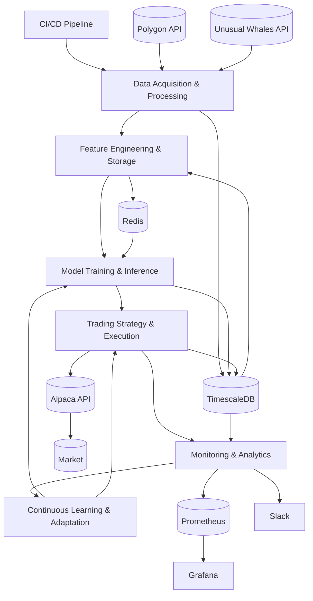
```mermaid
flowchart TD
    %% Main System Components
    DA[Data Acquisition & Processing]
    FE[Feature Engineering & Storage]
    MT[Model Training & Inference]
    TS[Trading Strategy & Execution]
    MA[Monitoring & Analytics]
    CL[Continuous Learning & Adaptation]
    CD[CI/CD Pipeline]
    
    %% Data Flow
    DA --> FE
    FE --> MT
    MT --> TS
    TS --> MA
    MA --> CL
    CL --> MT
    CD --> DA
    CL --> TS
    
    %% External Systems
    PA[(Polygon API)]
    UW[(Unusual Whales API)]
    AA[(Alpaca API)]
    MK[(Market)]
    
    %% Database Systems
    TS1[(TimescaleDB)]
    RD[(Redis)]
    PR[(Prometheus)]
    GR[Grafana]
    SL[Slack]
    
    %% External Connections
    PA --> DA
    UW --> DA
    DA --> TS1
    TS1 --> FE
    FE --> RD
    RD --> MT
    MT --> TS1
    TS --> AA
    AA --> MK
    TS --> TS1
    TS1 --> MA
    MA --> PR
    PR --> GR
    MA --> SL
```

## Detailed Subsystem Workflows

### 1. Data Acquisition & Processing Workflow

This diagram shows the detailed workflow of the Data Acquisition & Processing subsystem:

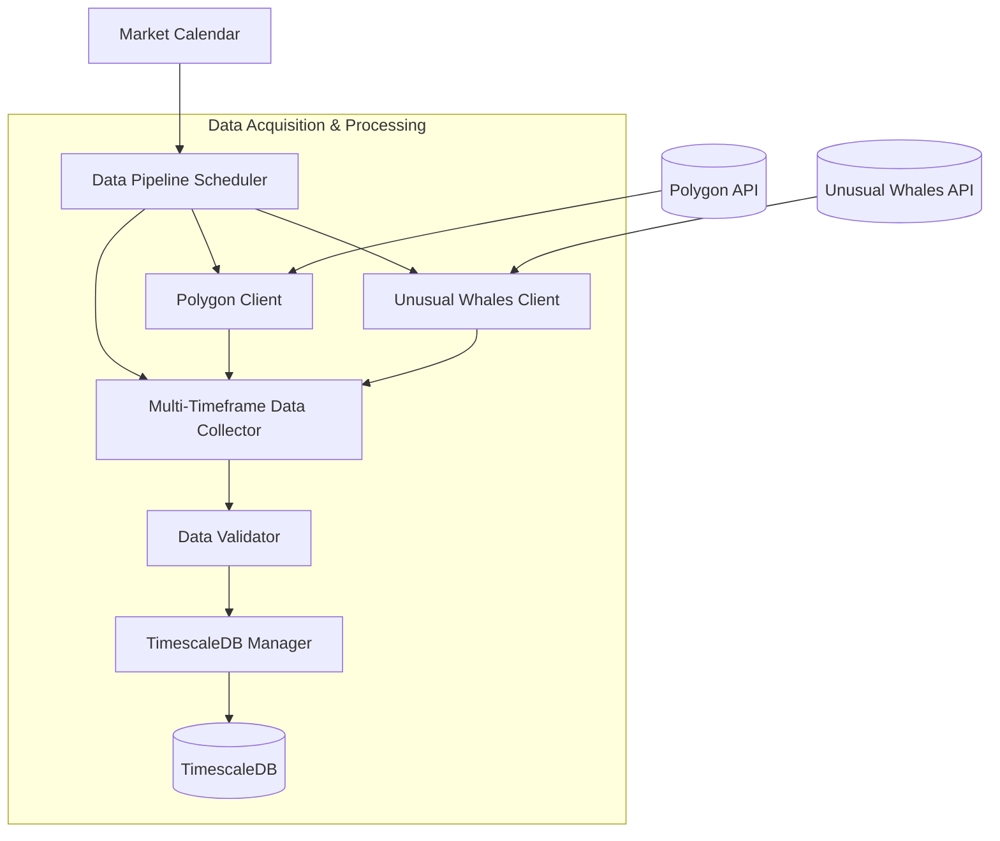
```mermaid
flowchart TD
    %% Data Acquisition Components
    subgraph "Data Acquisition & Processing"
        PC[Polygon Client]
        UWC[Unusual Whales Client]
        DPS[Data Pipeline Scheduler]
        MTDC[Multi-Timeframe Data Collector]
        DV[Data Validator]
        TSM[TimescaleDB Manager]
        
        DPS --> PC
        DPS --> UWC
        DPS --> MTDC
        PC --> MTDC
        UWC --> MTDC
        MTDC --> DV
        DV --> TSM
        TSM --> TS1[(TimescaleDB)]
    end
    
    %% External Systems
    PA[(Polygon API)]
    UW[(Unusual Whales API)]
    MC[Market Calendar]
    
    %% External Connections
    PA --> PC
    UW --> UWC
    MC --> DPS
```

#### Data Acquisition Process Flow

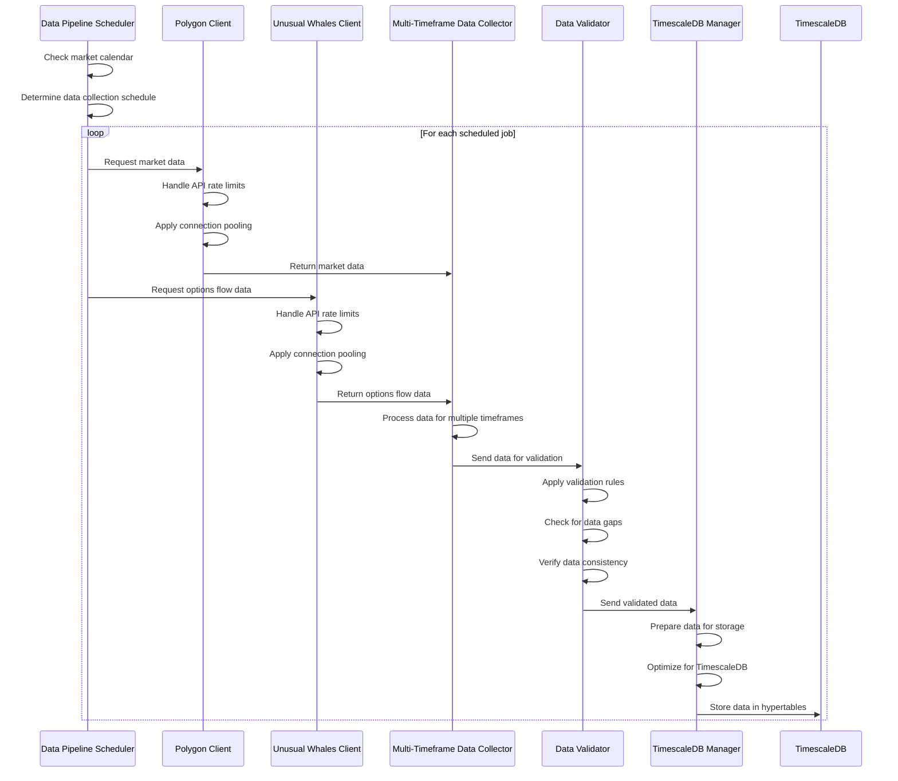
```mermaid
sequenceDiagram
    participant DPS as Data Pipeline Scheduler
    participant PC as Polygon Client
    participant UWC as Unusual Whales Client
    participant MTDC as Multi-Timeframe Data Collector
    participant DV as Data Validator
    participant TSM as TimescaleDB Manager
    participant TS1 as TimescaleDB
    
    DPS->>DPS: Check market calendar
    DPS->>DPS: Determine data collection schedule
    
    loop For each scheduled job
        DPS->>PC: Request market data
        PC->>PC: Handle API rate limits
        PC->>PC: Apply connection pooling
        PC->>MTDC: Return market data
        
        DPS->>UWC: Request options flow data
        UWC->>UWC: Handle API rate limits
        UWC->>UWC: Apply connection pooling
        UWC->>MTDC: Return options flow data
        
        MTDC->>MTDC: Process data for multiple timeframes
        MTDC->>DV: Send data for validation
        
        DV->>DV: Apply validation rules
        DV->>DV: Check for data gaps
        DV->>DV: Verify data consistency
        DV->>TSM: Send validated data
        
        TSM->>TSM: Prepare data for storage
        TSM->>TSM: Optimize for TimescaleDB
        TSM->>TS1: Store data in hypertables
    end
```

### 2. Feature Engineering & Storage Workflow

This diagram shows the detailed workflow of the Feature Engineering & Storage subsystem:

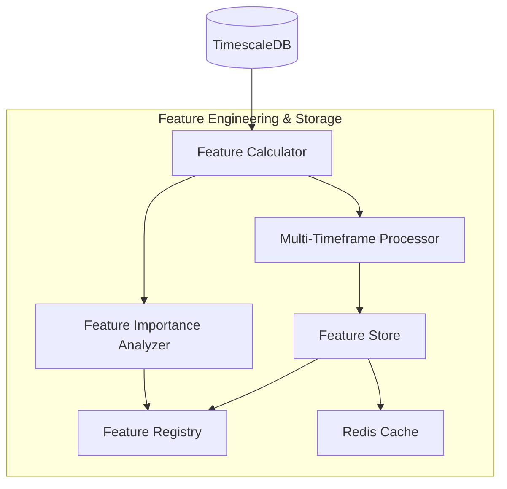
```mermaid
flowchart TD
    %% Feature Engineering Components
    subgraph "Feature Engineering & Storage"
        FC[Feature Calculator]
        MTP[Multi-Timeframe Processor]
        FS[Feature Store]
        FR[Feature Registry]
        FIA[Feature Importance Analyzer]
        RC[Redis Cache]
        
        FC --> MTP
        MTP --> FS
        FS --> FR
        FS --> RC
        FC --> FIA
        FIA --> FR
    end
    
    %% External Systems
    TS1[(TimescaleDB)]
    
    %% External Connections
    TS1 --> FC
```

#### Feature Engineering Process Flow

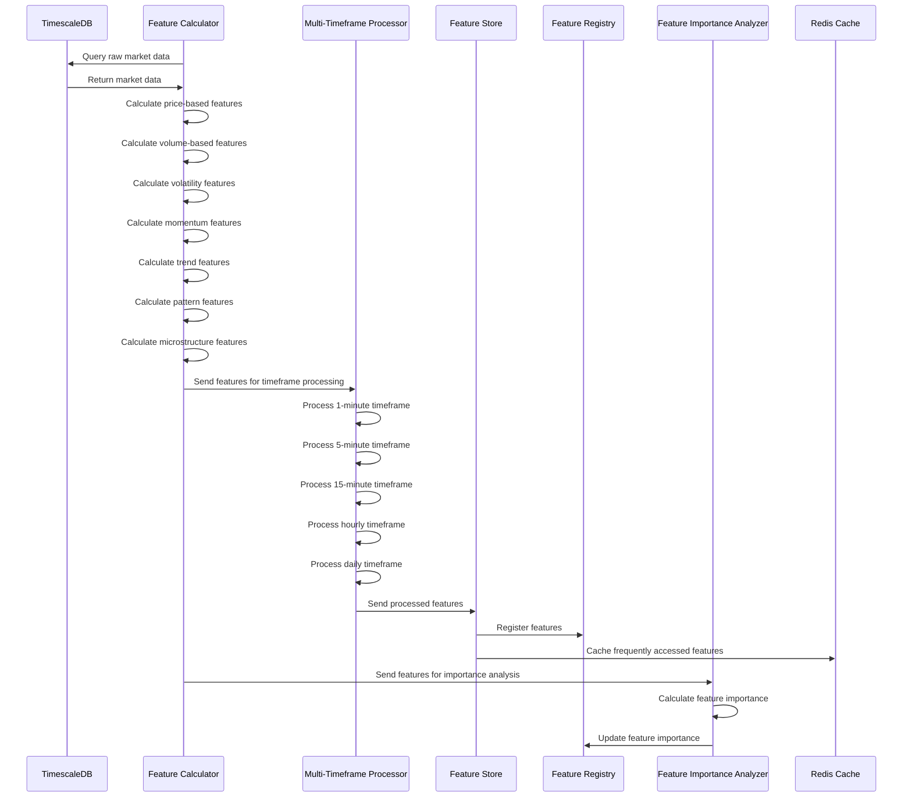
```mermaid
sequenceDiagram
    participant TS1 as TimescaleDB
    participant FC as Feature Calculator
    participant MTP as Multi-Timeframe Processor
    participant FS as Feature Store
    participant FR as Feature Registry
    participant FIA as Feature Importance Analyzer
    participant RC as Redis Cache
    
    FC->>TS1: Query raw market data
    TS1->>FC: Return market data
    
    FC->>FC: Calculate price-based features
    FC->>FC: Calculate volume-based features
    FC->>FC: Calculate volatility features
    FC->>FC: Calculate momentum features
    FC->>FC: Calculate trend features
    FC->>FC: Calculate pattern features
    FC->>FC: Calculate microstructure features
    
    FC->>MTP: Send features for timeframe processing
    
    MTP->>MTP: Process 1-minute timeframe
    MTP->>MTP: Process 5-minute timeframe
    MTP->>MTP: Process 15-minute timeframe
    MTP->>MTP: Process hourly timeframe
    MTP->>MTP: Process daily timeframe
    
    MTP->>FS: Send processed features
    
    FS->>FR: Register features
    FS->>RC: Cache frequently accessed features
    
    FC->>FIA: Send features for importance analysis
    FIA->>FIA: Calculate feature importance
    FIA->>FR: Update feature importance
```

### 3. Model Training & Inference Workflow

This diagram shows the detailed workflow of the Model Training & Inference subsystem:

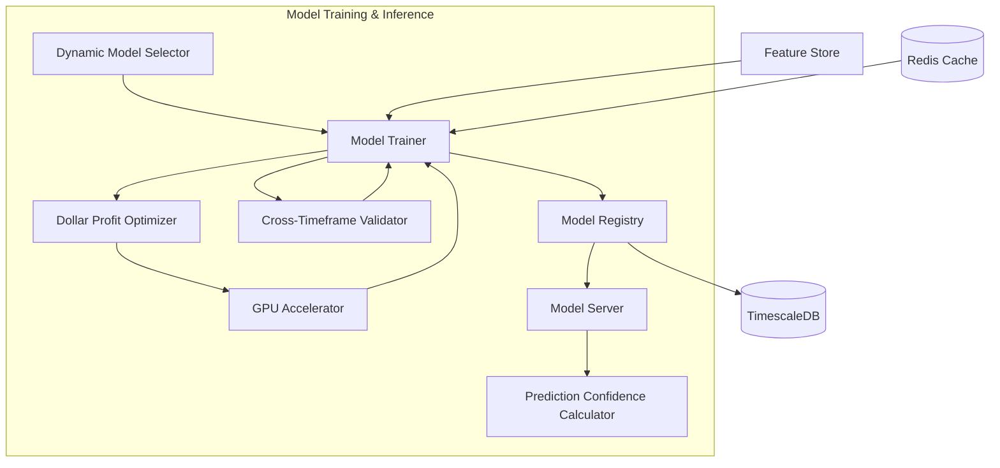
```mermaid
flowchart TD
    %% Model Training Components
    subgraph "Model Training & Inference"
        MT[Model Trainer]
        DMS[Dynamic Model Selector]
        DPO[Dollar Profit Optimizer]
        GPU[GPU Accelerator]
        CTV[Cross-Timeframe Validator]
        MR[Model Registry]
        MS[Model Server]
        PC[Prediction Confidence Calculator]
        
        DMS --> MT
        MT --> DPO
        DPO --> GPU
        GPU --> MT
        MT --> CTV
        CTV --> MT
        MT --> MR
        MR --> MS
        MS --> PC
    end
    
    %% External Systems
    FS[Feature Store]
    RC[(Redis Cache)]
    
    %% External Connections
    FS --> MT
    RC --> MT
    MR --> TS1[(TimescaleDB)]
```

#### Model Training Process Flow

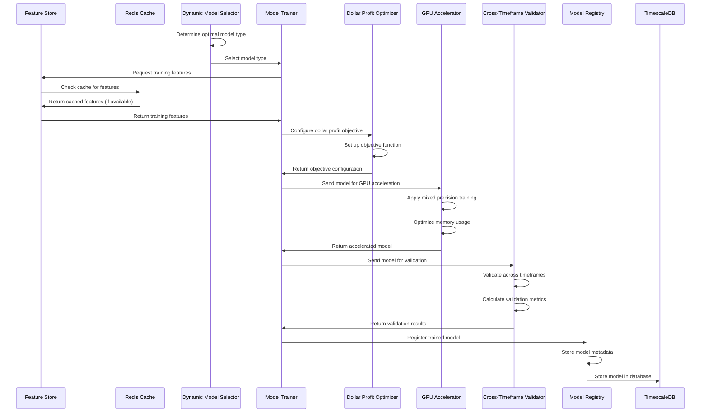
```mermaid
sequenceDiagram
    participant FS as Feature Store
    participant RC as Redis Cache
    participant DMS as Dynamic Model Selector
    participant MT as Model Trainer
    participant DPO as Dollar Profit Optimizer
    participant GPU as GPU Accelerator
    participant CTV as Cross-Timeframe Validator
    participant MR as Model Registry
    participant TS1 as TimescaleDB
    
    DMS->>DMS: Determine optimal model type
    DMS->>MT: Select model type
    
    MT->>FS: Request training features
    FS->>RC: Check cache for features
    RC->>FS: Return cached features (if available)
    FS->>MT: Return training features
    
    MT->>DPO: Configure dollar profit objective
    DPO->>DPO: Set up objective function
    DPO->>MT: Return objective configuration
    
    MT->>GPU: Send model for GPU acceleration
    GPU->>GPU: Apply mixed precision training
    GPU->>GPU: Optimize memory usage
    GPU->>MT: Return accelerated model
    
    MT->>CTV: Send model for validation
    CTV->>CTV: Validate across timeframes
    CTV->>CTV: Calculate validation metrics
    CTV->>MT: Return validation results
    
    MT->>MR: Register trained model
    MR->>MR: Store model metadata
    MR->>TS1: Store model in database
```

### 4. Trading Strategy & Execution Workflow

This diagram shows the detailed workflow of the Trading Strategy & Execution subsystem:

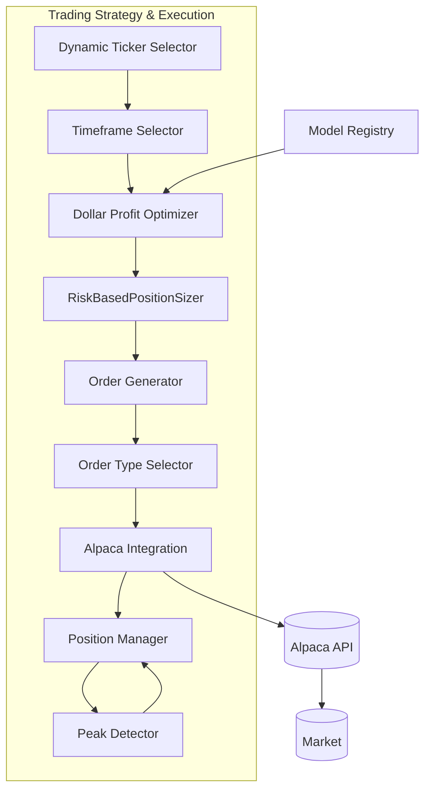
```mermaid
flowchart TD
    %% Trading Strategy Components
    subgraph "Trading Strategy & Execution"
        DTS[Dynamic Ticker Selector]
        TS[Timeframe Selector]
        DPO[Dollar Profit Optimizer]
        PS[RiskBasedPositionSizer]
        PD[Peak Detector]
        OG[Order Generator]
        OTS[Order Type Selector]
        AI[Alpaca Integration]
        PM[Position Manager]
        
        DTS --> TS
        TS --> DPO
        DPO --> PS
        PS --> OG
        OG --> OTS
        OTS --> AI
        AI --> PM
        PM --> PD
        PD --> PM
    end
    
    %% External Systems
    MR[Model Registry]
    AA[(Alpaca API)]
    MK[(Market)]
    
    %% External Connections
    MR --> DPO
    AI --> AA
    AA --> MK
```

#### Trading Strategy Process Flow

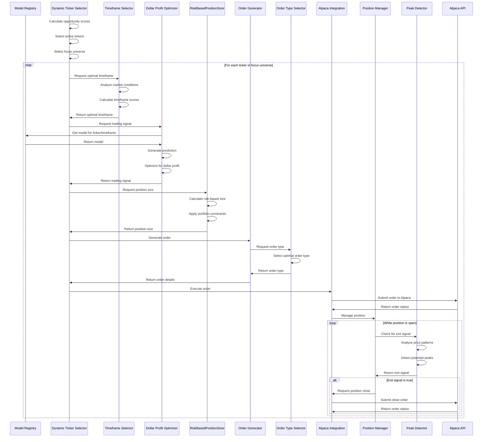
```mermaid
sequenceDiagram
    participant MR as Model Registry
    participant DTS as Dynamic Ticker Selector
    participant TS as Timeframe Selector
    participant DPO as Dollar Profit Optimizer
    participant PS as RiskBasedPositionSizer
    participant OG as Order Generator
    participant OTS as Order Type Selector
    participant AI as Alpaca Integration
    participant PM as Position Manager
    participant PD as Peak Detector
    participant AA as Alpaca API
    
    DTS->>DTS: Calculate opportunity scores
    DTS->>DTS: Select active tickers
    DTS->>DTS: Select focus universe
    
    loop For each ticker in focus universe
        DTS->>TS: Request optimal timeframe
        TS->>TS: Analyze market conditions
        TS->>TS: Calculate timeframe scores
        TS->>DTS: Return optimal timeframe
        
        DTS->>DPO: Request trading signal
        DPO->>MR: Get model for ticker/timeframe
        MR->>DPO: Return model
        DPO->>DPO: Generate prediction
        DPO->>DPO: Optimize for dollar profit
        DPO->>DTS: Return trading signal
        
        DTS->>PS: Request position size
        PS->>PS: Calculate risk-based size
        PS->>PS: Apply portfolio constraints
        PS->>DTS: Return position size
        
        DTS->>OG: Generate order
        OG->>OTS: Request order type
        OTS->>OTS: Select optimal order type
        OTS->>OG: Return order type
        OG->>DTS: Return order details
        
        DTS->>AI: Execute order
        AI->>AA: Submit order to Alpaca
        AA->>AI: Return order status
        
        AI->>PM: Manage position
        
        loop While position is open
            PM->>PD: Check for exit signal
            PD->>PD: Analyze price patterns
            PD->>PD: Detect potential peaks
            PD->>PM: Return exit signal
            
            alt Exit signal is true
                PM->>AI: Request position close
                AI->>AA: Submit close order
                AA->>AI: Return order status
            end
        end
    end
```

### 5. Monitoring & Analytics Workflow

This diagram shows the detailed workflow of the Monitoring & Analytics subsystem:

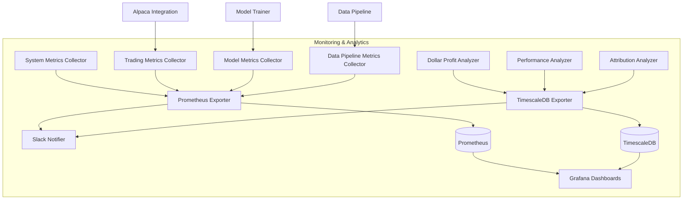
```mermaid
flowchart TD
    %% Monitoring Components
    subgraph "Monitoring & Analytics"
        SMC[System Metrics Collector]
        TMC[Trading Metrics Collector]
        MMC[Model Metrics Collector]
        DPMC[Data Pipeline Metrics Collector]
        PE[Prometheus Exporter]
        TE[TimescaleDB Exporter]
        DPA[Dollar Profit Analyzer]
        PA[Performance Analyzer]
        AA[Attribution Analyzer]
        SN[Slack Notifier]
        GD[Grafana Dashboards]
        
        SMC --> PE
        TMC --> PE
        MMC --> PE
        DPMC --> PE
        PE --> PR[(Prometheus)]
        
        DPA --> TE
        PA --> TE
        AA --> TE
        TE --> TS1[(TimescaleDB)]
        
        PR --> GD
        TS1 --> GD
        
        PE --> SN
        TE --> SN
    end
    
    %% External Systems
    AI[Alpaca Integration]
    MT[Model Trainer]
    DP[Data Pipeline]
    
    %% External Connections
    AI --> TMC
    MT --> MMC
    DP --> DPMC
```

#### Monitoring Process Flow

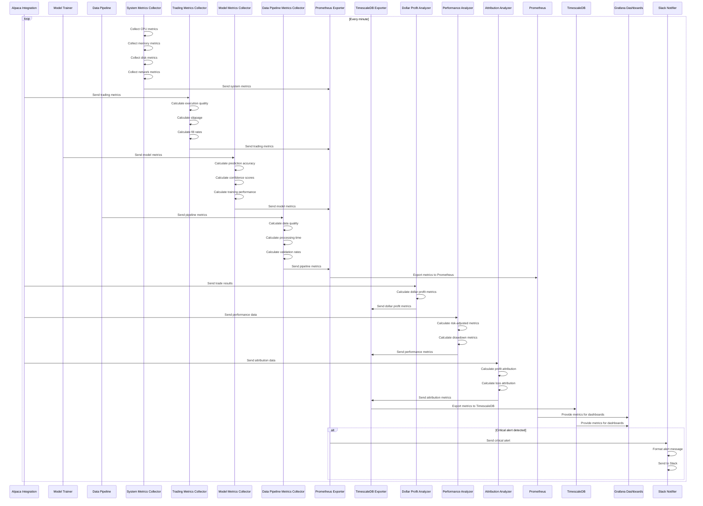
```mermaid
sequenceDiagram
    participant AI as Alpaca Integration
    participant MT as Model Trainer
    participant DP as Data Pipeline
    participant SMC as System Metrics Collector
    participant TMC as Trading Metrics Collector
    participant MMC as Model Metrics Collector
    participant DPMC as Data Pipeline Metrics Collector
    participant PE as Prometheus Exporter
    participant TE as TimescaleDB Exporter
    participant DPA as Dollar Profit Analyzer
    participant PA as Performance Analyzer
    participant AA as Attribution Analyzer
    participant PR as Prometheus
    participant TS1 as TimescaleDB
    participant GD as Grafana Dashboards
    participant SN as Slack Notifier
    
    loop Every minute
        SMC->>SMC: Collect CPU metrics
        SMC->>SMC: Collect memory metrics
        SMC->>SMC: Collect disk metrics
        SMC->>SMC: Collect network metrics
        SMC->>PE: Send system metrics
        
        AI->>TMC: Send trading metrics
        TMC->>TMC: Calculate execution quality
        TMC->>TMC: Calculate slippage
        TMC->>TMC: Calculate fill rates
        TMC->>PE: Send trading metrics
        
        MT->>MMC: Send model metrics
        MMC->>MMC: Calculate prediction accuracy
        MMC->>MMC: Calculate confidence scores
        MMC->>MMC: Calculate training performance
        MMC->>PE: Send model metrics
        
        DP->>DPMC: Send pipeline metrics
        DPMC->>DPMC: Calculate data quality
        DPMC->>DPMC: Calculate processing time
        DPMC->>DPMC: Calculate validation rates
        DPMC->>PE: Send pipeline metrics
        
        PE->>PR: Export metrics to Prometheus
        
        AI->>DPA: Send trade results
        DPA->>DPA: Calculate dollar profit metrics
        DPA->>TE: Send dollar profit metrics
        
        AI->>PA: Send performance data
        PA->>PA: Calculate risk-adjusted metrics
        PA->>PA: Calculate drawdown metrics
        PA->>TE: Send performance metrics
        
        AI->>AA: Send attribution data
        AA->>AA: Calculate profit attribution
        AA->>AA: Calculate loss attribution
        AA->>TE: Send attribution metrics
        
        TE->>TS1: Export metrics to TimescaleDB
        
        PR->>GD: Provide metrics for dashboards
        TS1->>GD: Provide metrics for dashboards
        
        alt Critical alert detected
            PE->>SN: Send critical alert
            SN->>SN: Format alert message
            SN->>SN: Send to Slack
        end
    end
```

### 6. Continuous Learning & Adaptation Workflow

This diagram shows the detailed workflow of the Continuous Learning & Adaptation subsystem:

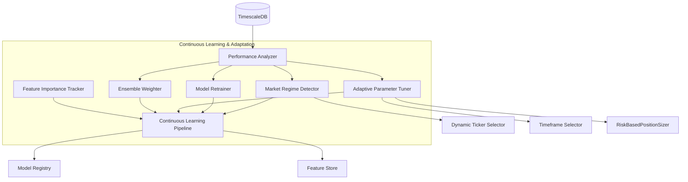
```mermaid
flowchart TD
    %% Continuous Learning Components
    subgraph "Continuous Learning & Adaptation"
        PA[Performance Analyzer]
        MRD[Market Regime Detector]
        MRT[Model Retrainer]
        APT[Adaptive Parameter Tuner]
        EW[Ensemble Weighter]
        FIT[Feature Importance Tracker]
        CLP[Continuous Learning Pipeline]
        
        PA --> MRD
        PA --> MRT
        PA --> APT
        PA --> EW
        MRD --> CLP
        MRT --> CLP
        APT --> CLP
        EW --> CLP
        FIT --> CLP
    end
    
    %% External Systems
    TS1[(TimescaleDB)]
    MR[Model Registry]
    FS[Feature Store]
    DTS[Dynamic Ticker Selector]
    TSel[Timeframe Selector]
    PS[RiskBasedPositionSizer]
    
    %% External Connections
    TS1 --> PA
    CLP --> MR
    CLP --> FS
    MRD --> DTS
    APT --> TSel
    APT --> PS
```

#### Continuous Learning Process Flow

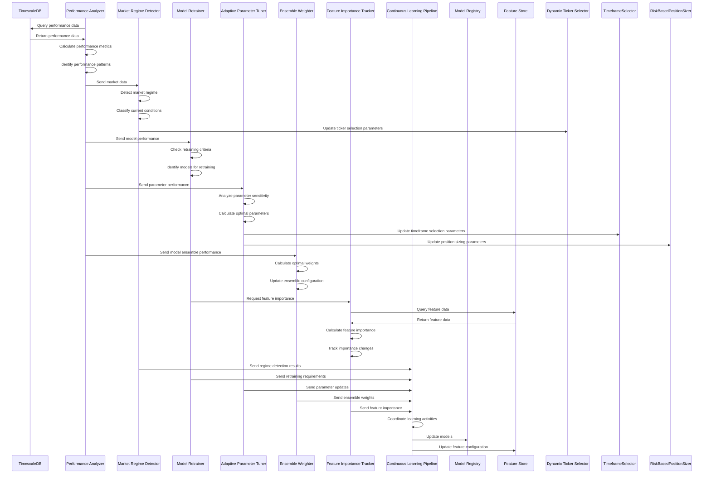
```mermaid
sequenceDiagram
    participant TS1 as TimescaleDB
    participant PA as Performance Analyzer
    participant MRD as Market Regime Detector
    participant MRT as Model Retrainer
    participant APT as Adaptive Parameter Tuner
    participant EW as Ensemble Weighter
    participant FIT as Feature Importance Tracker
    participant CLP as Continuous Learning Pipeline
    participant MR as Model Registry
    participant FS as Feature Store
    participant DTS as Dynamic Ticker Selector
    participant TSel as TimeframeSelector
    participant PS as RiskBasedPositionSizer
    
    PA->>TS1: Query performance data
    TS1->>PA: Return performance data
    
    PA->>PA: Calculate performance metrics
    PA->>PA: Identify performance patterns
    
    PA->>MRD: Send market data
    MRD->>MRD: Detect market regime
    MRD->>MRD: Classify current conditions
    MRD->>DTS: Update ticker selection parameters
    
    PA->>MRT: Send model performance
    MRT->>MRT: Check retraining criteria
    MRT->>MRT: Identify models for retraining
    
    PA->>APT: Send parameter performance
    APT->>APT: Analyze parameter sensitivity
    APT->>APT: Calculate optimal parameters
    APT->>TSel: Update timeframe selection parameters
    APT->>PS: Update position sizing parameters
    
    PA->>EW: Send model ensemble performance
    EW->>EW: Calculate optimal weights
    EW->>EW: Update ensemble configuration
    
    MRT->>FIT: Request feature importance
    FIT->>FS: Query feature data
    FS->>FIT: Return feature data
    FIT->>FIT: Calculate feature importance
    FIT->>FIT: Track importance changes
    
    MRD->>CLP: Send regime detection results
    MRT->>CLP: Send retraining requirements
    APT->>CLP: Send parameter updates
    EW->>CLP: Send ensemble weights
    FIT->>CLP: Send feature importance
    
    CLP->>CLP: Coordinate learning activities
    CLP->>MR: Update models
    CLP->>FS: Update feature configuration
```

### 7. CI/CD Pipeline Workflow

This diagram shows the detailed workflow of the CI/CD Pipeline subsystem:

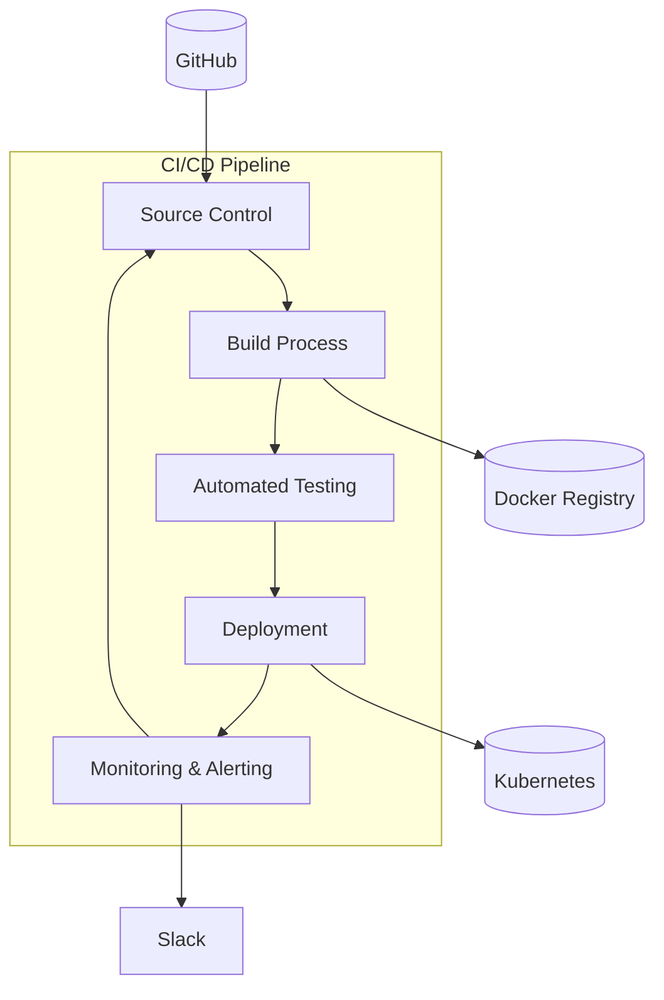
```mermaid
flowchart TD
    %% CI/CD Pipeline Components
    subgraph "CI/CD Pipeline"
        SC[Source Control]
        BP[Build Process]
        AT[Automated Testing]
        DP[Deployment]
        MA[Monitoring & Alerting]
        
        SC --> BP
        BP --> AT
        AT --> DP
        DP --> MA
        MA --> SC
    end
    
    %% External Systems
    GH[(GitHub)]
    DR[(Docker Registry)]
    K8S[(Kubernetes)]
    SL[Slack]
    
    %% External Connections
    GH --> SC
    BP --> DR
    DP --> K8S
    MA --> SL
```

#### CI/CD Process Flow

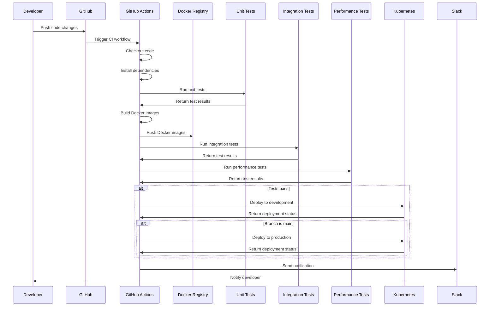
```mermaid
sequenceDiagram
    participant DEV as Developer
    participant GH as GitHub
    participant GA as GitHub Actions
    participant DR as Docker Registry
    participant UT as Unit Tests
    participant IT as Integration Tests
    participant PT as Performance Tests
    participant K8S as Kubernetes
    participant SL as Slack
    
    DEV->>GH: Push code changes
    GH->>GA: Trigger CI workflow
    
    GA->>GA: Checkout code
    GA->>GA: Install dependencies
    
    GA->>UT: Run unit tests
    UT->>GA: Return test results
    
    GA->>GA: Build Docker images
    GA->>DR: Push Docker images
    
    GA->>IT: Run integration tests
    IT->>GA: Return test results
    
    GA->>PT: Run performance tests
    PT->>GA: Return test results
    
    alt Tests pass
        GA->>K8S: Deploy to development
        K8S->>GA: Return deployment status
        
        alt Branch is main
            GA->>K8S: Deploy to production
            K8S->>GA: Return deployment status
        end
    end
    
    GA->>SL: Send notification
    SL->>DEV: Notify developer
```

## Complete System Sequence Diagram

This diagram shows the complete system workflow as a sequence of operations:

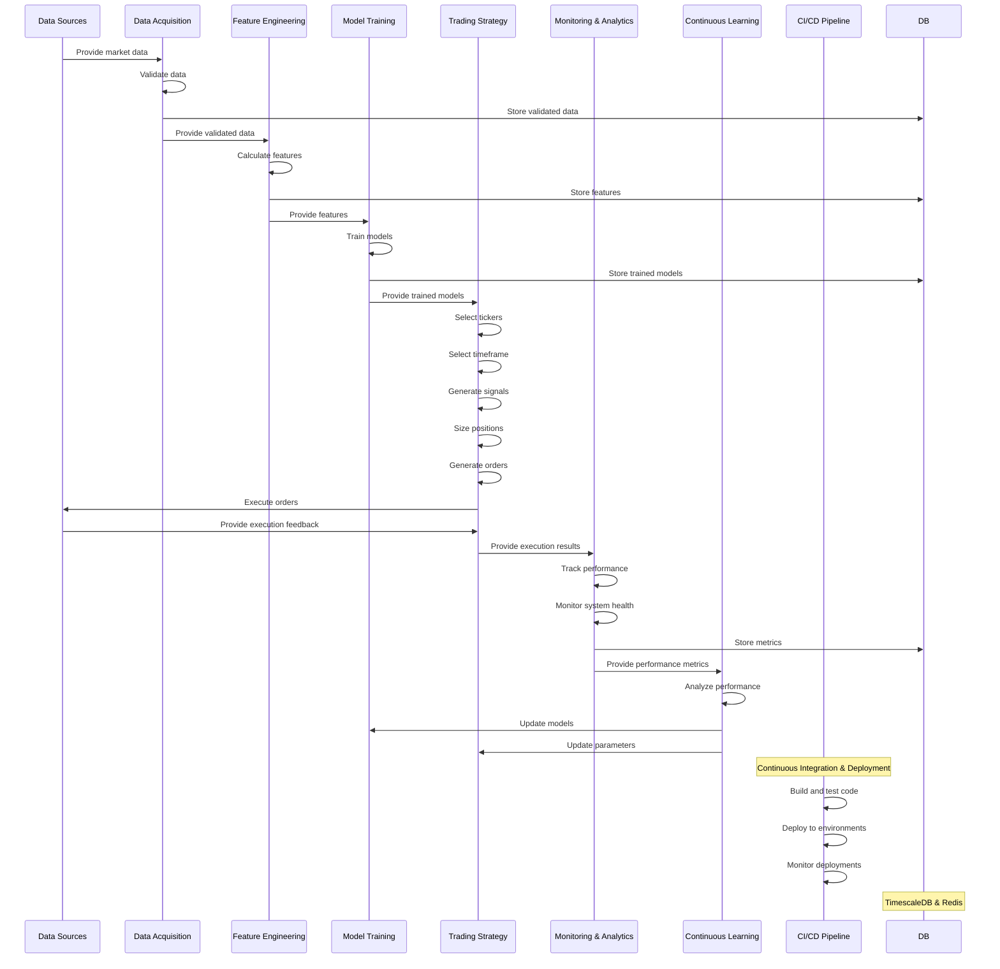
```mermaid
sequenceDiagram
    participant DS as Data Sources
    participant DA as Data Acquisition
    participant FE as Feature Engineering
    participant MT as Model Training
    participant TS as Trading Strategy
    participant MA as Monitoring & Analytics
    participant CL as Continuous Learning
    participant CD as CI/CD Pipeline
    
    %% Data Acquisition Phase
    DS->>DA: Provide market data
    DA->>DA: Validate data
    DA->>DB: Store validated data
    
    %% Feature Engineering Phase
    DA->>FE: Provide validated data
    FE->>FE: Calculate features
    FE->>DB: Store features
    
    %% Model Training Phase
    FE->>MT: Provide features
    MT->>MT: Train models
    MT->>DB: Store trained models
    
    %% Trading Strategy Phase
    MT->>TS: Provide trained models
    TS->>TS: Select tickers
    TS->>TS: Select timeframe
    TS->>TS: Generate signals
    TS->>TS: Size positions
    TS->>TS: Generate orders
    TS->>DS: Execute orders
    DS->>TS: Provide execution feedback
    
    %% Monitoring & Analytics Phase
    TS->>MA: Provide execution results
    MA->>MA: Track performance
    MA->>MA: Monitor system health
    MA->>DB: Store metrics
    
    %% Continuous Learning Phase
    MA->>CL: Provide performance metrics
    CL->>CL: Analyze performance
    CL->>MT: Update models
    CL->>TS: Update parameters

    %% CI/CD Phase
    Note over CD: Continuous Integration & Deployment
    CD->>CD: Build and test code
    CD->>CD: Deploy to environments
    CD->>CD: Monitor deployments
    
    %% Database Interactions
    Note over DB: TimescaleDB & Redis
```

## Daily Trading Workflow

This diagram shows the daily workflow of the trading system:

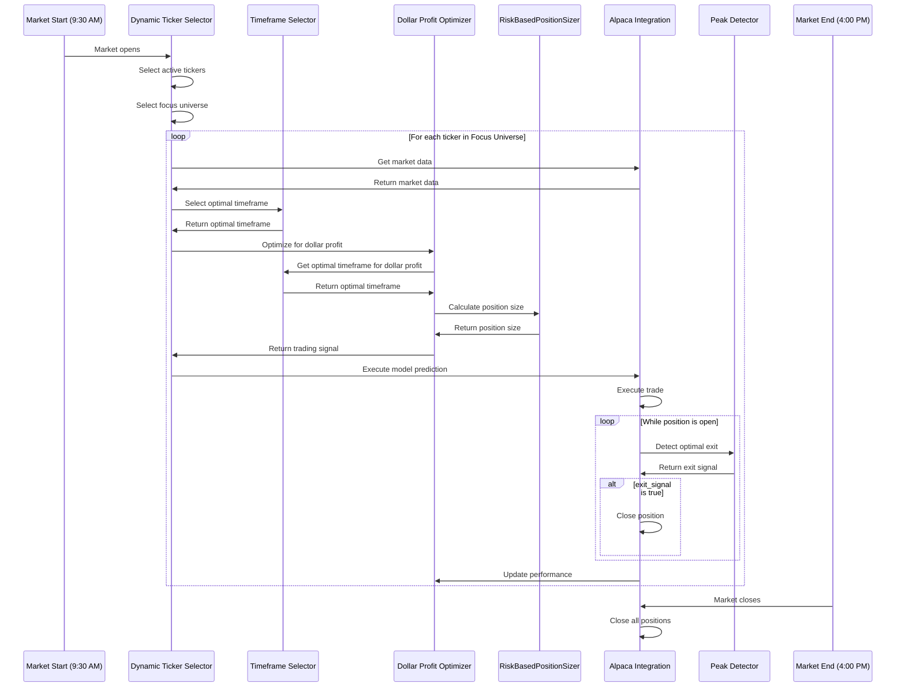
```mermaid
sequenceDiagram
    participant MS as Market Start (9:30 AM)
    participant DTS as Dynamic Ticker Selector
    participant TS as Timeframe Selector
    participant DPO as Dollar Profit Optimizer
    participant PS as RiskBasedPositionSizer
    participant AI as Alpaca Integration
    participant PD as Peak Detector
    participant ME as Market End (4:00 PM)
    
    MS->>DTS: Market opens
    DTS->>DTS: Select active tickers
    DTS->>DTS: Select focus universe
    
    loop For each ticker in Focus Universe
        DTS->>AI: Get market data
        AI->>DTS: Return market data
        
        DTS->>TS: Select optimal timeframe
        TS->>DTS: Return optimal timeframe
        
        DTS->>DPO: Optimize for dollar profit
        DPO->>TS: Get optimal timeframe for dollar profit
        TS->>DPO: Return optimal timeframe
        
        DPO->>PS: Calculate position size
        PS->>DPO: Return position size
        
        DPO->>DTS: Return trading signal
        
        DTS->>AI: Execute model prediction
        AI->>AI: Execute trade
        
        loop While position is open
            AI->>PD: Detect optimal exit
            PD->>AI: Return exit signal
            
            alt exit_signal is true
                AI->>AI: Close position
            end
        end
        
        AI->>DPO: Update performance
    end
    
    ME->>AI: Market closes
    AI->>AI: Close all positions
```

## Data Flow Diagram

This diagram shows the flow of data through the system:

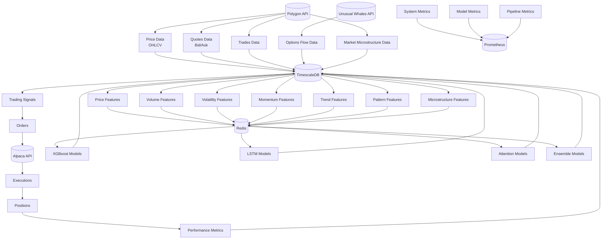
```mermaid
flowchart TD
    %% Data Sources
    PA[(Polygon API)]
    UW[(Unusual Whales API)]
    AA[(Alpaca API)]
    
    %% Data Types
    OHLCV[Price Data\nOHLCV]
    QUOTES[Quotes Data\nBid/Ask]
    TRADES[Trades Data]
    OPTIONS[Options Flow Data]
    MICRO[Market Microstructure Data]
    
    %% Features
    PRICE[Price Features]
    VOLUME[Volume Features]
    VOLATILITY[Volatility Features]
    MOMENTUM[Momentum Features]
    TREND[Trend Features]
    PATTERN[Pattern Features]
    MICRO_F[Microstructure Features]
    
    %% Models
    XGB[XGBoost Models]
    LSTM[LSTM Models]
    ATTENTION[Attention Models]
    ENSEMBLE[Ensemble Models]
    
    %% Trading
    SIGNALS[Trading Signals]
    ORDERS[Orders]
    EXECUTIONS[Executions]
    POSITIONS[Positions]
    
    %% Metrics
    PERF[Performance Metrics]
    SYSTEM[System Metrics]
    MODEL_M[Model Metrics]
    PIPELINE[Pipeline Metrics]
    
    %% Storage
    TS1[(TimescaleDB)]
    RD[(Redis)]
    PR[(Prometheus)]
    
    %% Data Flow
    PA --> OHLCV
    PA --> QUOTES
    PA --> TRADES
    UW --> OPTIONS
    PA --> MICRO
    
    OHLCV --> TS1
    QUOTES --> TS1
    TRADES --> TS1
    OPTIONS --> TS1
    MICRO --> TS1
    
    TS1 --> PRICE
    TS1 --> VOLUME
    TS1 --> VOLATILITY
    TS1 --> MOMENTUM
    TS1 --> TREND
    TS1 --> PATTERN
    TS1 --> MICRO_F
    
    PRICE --> RD
    VOLUME --> RD
    VOLATILITY --> RD
    MOMENTUM --> RD
    TREND --> RD
    PATTERN --> RD
    MICRO_F --> RD
    
    RD --> XGB
    RD --> LSTM
    RD --> ATTENTION
    RD --> ENSEMBLE
    
    XGB --> TS1
    LSTM --> TS1
    ATTENTION --> TS1
    ENSEMBLE --> TS1
    
    TS1 --> SIGNALS
    SIGNALS --> ORDERS
    ORDERS --> AA
    AA --> EXECUTIONS
    EXECUTIONS --> POSITIONS
    
    POSITIONS --> PERF
    PERF --> TS1
    SYSTEM --> PR
    MODEL_M --> PR
    PIPELINE --> PR
```

## Conclusion

These workflow diagrams provide a comprehensive visualization of the Autonomous Trading System, showing how data and control flow through the system. The modular architecture allows for clear separation of concerns while ensuring that all components work together seamlessly to create an adaptive, high-performance trading system.

The system's workflow is designed to be robust, with clear data flows and control paths. Each subsystem has well-defined responsibilities and interfaces, allowing for independent development and testing while ensuring that the system as a whole functions cohesively.

The CI/CD pipeline ensures that code changes are automatically built, tested, and deployed in a consistent and reliable manner, reducing the risk of errors and improving the overall quality of the system.

By following these workflows, developers can understand how the system operates and how to extend or modify specific components without disrupting the overall system functionality.