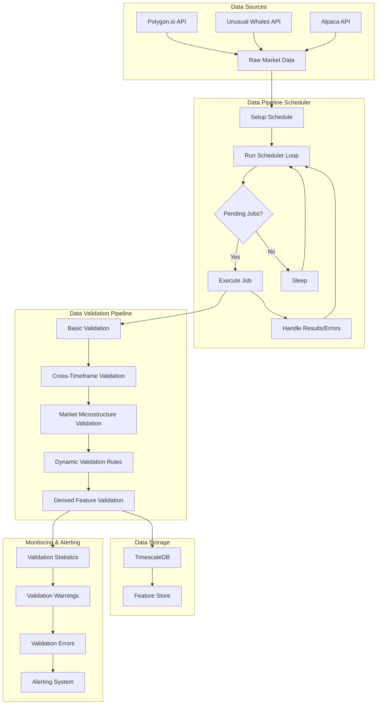
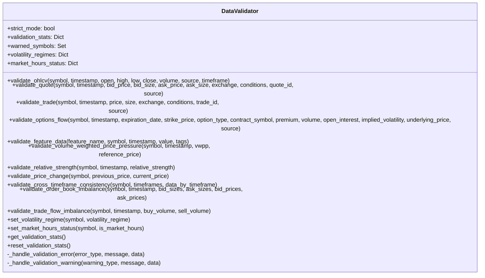
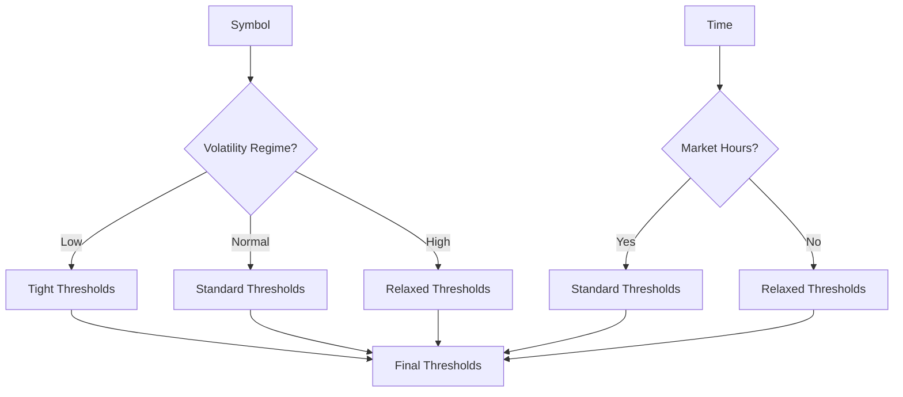
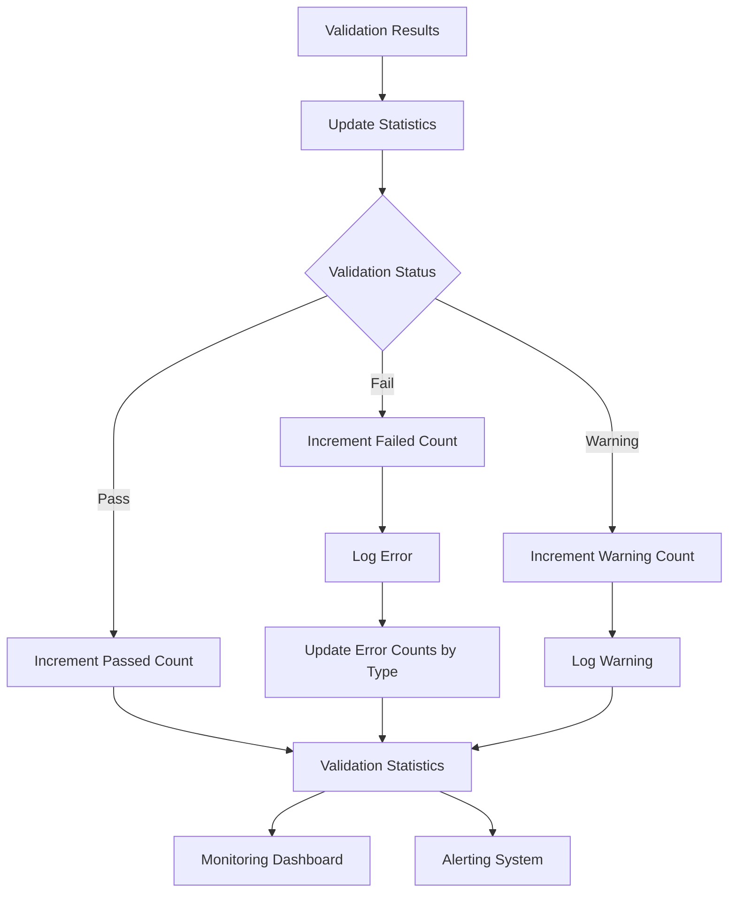
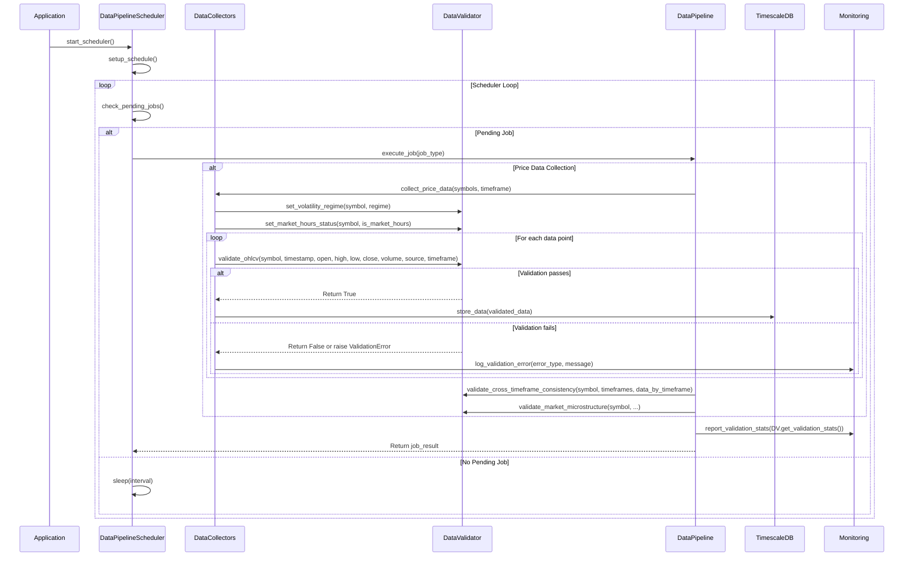
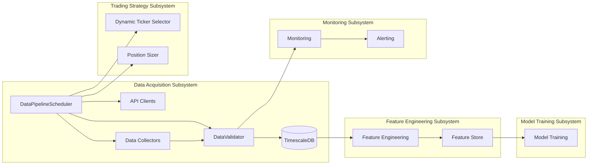
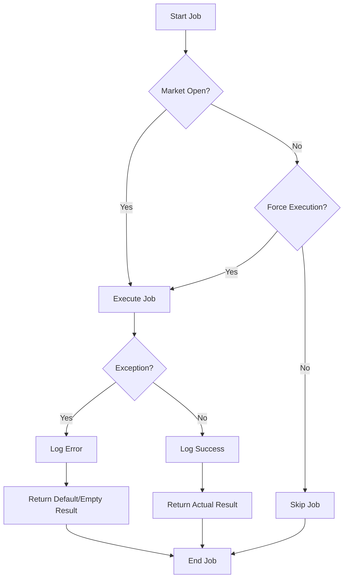

# Data Acquisition Subsystem

## 1. Introduction

The Data Acquisition Subsystem is a critical component of the Autonomous Trading System responsible for gathering, validating, processing, and storing market data from various sources. It ensures that the system has access to high-quality, consistent data for making trading decisions.

This document provides a comprehensive overview of the Data Acquisition Subsystem, including its architecture, components, data flow, validation framework, and integration with other subsystems.

## 2. System Architecture Overview

The Data Acquisition Subsystem follows a modular architecture with several key components:



## 3. Key Components

### 3.1 Data Pipeline Scheduler

The Data Pipeline Scheduler orchestrates the collection, validation, and processing of market data at regular intervals. It ensures that the system has access to up-to-date, validated data for making trading decisions.

#### 3.1.1 DataPipelineScheduler Class

The core component of the scheduler is the `DataPipelineScheduler` class, which:
- Initializes the data pipeline and related components
- Sets up the schedule for various data collection jobs
- Runs the scheduler loop
- Handles job execution and error handling

#### 3.1.2 Scheduled Jobs

The scheduler manages several types of jobs:

1. **Dynamic Ticker Selection Job**: Selects the most promising tickers from a large universe based on opportunity scores
2. **Position Sizing Job**: Calculates position sizes for selected tickers
3. **Price Data Collection Job**: Collects OHLCV data for selected tickers
4. **Quotes Data Collection Job**: Collects bid/ask quotes data
5. **Trades Data Collection Job**: Collects individual trades data
6. **Options Data Collection Job**: Collects options flow data
7. **Indicators Calculation Job**: Calculates technical indicators
8. **Full Pipeline Job**: Runs the complete data pipeline

#### 3.1.3 Scheduling Strategy

The scheduler employs a time-based scheduling strategy with different frequencies for different job types:

```mermaid
gantt
    title Data Pipeline Scheduling Strategy
    dateFormat  HH:mm
    axisFormat %H:%M
    
    section Market Open
    Dynamic Ticker Selection    :milestone, m1, 09:35, 0m
    Position Sizing             :milestone, m2, 09:45, 0m
    
    section Hourly
    Price Data Collection       :crit, p1, 09:05, 1m
    Price Data Collection       :crit, p2, 10:05, 1m
    Price Data Collection       :crit, p3, 11:05, 1m
    Price Data Collection       :crit, p4, 12:05, 1m
    Price Data Collection       :crit, p5, 13:05, 1m
    Price Data Collection       :crit, p6, 14:05, 1m
    Price Data Collection       :crit, p7, 15:05, 1m
    
    section Every 15 Minutes
    Quotes Data Collection      :active, q1, 09:00, 1m
    Quotes Data Collection      :active, q2, 09:15, 1m
    Quotes Data Collection      :active, q3, 09:30, 1m
    Quotes Data Collection      :active, q4, 09:45, 1m
    
    section Every 30 Minutes
    Trades Data Collection      :t1, 09:00, 1m
    Trades Data Collection      :t2, 09:30, 1m
    Trades Data Collection      :t3, 10:00, 1m
    Trades Data Collection      :t4, 10:30, 1m
    
    section Every 2 Hours
    Options Data Collection     :o1, 09:15, 1m
    Options Data Collection     :o2, 11:15, 1m
    Options Data Collection     :o3, 13:15, 1m
    Options Data Collection     :o4, 15:15, 1m
    
    section Every 4 Hours
    Indicators Calculation      :i1, 09:30, 1m
    Indicators Calculation      :i2, 13:30, 1m
    
    section Market Close
    Full Pipeline               :milestone, m3, 16:30, 0m
```



Key scheduling decisions:

1. **Dynamic Ticker Selection**: Runs once at market open (9:35 AM) to select the most promising tickers for the day
2. **Position Sizing**: Runs shortly after market open (9:45 AM) to calculate position sizes for selected tickers
3. **Price Data Collection**: Runs hourly to collect OHLCV data
4. **Quotes Data Collection**: Runs every 15 minutes to collect bid/ask quotes
5. **Trades Data Collection**: Runs every 30 minutes to collect trades data
6. **Options Data Collection**: Runs every 2 hours to collect options flow data
7. **Indicators Calculation**: Runs every 4 hours to calculate technical indicators
8. **Full Pipeline**: Runs once after market close (4:30 PM) to ensure all data is collected and processed

### 3.2 Data Validation Framework

The Data Validation Framework ensures data quality, consistency, and integrity across all components. It provides a comprehensive set of validation rules, cross-timeframe consistency checks, and market microstructure validation.

#### 3.2.1 DataValidator Class

The `DataValidator` class is the core component responsible for validating market data. It provides methods for validating different types of data, including OHLCV, quotes, trades, options flow, and derived features.



#### 3.2.2 Validation Types

The validation framework supports several types of validation:

1. **Basic OHLCV Validation**: Ensures that price and volume data meet fundamental quality requirements
   - Required fields validation
   - Type validation
   - Range validation
   - Consistency validation (high >= low, high >= open, high >= close, etc.)

2. **Quote Validation**: Ensures that bid/ask prices and sizes are consistent and reasonable
   - Required fields validation
   - Type validation
   - Range validation
   - Consistency validation (bid <= ask)
   - Warning for unusual values (zero prices, large spread)

3. **Trade Validation**: Ensures that trade prices and sizes are reasonable
   - Required fields validation
   - Type validation
   - Range validation
   - Warning for unusual values (high price, large size)

4. **Options Flow Validation**: Ensures that options data is consistent and reasonable
   - Required fields validation
   - Type validation
   - Value validation (option type)
   - Range validation
   - Date validation
   - Warning for unusual values (past expiration)

5. **Cross-Timeframe Consistency Validation**: Ensures that data is consistent across different timeframes
   - Resampling smaller timeframes to match larger timeframes
   - Comparing OHLCV values across timeframes
   - Validating consistency of derived features across timeframes

6. **Market Microstructure Validation**: Ensures that order book and trade flow data is consistent and reasonable
   - Order book imbalance validation
   - Trade flow imbalance validation
   - Price pressure validation
   - Extreme value detection

#### 3.2.3 Dynamic Validation Rules

The system adjusts validation thresholds based on volatility regimes and market hours:



#### 3.2.4 Batch Validation

The system supports batch validation for efficient processing of large datasets:

```python
def validate_batch_ohlcv(self, ohlcv_data: List[Tuple]) -> List[Tuple]:
    """Validate a batch of OHLCV data."""
    valid_data = []
    
    for data in ohlcv_data:
        if len(data) != 9:
            self._handle_validation_error("format_error", "OHLCV data tuple must have 9 elements", data)
            continue
            
        symbol, timestamp, open_price, high, low, close, volume, source, timeframe = data
        
        if self.validate_ohlcv(symbol, timestamp, open_price, high, low, close, volume, source, timeframe):
            valid_data.append(data)
    
    return valid_data
```

#### 3.2.5 Validation Statistics and Monitoring

The validation system tracks statistics and integrates with the monitoring system to provide alerts for validation failures:



### 3.3 API Clients

The Data Acquisition Subsystem includes several API clients for collecting data from external sources:

1. **PolygonClient**: Interface to the Polygon.io API for collecting price, quote, and trade data
2. **UnusualWhalesClient**: Interface to the Unusual Whales API for collecting options flow data
3. **AlpacaMarketDataClient**: Interface to the Alpaca API for collecting market data

### 3.4 Data Collectors

The Data Acquisition Subsystem includes several data collectors for different types of market data:

1. **PriceCollector**: Collects OHLCV data for selected tickers
2. **QuoteCollector**: Collects bid/ask quotes data
3. **TradeCollector**: Collects individual trades data
4. **OptionsCollector**: Collects options flow data

### 3.5 Data Storage

The Data Acquisition Subsystem stores data in TimescaleDB, a time-series database optimized for fast ingest and complex queries:

1. **TimescaleManager**: Manages connections to the TimescaleDB database
2. **DataSchema**: Defines the database schema for storing market data

## 4. Data Flow Process

The data flow through the Data Acquisition Subsystem is as follows:



## 5. Integration with Other Subsystems

The Data Acquisition Subsystem integrates with several other subsystems of the Autonomous Trading System:



Key integration points:

1. **Feature Engineering Subsystem**: The Data Acquisition Subsystem provides validated data to the Feature Engineering Subsystem for calculating features
2. **Model Training Subsystem**: The validated data is used by the Model Training Subsystem for training machine learning models
3. **Trading Strategy Subsystem**: The Data Acquisition Subsystem interacts with the Dynamic Ticker Selector and Position Sizer components of the Trading Strategy Subsystem
4. **Monitoring Subsystem**: The Data Acquisition Subsystem reports validation statistics and errors to the Monitoring Subsystem for alerting and visualization

## 6. Error Handling and Resilience

The Data Acquisition Subsystem implements several error handling and resilience mechanisms:

1. **Job-Level Exception Handling**: Each job method has try-except blocks to catch and log exceptions
2. **Scheduler Loop Exception Handling**: The main scheduler loop has exception handling to prevent the scheduler from crashing
3. **Market Hours Check**: Jobs can be configured to only run during market hours
4. **Fallback Mechanisms**: If dynamic ticker selection fails, the system falls back to default tickers
5. **Logging**: Comprehensive logging of job execution status and errors
6. **Circuit Breaker Pattern**: Prevents repeated calls to failing endpoints
7. **Retry Mechanisms**: Implements exponential backoff for transient failures



## 7. Configuration Options

The Data Acquisition Subsystem supports several configuration options:

1. **Market Hours Only**: Only run jobs during market hours
2. **Symbols**: Comma-separated list of symbols to use (defaults to dynamic selection)
3. **Lookback Days**: Number of days to look back for historical data
4. **Strict Validation**: Enable strict validation mode
5. **Generate Report**: Generate validation report
6. **Max Active Tickers**: Maximum number of active tickers
7. **Focus Universe Size**: Number of tickers in the focus universe
8. **Min Volume**: Minimum trading volume for ticker selection
9. **Min Volatility**: Minimum volatility (ATR/price) for ticker selection
10. **Opportunity Threshold**: Minimum opportunity score for ticker selection

## 8. Performance Considerations

### 8.1 Batch Processing

For large datasets, use batch validation to improve performance:

```python
# Instead of validating individual data points
for data_point in data_points:
    validator.validate_ohlcv(...)

# Use batch validation
valid_data = validator.validate_batch_ohlcv(data_points)
```

### 8.2 Parallel Validation

For very large datasets, consider parallel validation:

```python
def validate_in_parallel(data_chunks):
    with concurrent.futures.ProcessPoolExecutor() as executor:
        results = list(executor.map(validator.validate_batch_ohlcv, data_chunks))
    return [item for sublist in results for item in sublist]
```

### 8.3 Caching Volatility Regimes

Cache volatility regimes to avoid recalculating them for each validation:

```python
# Calculate volatility regimes once
for symbol in symbols:
    volatility = calculate_volatility(symbol)
    validator.set_volatility_regime(symbol, get_regime(volatility))

# Use cached regimes in validation
validator.validate_price_change(symbol, prev_price, curr_price)
```

## 9. Best Practices

1. **Use strict mode in production** - Enable strict validation mode in production to ensure data quality
2. **Monitor validation statistics** - Regularly review validation statistics to identify potential issues
3. **Adjust thresholds as needed** - Fine-tune validation thresholds based on your specific requirements
4. **Validate across timeframes** - Always validate data across multiple timeframes for consistency
5. **Validate market microstructure** - Pay special attention to market microstructure validation for trading strategies
6. **Set appropriate volatility regimes** - Adjust validation thresholds based on market volatility
7. **Handle validation warnings** - Review validation warnings to identify potential issues before they become errors
8. **Use batch validation for efficiency** - Use batch validation for large datasets to improve performance
9. **Integrate with monitoring** - Integrate validation statistics with your monitoring system for real-time alerting
10. **Regularly review validation rules** - Periodically review and update validation rules based on changing market conditions

## 10. Recommendations for Improvements

### 10.1 Architecture Improvements

1. **Microservices Architecture**: Split the monolithic scheduler into smaller, specialized schedulers for different data types
2. **Message Queue Integration**: Use a message queue (e.g., RabbitMQ, Kafka) for job distribution and processing
3. **Containerization**: Containerize the scheduler for easier deployment and scaling
4. **Service Discovery**: Implement service discovery for dynamic configuration of API endpoints

### 10.2 Scheduling Improvements

1. **Adaptive Scheduling**: Adjust job frequency based on market volatility and trading volume
2. **Priority-Based Scheduling**: Implement priority levels for different jobs
3. **Dependency-Based Scheduling**: Define dependencies between jobs to ensure proper execution order
4. **Distributed Scheduling**: Distribute jobs across multiple nodes for better scalability

### 10.3 Validation Improvements

1. **Machine Learning Enhancement**: Implement machine learning models to improve validation accuracy
2. **Real-Time Validation**: Implement real-time validation for streaming data
3. **Anomaly Detection**: Add anomaly detection for identifying unusual patterns in data
4. **Semantic Validation**: Add semantic validation for ensuring data makes sense in context

### 10.4 Monitoring Improvements

1. **Metrics Collection**: Collect and expose metrics on job execution time, success rate, etc.
2. **Alerting**: Implement alerting for critical job failures
3. **Dashboard**: Create a dashboard for monitoring scheduler status and job execution
4. **Performance Profiling**: Add performance profiling to identify bottlenecks

## 11. Conclusion

The Data Acquisition Subsystem is a critical component of the Autonomous Trading System that ensures the system has access to high-quality, consistent data for making trading decisions. Its modular architecture, comprehensive validation framework, and integration with other subsystems make it a robust foundation for the entire system.

By implementing the recommended improvements, the subsystem can become more scalable, resilient, and adaptable to changing market conditions, ultimately leading to better trading decisions and higher profitability.