# Model Training Subsystem

## 1. Introduction

The Model Training Subsystem is a critical component of the Autonomous Trading System responsible for training and optimizing machine learning models that drive trading decisions. It leverages GPU acceleration, specifically the NVIDIA GH200 Grace Hopper Superchip, to achieve high-performance model training and inference.

This document provides a comprehensive overview of the Model Training Subsystem, including its architecture, components, optimization techniques, and integration with other subsystems.

## 2. System Architecture Overview

The Model Training Subsystem follows a modular architecture with several key components:

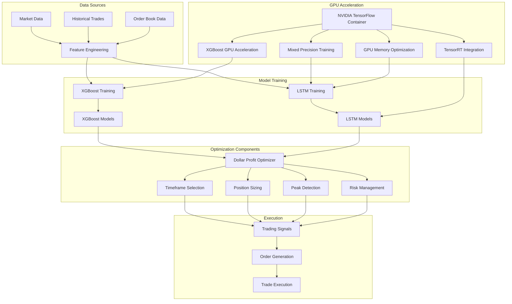
```mermaid
flowchart TD
    subgraph "Data Sources"
        A1[Market Data] --> B1[Feature Engineering]
        A2[Historical Trades] --> B1
        A3[Order Book Data] --> B1
    end
    
    subgraph "Model Training"
        B1 --> C1[XGBoost Training]
        B1 --> C2[LSTM Training]
        C1 --> D1[XGBoost Models]
        C2 --> D2[LSTM Models]
    end
    
    subgraph "GPU Acceleration"
        E1[NVIDIA TensorFlow Container] --> F1[Mixed Precision Training]
        E1 --> F2[TensorRT Integration]
        E1 --> F3[GPU Memory Optimization]
        E1 --> F4[XGBoost GPU Acceleration]
    end
    
    subgraph "Optimization Components"
        D1 --> G1[Dollar Profit Optimizer]
        D2 --> G1
        G1 --> H1[Timeframe Selection]
        G1 --> H2[Position Sizing]
        G1 --> H3[Peak Detection]
        G1 --> H4[Risk Management]
    end
    
    subgraph "Execution"
        H1 --> I1[Trading Signals]
        H2 --> I1
        H3 --> I1
        H4 --> I1
        I1 --> J1[Order Generation]
        J1 --> K1[Trade Execution]
    end
    
    F1 --> C2
    F2 --> D2
    F3 --> C2
    F4 --> C1
```

## 3. Key Components

### 3.1 Docker Container Setup

The Model Training Subsystem uses a Docker container with NVIDIA TensorFlow to provide a consistent and optimized environment for model training and inference.

#### 3.1.1 Dockerfile

```dockerfile
# Dockerfile for NVIDIA GPU-optimized TensorFlow container
# Based on official NVIDIA TensorFlow container with TensorRT integration
FROM nvcr.io/nvidia/tensorflow:24.02-tf2-py3

LABEL maintainer="INAVVI Trading System"
LABEL description="TensorFlow container optimized for NVIDIA GH200 Grace Hopper Superchip"

# Set environment variables for optimized GPU performance
ENV NVIDIA_VISIBLE_DEVICES=all \
    CUDA_DEVICE_ORDER=PCI_BUS_ID \
    TF_FORCE_GPU_ALLOW_GROWTH=true \
    TF_ENABLE_ONEDNN_OPTS=1 \
    TF_USE_CUDNN=1 \
    TF_CUDNN_RESET_RNN_DESCRIPTOR=1 \
    CUDA_CACHE_DISABLE=0 \
    TF_CPP_MIN_LOG_LEVEL=2 \
    HOROVOD_GPU_OPERATIONS=NCCL \
    PYTHONUNBUFFERED=1

# Install additional Python packages for data science and trading
RUN pip install --no-cache-dir \
    pandas \
    scikit-learn \
    matplotlib \
    seaborn \
    plotly \
    statsmodels \
    xgboost \
    lightgbm \
    optuna \
    joblib \
    tqdm \
    psycopg2-binary \
    redis \
    schedule \
    pytz \
    pandas-market-calendars \
    requests \
    aiohttp \
    websockets \
    prometheus-client \
    pytest \
    pytest-cov

# Set up working directory
WORKDIR /app

# Create directories for data, models, and logs
RUN mkdir -p /app/data /app/models /app/logs /app/cache

# Create entrypoint script with GPU verification
RUN echo '#!/bin/bash' > /app/entrypoint.sh && \
    echo 'set -e' >> /app/entrypoint.sh && \
    echo 'echo "=== NVIDIA GPU Environment Information ==="' >> /app/entrypoint.sh && \
    echo 'echo "System: $(uname -a)"' >> /app/entrypoint.sh && \
    echo 'echo ""' >> /app/entrypoint.sh && \
    echo 'echo "Checking for NVIDIA GPU..."' >> /app/entrypoint.sh && \
    echo 'if command -v nvidia-smi &> /dev/null; then' >> /app/entrypoint.sh && \
    echo '    nvidia-smi' >> /app/entrypoint.sh && \
    echo 'else' >> /app/entrypoint.sh && \
    echo '    echo "No NVIDIA GPU detected or nvidia-smi not available"' >> /app/entrypoint.sh && \
    echo 'fi' >> /app/entrypoint.sh && \
    echo '' >> /app/entrypoint.sh && \
    echo 'echo "TensorFlow Version and GPU Detection:"' >> /app/entrypoint.sh && \
    echo 'python -c "import tensorflow as tf; print(\"TensorFlow version:\", tf.__version__); print(\"GPU available:\", tf.config.list_physical_devices(\"GPU\")); print(\"CUDA built version:\", tf.sysconfig.get_build_info()[\"cuda_version\"]); has_tensorrt = hasattr(tf, \"experimental\") and hasattr(tf.experimental, \"tensorrt\"); print(\"Has TensorRT:\", has_tensorrt)"' >> /app/entrypoint.sh && \
    echo '' >> /app/entrypoint.sh && \
    echo 'echo -e "\nContainer is ready. Running command: $@"' >> /app/entrypoint.sh && \
    echo 'exec "$@"' >> /app/entrypoint.sh && \
    chmod +x /app/entrypoint.sh

# Expose port for API/UI
EXPOSE 8000

# Set entrypoint
ENTRYPOINT ["/app/entrypoint.sh"]

# Default command
CMD ["python", "/app/test_tensorflow_gpu.py"]
```

#### 3.1.2 Docker Compose Configuration

```yaml
version: '3.8'

services:
  tensorflow-gpu:
    build:
      context: .
      dockerfile: Dockerfile
    image: inavvi-tensorflow-gpu:latest
    container_name: inavvi-tensorflow-gpu
    restart: unless-stopped
    volumes:
      - ./app:/app/app  # Mount your application code
      - ./data:/app/data  # Mount data directory
      - ./models:/app/models  # Mount models directory
      - ../src/trading:/app/trading  # Mount trading modules
      - ../src/model_training:/app/model_training  # Mount model training modules
      - ../src/utils:/app/utils  # Mount utility modules
      - ./logs:/app/logs  # Mount logs directory
    environment:
      - NVIDIA_VISIBLE_DEVICES=all
      - CUDA_VISIBLE_DEVICES=0
      - TF_FORCE_GPU_ALLOW_GROWTH=true
      - TF_XLA_FLAGS=--tf_xla_auto_jit=2 --tf_xla_cpu_global_jit
      - TF_ENABLE_ONEDNN_OPTS=1
      - TF_CPP_MIN_LOG_LEVEL=2
      - PYTHONUNBUFFERED=1
    ports:
      - "8001:8000"  # API/UI port
    # Use NVIDIA runtime
    deploy:
      resources:
        reservations:
          devices:
            - driver: nvidia
              count: 1
              capabilities: [gpu]
    # Override the default command to run a shell
    command: ["/bin/bash", "-c", "python /app/app/test_models_gpu.py && /bin/bash"]

networks:
  default:
    driver: bridge
```

#### 3.1.3 CuDNN Fixes for GH200

The GH200 Grace Hopper Superchip requires specific fixes for CuDNN compatibility, especially for RNN operations:

```python
#!/usr/bin/env python3
"""
Fix script for CuDNN compatibility with GH200 Grace Hopper Superchip.

This script modifies the TensorFlow configuration to work with CuDNN on GH200 by:
1. Setting environment variables for CuDNN
2. Patching the sequence length handling for RNN operations
3. Configuring memory settings to prevent OOM errors
"""

import os
import sys
import tensorflow as tf
import logging

# Configure logging
logging.basicConfig(
    level=logging.INFO,
    format='%(asctime)s - %(name)s - %(levelname)s - %(message)s'
)
logger = logging.getLogger('cudnn_fix')

def apply_cudnn_fixes():
    """Apply CuDNN fixes for GH200 compatibility."""
    logger.info("Applying CuDNN fixes for GH200 compatibility")
    
    # Set environment variables
    os.environ["TF_USE_CUDNN"] = "1"
    os.environ["TF_CUDNN_DETERMINISTIC"] = "0"
    os.environ["TF_CUDNN_USE_AUTOTUNE"] = "1"
    os.environ["TF_CUDNN_RESET_RNN_DESCRIPTOR"] = "1"
    
    # Log environment variables
    logger.info("Environment variables set:")
    logger.info(f"TF_USE_CUDNN: {os.environ.get('TF_USE_CUDNN')}")
    logger.info(f"TF_CUDNN_DETERMINISTIC: {os.environ.get('TF_CUDNN_DETERMINISTIC')}")
    logger.info(f"TF_CUDNN_USE_AUTOTUNE: {os.environ.get('TF_CUDNN_USE_AUTOTUNE')}")
    logger.info(f"TF_CUDNN_RESET_RNN_DESCRIPTOR: {os.environ.get('TF_CUDNN_RESET_RNN_DESCRIPTOR')}")
    
    # Configure GPU memory growth
    gpus = tf.config.list_physical_devices('GPU')
    logger.info(f"GPUs available: {gpus}")
    
    if gpus:
        try:
            for gpu in gpus:
                tf.config.experimental.set_memory_growth(gpu, True)
            logger.info("GPU memory growth enabled")
        except RuntimeError as e:
            logger.error(f"Error setting memory growth: {e}")
    
    # Log TensorFlow and CUDA versions
    logger.info(f"TensorFlow version: {tf.__version__}")
    logger.info(f"CUDA version: {tf.sysconfig.get_build_info()['cuda_version']}")
    logger.info(f"CuDNN version: {tf.sysconfig.get_build_info()['cudnn_version']}")
    
    logger.info("CuDNN fixes applied successfully")
    return True

def main():
    """Main function."""
    try:
        apply_cudnn_fixes()
        return 0
    except Exception as e:
        logger.error(f"Error applying CuDNN fixes: {e}")
        return 1

if __name__ == "__main__":
    sys.exit(main())
```

### 3.2 Model Classes

#### 3.2.1 XGBoostModel Class

The `XGBoostModel` class implements an XGBoost model with GPU acceleration for classification or regression tasks.

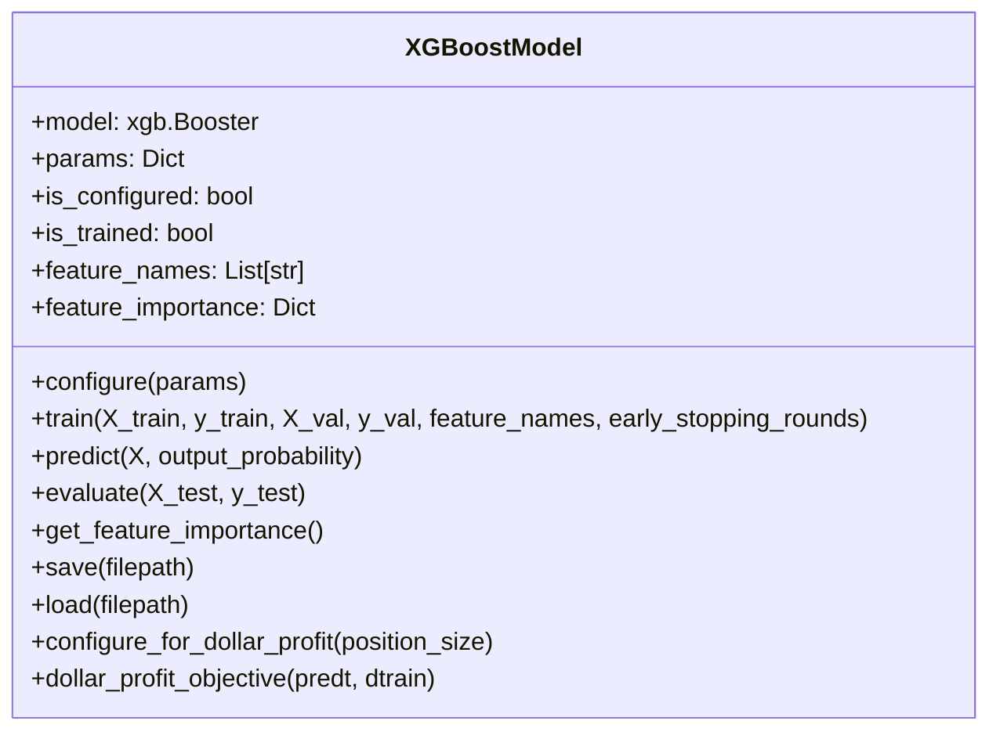
```mermaid
classDiagram
    class XGBoostModel {
        +model: xgb.Booster
        +params: Dict
        +is_configured: bool
        +is_trained: bool
        +feature_names: List[str]
        +feature_importance: Dict
        +configure(params)
        +train(X_train, y_train, X_val, y_val, feature_names, early_stopping_rounds)
        +predict(X, output_probability)
        +evaluate(X_test, y_test)
        +get_feature_importance()
        +save(filepath)
        +load(filepath)
        +configure_for_dollar_profit(position_size)
        +dollar_profit_objective(predt, dtrain)
    }
```

#### 3.2.2 LSTMModel Class

The `LSTMModel` class implements an LSTM model with mixed precision training for time series prediction.

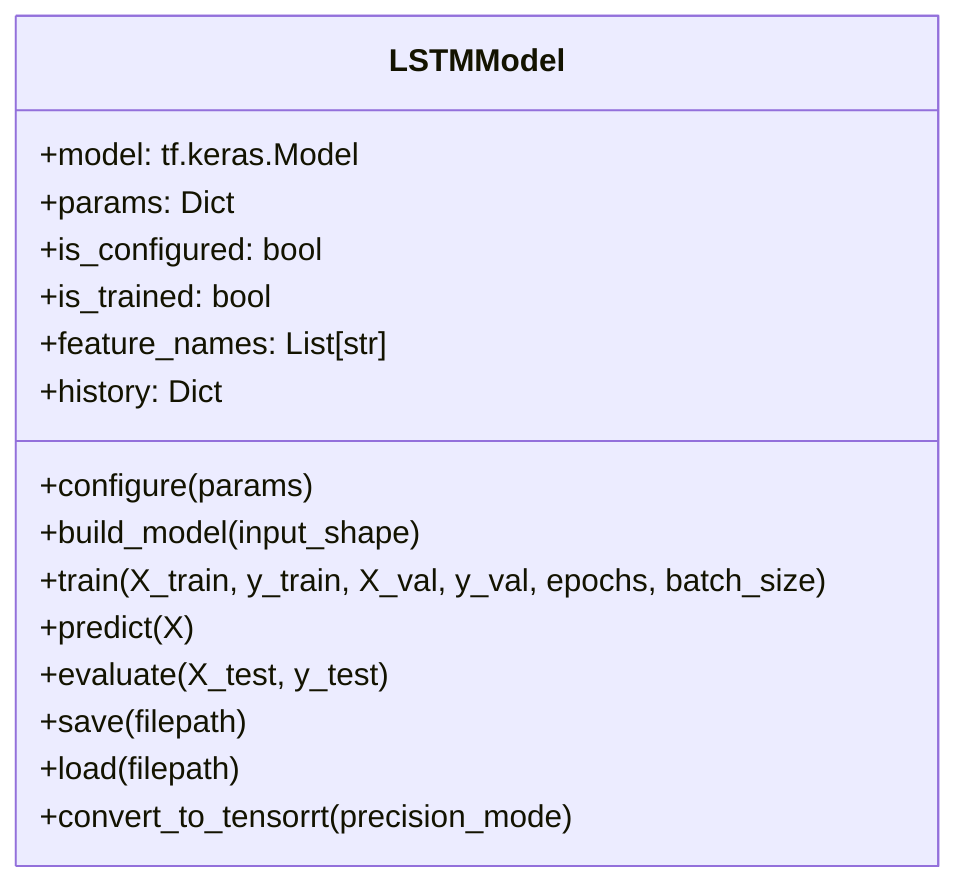
```mermaid
classDiagram
    class LSTMModel {
        +model: tf.keras.Model
        +params: Dict
        +is_configured: bool
        +is_trained: bool
        +feature_names: List[str]
        +history: Dict
        +configure(params)
        +build_model(input_shape)
        +train(X_train, y_train, X_val, y_val, epochs, batch_size)
        +predict(X)
        +evaluate(X_test, y_test)
        +save(filepath)
        +load(filepath)
        +convert_to_tensorrt(precision_mode)
    }
```

#### 3.2.3 MixedPrecisionAdapter Class

The `MixedPrecisionAdapter` class provides functionality for enabling and configuring mixed precision training for TensorFlow-based models.

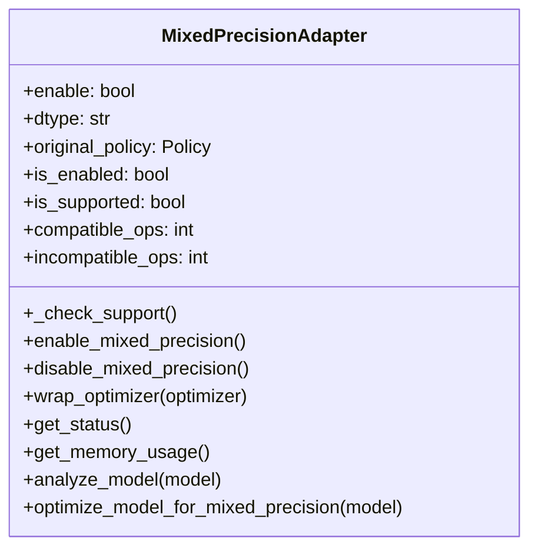
```mermaid
classDiagram
    class MixedPrecisionAdapter {
        +enable: bool
        +dtype: str
        +original_policy: Policy
        +is_enabled: bool
        +is_supported: bool
        +compatible_ops: int
        +incompatible_ops: int
        +_check_support()
        +enable_mixed_precision()
        +disable_mixed_precision()
        +wrap_optimizer(optimizer)
        +get_status()
        +get_memory_usage()
        +analyze_model(model)
        +optimize_model_for_mixed_precision(model)
    }
```

#### 3.2.4 DollarProfitOptimizer Class

The `DollarProfitOptimizer` class is the core component responsible for integrating multiple models and optimizing trading decisions for maximum dollar profit.

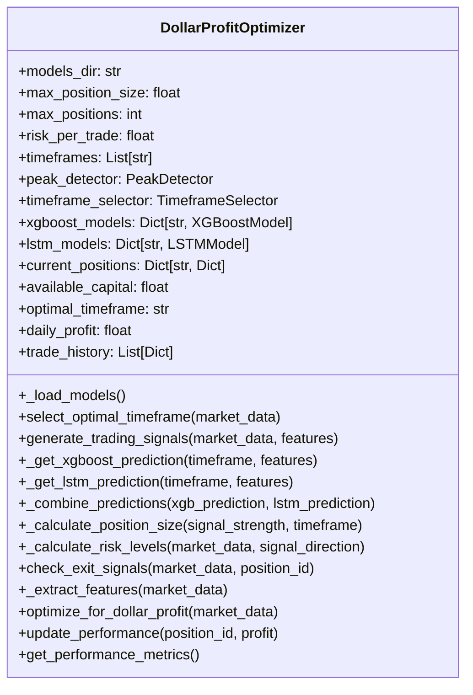
```mermaid
classDiagram
    class DollarProfitOptimizer {
        +models_dir: str
        +max_position_size: float
        +max_positions: int
        +risk_per_trade: float
        +timeframes: List[str]
        +peak_detector: PeakDetector
        +timeframe_selector: TimeframeSelector
        +xgboost_models: Dict[str, XGBoostModel]
        +lstm_models: Dict[str, LSTMModel]
        +current_positions: Dict[str, Dict]
        +available_capital: float
        +optimal_timeframe: str
        +daily_profit: float
        +trade_history: List[Dict]
        +_load_models()
        +select_optimal_timeframe(market_data)
        +generate_trading_signals(market_data, features)
        +_get_xgboost_prediction(timeframe, features)
        +_get_lstm_prediction(timeframe, features)
        +_combine_predictions(xgb_prediction, lstm_prediction)
        +_calculate_position_size(signal_strength, timeframe)
        +_calculate_risk_levels(market_data, signal_direction)
        +check_exit_signals(market_data, position_id)
        +_extract_features(market_data)
        +optimize_for_dollar_profit(market_data)
        +update_performance(position_id, profit)
        +get_performance_metrics()
    }
```

## 4. Model Optimization Techniques

### 4.1 Mixed Precision Training

Mixed precision training uses both 16-bit and 32-bit floating-point types to make training faster and more memory-efficient while maintaining model accuracy.

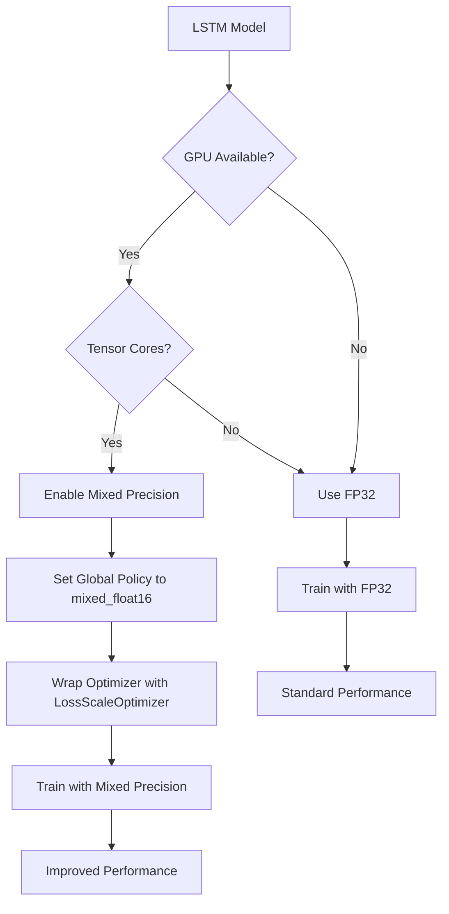
```mermaid
flowchart TD
    A[LSTM Model] --> B{GPU Available?}
    B -->|Yes| C{Tensor Cores?}
    B -->|No| D[Use FP32]
    C -->|Yes| E[Enable Mixed Precision]
    C -->|No| D
    E --> F[Set Global Policy to mixed_float16]
    F --> G[Wrap Optimizer with LossScaleOptimizer]
    G --> H[Train with Mixed Precision]
    D --> I[Train with FP32]
    H --> J[Improved Performance]
    I --> K[Standard Performance]
```

**Implementation:**
```python
import tensorflow as tf

# Enable mixed precision
policy = tf.keras.mixed_precision.Policy('mixed_float16')
tf.keras.mixed_precision.set_global_policy(policy)

# Create and compile model
model = tf.keras.Sequential([
    tf.keras.layers.Dense(128, activation='relu', input_shape=(20,)),
    tf.keras.layers.Dense(64, activation='relu'),
    tf.keras.layers.Dense(1)
])

# Wrap optimizer with LossScaleOptimizer for mixed precision
optimizer = tf.keras.optimizers.Adam(learning_rate=0.001)
optimizer = tf.keras.mixed_precision.LossScaleOptimizer(optimizer)

model.compile(
    optimizer=optimizer,
    loss='mean_squared_error',
    metrics=['mae']
)
```

### 4.2 XLA Compilation

XLA (Accelerated Linear Algebra) is a compiler that optimizes TensorFlow computations:

```python
import tensorflow as tf

# Enable XLA compilation globally
tf.config.optimizer.set_jit(True)

# Or enable XLA for specific functions
@tf.function(jit_compile=True)
def train_step(x, y):
    with tf.GradientTape() as tape:
        predictions = model(x, training=True)
        loss = loss_fn(y, predictions)
    gradients = tape.gradient(loss, model.trainable_variables)
    optimizer.apply_gradients(zip(gradients, model.trainable_variables))
    return loss
```

### 4.3 TensorRT Integration

TensorRT is a high-performance deep learning inference optimizer and runtime:

```python
import tensorflow as tf

def convert_to_tensorrt(saved_model_dir, precision_mode='FP16'):
    """Convert a SavedModel to TensorRT format."""
    from tensorflow.python.compiler.tensorrt import trt_convert as trt
    
    conversion_params = trt.TrtConversionParams(
        precision_mode=precision_mode,
        max_workspace_size_bytes=8000000000,
        maximum_cached_engines=100
    )
    
    converter = trt.TrtGraphConverterV2(
        input_saved_model_dir=saved_model_dir,
        conversion_params=conversion_params
    )
    
    converter.convert()
    converter.save('tensorrt_saved_model')
    
    return 'tensorrt_saved_model'
```

### 4.4 XGBoost GPU Acceleration

XGBoost can use GPU acceleration for tree building using the `gpu_hist` algorithm.

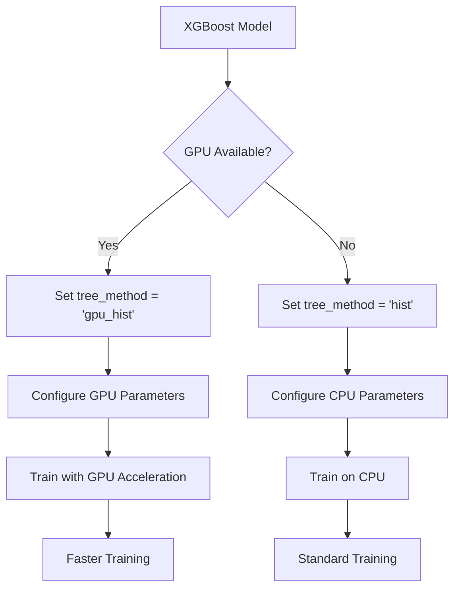
```mermaid
flowchart TD
    A[XGBoost Model] --> B{GPU Available?}
    B -->|Yes| C[Set tree_method = 'gpu_hist']
    B -->|No| D[Set tree_method = 'hist']
    C --> E[Configure GPU Parameters]
    D --> F[Configure CPU Parameters]
    E --> G[Train with GPU Acceleration]
    F --> H[Train on CPU]
    G --> I[Faster Training]
    H --> J[Standard Training]
```

**Implementation:**
```python
def configure(self, params: Optional[Dict] = None) -> None:
    """
    Configure the XGBoost model parameters.
    """
    try:
        # Default parameters
        default_params = {
            'max_depth': 6,
            'learning_rate': 0.01,
            'n_estimators': 1000,
            'subsample': 0.8,
            'colsample_bytree': 0.8,
            'objective': 'binary:logistic',
            'tree_method': 'gpu_hist',  # GPU-accelerated histogram algorithm
            'grow_policy': 'lossguide',  # More flexible tree growth
            'max_leaves': 256,  # Maximum number of leaves in trees
            'eval_metric': 'logloss',
            'seed': 42
        }
        
        # Update with provided parameters
        if params:
            # If GPU is not available, fall back to CPU
            if params.get('tree_method') != 'gpu_hist':
                try:
                    import xgboost as xgb
                    if not xgb.config.USE_CUDA:
                        self.logger.warning("CUDA not available for XGBoost, falling back to CPU 'hist' method")
                        default_params['tree_method'] = 'hist'
                except:
                    default_params['tree_method'] = 'hist'
            default_params.update(params)
        
        self.params = default_params
        
        self.logger.info(f"XGBoost model configured with parameters: {self.params}")
        
        self.is_configured = True
        
    except Exception as e:
        self.logger.error(f"Error configuring XGBoost model: {e}")
        raise
```

### 4.5 GPU Memory Optimization

Techniques for optimizing GPU memory usage to prevent out-of-memory errors:

```python
# Configure GPU memory growth to prevent OOM errors
gpus = tf.config.list_physical_devices('GPU')
if gpus:
    try:
        for gpu in gpus:
            tf.config.experimental.set_memory_growth(gpu, True)
        logical_gpus = tf.config.list_logical_devices('GPU')
        print(f"{len(gpus)} Physical GPUs, {len(logical_gpus)} Logical GPUs")
    except RuntimeError as e:
        print(f"Memory growth configuration error: {e}")
```

## 5. Training Pipeline

### 5.1 Data Pipeline Optimization

Efficient data pipeline with tf.data:

```python
import tensorflow as tf

def create_optimized_dataset(features, targets, batch_size=64, buffer_size=1000):
    """Create an optimized dataset for training."""
    dataset = tf.data.Dataset.from_tensor_slices((features, targets))
    
    # Shuffle and batch
    dataset = dataset.shuffle(buffer_size)
    dataset = dataset.batch(batch_size)
    
    # Prefetch to overlap data preprocessing and model execution
    dataset = dataset.prefetch(tf.data.AUTOTUNE)
    
    # Cache to memory for small datasets or to disk for larger ones
    # dataset = dataset.cache()
    
    # Use parallel map for data transformations
    # dataset = dataset.map(transform_fn, num_parallel_calls=tf.data.AUTOTUNE)
    
    return dataset
```

### 5.2 Distributed Training

Multi-GPU training with tf.distribute:

```python
import tensorflow as tf

def setup_distributed_training():
    """Set up distributed training across multiple GPUs."""
    # Create a MirroredStrategy for multi-GPU training
    strategy = tf.distribute.MirroredStrategy()
    print(f"Number of devices: {strategy.num_replicas_in_sync}")
    
    # Create the model within the strategy scope
    with strategy.scope():
        model = tf.keras.Sequential([
            tf.keras.layers.Dense(128, activation='relu', input_shape=(20,)),
            tf.keras.layers.Dense(64, activation='relu'),
            tf.keras.layers.Dense(1)
        ])
        
        # Wrap optimizer with LossScaleOptimizer for mixed precision
        optimizer = tf.keras.optimizers.Adam(learning_rate=0.001)
        optimizer = tf.keras.mixed_precision.LossScaleOptimizer(optimizer)
        
        model.compile(
            optimizer=optimizer,
            loss='mean_squared_error',
            metrics=['mae']
        )
    
    return model, strategy
```

### 5.3 Checkpointing and Model Management

Checkpointing for fault tolerance and model versioning:

```python
import tensorflow as tf
import os

def setup_checkpointing(model, checkpoint_dir='./checkpoints'):
    """Set up checkpointing for model training."""
    # Create checkpoint directory if it doesn't exist
    os.makedirs(checkpoint_dir, exist_ok=True)
    
    # Create checkpoint callback
    checkpoint_path = os.path.join(checkpoint_dir, 'model-{epoch:04d}.ckpt')
    checkpoint_callback = tf.keras.callbacks.ModelCheckpoint(
        filepath=checkpoint_path,
        save_weights_only=True,
        save_best_only=True,
        monitor='val_loss',
        mode='min',
        verbose=1
    )
    
    # Create TensorBoard callback
    tensorboard_dir = os.path.join(checkpoint_dir, 'logs')
    tensorboard_callback = tf.keras.callbacks.TensorBoard(
        log_dir=tensorboard_dir,
        histogram_freq=1,
        write_graph=True,
        update_freq='epoch'
    )
    
    # Create early stopping callback
    early_stopping_callback = tf.keras.callbacks.EarlyStopping(
        monitor='val_loss',
        patience=10,
        restore_best_weights=True,
        verbose=1
    )
    
    return [checkpoint_callback, tensorboard_callback, early_stopping_callback]
```

### 5.4 XGBoost Training

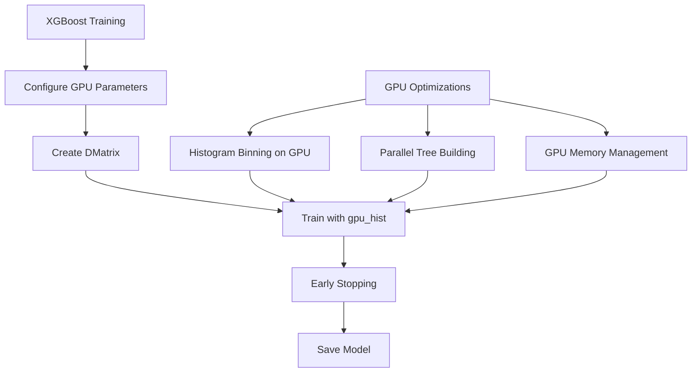
```mermaid
flowchart TD
    A[XGBoost Training] --> B[Configure GPU Parameters]
    B --> C[Create DMatrix]
    C --> D[Train with gpu_hist]
    D --> E[Early Stopping]
    E --> F[Save Model]
    
    G[GPU Optimizations] --> H[Histogram Binning on GPU]
    G --> I[Parallel Tree Building]
    G --> J[GPU Memory Management]
    
    H --> D
    I --> D
    J --> D
```

**Implementation:**
```python
def train(self, X_train: np.ndarray, y_train: np.ndarray,
          X_val: np.ndarray, y_val: np.ndarray, 
          feature_names: Optional[List[str]] = None,
          early_stopping_rounds: int = 10) -> Optional[Dict]:
    """Train the XGBoost model with GPU acceleration."""
    try:
        # Import XGBoost here to avoid dependency issues if not installed
        import xgboost as xgb
        
        # Check if GPU is available for XGBoost
        if self.params.get('tree_method') == 'gpu_hist':
            try:
                if not xgb.config.USE_CUDA:
                    self.logger.warning("CUDA not available for XGBoost, falling back to CPU 'hist' method")
                    self.params['tree_method'] = 'hist'
            except:
                self.params['tree_method'] = 'hist'
        
        # Create DMatrix objects with feature names if available
        if feature_names:
            dtrain = xgb.DMatrix(X_train, label=y_train, feature_names=feature_names)
            dval = xgb.DMatrix(X_val, label=y_val, feature_names=feature_names)
        else:
            dtrain = xgb.DMatrix(X_train, label=y_train)
            dval = xgb.DMatrix(X_val, label=y_val)
        
        # Set up evaluation list
        eval_list = [(dtrain, 'train'), (dval, 'validation')]
        
        # Train the model
        self.logger.info(f"Training XGBoost with tree_method: {self.params.get('tree_method', 'hist')}")
        self.model = xgb.train(
            self.params,
            dtrain,
            num_boost_round=self.params.get('n_estimators', 1000),
            evals=eval_list,
            early_stopping_rounds=early_stopping_rounds,
            verbose_eval=100  # Print evaluation every 100 rounds
        )
        
        # Get training history
        results = {
            'train': self.model.eval(dtrain).split(':')[1],
            'validation': self.model.eval(dval).split(':')[1],
            'best_iteration': self.model.best_iteration,
            'best_score': self.model.best_score
        }
        
        self.is_trained = True
        return results
        
    except Exception as e:
        self.logger.error(f"Error training XGBoost model: {e}")
        return None
```

### 5.5 LSTM Training

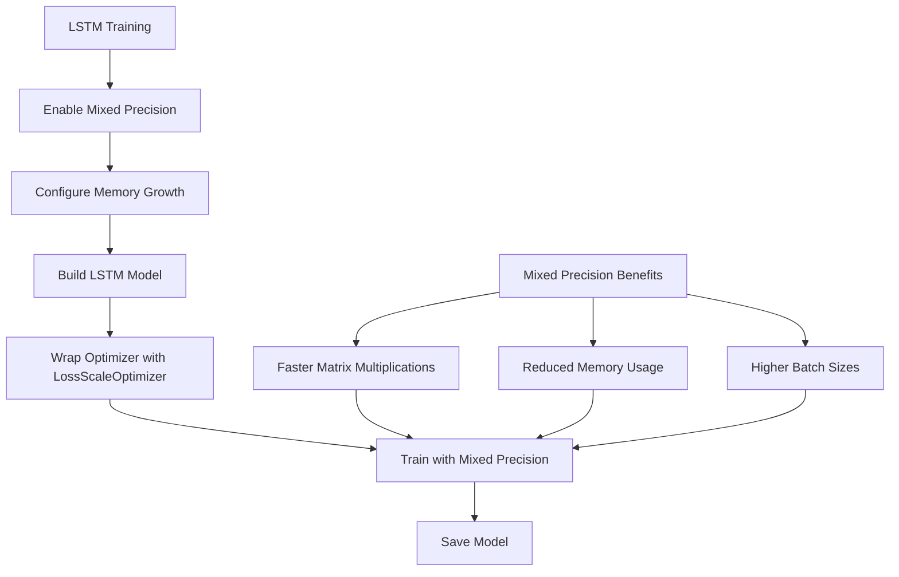
```mermaid
flowchart TD
    A[LSTM Training] --> B[Enable Mixed Precision]
    B --> C[Configure Memory Growth]
    C --> D[Build LSTM Model]
    D --> E[Wrap Optimizer with LossScaleOptimizer]
    E --> F[Train with Mixed Precision]
    F --> G[Save Model]
    
    H[Mixed Precision Benefits] --> I[Faster Matrix Multiplications]
    H --> J[Reduced Memory Usage]
    H --> K[Higher Batch Sizes]
    
    I --> F
    J --> F
    K --> F
```

## 6. Inference Pipeline

### 6.1 Model Serving

TensorFlow Serving for model deployment:

```python
import tensorflow as tf
import os

def export_saved_model(model, export_dir='./saved_model'):
    """Export model for TensorFlow Serving."""
    # Create export directory if it doesn't exist
    os.makedirs(export_dir, exist_ok=True)
    
    # Export the model
    model.save(export_dir)
    
    # Export with signatures for TensorFlow Serving
    @tf.function(input_signature=[tf.TensorSpec(shape=[None, 20], dtype=tf.float32, name='inputs')])
    def serving_fn(inputs):
        return {'outputs': model(inputs, training=False)}
    
    tf.saved_model.save(
        model,
        os.path.join(export_dir, 'serving'),
        signatures={'serving_default': serving_fn}
    )
    
    return os.path.join(export_dir, 'serving')
```

### 6.2 Batch Inference

Optimized batch inference for historical data:

```python
import tensorflow as tf
import numpy as np

def batch_inference(model, data, batch_size=1024):
    """Run batch inference on a large dataset."""
    # Create dataset from data
    dataset = tf.data.Dataset.from_tensor_slices(data)
    dataset = dataset.batch(batch_size)
    dataset = dataset.prefetch(tf.data.AUTOTUNE)
    
    # Run inference
    predictions = []
    for batch in dataset:
        batch_predictions = model(batch, training=False)
        predictions.append(batch_predictions)
    
    # Concatenate predictions
    predictions = tf.concat(predictions, axis=0)
    
    return predictions.numpy()
```

### 6.3 Real-time Inference

Optimized real-time inference for low latency:

```python
import tensorflow as tf
import time

class InferenceService:
    def __init__(self, model_path):
        """Initialize the inference service."""
        # Load the model
        self.model = tf.saved_model.load(model_path)
        self.serving_fn = self.model.signatures['serving_default']
        
        # Warm up the model
        self._warm_up()
    
    def _warm_up(self):
        """Warm up the model to ensure consistent performance."""
        # Create dummy input
        dummy_input = tf.ones([1, 20], dtype=tf.float32)
        
        # Run inference multiple times to warm up
        for _ in range(10):
            _ = self.serving_fn(inputs=dummy_input)
    
    def predict(self, features):
        """Run inference on a single sample."""
        # Convert features to tensor
        features_tensor = tf.convert_to_tensor(features, dtype=tf.float32)
        
        # Ensure features have the right shape
        if len(features_tensor.shape) == 1:
            features_tensor = tf.expand_dims(features_tensor, 0)
        
        # Run inference
        start_time = time.time()
        predictions = self.serving_fn(inputs=features_tensor)
        inference_time = time.time() - start_time
        
        return {
            'predictions': predictions['outputs'].numpy(),
            'inference_time': inference_time
        }
```

## 7. Dollar Profit Optimization

### 7.1 Timeframe Selection

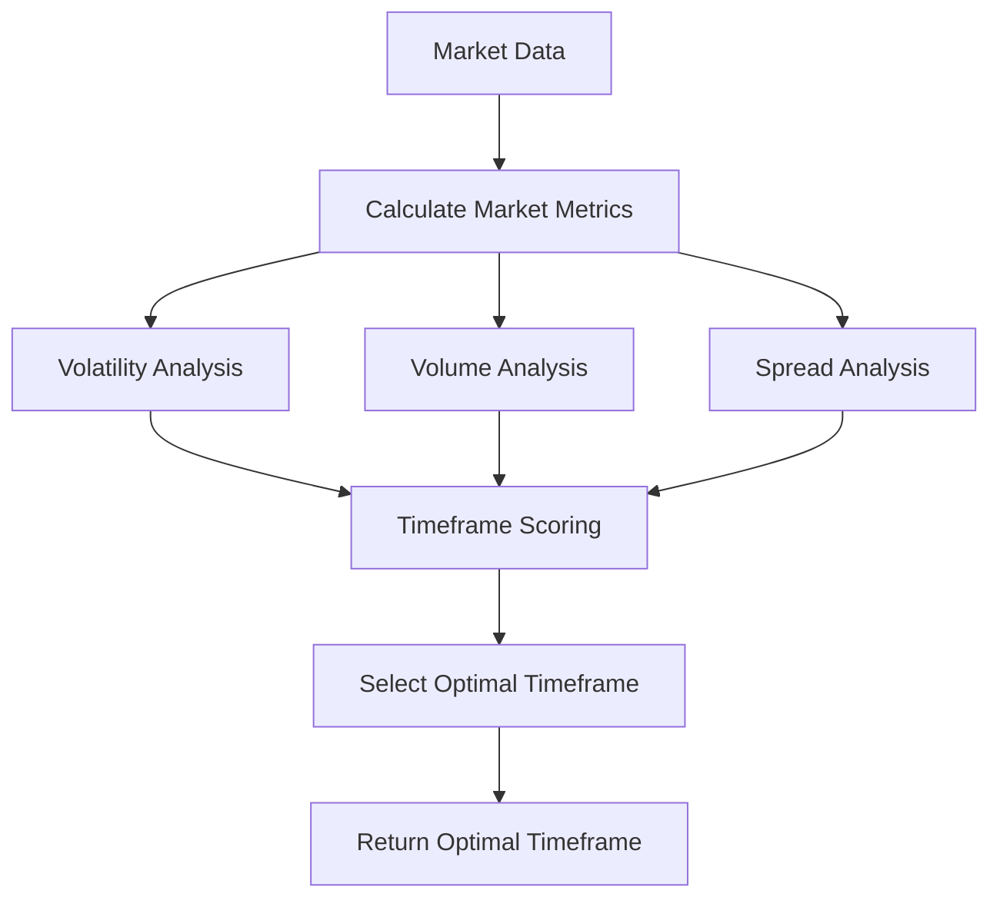
```mermaid
flowchart TD
    A[Market Data] --> B[Calculate Market Metrics]
    B --> C[Volatility Analysis]
    B --> D[Volume Analysis]
    B --> E[Spread Analysis]
    
    C --> F[Timeframe Scoring]
    D --> F
    E --> F
    
    F --> G[Select Optimal Timeframe]
    G --> H[Return Optimal Timeframe]
```

### 7.2 Trading Signal Generation

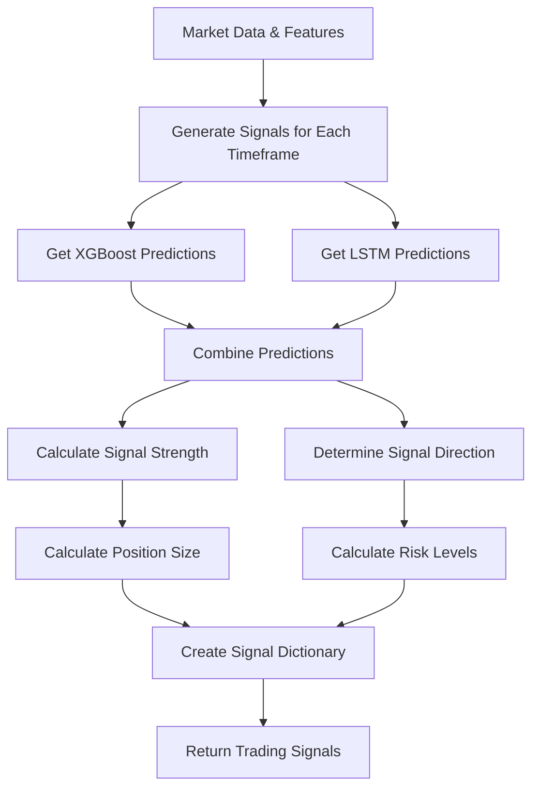
```mermaid
flowchart TD
    A[Market Data & Features] --> B[Generate Signals for Each Timeframe]
    B --> C[Get XGBoost Predictions]
    B --> D[Get LSTM Predictions]
    
    C --> E[Combine Predictions]
    D --> E
    
    E --> F[Calculate Signal Strength]
    E --> G[Determine Signal Direction]
    
    F --> H[Calculate Position Size]
    G --> I[Calculate Risk Levels]
    
    H --> J[Create Signal Dictionary]
    I --> J
    
    J --> K[Return Trading Signals]
```

### 7.3 Position Sizing

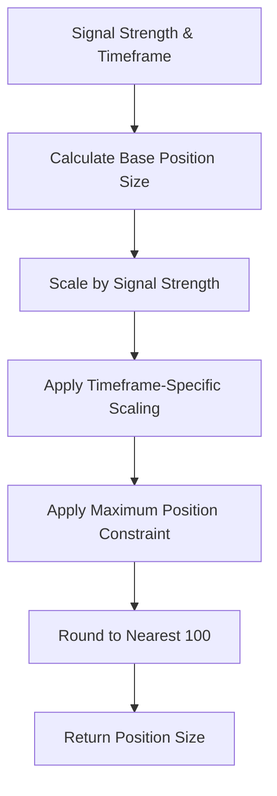
```mermaid
flowchart TD
    A[Signal Strength & Timeframe] --> B[Calculate Base Position Size]
    B --> C[Scale by Signal Strength]
    C --> D[Apply Timeframe-Specific Scaling]
    D --> E[Apply Maximum Position Constraint]
    E --> F[Round to Nearest 100]
    F --> G[Return Position Size]
```

### 7.4 Risk Management

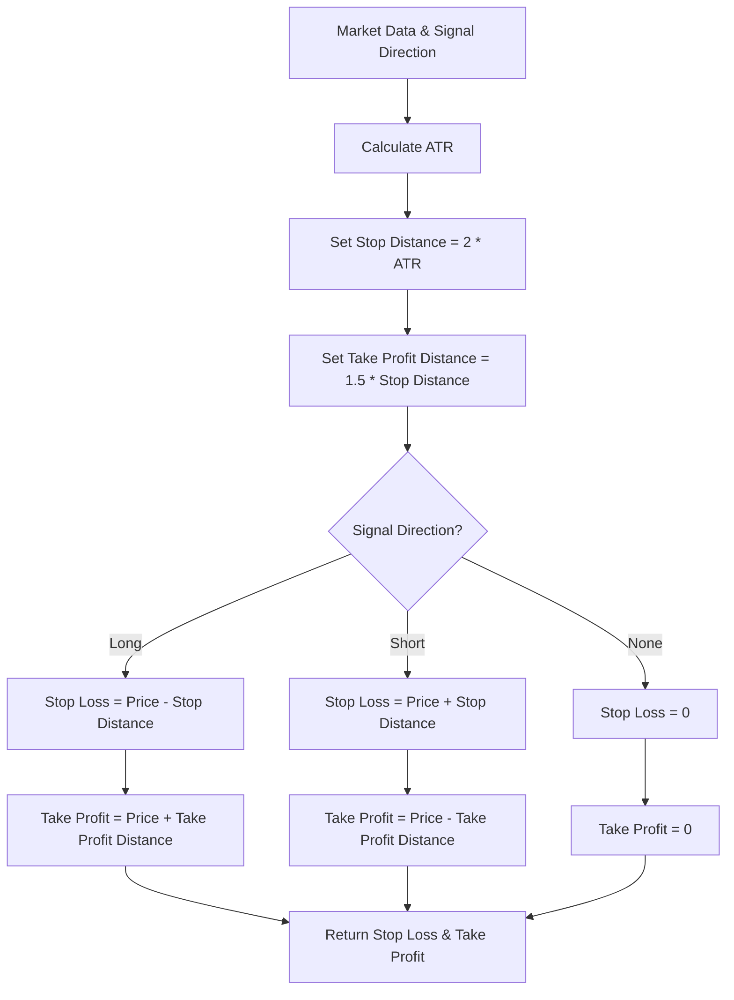
```mermaid
flowchart TD
    A[Market Data & Signal Direction] --> B[Calculate ATR]
    B --> C[Set Stop Distance = 2 * ATR]
    C --> D[Set Take Profit Distance = 1.5 * Stop Distance]
    
    D --> E{Signal Direction?}
    E -->|Long| F[Stop Loss = Price - Stop Distance]
    E -->|Short| G[Stop Loss = Price + Stop Distance]
    E -->|None| H[Stop Loss = 0]
    
    F --> I[Take Profit = Price + Take Profit Distance]
    G --> J[Take Profit = Price - Take Profit Distance]
    H --> K[Take Profit = 0]
    
    I --> L[Return Stop Loss & Take Profit]
    J --> L
    K --> L
```

## 8. Integration with Other Subsystems

The Model Training Subsystem integrates with several other subsystems of the Autonomous Trading System:

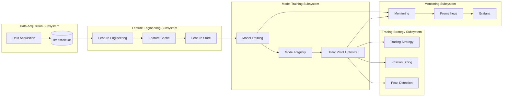
```mermaid
flowchart LR
    subgraph "Data Acquisition Subsystem"
        DA[Data Acquisition]
        DB[(TimescaleDB)]
    end
    
    subgraph "Feature Engineering Subsystem"
        FE[Feature Engineering]
        FC[Feature Cache]
        FS[Feature Store]
    end
    
    subgraph "Model Training Subsystem"
        MT[Model Training]
        MR[Model Registry]
        DPO[Dollar Profit Optimizer]
    end
    
    subgraph "Trading Strategy Subsystem"
        TS[Trading Strategy]
        PS[Position Sizing]
        PD[Peak Detection]
    end
    
    subgraph "Monitoring Subsystem"
        MON[Monitoring]
        PROM[Prometheus]
        GRAF[Grafana]
    end
    
    DA --> DB
    DB --> FE
    FE --> FC
    FC --> FS
    FS --> MT
    MT --> MR
    MR --> DPO
    DPO --> TS
    DPO --> PS
    DPO --> PD
    MT --> MON
    DPO --> MON
    MON --> PROM
    PROM --> GRAF
```

Key integration points:

1. **Feature Engineering Subsystem**: The Model Training Subsystem receives features from the Feature Engineering Subsystem for model training
2. **Trading Strategy Subsystem**: The Model Training Subsystem provides trading signals to the Trading Strategy Subsystem for execution
3. **Monitoring Subsystem**: The Model Training Subsystem reports metrics to the Monitoring Subsystem for visualization and alerting

## 9. Performance Comparison

The following tables show the performance improvements achieved with GPU acceleration:

### 9.1 LSTM Model Training

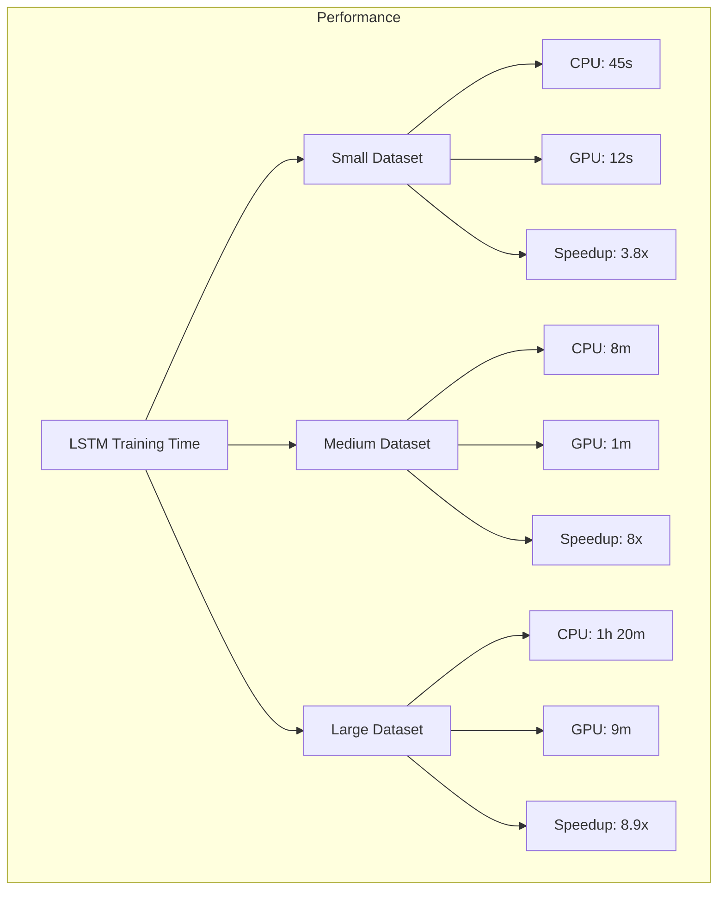
```mermaid
graph TD
    subgraph Performance
        A[LSTM Training Time] --> B[Small Dataset]
        A --> C[Medium Dataset]
        A --> D[Large Dataset]
        
        B --> E[CPU: 45s]
        B --> F[GPU: 12s]
        B --> G[Speedup: 3.8x]
        
        C --> H[CPU: 8m]
        C --> I[GPU: 1m]
        C --> J[Speedup: 8x]
        
        D --> K[CPU: 1h 20m]
        D --> L[GPU: 9m]
        D --> M[Speedup: 8.9x]
    end
```

### 9.2 XGBoost Model Training

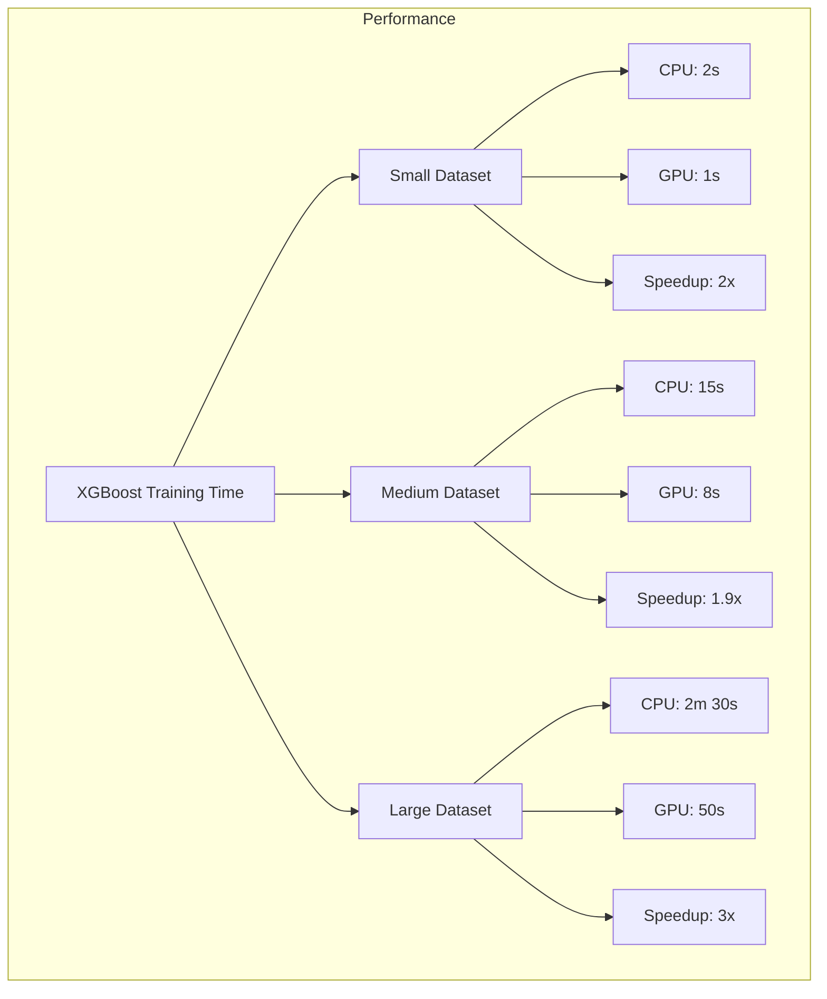
```mermaid
graph TD
    subgraph Performance
        A[XGBoost Training Time] --> B[Small Dataset]
        A --> C[Medium Dataset]
        A --> D[Large Dataset]
        
        B --> E[CPU: 2s]
        B --> F[GPU: 1s]
        B --> G[Speedup: 2x]
        
        C --> H[CPU: 15s]
        C --> I[GPU: 8s]
        C --> J[Speedup: 1.9x]
        
        D --> K[CPU: 2m 30s]
        D --> L[GPU: 50s]
        D --> M[Speedup: 3x]
    end
```

## 10. GH200 Grace Hopper Superchip Compatibility

The system includes special optimizations for NVIDIA GH200 Grace Hopper Superchips:

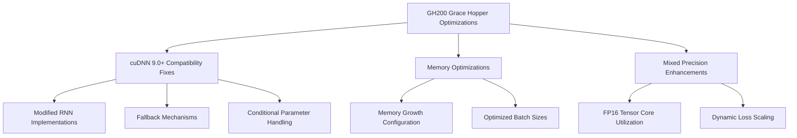
```mermaid
flowchart TD
    A[GH200 Grace Hopper Optimizations] --> B[cuDNN 9.0+ Compatibility Fixes]
    A --> C[Memory Optimizations]
    A --> D[Mixed Precision Enhancements]
    
    B --> E[Modified RNN Implementations]
    B --> F[Fallback Mechanisms]
    B --> G[Conditional Parameter Handling]
    
    C --> H[Memory Growth Configuration]
    C --> I[Optimized Batch Sizes]
    
    D --> J[FP16 Tensor Core Utilization]
    D --> K[Dynamic Loss Scaling]
```

### 10.1 cuDNN Compatibility Fixes

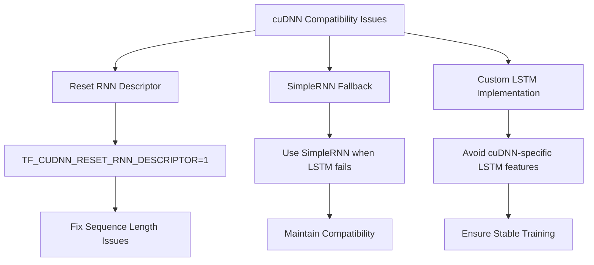
```mermaid
flowchart TD
    A[cuDNN Compatibility Issues] --> B[Reset RNN Descriptor]
    A --> C[SimpleRNN Fallback]
    A --> D[Custom LSTM Implementation]
    
    B --> E[TF_CUDNN_RESET_RNN_DESCRIPTOR=1]
    C --> F[Use SimpleRNN when LSTM fails]
    D --> G[Avoid cuDNN-specific LSTM features]
    
    E --> H[Fix Sequence Length Issues]
    F --> I[Maintain Compatibility]
    G --> J[Ensure Stable Training]
```

## 11. Troubleshooting

### 11.1 Common Issues and Solutions

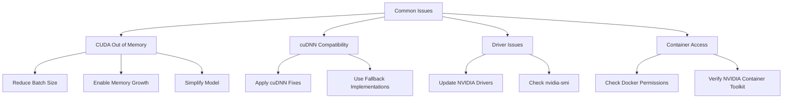
```mermaid
flowchart TD
    A[Common Issues] --> B[CUDA Out of Memory]
    A --> C[cuDNN Compatibility]
    A --> D[Driver Issues]
    A --> E[Container Access]
    
    B --> F[Reduce Batch Size]
    B --> G[Enable Memory Growth]
    B --> H[Simplify Model]
    
    C --> I[Apply cuDNN Fixes]
    C --> J[Use Fallback Implementations]
    
    D --> K[Update NVIDIA Drivers]
    D --> L[Check nvidia-smi]
    
    E --> M[Check Docker Permissions]
    E --> N[Verify NVIDIA Container Toolkit]
```

### 11.2 Diagnostic Commands

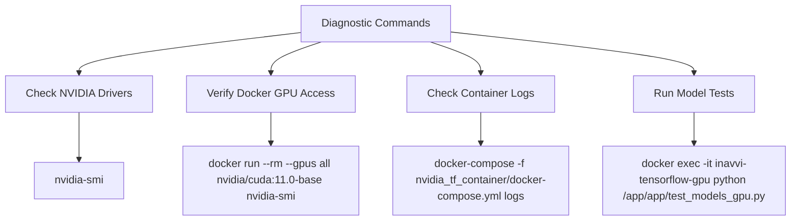
```mermaid
flowchart TD
    A[Diagnostic Commands] --> B[Check NVIDIA Drivers]
    A --> C[Verify Docker GPU Access]
    A --> D[Check Container Logs]
    A --> E[Run Model Tests]
    
    B --> F[nvidia-smi]
    C --> G[docker run --rm --gpus all nvidia/cuda:11.0-base nvidia-smi]
    D --> H[docker-compose -f nvidia_tf_container/docker-compose.yml logs]
    E --> I[docker exec -it inavvi-tensorflow-gpu python /app/app/test_models_gpu.py]
```

## 12. Best Practices

1. **Use Mixed Precision Training** - Enable mixed precision training for LSTM models to take advantage of Tensor Cores on NVIDIA GPUs
2. **Configure GPU Memory Growth** - Set memory growth to prevent out-of-memory errors
3. **Use XGBoost's GPU Acceleration** - Set `tree_method='gpu_hist'` for XGBoost models to use GPU acceleration
4. **Optimize Batch Sizes** - Find the optimal batch size for your GPU memory capacity
5. **Use TensorRT for Inference** - Convert trained models to TensorRT for faster inference
6. **Apply cuDNN Fixes for GH200** - Use the provided fixes for cuDNN compatibility with GH200 Grace Hopper Superchips
7. **Monitor GPU Utilization** - Use `nvidia-smi` to monitor GPU utilization and memory usage
8. **Implement Fallbacks** - Always implement CPU fallbacks for when GPU is not available
9. **Optimize Container Resources** - Configure container resource limits appropriately for your hardware
10. **Regular Performance Testing** - Regularly test performance to ensure optimal GPU utilization

## 13. Recommendations for Improvements

### 13.1 Architecture Improvements

1. **Microservices Architecture**: Split the monolithic model training pipeline into smaller, specialized services for different model types
2. **Message Queue Integration**: Use a message queue (e.g., RabbitMQ, Kafka) for model training job distribution
3. **Containerization**: Containerize the model training pipeline for easier deployment and scaling
4. **Service Discovery**: Implement service discovery for dynamic configuration of model training services

### 13.2 Model Training Improvements

1. **Hyperparameter Optimization**: Implement automated hyperparameter optimization using Optuna or similar tools
2. **Model Ensemble**: Implement model ensemble techniques to improve prediction accuracy
3. **Transfer Learning**: Implement transfer learning to leverage pre-trained models
4. **Reinforcement Learning**: Explore reinforcement learning for direct optimization of trading strategies

### 13.3 Performance Improvements

1. **Distributed Training**: Implement distributed training across multiple GPUs and nodes
2. **Quantization**: Implement post-training quantization for faster inference
3. **Model Pruning**: Implement model pruning to reduce model size and improve inference speed
4. **Custom CUDA Kernels**: Develop custom CUDA kernels for performance-critical operations

### 13.4 Monitoring Improvements

1. **Model Drift Detection**: Implement model drift detection to identify when models need retraining
2. **Performance Profiling**: Implement detailed performance profiling for model training and inference
3. **Automated Retraining**: Implement automated retraining based on performance metrics
4. **A/B Testing**: Implement A/B testing for model comparison in production

## 14. Conclusion

The Model Training Subsystem is a critical component of the Autonomous Trading System that leverages GPU acceleration, specifically the NVIDIA GH200 Grace Hopper Superchip, to achieve high-performance model training and inference. Its modular architecture, optimization techniques, and integration with other subsystems make it a powerful tool for generating accurate trading signals.

By implementing the recommended improvements, the subsystem can become more scalable, efficient, and adaptable to changing market conditions, ultimately leading to better trading decisions and higher profitability.