# Trading Strategy Subsystem

## 1. Introduction

The Trading Strategy Subsystem is a critical component of the Autonomous Trading System responsible for selecting the most promising tickers from a large universe, calculating optimal position sizes, and managing risk. It implements a sophisticated approach to ticker selection and position sizing that optimizes both computational resources and capital allocation.

This document provides a comprehensive overview of the Trading Strategy Subsystem, including its architecture, components, ticker selection process, position sizing methodology, and integration with other subsystems.

## 2. System Architecture Overview

The Trading Strategy Subsystem follows a modular architecture with several key components:

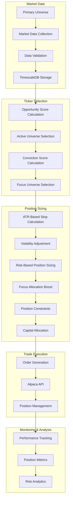

## 3. Tiered Selection Approach

The Trading Strategy Subsystem implements a tiered selection approach to efficiently manage a large universe of tickers:

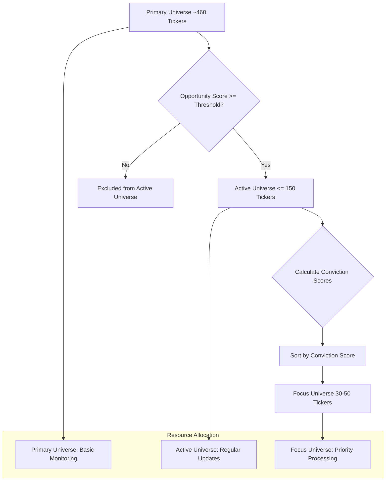

This tiered approach allows the system to:

1. **Efficiently Manage Computational Resources**: By focusing intensive processing on a smaller subset of tickers
2. **Optimize Capital Allocation**: By concentrating capital on the highest conviction opportunities
3. **Maintain Broad Market Coverage**: By monitoring a large universe of tickers for emerging opportunities

## 4. Key Components

### 4.1 DynamicTickerSelector Class

The `DynamicTickerSelector` class is responsible for selecting the most promising tickers from a large universe based on opportunity scores and conviction scores.

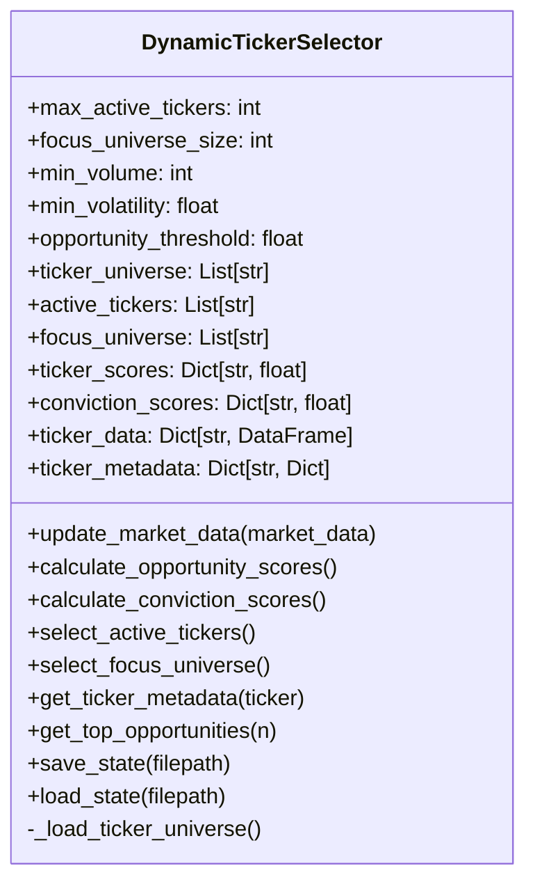

### 4.2 RiskBasedPositionSizer Class

The `RiskBasedPositionSizer` class is responsible for calculating position sizes based on the 2% risk rule and other constraints.

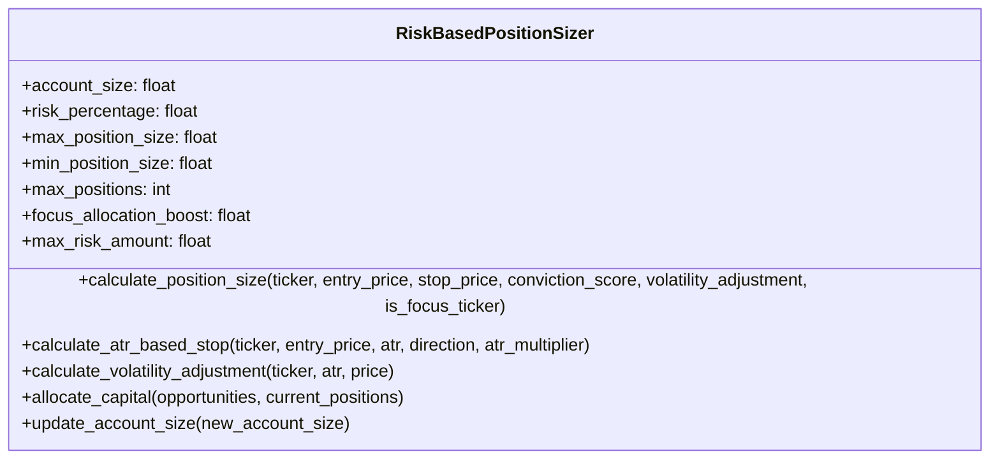

## 5. Data Flow Process

The data flow through the Trading Strategy Subsystem is as follows:

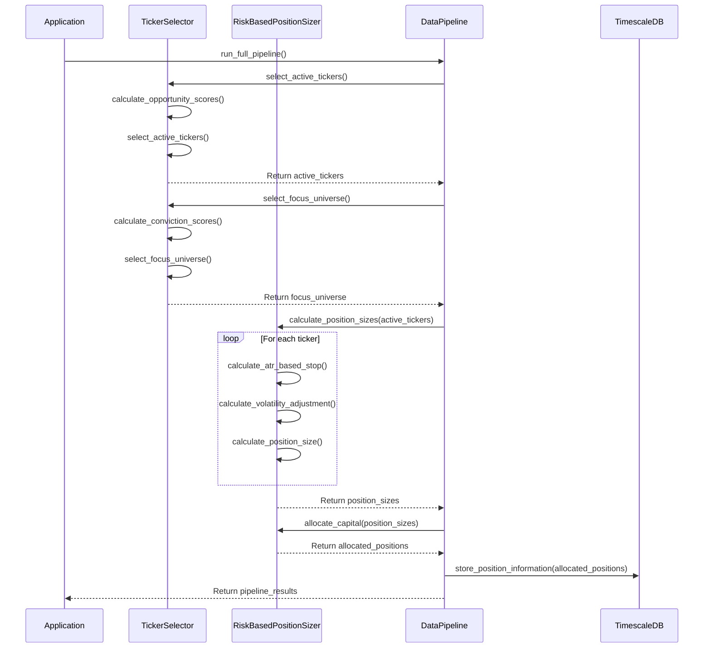

## 6. Dynamic Ticker Selection Process

### 6.1 Opportunity Score Calculation

The opportunity score is calculated based on volatility, volume, momentum, and pattern recognition:

```mermaid
flowchart TD
    A[Market Data] --> B[Calculate Volatility Score]
    A --> C[Calculate Volume Score]
    A --> D[Calculate Momentum Score]
    A --> E[Calculate Pattern Score]
    
    B --> F[Volatility Score = min(atr_pct * 50, 1.0)]
    C --> G[Volume Score = min(volume / 10M, 1.0)]
    D --> H[Momentum Score from 5d and 20d returns]
    E --> I[Pattern Score = 0.5]
    
    F --> J[Weighted Average]
    G --> J
    H --> J
    I --> J
    
    J --> K[Final Opportunity Score]
```

**Implementation:**
```python
def calculate_opportunity_scores(self) -> Dict[str, float]:
    scores = {}
    
    for ticker in self.ticker_universe:
        # Skip tickers with no data
        if ticker not in self.ticker_data or ticker not in self.ticker_metadata:
            continue
        
        # Get ticker data and metadata
        df = self.ticker_data.get(ticker)
        metadata = self.ticker_metadata.get(ticker, {})
        
        if df is None or df.empty:
            continue
        
        try:
            # Basic filters
            volume = metadata.get('volume', 0)
            atr_pct = metadata.get('atr_pct', 0)
            
            # Skip tickers with insufficient volume or volatility
            if volume < self.min_volume or atr_pct < self.min_volatility:
                continue
            
            # Calculate opportunity score components
            
            # 1. Volatility score (0-1)
            volatility_score = min(atr_pct * 50, 1.0)
            
            # 2. Volume score (0-1)
            volume_score = min(volume / 10000000, 1.0)
            
            # 3. Momentum score (0-1)
            if len(df) >= 20 and 'close' in df.columns:
                close = df['close'].values
                momentum_5d = close[-1] / close[-5] - 1 if close[-5] > 0 else 0
                momentum_20d = close[-1] / close[-20] - 1 if close[-20] > 0 else 0
                
                momentum_score = (
                    0.5 + min(max(momentum_5d * 10, -0.5), 0.5) + 
                    min(max(momentum_20d * 5, -0.5), 0.5)
                ) / 2
            else:
                momentum_score = 0.5
            
            # 4. Pattern score (0-1)
            pattern_score = 0.5
            
            # Calculate final opportunity score (weighted average)
            opportunity_score = (
                volatility_score * 0.3 +
                volume_score * 0.2 +
                momentum_score * 0.3 +
                pattern_score * 0.2
            )
            
            scores[ticker] = opportunity_score
            
        except Exception as e:
            logger.warning(f"Error calculating opportunity score for {ticker}: {e}")
    
    self.ticker_scores = scores
    return scores
```

### 6.2 Conviction Score Calculation

The conviction score is calculated based on trend strength and volatility efficiency:

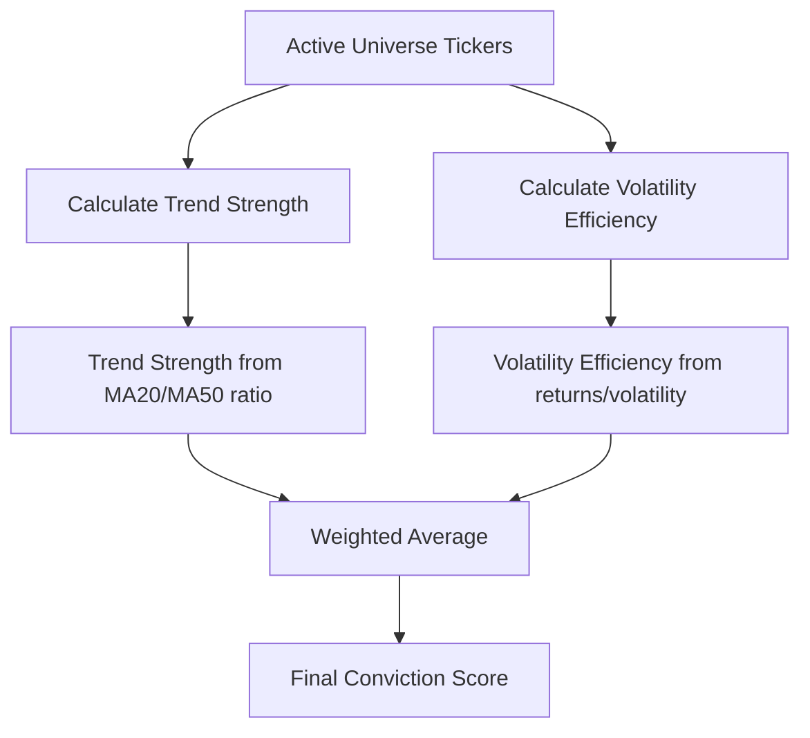

**Implementation:**
```python
def calculate_conviction_scores(self) -> Dict[str, float]:
    # Ensure we have active tickers
    if not self.active_tickers:
        self.select_active_tickers()
        
    conviction_scores = {}
    
    for ticker in self.active_tickers:
        # Skip tickers with no data
        if ticker not in self.ticker_data or ticker not in self.ticker_metadata:
            continue
        
        # Get ticker data and metadata
        df = self.ticker_data.get(ticker)
        metadata = self.ticker_metadata.get(ticker, {})
        
        if df is None or df.empty:
            continue
        
        try:
            # Calculate conviction score components
            
            # 1. Trend strength (0-1)
            if len(df) >= 50 and 'close' in df.columns:
                close = df['close'].values
                ma20 = np.mean(close[-20:])
                ma50 = np.mean(close[-50:])
                
                # Trend strength based on MA alignment
                trend_strength = min(max(0, (ma20 / ma50 - 0.97) * 10), 1.0)
            else:
                trend_strength = 0.5
            
            # 2. Volatility efficiency (0-1)
            atr_pct = metadata.get('atr_pct', 0)
            if len(df) >= 20 and 'close' in df.columns and atr_pct > 0:
                close = df['close'].values
                returns_20d = abs(close[-1] / close[-20] - 1)
                volatility_efficiency = min(returns_20d / (atr_pct * 20), 1.0)
            else:
                volatility_efficiency = 0.5
            
            # Calculate final conviction score (weighted average)
            conviction_score = (
                trend_strength * 0.6 +
                volatility_efficiency * 0.4
            )
            
            conviction_scores[ticker] = conviction_score
        except Exception as e:
            logger.warning(f"Error calculating conviction score for {ticker}: {e}")
    
    self.conviction_scores = conviction_scores
    return conviction_scores
```

### 6.3 Active Universe Selection

The active universe is selected based on opportunity scores:

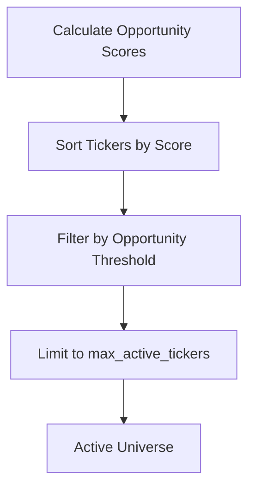

**Implementation:**
```python
def select_active_tickers(self) -> List[str]:
    # Ensure we have opportunity scores
    if not self.ticker_scores:
        self.calculate_opportunity_scores()
    
    # Sort tickers by opportunity score (descending)
    sorted_tickers = sorted(
        self.ticker_scores.items(), 
        key=lambda x: x[1], 
        reverse=True
    )
    
    # Select top tickers up to max_active_tickers
    self.active_tickers = [
        ticker for ticker, score in sorted_tickers[:self.max_active_tickers]
        if score >= self.opportunity_threshold
    ]
    
    return self.active_tickers
```

### 6.4 Focus Universe Selection

The focus universe is selected based on conviction scores:

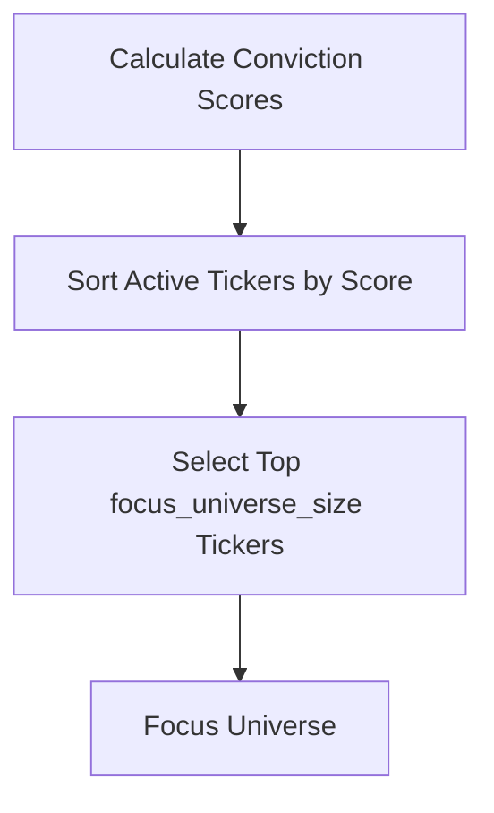

**Implementation:**
```python
def select_focus_universe(self) -> List[str]:
    # Ensure we have active tickers
    if not self.active_tickers:
        self.select_active_tickers()
        
    # Ensure we have conviction scores
    if not self.conviction_scores:
        self.calculate_conviction_scores()
    
    # Sort active tickers by conviction score (descending)
    sorted_tickers = sorted(
        [(ticker, self.conviction_scores.get(ticker, 0)) 
         for ticker in self.active_tickers],
        key=lambda x: x[1],
        reverse=True
    )
    
    # Select top tickers up to focus_universe_size
    self.focus_universe = [ticker for ticker, score in sorted_tickers[:self.focus_universe_size]]
    
    return self.focus_universe
```

## 7. Risk-Based Position Sizing Process

### 7.1 ATR-Based Stop Calculation

The system calculates stop prices based on Average True Range (ATR):

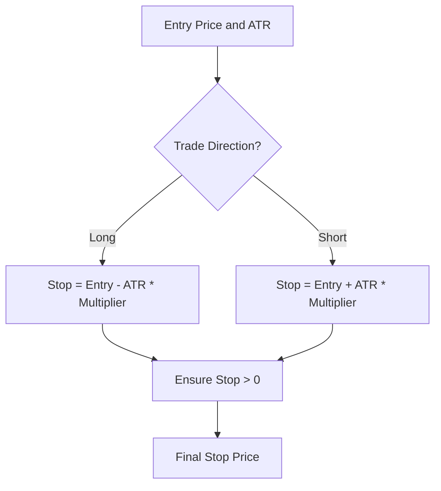

**Implementation:**
```python
def calculate_atr_based_stop(self, ticker: str, entry_price: float, atr: float, 
                           direction: str = 'long', atr_multiplier: float = 2.0) -> float:
    if direction.lower() == 'long':
        stop_price = entry_price - (atr * atr_multiplier)
    else:
        stop_price = entry_price + (atr * atr_multiplier)
    
    # Ensure stop price is positive
    stop_price = max(0.01, stop_price)
    
    return stop_price
```

### 7.2 Volatility Adjustment

The system adjusts position sizes based on volatility:

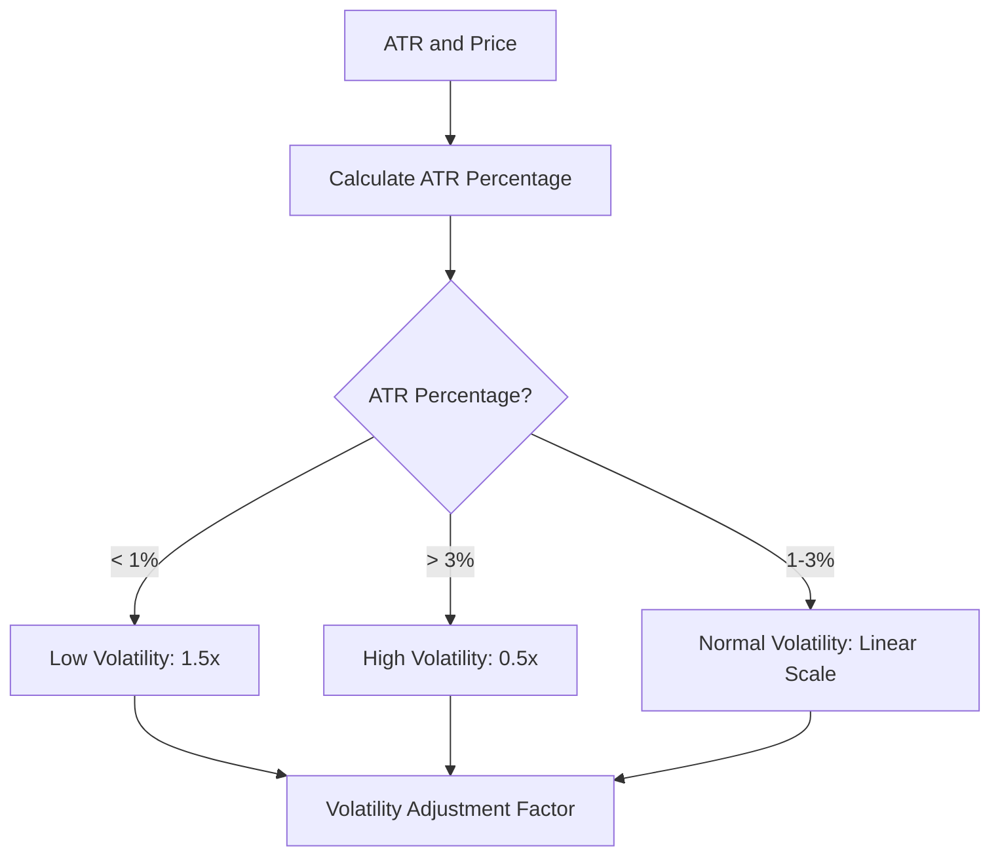

**Implementation:**
```python
def calculate_volatility_adjustment(self, ticker: str, atr: float, price: float) -> float:
    # Calculate ATR as percentage of price
    atr_percentage = atr / price
    
    # Typical ATR percentage is around 1-2% for stocks
    # Adjust factor based on deviation from typical
    if atr_percentage < 0.01:  # Low volatility
        adjustment = 1.5  # Increase position size
    elif atr_percentage > 0.03:  # High volatility
        adjustment = 0.5  # Decrease position size
    else:
        # Linear scaling between 0.5 and 1.5
        adjustment = 1.5 - ((atr_percentage - 0.01) / 0.02)
    
    return adjustment
```

### 7.3 Position Size Calculation

The system calculates position sizes based on the 2% risk rule:

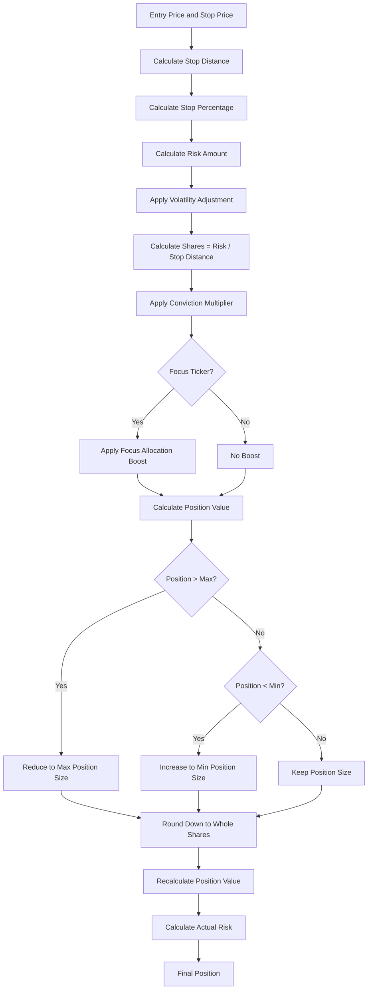

**Implementation:**
```python
def calculate_position_size(self, ticker: str, entry_price: float, stop_price: float,
                          conviction_score: float = 1.0, volatility_adjustment: float = 1.0,
                          is_focus_ticker: bool = False) -> Dict:
    # Validate inputs
    if entry_price <= 0 or stop_price <= 0:
        raise ValueError("Entry and stop prices must be positive")
    
    # Calculate stop distance
    stop_distance = abs(entry_price - stop_price)
    if stop_distance == 0:
        raise ValueError("Stop distance cannot be zero")
    
    # Calculate stop distance as percentage
    stop_percentage = stop_distance / entry_price
    
    # Calculate risk amount in dollars (adjusted for volatility)
    risk_amount = self.max_risk_amount * volatility_adjustment
    
    # Calculate shares based on risk
    shares = risk_amount / stop_distance
    
    # Apply conviction multiplier (0.5-1.5)
    conviction_score = max(0.5, min(1.5, conviction_score))
    shares = shares * conviction_score

    # Apply focus universe boost if applicable
    if is_focus_ticker:
        shares = shares * self.focus_allocation_boost
    
    # Calculate position value
    position_value = shares * entry_price
    
    # Apply maximum position constraint
    if position_value > self.max_position_size:
        shares = self.max_position_size / entry_price
        position_value = self.max_position_size
    
    # Apply minimum position constraint
    if position_value < self.min_position_size:
        if self.min_position_size / entry_price < 1:
            # Can't buy fractional shares, so position is too small
            return {
                'ticker': ticker,
                'shares': 0,
                'entry_price': entry_price,
                'stop_price': stop_price,
                'position_value': 0.0,
                'risk_amount': 0.0,
                'stop_percentage': stop_percentage,
                'viable': False,
                'reason': 'Position size below minimum'
            }
        shares = self.min_position_size / entry_price
        position_value = shares * entry_price
    
    # Round down to whole shares
    shares = math.floor(shares)
    
    # Recalculate position value with whole shares
    position_value = shares * entry_price
    
    # Calculate actual risk amount
    actual_risk = position_value * (stop_distance / entry_price)
    
    # Check if position is viable (at least 1 share)
    viable = shares >= 1
    reason = '' if viable else 'Not enough shares to trade'
    
    result = {
        'ticker': ticker,
        'shares': shares,
        'entry_price': entry_price,
        'stop_price': stop_price,
        'position_value': position_value,
        'risk_amount': actual_risk,
        'stop_percentage': stop_percentage,
        'viable': viable,
        'is_focus_ticker': is_focus_ticker,
        'reason': reason
    }
    
    return result
```

### 7.4 Capital Allocation

The system allocates capital across multiple trading opportunities:

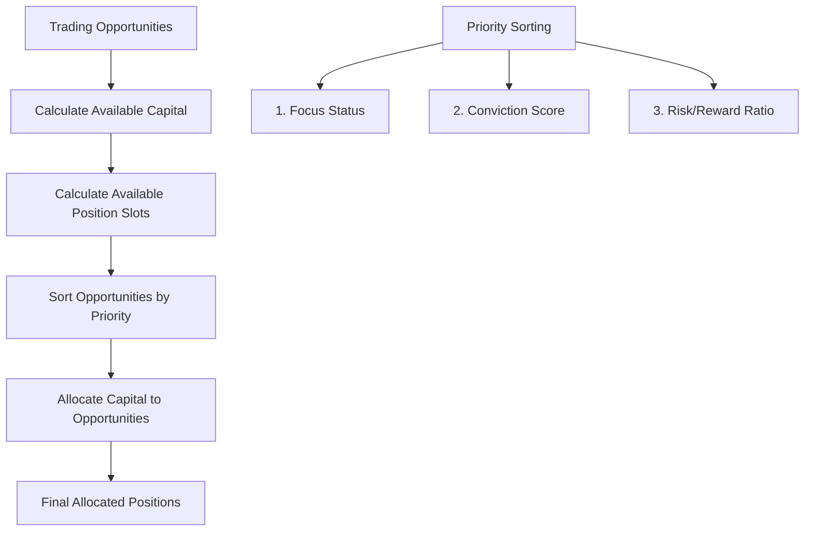

**Implementation:**
```python
def allocate_capital(self, opportunities: List[Dict], current_positions: List[Dict] = None) -> List[Dict]:
    if current_positions is None:
        current_positions = []
    
    # Calculate available capital
    capital_used = sum(pos.get('position_value', 0) for pos in current_positions)
    available_capital = self.account_size - capital_used
    
    # Calculate available position slots
    available_positions = self.max_positions - len(current_positions)
    
    if available_positions <= 0 or available_capital <= 0:
        return []
    
    # Sort opportunities by conviction score (highest first)
    # Prioritize focus tickers over non-focus tickers
    sorted_opportunities = sorted(
        opportunities, 
        key=lambda x: (
            # First sort by focus status (True comes before False)
            not x.get('is_focus_ticker', False),
            # Then sort by conviction score (higher is better)
            -x.get('conviction_score', 0),
            # Finally sort by risk/reward ratio (lower is better)
            x.get('risk_amount', float('inf')) / max(x.get('position_value', 1), 1)
        )
    )
    
    # Allocate capital to opportunities
    allocated_positions = []
    remaining_capital = available_capital
    
    for opportunity in sorted_opportunities:
        if len(allocated_positions) >= available_positions:
            break
            
        # Skip non-viable opportunities
        if not opportunity.get('viable', False):
            continue
            
        position_value = opportunity.get('position_value', 0)
        
        # Skip if position value is zero or not enough capital
        if position_value <= 0 or position_value > remaining_capital:
            continue
            
        # Allocate capital to this position
        allocated_positions.append(opportunity)
        remaining_capital -= position_value
    
    return allocated_positions
```

## 8. Integration with Production Pipeline

The dynamic ticker selection and position sizing components are integrated into the production data pipeline:

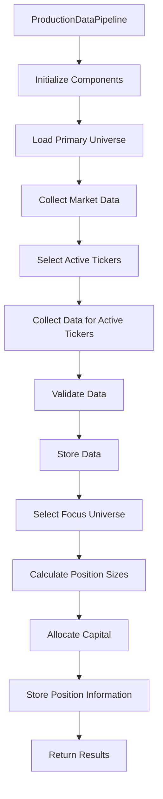

**Integration Code:**
```python
def run_full_pipeline(self, date=None):
    if date is None:
        date = datetime.now().strftime('%Y-%m-%d')
    
    logger.info(f"Running full pipeline for date: {date}")
    
    # Step 1: Select active tickers
    self.active_universe = self.select_active_tickers(date)
    logger.info(f"Selected {len(self.active_universe)} active tickers")
    
    # Step 2: Collect data for active tickers
    data = self.collect_data_for_active_tickers(date)
    logger.info(f"Collected data for {len(data)} tickers")
    
    # Step 3: Validate data
    validation_results = self.validate_data(data)
    logger.info(f"Validated data: {sum(1 for r in validation_results.values() if r['valid'])} valid, {sum(1 for r in validation_results.values() if not r['valid'])} invalid")
    
    # Step 4: Store data
    storage_results = self.store_data(data)
    logger.info(f"Stored data: {storage_results}")
    
    # Step 5: Select focus universe
    self.focus_universe = self.select_focus_universe(data)
    logger.info(f"Selected {len(self.focus_universe)} focus tickers")
    
    # Step 6: Calculate position sizes
    position_sizes = self.calculate_position_sizes(data)
    logger.info(f"Calculated position sizes for {len(position_sizes)} tickers")
    
    # Step 7: Store position information
    self._store_position_information(position_sizes, date)
    
    return {
        'date': date,
        'active_universe': self.active_universe,
        'focus_universe': self.focus_universe,
        'data_collected': len(data),
        'valid_data': sum(1 for r in validation_results.values() if r['valid']),
        'invalid_data': sum(1 for r in validation_results.values() if not r['valid']),
        'storage_results': storage_results,
        'position_sizes': position_sizes
    }
```

## 9. Performance Considerations

### 9.1 Tiered Resource Allocation

The system optimizes computational resources through tiered resource allocation:

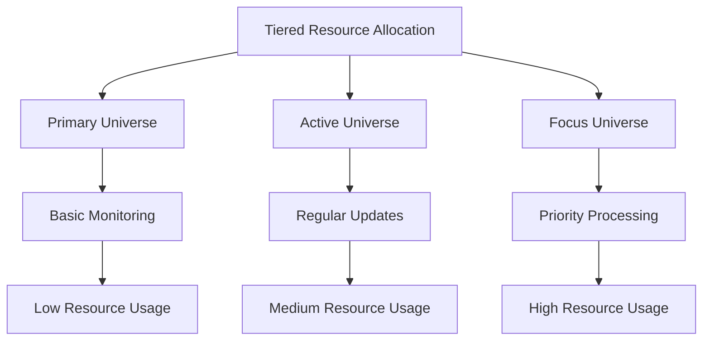

### 9.2 Parallel Processing

The system uses parallel processing for opportunity score calculation:

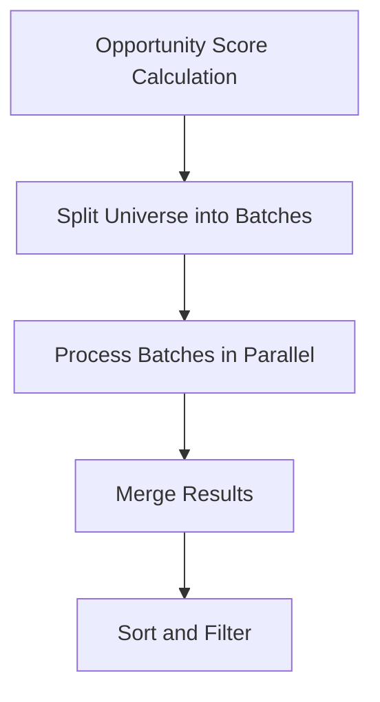

### 9.3 Memory Optimization

The system optimizes memory usage through efficient data structures:

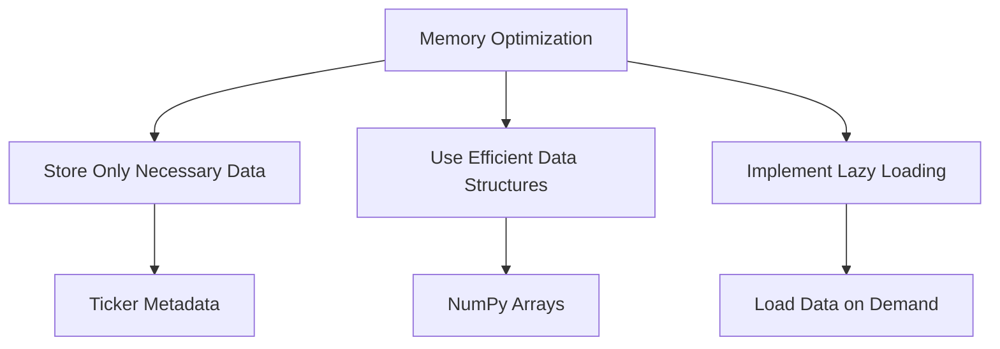

## 10. Integration with Other Subsystems

The Trading Strategy Subsystem integrates with several other subsystems of the Autonomous Trading System:

```mermaid
flowchart LR
    subgraph "Data Acquisition Subsystem"
        DA[Data Acquisition]
        DB[(TimescaleDB)]
    end
    
    subgraph "Feature Engineering Subsystem"
        FE[Feature Engineering]
        FC[Feature Cache]
        FS[Feature Store]
    end
    
    subgraph "Model Training Subsystem"
        MT[Model Training]
        MR[Model Registry]
        DPO[Dollar Profit Optimizer]
    end
    
    subgraph "Trading Strategy Subsystem"
        TS[Ticker Selection]
        PS[Position Sizing]
        OG[Order Generation]
    end
    
    subgraph "Execution Subsystem"
        EX[Alpaca API]
        PM[Position Management]
    end
    
    subgraph "Monitoring Subsystem"
        MON[Monitoring]
        PROM[Prometheus]
        GRAF[Grafana]
    end
    
    DA --> DB
    DB --> FE
    FE --> FC
    FC --> FS
    FS --> MT
    MT --> MR
    MR --> DPO
    DPO --> TS
    TS --> PS
    PS --> OG
    OG --> EX
    EX --> PM
    PM --> MON
    MON --> PROM
    PROM --> GRAF
```

Key integration points:

1. **Data Acquisition Subsystem**: The Trading Strategy Subsystem retrieves market data from TimescaleDB, which is populated by the Data Acquisition Subsystem
2. **Feature Engineering Subsystem**: The Trading Strategy Subsystem uses features from the Feature Engineering Subsystem for ticker selection and position sizing
3. **Model Training Subsystem**: The Trading Strategy Subsystem receives trading signals from the Model Training Subsystem's Dollar Profit Optimizer
4. **Execution Subsystem**: The Trading Strategy Subsystem sends orders to the Execution Subsystem for execution
5. **Monitoring Subsystem**: The Trading Strategy Subsystem reports metrics to the Monitoring Subsystem for visualization and alerting

## 11. Database Integration

Position information is stored in the database for tracking and analysis:

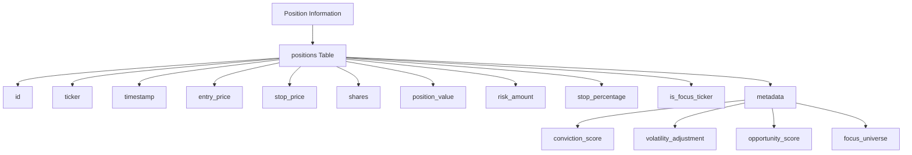

## 12. Best Practices

1. **Use tiered selection approach** - Efficiently manage a large universe of tickers by focusing computational resources on the most promising opportunities
2. **Implement the 2% risk rule** - Ensure consistent risk management across all trades
3. **Use ATR-based stops** - Calculate stop prices based on volatility rather than arbitrary percentages
4. **Adjust for volatility** - Reduce position sizes for high-volatility stocks and increase for low-volatility stocks
5. **Prioritize focus tickers** - Allocate more capital to high-conviction opportunities
6. **Respect position constraints** - Enforce maximum and minimum position sizes to manage risk and avoid inefficient trades
7. **Optimize for GH200 architecture** - Use vectorized operations and parallel processing for efficient computation
8. **Implement state persistence** - Save and load state to handle restarts and crashes
9. **Monitor performance metrics** - Track opportunity scores, conviction scores, and position sizes over time
10. **Regularly update universe** - Periodically review and update the primary universe to include new opportunities

## 13. Future Enhancements

### 13.1 Enhanced Opportunity Scoring

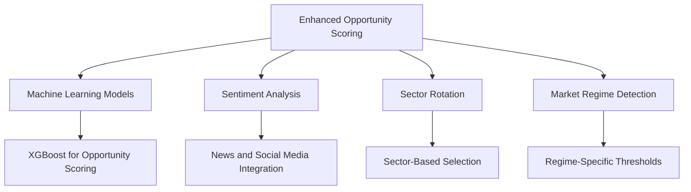

### 13.2 Advanced Position Sizing

```mermaid
flowchart TD
    A[Advanced Position Sizing] --> B[Portfolio Optimization]
    A --> C[Correlation-Based Sizing]
    A --> D[Dynamic Focus Allocation]
    
    B --> E[Mean-Variance Analysis]
    C --> F[Reduce Size for Correlated Positions]
    D --> G[Adjust Boost Based on Market Conditions]
```

### 13.3 Real-Time Adaptation

```mermaid
flowchart TD
    A[Real-Time Adaptation] --> B[Dynamic Tier Sizes]
    A --> C[Dynamic Risk Adjustment]
    A --> D[Adaptive Capital Allocation]
    
    B --> E[Adjust Based on Market Conditions]
    C --> F[Adjust Based on Market Volatility]
    D --> G[Adjust Based on Market Regime]
```

## 14. Conclusion

The Trading Strategy Subsystem provides a robust framework for efficiently managing a large universe of tickers while maintaining strict risk controls. The tiered selection approach optimizes computational resources and capital allocation, focusing on the highest conviction opportunities while maintaining broad market coverage. The risk-based position sizing ensures consistent risk management across all trades, with adjustments for volatility, conviction, and focus status.

By implementing the recommended enhancements, the subsystem can become more adaptive to changing market conditions, ultimately leading to better trading decisions and higher profitability.