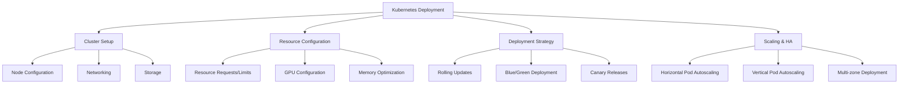
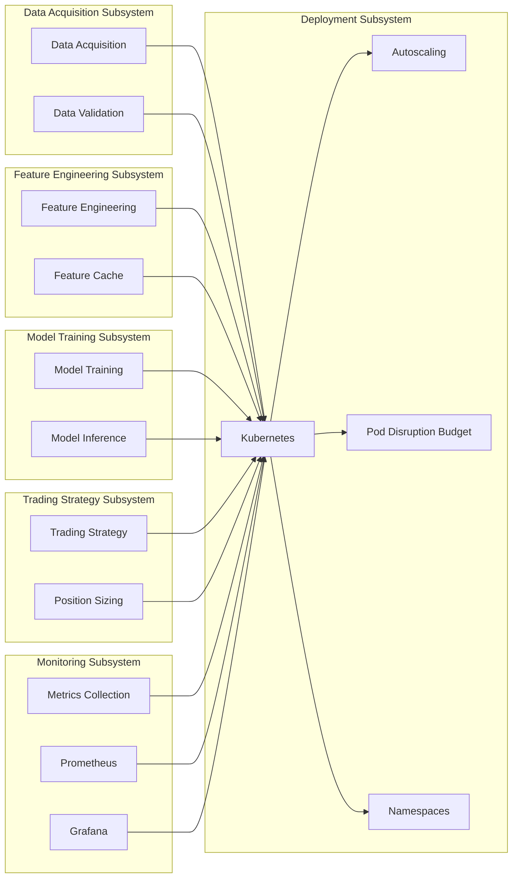

# Deployment Subsystem

## 1. Introduction

The Deployment Subsystem is a critical component of the Autonomous Trading System responsible for deploying, scaling, and managing the system on Kubernetes. It provides a robust, scalable, and resilient infrastructure for running the trading system in production.

This document provides a comprehensive overview of the Deployment Subsystem, including its architecture, components, configuration, and implementation steps.

## 2. System Architecture Overview

The Deployment Subsystem follows a modular architecture with several key components:



## 3. Cluster Setup

### 3.1 Node Configuration

The Kubernetes cluster is configured with the following node types:

1. **Control Plane Nodes**:
   - Minimum 3 nodes for high availability
   - 4 vCPUs, 16GB RAM per node
   - 100GB SSD storage per node

2. **Worker Nodes (CPU)**:
   - Minimum 3 nodes for high availability
   - 8 vCPUs, 32GB RAM per node
   - 200GB SSD storage per node

3. **Worker Nodes (GPU)**:
   - Minimum 2 nodes with NVIDIA GH200 Grace Hopper Superchip
   - 16 vCPUs, 128GB RAM per node
   - 500GB SSD storage per node

4. **Storage Nodes**:
   - Minimum 2 nodes for high availability
   - 4 vCPUs, 16GB RAM per node
   - 2TB SSD storage per node

### 3.2 Networking

The Kubernetes cluster uses Calico for networking:

```yaml
# calico-config.yaml
apiVersion: operator.tigera.io/v1
kind: Installation
metadata:
  name: default
spec:
  calicoNetwork:
    ipPools:
    - blockSize: 26
      cidr: 192.168.0.0/16
      encapsulation: VXLANCrossSubnet
      natOutgoing: Enabled
      nodeSelector: all()
  typhaMetricsPort: 9091
```

Network policies are configured to restrict communication between components:

```yaml
# network-policy.yaml
apiVersion: networking.k8s.io/v1
kind: NetworkPolicy
metadata:
  name: data-acquisition-policy
  namespace: trading-system
spec:
  podSelector:
    matchLabels:
      app: data-acquisition
  policyTypes:
  - Ingress
  - Egress
  ingress:
  - from:
    - podSelector:
        matchLabels:
          app: feature-engineering
    ports:
    - protocol: TCP
      port: 8080
  egress:
  - to:
    - podSelector:
        matchLabels:
          app: feature-engineering
    ports:
    - protocol: TCP
      port: 8080
  - to:
    - ipBlock:
        cidr: 0.0.0.0/0
        except:
        - 10.0.0.0/8
        - 172.16.0.0/12
        - 192.168.0.0/16
    ports:
    - protocol: TCP
      port: 443
```

### 3.3 Storage

Storage classes are configured for different performance tiers:

```yaml
# storage-classes.yaml
apiVersion: storage.k8s.io/v1
kind: StorageClass
metadata:
  name: fast
provisioner: kubernetes.io/gce-pd
parameters:
  type: pd-ssd
  fstype: ext4
reclaimPolicy: Retain
allowVolumeExpansion: true
volumeBindingMode: WaitForFirstConsumer
---
apiVersion: storage.k8s.io/v1
kind: StorageClass
metadata:
  name: standard
provisioner: kubernetes.io/gce-pd
parameters:
  type: pd-standard
  fstype: ext4
reclaimPolicy: Retain
allowVolumeExpansion: true
volumeBindingMode: WaitForFirstConsumer
```

## 4. Resource Configuration

### 4.1 Namespace Configuration

```yaml
# namespaces.yaml
apiVersion: v1
kind: Namespace
metadata:
  name: trading-system
  labels:
    name: trading-system
---
apiVersion: v1
kind: ResourceQuota
metadata:
  name: trading-system-quota
  namespace: trading-system
spec:
  hard:
    requests.cpu: "64"
    requests.memory: 128Gi
    requests.nvidia.com/gpu: "4"
    limits.cpu: "128"
    limits.memory: 256Gi
    limits.nvidia.com/gpu: "8"
    pods: "100"
    services: "50"
    persistentvolumeclaims: "50"
    secrets: "100"
    configmaps: "100"
```

### 4.2 GPU Configuration

NVIDIA device plugin configuration:

```yaml
# nvidia-device-plugin.yaml
apiVersion: apps/v1
kind: DaemonSet
metadata:
  name: nvidia-device-plugin-daemonset
  namespace: kube-system
spec:
  selector:
    matchLabels:
      name: nvidia-device-plugin-ds
  template:
    metadata:
      labels:
        name: nvidia-device-plugin-ds
    spec:
      tolerations:
      - key: nvidia.com/gpu
        operator: Exists
        effect: NoSchedule
      containers:
      - image: nvcr.io/nvidia/k8s-device-plugin:v0.14.0
        name: nvidia-device-plugin-ctr
        args: ["--fail-on-init-error=false"]
        securityContext:
          allowPrivilegeEscalation: false
          capabilities:
            drop: ["ALL"]
        volumeMounts:
        - name: device-plugin
          mountPath: /var/lib/kubelet/device-plugins
      volumes:
      - name: device-plugin
        hostPath:
          path: /var/lib/kubelet/device-plugins
```

Example of a pod requesting GPU resources:

```yaml
# model-training-pod.yaml
apiVersion: v1
kind: Pod
metadata:
  name: model-training
  namespace: trading-system
spec:
  containers:
  - name: model-training
    image: inavvi-tensorflow-gpu:latest
    resources:
      limits:
        nvidia.com/gpu: 1
        memory: "32Gi"
        cpu: "8"
      requests:
        nvidia.com/gpu: 1
        memory: "16Gi"
        cpu: "4"
    volumeMounts:
    - name: model-data
      mountPath: /app/models
  volumes:
  - name: model-data
    persistentVolumeClaim:
      claimName: model-data-pvc
```

### 4.3 Memory Optimization

Memory optimization for Java-based components:

```yaml
# java-component.yaml
apiVersion: apps/v1
kind: Deployment
metadata:
  name: java-component
  namespace: trading-system
spec:
  replicas: 3
  selector:
    matchLabels:
      app: java-component
  template:
    metadata:
      labels:
        app: java-component
    spec:
      containers:
      - name: java-component
        image: java-component:latest
        env:
        - name: JAVA_OPTS
          value: "-XX:+UseG1GC -XX:MaxGCPauseMillis=200 -XX:+UseStringDeduplication -XX:+HeapDumpOnOutOfMemoryError -XX:HeapDumpPath=/tmp/heapdump.hprof"
        resources:
          limits:
            memory: "4Gi"
            cpu: "2"
          requests:
            memory: "2Gi"
            cpu: "1"
```

## 5. Deployment Strategy

### 5.1 Rolling Updates

Rolling update configuration for deployments:

```yaml
# data-acquisition-deployment.yaml
apiVersion: apps/v1
kind: Deployment
metadata:
  name: data-acquisition
  namespace: trading-system
spec:
  replicas: 3
  strategy:
    type: RollingUpdate
    rollingUpdate:
      maxSurge: 1
      maxUnavailable: 0
  selector:
    matchLabels:
      app: data-acquisition
  template:
    metadata:
      labels:
        app: data-acquisition
    spec:
      containers:
      - name: data-acquisition
        image: data-acquisition:latest
        ports:
        - containerPort: 8080
        readinessProbe:
          httpGet:
            path: /health/ready
            port: 8080
          initialDelaySeconds: 10
          periodSeconds: 5
        livenessProbe:
          httpGet:
            path: /health/live
            port: 8080
          initialDelaySeconds: 20
          periodSeconds: 10
        lifecycle:
          preStop:
            exec:
              command: ["/bin/sh", "-c", "sleep 10"]
```

### 5.2 Blue/Green Deployment

Blue/Green deployment configuration:

```yaml
# blue-deployment.yaml
apiVersion: apps/v1
kind: Deployment
metadata:
  name: trading-strategy-blue
  namespace: trading-system
spec:
  replicas: 3
  selector:
    matchLabels:
      app: trading-strategy
      version: blue
  template:
    metadata:
      labels:
        app: trading-strategy
        version: blue
    spec:
      containers:
      - name: trading-strategy
        image: trading-strategy:v1
        ports:
        - containerPort: 8080
---
# green-deployment.yaml
apiVersion: apps/v1
kind: Deployment
metadata:
  name: trading-strategy-green
  namespace: trading-system
spec:
  replicas: 3
  selector:
    matchLabels:
      app: trading-strategy
      version: green
  template:
    metadata:
      labels:
        app: trading-strategy
        version: green
    spec:
      containers:
      - name: trading-strategy
        image: trading-strategy:v2
        ports:
        - containerPort: 8080
---
# service.yaml
apiVersion: v1
kind: Service
metadata:
  name: trading-strategy
  namespace: trading-system
spec:
  selector:
    app: trading-strategy
    version: blue  # Switch to green for cutover
  ports:
  - port: 80
    targetPort: 8080
```

### 5.3 Canary Releases

Canary deployment with Istio:

```yaml
# canary-deployment.yaml
apiVersion: networking.istio.io/v1alpha3
kind: VirtualService
metadata:
  name: trading-strategy
  namespace: trading-system
spec:
  hosts:
  - trading-strategy
  http:
  - route:
    - destination:
        host: trading-strategy
        subset: v1
      weight: 90
    - destination:
        host: trading-strategy
        subset: v2
      weight: 10
---
apiVersion: networking.istio.io/v1alpha3
kind: DestinationRule
metadata:
  name: trading-strategy
  namespace: trading-system
spec:
  host: trading-strategy
  subsets:
  - name: v1
    labels:
      version: v1
  - name: v2
    labels:
      version: v2
```

## 6. High Availability and Scaling

### 6.1 Horizontal Pod Autoscaling

HPA configuration for CPU-based scaling:

```yaml
# hpa-cpu.yaml
apiVersion: autoscaling/v2
kind: HorizontalPodAutoscaler
metadata:
  name: feature-engineering-hpa
  namespace: trading-system
spec:
  scaleTargetRef:
    apiVersion: apps/v1
    kind: Deployment
    name: feature-engineering
  minReplicas: 3
  maxReplicas: 10
  metrics:
  - type: Resource
    resource:
      name: cpu
      target:
        type: Utilization
        averageUtilization: 70
```

HPA configuration with custom metrics:

```yaml
# hpa-custom.yaml
apiVersion: autoscaling/v2
kind: HorizontalPodAutoscaler
metadata:
  name: trading-strategy-hpa
  namespace: trading-system
spec:
  scaleTargetRef:
    apiVersion: apps/v1
    kind: Deployment
    name: trading-strategy
  minReplicas: 3
  maxReplicas: 10
  metrics:
  - type: Resource
    resource:
      name: cpu
      target:
        type: Utilization
        averageUtilization: 70
  - type: Pods
    pods:
      metric:
        name: requests_per_second
      target:
        type: AverageValue
        averageValue: 1000
```

### 6.2 Multi-zone Deployment

Pod anti-affinity for multi-zone deployment:

```yaml
# multi-zone-deployment.yaml
apiVersion: apps/v1
kind: Deployment
metadata:
  name: model-inference
  namespace: trading-system
spec:
  replicas: 6
  selector:
    matchLabels:
      app: model-inference
  template:
    metadata:
      labels:
        app: model-inference
    spec:
      affinity:
        podAntiAffinity:
          requiredDuringSchedulingIgnoredDuringExecution:
          - labelSelector:
              matchExpressions:
              - key: app
                operator: In
                values:
                - model-inference
            topologyKey: "topology.kubernetes.io/zone"
      containers:
      - name: model-inference
        image: model-inference:latest
```

Topology spread constraints:

```yaml
# topology-spread.yaml
apiVersion: apps/v1
kind: Deployment
metadata:
  name: data-pipeline
  namespace: trading-system
spec:
  replicas: 9
  selector:
    matchLabels:
      app: data-pipeline
  template:
    metadata:
      labels:
        app: data-pipeline
    spec:
      topologySpreadConstraints:
      - maxSkew: 1
        topologyKey: "topology.kubernetes.io/zone"
        whenUnsatisfiable: DoNotSchedule
        labelSelector:
          matchLabels:
            app: data-pipeline
      - maxSkew: 1
        topologyKey: "kubernetes.io/hostname"
        whenUnsatisfiable: ScheduleAnyway
        labelSelector:
          matchLabels:
            app: data-pipeline
      containers:
      - name: data-pipeline
        image: data-pipeline:latest
```

### 6.3 StatefulSet Configuration

StatefulSet configuration for stateful components:

```yaml
# timescaledb-statefulset.yaml
apiVersion: apps/v1
kind: StatefulSet
metadata:
  name: timescaledb
  namespace: trading-system
spec:
  serviceName: "timescaledb"
  replicas: 3
  selector:
    matchLabels:
      app: timescaledb
  template:
    metadata:
      labels:
        app: timescaledb
    spec:
      terminationGracePeriodSeconds: 60
      containers:
      - name: timescaledb
        image: timescale/timescaledb:latest-pg14
        ports:
        - containerPort: 5432
          name: postgresql
        env:
        - name: POSTGRES_USER
          valueFrom:
            secretKeyRef:
              name: timescaledb-credentials
              key: username
        - name: POSTGRES_PASSWORD
          valueFrom:
            secretKeyRef:
              name: timescaledb-credentials
              key: password
        - name: POSTGRES_DB
          value: trading_system
        volumeMounts:
        - name: data
          mountPath: /var/lib/postgresql/data
  volumeClaimTemplates:
  - metadata:
      name: data
    spec:
      accessModes: [ "ReadWriteOnce" ]
      storageClassName: "fast"
      resources:
        requests:
          storage: 100Gi
```

Pod disruption budget:

```yaml
# pdb.yaml
apiVersion: policy/v1
kind: PodDisruptionBudget
metadata:
  name: timescaledb-pdb
  namespace: trading-system
spec:
  minAvailable: 2
  selector:
    matchLabels:
      app: timescaledb
```

## 7. Component Deployment

### 7.1 Data Acquisition Subsystem

```yaml
# data-acquisition-deployment.yaml
apiVersion: apps/v1
kind: Deployment
metadata:
  name: data-acquisition
  namespace: trading-system
spec:
  replicas: 3
  selector:
    matchLabels:
      app: data-acquisition
  template:
    metadata:
      labels:
        app: data-acquisition
    spec:
      containers:
      - name: data-acquisition
        image: data-acquisition:latest
        resources:
          limits:
            memory: "4Gi"
            cpu: "2"
          requests:
            memory: "2Gi"
            cpu: "1"
        volumeMounts:
        - name: data
          mountPath: /app/data
      volumes:
      - name: data
        persistentVolumeClaim:
          claimName: data-pvc
```

### 7.2 Feature Engineering Subsystem

```yaml
# feature-engineering-deployment.yaml
apiVersion: apps/v1
kind: Deployment
metadata:
  name: feature-engineering
  namespace: trading-system
spec:
  replicas: 3
  selector:
    matchLabels:
      app: feature-engineering
  template:
    metadata:
      labels:
        app: feature-engineering
    spec:
      containers:
      - name: feature-engineering
        image: feature-engineering:latest
        resources:
          limits:
            memory: "8Gi"
            cpu: "4"
          requests:
            memory: "4Gi"
            cpu: "2"
        volumeMounts:
        - name: data
          mountPath: /app/data
        - name: features
          mountPath: /app/features
      volumes:
      - name: data
        persistentVolumeClaim:
          claimName: data-pvc
      - name: features
        persistentVolumeClaim:
          claimName: features-pvc
```

### 7.3 Model Training Subsystem

```yaml
# model-training-deployment.yaml
apiVersion: apps/v1
kind: Deployment
metadata:
  name: model-training
  namespace: trading-system
spec:
  replicas: 2
  selector:
    matchLabels:
      app: model-training
  template:
    metadata:
      labels:
        app: model-training
    spec:
      containers:
      - name: model-training
        image: model-training:latest
        resources:
          limits:
            nvidia.com/gpu: 1
            memory: "32Gi"
            cpu: "8"
          requests:
            nvidia.com/gpu: 1
            memory: "16Gi"
            cpu: "4"
        volumeMounts:
        - name: features
          mountPath: /app/features
        - name: models
          mountPath: /app/models
      volumes:
      - name: features
        persistentVolumeClaim:
          claimName: features-pvc
      - name: models
        persistentVolumeClaim:
          claimName: models-pvc
```

### 7.4 Trading Strategy Subsystem

```yaml
# trading-strategy-deployment.yaml
apiVersion: apps/v1
kind: Deployment
metadata:
  name: trading-strategy
  namespace: trading-system
spec:
  replicas: 3
  selector:
    matchLabels:
      app: trading-strategy
  template:
    metadata:
      labels:
        app: trading-strategy
    spec:
      containers:
      - name: trading-strategy
        image: trading-strategy:latest
        resources:
          limits:
            memory: "8Gi"
            cpu: "4"
          requests:
            memory: "4Gi"
            cpu: "2"
        volumeMounts:
        - name: models
          mountPath: /app/models
        - name: strategies
          mountPath: /app/strategies
      volumes:
      - name: models
        persistentVolumeClaim:
          claimName: models-pvc
      - name: strategies
        persistentVolumeClaim:
          claimName: strategies-pvc
```

## 8. Integration with Other Subsystems

The Deployment Subsystem integrates with several other subsystems of the Autonomous Trading System:



Key integration points:

1. **Data Acquisition Subsystem**: The Deployment Subsystem deploys and manages the Data Acquisition Subsystem components
2. **Feature Engineering Subsystem**: The Deployment Subsystem deploys and manages the Feature Engineering Subsystem components
3. **Model Training Subsystem**: The Deployment Subsystem deploys and manages the Model Training Subsystem components, including GPU configuration
4. **Trading Strategy Subsystem**: The Deployment Subsystem deploys and manages the Trading Strategy Subsystem components
5. **Monitoring Subsystem**: The Deployment Subsystem deploys and manages the Monitoring Subsystem components, and integrates with them for monitoring and alerting

## 9. Implementation Steps

### 9.1 Set up Kubernetes Cluster

1. Create the Kubernetes cluster with the specified node types
2. Configure networking with Calico
3. Set up storage classes for different performance tiers
4. Install NVIDIA device plugin for GPU support

### 9.2 Configure Namespaces and Resource Quotas

1. Create the trading-system namespace
2. Configure resource quotas for the namespace
3. Set up limit ranges for default resource limits

### 9.3 Deploy Core Infrastructure

1. Deploy TimescaleDB StatefulSet
2. Deploy Redis StatefulSet
3. Deploy Prometheus and Grafana for monitoring
4. Configure persistent storage for all stateful components

### 9.4 Deploy Application Components

1. Deploy data acquisition components
2. Deploy feature engineering components
3. Deploy model training components
4. Deploy trading strategy components
5. Deploy monitoring components

### 9.5 Configure Networking and Security

1. Configure network policies for secure communication
2. Set up ingress for external access
3. Configure TLS certificates for secure communication
4. Implement authentication and authorization

### 9.6 Set up Scaling and High Availability

1. Configure horizontal pod autoscaling
2. Set up pod disruption budgets
3. Configure pod anti-affinity for high availability
4. Implement topology spread constraints

### 9.7 Test and Validate

1. Test deployment and scaling
2. Validate high availability
3. Test failover scenarios
4. Verify resource utilization

## 10. Best Practices

1. **Use resource requests and limits** - Configure appropriate resource requests and limits for all containers
2. **Implement health checks** - Configure readiness and liveness probes for all containers
3. **Use rolling updates** - Configure rolling updates for deployments to minimize downtime
4. **Implement pod disruption budgets** - Configure pod disruption budgets for stateful components
5. **Use node affinity and anti-affinity** - Configure node affinity and anti-affinity for optimal pod placement
6. **Implement topology spread constraints** - Configure topology spread constraints for high availability
7. **Use persistent storage** - Configure persistent storage for stateful components
8. **Implement network policies** - Configure network policies for secure communication
9. **Use secrets for sensitive data** - Store sensitive data in Kubernetes secrets
10. **Monitor resource utilization** - Monitor resource utilization and adjust resource requests and limits as needed

## 11. Recommendations for Improvements

### 11.1 Architecture Improvements

1. **Implement service mesh** - Use Istio or Linkerd for advanced traffic management and security
2. **Implement GitOps** - Use GitOps for declarative configuration management
3. **Implement infrastructure as code** - Use Terraform or Pulumi for infrastructure provisioning
4. **Implement cluster autoscaling** - Configure cluster autoscaling for dynamic resource allocation

### 11.2 Security Improvements

1. **Implement pod security policies** - Configure pod security policies for enhanced security
2. **Implement network security policies** - Configure network security policies for secure communication
3. **Implement RBAC** - Configure role-based access control for fine-grained access control
4. **Implement secret management** - Use external secret management solutions like HashiCorp Vault

### 11.3 Monitoring Improvements

1. **Implement custom metrics** - Configure custom metrics for application-specific monitoring
2. **Implement distributed tracing** - Use Jaeger or Zipkin for distributed tracing
3. **Implement log aggregation** - Use Elasticsearch, Fluentd, and Kibana for log aggregation
4. **Implement alerting** - Configure alerting for critical events

### 11.4 Performance Improvements

1. **Implement node taints and tolerations** - Configure node taints and tolerations for specialized workloads
2. **Implement priority classes** - Configure priority classes for critical workloads
3. **Implement resource quotas** - Configure resource quotas for fair resource allocation
4. **Implement limit ranges** - Configure limit ranges for default resource limits

## 12. Conclusion

The Deployment Subsystem provides a robust, scalable, and resilient infrastructure for running the Autonomous Trading System in production. Its modular architecture, comprehensive resource configuration, and flexible deployment strategies enable efficient operation and management of the system.

By implementing the recommended improvements, the subsystem can become more secure, resilient, and efficient in supporting the operation of the Autonomous Trading System.