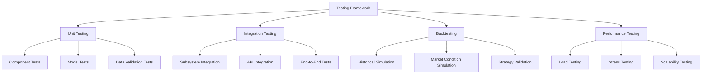
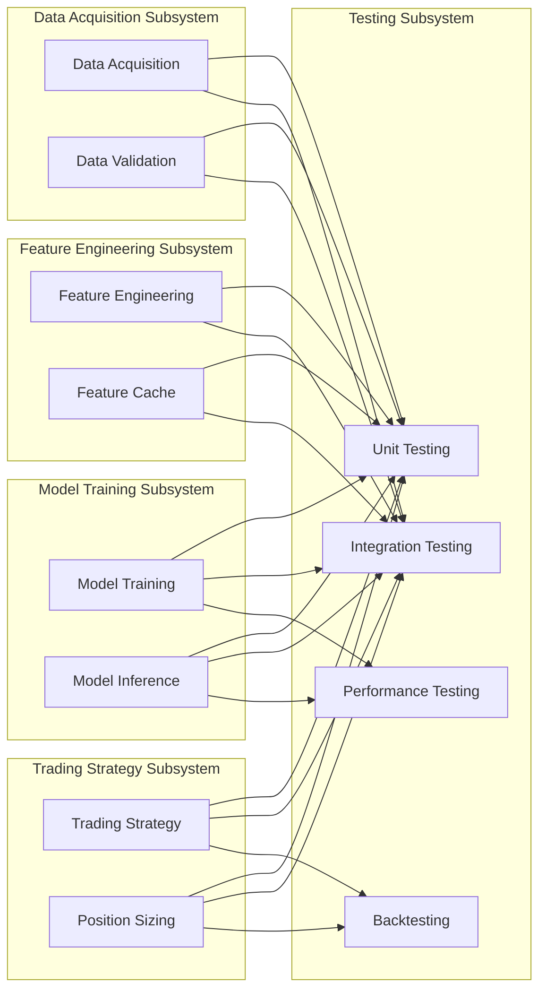

# Testing Subsystem

## 1. Introduction

The Testing Subsystem is a critical component of the Autonomous Trading System responsible for ensuring the system's reliability, robustness, and performance. It provides comprehensive testing capabilities across multiple levels, from unit testing of individual components to end-to-end testing of the complete system.

This document provides a comprehensive overview of the Testing Subsystem, including its architecture, components, testing methodologies, and implementation steps.

## 2. System Architecture Overview

The Testing Subsystem follows a modular architecture with several key components:



## 3. Unit Testing

Unit testing ensures that individual components function correctly in isolation.

### 3.1 Component Tests

Component tests verify the functionality of individual components:

```python
# test_data_validator.py
import unittest
from src.data_acquisition.validation.data_validator import DataValidator

class TestDataValidator(unittest.TestCase):
    def setUp(self):
        self.validator = DataValidator(config={"strict_mode": True})
        self.valid_data = {
            "ticker": "AAPL",
            "timestamp": "2023-01-01T00:00:00Z",
            "open": 150.0,
            "high": 155.0,
            "low": 149.0,
            "close": 152.0,
            "volume": 1000000
        }
        self.invalid_data = {
            "ticker": "AAPL",
            "timestamp": "2023-01-01T00:00:00Z",
            "open": 150.0,
            "high": 145.0,  # High < Open, which is invalid
            "low": 149.0,
            "close": 152.0,
            "volume": 1000000
        }
    
    def test_validate_valid_data(self):
        result = self.validator.validate_price_data({"data": [self.valid_data]})
        self.assertTrue(result["is_valid"])
        self.assertEqual(len(result["validated_data"]["data"]), 1)
    
    def test_validate_invalid_data(self):
        result = self.validator.validate_price_data({"data": [self.invalid_data]})
        self.assertFalse(result["is_valid"])
        self.assertEqual(len(result["validation_errors"]), 1)
    
    def test_validation_rules(self):
        # Test specific validation rules
        rule_result = self.validator._check_high_low_consistency(self.invalid_data)
        self.assertFalse(rule_result["is_valid"])

if __name__ == "__main__":
    unittest.main()
```

### 3.2 Model Tests

Model tests verify the functionality of machine learning models:

```python
# test_xgboost_model.py
import unittest
import numpy as np
from src.model_training.models.xgboost_model import XGBoostModel

class TestXGBoostModel(unittest.TestCase):
    def setUp(self):
        self.model = XGBoostModel(config={
            "max_depth": 3,
            "learning_rate": 0.1,
            "n_estimators": 100
        })
        # Create synthetic data for testing
        np.random.seed(42)
        self.X_train = np.random.normal(0, 1, (1000, 10))
        self.y_train = np.random.normal(0, 1, (1000,))
        self.X_test = np.random.normal(0, 1, (200, 10))
        self.y_test = np.random.normal(0, 1, (200,))
    
    def test_model_training(self):
        # Train the model
        self.model.train(self.X_train, self.y_train)
        
        # Check that the model is trained
        self.assertTrue(self.model.is_trained())
        
        # Check that the model has the expected number of features
        self.assertEqual(self.model.get_n_features(), 10)
    
    def test_model_prediction(self):
        # Train the model
        self.model.train(self.X_train, self.y_train)
        
        # Make predictions
        predictions = self.model.predict(self.X_test)
        
        # Check that predictions have the expected shape
        self.assertEqual(predictions.shape, (200,))
        
        # Check that predictions are within a reasonable range
        self.assertTrue(np.all(np.isfinite(predictions)))
    
    def test_feature_importance(self):
        # Train the model
        self.model.train(self.X_train, self.y_train)
        
        # Get feature importance
        importance = self.model.get_feature_importance()
        
        # Check that importance has the expected shape
        self.assertEqual(len(importance), 10)
        
        # Check that importance values sum to 1
        self.assertAlmostEqual(sum(importance), 1.0, places=5)

if __name__ == "__main__":
    unittest.main()
```

### 3.3 Data Validation Tests

Data validation tests verify the functionality of data validation rules:

```python
# test_validation_rules.py
import unittest
from src.data_acquisition.validation.validation_rules import ValidationRules

class TestValidationRules(unittest.TestCase):
    def setUp(self):
        self.rules = ValidationRules()
        self.valid_price_data = {
            "ticker": "AAPL",
            "timestamp": "2023-01-01T00:00:00Z",
            "open": 150.0,
            "high": 155.0,
            "low": 149.0,
            "close": 152.0,
            "volume": 1000000
        }
        self.valid_quote_data = {
            "ticker": "AAPL",
            "timestamp": "2023-01-01T00:00:00Z",
            "bid_price": 151.5,
            "ask_price": 152.0,
            "bid_size": 100,
            "ask_size": 200
        }
    
    def test_price_data_completeness(self):
        # Test with complete data
        result = self.rules.check_completeness(self.valid_price_data, ["ticker", "timestamp", "open", "high", "low", "close", "volume"])
        self.assertTrue(result["is_valid"])
        
        # Test with incomplete data
        incomplete_data = self.valid_price_data.copy()
        del incomplete_data["volume"]
        result = self.rules.check_completeness(incomplete_data, ["ticker", "timestamp", "open", "high", "low", "close", "volume"])
        self.assertFalse(result["is_valid"])
    
    def test_price_data_consistency(self):
        # Test with consistent data
        result = self.rules.check_price_consistency(self.valid_price_data)
        self.assertTrue(result["is_valid"])
        
        # Test with inconsistent data (high < low)
        inconsistent_data = self.valid_price_data.copy()
        inconsistent_data["high"] = 148.0
        result = self.rules.check_price_consistency(inconsistent_data)
        self.assertFalse(result["is_valid"])
    
    def test_quote_data_consistency(self):
        # Test with consistent data
        result = self.rules.check_quote_consistency(self.valid_quote_data)
        self.assertTrue(result["is_valid"])
        
        # Test with inconsistent data (bid > ask)
        inconsistent_data = self.valid_quote_data.copy()
        inconsistent_data["bid_price"] = 153.0
        result = self.rules.check_quote_consistency(inconsistent_data)
        self.assertFalse(result["is_valid"])

if __name__ == "__main__":
    unittest.main()
```

## 4. Integration Testing

Integration testing ensures that components work together correctly.

### 4.1 Subsystem Integration Tests

Subsystem integration tests verify the integration of components within a subsystem:

```python
# test_data_acquisition_subsystem.py
import unittest
from unittest.mock import MagicMock, patch
from src.data_acquisition.pipeline.data_pipeline import DataPipeline
from src.data_acquisition.api.polygon_client import PolygonClient
from src.data_acquisition.validation.data_validator import DataValidator
from src.data_acquisition.storage.timescale_manager import TimescaleDBManager

class TestDataAcquisitionSubsystem(unittest.TestCase):
    def setUp(self):
        # Mock the API client
        self.mock_polygon_client = MagicMock(spec=PolygonClient)
        self.mock_polygon_client.get_aggregates.return_value = [
            {
                "ticker": "AAPL",
                "timestamp": "2023-01-01T00:00:00Z",
                "open": 150.0,
                "high": 155.0,
                "low": 149.0,
                "close": 152.0,
                "volume": 1000000
            }
        ]
        
        # Mock the data validator
        self.mock_validator = MagicMock(spec=DataValidator)
        self.mock_validator.validate_price_data.return_value = {
            "is_valid": True,
            "validated_data": {
                "data": [
                    {
                        "ticker": "AAPL",
                        "timestamp": "2023-01-01T00:00:00Z",
                        "open": 150.0,
                        "high": 155.0,
                        "low": 149.0,
                        "close": 152.0,
                        "volume": 1000000
                    }
                ]
            }
        }
        
        # Mock the database manager
        self.mock_db_manager = MagicMock(spec=TimescaleDBManager)
        self.mock_db_manager.store_price_data.return_value = True
        
        # Create the data pipeline with mocked dependencies
        self.data_pipeline = DataPipeline(
            polygon_client=self.mock_polygon_client,
            validator=self.mock_validator,
            db_manager=self.mock_db_manager,
            config={"batch_size": 100}
        )
    
    def test_collect_and_store_price_data(self):
        # Test the data pipeline
        result = self.data_pipeline.collect_and_store_price_data(
            tickers=["AAPL"],
            timeframe="1m",
            start_date="2023-01-01",
            end_date="2023-01-02"
        )
        
        # Check that the API client was called with the correct parameters
        self.mock_polygon_client.get_aggregates.assert_called_once_with(
            ticker="AAPL",
            timespan="minute",
            from_date="2023-01-01",
            to_date="2023-01-02"
        )
        
        # Check that the validator was called with the correct data
        self.mock_validator.validate_price_data.assert_called_once()
        
        # Check that the database manager was called with the correct data
        self.mock_db_manager.store_price_data.assert_called_once()
        
        # Check that the result is as expected
        self.assertTrue(result["success"])
        self.assertEqual(result["records_processed"], 1)

if __name__ == "__main__":
    unittest.main()
```

### 4.2 API Integration Tests

API integration tests verify the integration with external APIs:

```python
# test_polygon_api_integration.py
import unittest
import os
import requests
from src.data_acquisition.api.polygon_client import PolygonClient

class TestPolygonAPIIntegration(unittest.TestCase):
    @classmethod
    def setUpClass(cls):
        # Get API key from environment variable
        cls.api_key = os.environ.get("POLYGON_API_KEY")
        if not cls.api_key:
            raise ValueError("POLYGON_API_KEY environment variable not set")
        
        # Create the client
        cls.client = PolygonClient(api_key=cls.api_key)
    
    def test_get_ticker_details(self):
        # Test getting ticker details
        ticker_details = self.client.get_ticker_details("AAPL")
        
        # Check that the response contains the expected fields
        self.assertIn("ticker", ticker_details)
        self.assertIn("name", ticker_details)
        self.assertIn("market", ticker_details)
        self.assertIn("locale", ticker_details)
        self.assertIn("currency", ticker_details)
        
        # Check that the ticker is correct
        self.assertEqual(ticker_details["ticker"], "AAPL")
    
    def test_get_aggregates(self):
        # Test getting price aggregates
        aggregates = self.client.get_aggregates(
            ticker="AAPL",
            timespan="minute",
            from_date="2023-01-03",
            to_date="2023-01-03"
        )
        
        # Check that the response is a list
        self.assertIsInstance(aggregates, list)
        
        # Check that the list is not empty
        self.assertGreater(len(aggregates), 0)
        
        # Check that each item has the expected fields
        for item in aggregates:
            self.assertIn("ticker", item)
            self.assertIn("timestamp", item)
            self.assertIn("open", item)
            self.assertIn("high", item)
            self.assertIn("low", item)
            self.assertIn("close", item)
            self.assertIn("volume", item)
    
    def test_rate_limiting(self):
        # Test that rate limiting works
        # Make multiple requests in quick succession
        for _ in range(5):
            response = self.client.get_ticker_details("AAPL")
            self.assertIn("ticker", response)

if __name__ == "__main__":
    unittest.main()
```

### 4.3 End-to-End Tests

End-to-end tests verify the complete workflow:

```python
# test_end_to_end_workflow.py
import unittest
import os
import time
from src.system_controller import SystemController

class TestEndToEndWorkflow(unittest.TestCase):
    @classmethod
    def setUpClass(cls):
        # Create the system controller
        cls.controller = SystemController(config_path="config/test_config.json")
        
        # Start the system
        cls.controller.start()
        
        # Wait for the system to initialize
        time.sleep(10)
    
    @classmethod
    def tearDownClass(cls):
        # Stop the system
        cls.controller.stop()
    
    def test_data_acquisition_workflow(self):
        # Test the data acquisition workflow
        result = self.controller.run_data_acquisition(
            tickers=["AAPL"],
            timeframe="1m",
            start_date="2023-01-03",
            end_date="2023-01-03"
        )
        
        # Check that the workflow completed successfully
        self.assertTrue(result["success"])
        self.assertGreater(result["records_processed"], 0)
    
    def test_feature_engineering_workflow(self):
        # Test the feature engineering workflow
        result = self.controller.run_feature_engineering(
            tickers=["AAPL"],
            timeframe="1m",
            start_date="2023-01-03",
            end_date="2023-01-03",
            feature_types=["price", "volume", "momentum"]
        )
        
        # Check that the workflow completed successfully
        self.assertTrue(result["success"])
        self.assertGreater(result["features_calculated"], 0)
    
    def test_model_training_workflow(self):
        # Test the model training workflow
        result = self.controller.run_model_training(
            model_type="xgboost",
            tickers=["AAPL"],
            timeframe="1m",
            feature_types=["price", "volume", "momentum"],
            target="future_return_5m",
            training_start_date="2023-01-03",
            training_end_date="2023-01-03"
        )
        
        # Check that the workflow completed successfully
        self.assertTrue(result["success"])
        self.assertIsNotNone(result["model_id"])
    
    def test_trading_strategy_workflow(self):
        # Test the trading strategy workflow
        result = self.controller.run_trading_strategy(
            model_id=self.controller.get_latest_model_id(),
            tickers=["AAPL"],
            timeframe="1m",
            start_date="2023-01-03",
            end_date="2023-01-03",
            initial_capital=10000.0,
            risk_percentage=0.02
        )
        
        # Check that the workflow completed successfully
        self.assertTrue(result["success"])
        self.assertIsNotNone(result["strategy_id"])
        self.assertGreaterEqual(result["final_capital"], 0.0)

if __name__ == "__main__":
    unittest.main()
```

## 5. Backtesting Framework

The backtesting framework allows for testing trading strategies using historical data.

### 5.1 Historical Simulation

Historical simulation allows for testing trading strategies on historical data.

### 5.2 Market Condition Simulation

Market condition simulation allows for testing trading strategies under different market conditions.

### 5.3 Strategy Validation

Strategy validation allows for validating trading strategies against performance metrics.

## 6. Performance Testing

Performance testing ensures that the system can handle the expected load and scale as needed.

### 6.1 Load Testing

Load testing ensures that the system can handle high volumes of data and requests.

### 6.2 Stress Testing

Stress testing ensures that the system can handle extreme conditions.

### 6.3 Scalability Testing

Scalability testing ensures that the system can scale to handle increased load.

## 7. Integration with Other Subsystems

The Testing Subsystem integrates with several other subsystems of the Autonomous Trading System:



Key integration points:

1. **Data Acquisition Subsystem**: The Testing Subsystem tests the data acquisition components, data validation rules, and storage mechanisms
2. **Feature Engineering Subsystem**: The Testing Subsystem tests the feature engineering components, feature calculation, and feature caching
3. **Model Training Subsystem**: The Testing Subsystem tests the model training components, model inference, and model performance
4. **Trading Strategy Subsystem**: The Testing Subsystem tests the trading strategy components, position sizing, and strategy performance

## 8. Implementation Steps

### 8.1 Set up Unit Testing Framework

1. Implement test fixtures and mocks
2. Create unit tests for individual components
3. Set up continuous integration for automated testing
4. Configure test coverage reporting

### 8.2 Implement Integration Testing

1. Create integration tests for subsystems
2. Implement API integration tests
3. Develop end-to-end tests for complete workflows
4. Set up test environments for integration testing

### 8.3 Develop Backtesting Framework

1. Implement historical simulation
2. Create market condition simulation
3. Develop strategy validation
4. Set up visualization for backtesting results

### 8.4 Implement Performance Testing

1. Create load testing framework
2. Develop stress testing framework
3. Implement scalability testing
4. Set up performance monitoring and reporting

### 8.5 Set up Continuous Testing

1. Configure automated test runs
2. Implement test result reporting
3. Set up alerts for test failures
4. Create dashboards for test metrics

## 9. Best Practices

1. **Write comprehensive unit tests** - Cover all critical components and edge cases
2. **Use test-driven development** - Write tests before implementing features
3. **Implement continuous integration** - Run tests automatically on code changes
4. **Use realistic test data** - Test with data that resembles production data
5. **Implement performance testing** - Test system performance under various conditions
6. **Use backtesting for strategy validation** - Validate trading strategies with historical data
7. **Implement end-to-end testing** - Test complete workflows from data acquisition to trading
8. **Monitor test coverage** - Ensure that tests cover all critical code paths
9. **Implement regression testing** - Ensure that new changes don't break existing functionality
10. **Document test cases** - Document test cases and expected results

## 10. Recommendations for Improvements

### 10.1 Testing Framework Improvements

1. **Implement property-based testing** - Use property-based testing for more comprehensive test coverage
2. **Implement mutation testing** - Use mutation testing to ensure test quality
3. **Implement fuzzing** - Use fuzzing to find edge cases and vulnerabilities
4. **Implement chaos testing** - Test system resilience under chaotic conditions

### 10.2 Backtesting Improvements

1. **Implement Monte Carlo simulation** - Use Monte Carlo simulation for more robust strategy validation
2. **Implement walk-forward testing** - Use walk-forward testing to reduce overfitting
3. **Implement multi-asset backtesting** - Test strategies across multiple assets
4. **Implement realistic slippage models** - Use realistic slippage models for more accurate backtesting

### 10.3 Performance Testing Improvements

1. **Implement distributed load testing** - Use distributed load testing for more realistic load testing
2. **Implement long-running stability tests** - Test system stability over extended periods
3. **Implement resource utilization monitoring** - Monitor resource utilization during performance testing
4. **Implement realistic user behavior simulation** - Simulate realistic user behavior for more accurate load testing

## 11. Conclusion

The Testing Subsystem is a critical component of the Autonomous Trading System that ensures the system's reliability, robustness, and performance. Its comprehensive testing capabilities across multiple levels, from unit testing to performance testing, provide confidence in the system's ability to operate correctly and efficiently in production.

By implementing the recommended improvements, the Testing Subsystem can become even more effective in identifying and preventing issues before they impact the production system.