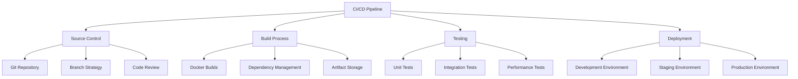

# CI/CD Pipeline

## 1. Introduction

This document provides detailed specifications for the Continuous Integration and Continuous Deployment (CI/CD) pipeline for the Autonomous Trading System (ATS). The CI/CD pipeline ensures that code changes are automatically built, tested, and deployed in a consistent and reliable manner.

## 2. Architecture



## 3. Components

### 3.1 Source Control

#### 3.1.1 Git Repository

The source code for the Autonomous Trading System is stored in a Git repository:

- **Repository Structure**:
  - `src/`: Source code
  - `tests/`: Test code
  - `docs/`: Documentation
  - `deployment/`: Deployment configurations
  - `ci/`: CI/CD configuration files

- **Repository Hosting**:
  - GitHub Enterprise or GitLab for hosting the repository
  - Protected main branch to prevent direct pushes
  - Required status checks before merging

#### 3.1.2 Branch Strategy

The project follows a Git Flow branching strategy:

- **Main Branches**:
  - `main`: Production-ready code
  - `develop`: Integration branch for features

- **Supporting Branches**:
  - `feature/*`: New features
  - `bugfix/*`: Bug fixes
  - `release/*`: Release preparation
  - `hotfix/*`: Urgent fixes for production

- **Branch Naming Convention**:
  - `feature/ATS-123-short-description`
  - `bugfix/ATS-123-short-description`
  - `release/v1.2.3`
  - `hotfix/v1.2.3-short-description`

#### 3.1.3 Code Review

All code changes require review before merging:

- **Pull Request Process**:
  - Create a pull request from feature branch to develop
  - Assign reviewers (at least 2)
  - Address review comments
  - Get approval from all reviewers
  - Merge when all checks pass

- **Code Review Checklist**:
  - Code follows style guide
  - Unit tests are included
  - Documentation is updated
  - No security vulnerabilities
  - Performance considerations addressed

### 3.2 Build Process

#### 3.2.1 CI Server

The CI/CD pipeline is implemented using GitHub Actions:

```yaml
# .github/workflows/ci.yml
name: CI Pipeline

on:
  push:
    branches: [ develop, main, 'release/*', 'hotfix/*' ]
  pull_request:
    branches: [ develop, main ]

jobs:
  build:
    runs-on: ubuntu-latest
    
    steps:
    - uses: actions/checkout@v3
    
    - name: Set up Python
      uses: actions/setup-python@v4
      with:
        python-version: '3.10'
    
    - name: Install dependencies
      run: |
        python -m pip install --upgrade pip
        pip install -r requirements.txt
        pip install -r requirements-dev.txt
    
    - name: Lint with flake8
      run: |
        flake8 src tests
    
    - name: Type check with mypy
      run: |
        mypy src tests
    
    - name: Run unit tests
      run: |
        pytest tests/unit
    
    - name: Build Docker images
      run: |
        docker-compose build
    
    - name: Save Docker images
      run: |
        docker save -o data-acquisition.tar ats/data-acquisition:latest
        docker save -o feature-engineering.tar ats/feature-engineering:latest
        docker save -o model-training.tar ats/model-training:latest
        docker save -o trading-strategy.tar ats/trading-strategy:latest
        docker save -o monitoring.tar ats/monitoring:latest
    
    - name: Upload Docker images as artifacts
      uses: actions/upload-artifact@v3
      with:
        name: docker-images
        path: |
          *.tar
```

#### 3.2.2 Docker Builds

Each component of the system is built as a Docker image:

```yaml
# docker-compose.yml
version: '3.8'

services:
  data-acquisition:
    build:
      context: .
      dockerfile: deployment/docker/data-acquisition.Dockerfile
    image: ats/data-acquisition:latest
  
  feature-engineering:
    build:
      context: .
      dockerfile: deployment/docker/feature-engineering.Dockerfile
    image: ats/feature-engineering:latest
  
  model-training:
    build:
      context: .
      dockerfile: deployment/docker/model-training.Dockerfile
    image: ats/model-training:latest
  
  trading-strategy:
    build:
      context: .
      dockerfile: deployment/docker/trading-strategy.Dockerfile
    image: ats/trading-strategy:latest
  
  monitoring:
    build:
      context: .
      dockerfile: deployment/docker/monitoring.Dockerfile
    image: ats/monitoring:latest
```

#### 3.2.3 Dependency Management

Dependencies are managed using Poetry:

```toml
# pyproject.toml
[tool.poetry]
name = "autonomous-trading-system"
version = "0.1.0"
description = "Autonomous Trading System"
authors = ["Your Name <your.email@example.com>"]

[tool.poetry.dependencies]
python = "^3.10"
pandas = "^2.0.0"
numpy = "^1.24.0"
scikit-learn = "^1.2.0"
tensorflow = "^2.12.0"
xgboost = "^1.7.0"
fastapi = "^0.95.0"
pydantic = "^1.10.0"
prometheus-client = "^0.16.0"
psycopg2-binary = "^2.9.0"
redis = "^4.5.0"
schedule = "^1.2.0"
requests = "^2.28.0"
aiohttp = "^3.8.0"

[tool.poetry.dev-dependencies]
pytest = "^7.3.0"
pytest-cov = "^4.1.0"
flake8 = "^6.0.0"
black = "^23.3.0"
mypy = "^1.2.0"
isort = "^5.12.0"
pre-commit = "^3.2.0"

[build-system]
requires = ["poetry-core>=1.0.0"]
build-backend = "poetry.core.masonry.api"
```

#### 3.2.4 Artifact Storage

Built artifacts are stored in a container registry:

- **Container Registry**:
  - Amazon ECR or GitHub Container Registry
  - Tagged with Git commit hash and branch name
  - Latest tag for most recent build on each branch

### 3.3 Testing

#### 3.3.1 Automated Testing

The CI pipeline includes multiple levels of testing:

```yaml
# .github/workflows/test.yml
name: Test Pipeline

on:
  workflow_run:
    workflows: ["CI Pipeline"]
    types:
      - completed

jobs:
  integration-test:
    runs-on: ubuntu-latest
    if: ${{ github.event.workflow_run.conclusion == 'success' }}
    
    steps:
    - uses: actions/checkout@v3
    
    - name: Set up Python
      uses: actions/setup-python@v4
      with:
        python-version: '3.10'
    
    - name: Install dependencies
      run: |
        python -m pip install --upgrade pip
        pip install -r requirements.txt
        pip install -r requirements-dev.txt
    
    - name: Download Docker images
      uses: actions/download-artifact@v3
      with:
        name: docker-images
        path: .
    
    - name: Load Docker images
      run: |
        docker load -i data-acquisition.tar
        docker load -i feature-engineering.tar
        docker load -i model-training.tar
        docker load -i trading-strategy.tar
        docker load -i monitoring.tar
    
    - name: Start test environment
      run: |
        docker-compose -f docker-compose.test.yml up -d
    
    - name: Run integration tests
      run: |
        pytest tests/integration
    
    - name: Run system tests
      run: |
        pytest tests/system
    
    - name: Stop test environment
      run: |
        docker-compose -f docker-compose.test.yml down
```

#### 3.3.2 Test Coverage

Test coverage is tracked and enforced:

```yaml
# .github/workflows/coverage.yml
name: Coverage Report

on:
  workflow_run:
    workflows: ["Test Pipeline"]
    types:
      - completed

jobs:
  coverage:
    runs-on: ubuntu-latest
    if: ${{ github.event.workflow_run.conclusion == 'success' }}
    
    steps:
    - uses: actions/checkout@v3
    
    - name: Set up Python
      uses: actions/setup-python@v4
      with:
        python-version: '3.10'
    
    - name: Install dependencies
      run: |
        python -m pip install --upgrade pip
        pip install -r requirements.txt
        pip install -r requirements-dev.txt
    
    - name: Generate coverage report
      run: |
        pytest --cov=src --cov-report=xml tests/
    
    - name: Upload coverage to Codecov
      uses: codecov/codecov-action@v3
      with:
        file: ./coverage.xml
        fail_ci_if_error: true
```

#### 3.3.3 Performance Testing

Performance tests are run on a schedule:

```yaml
# .github/workflows/performance.yml
name: Performance Tests

on:
  schedule:
    - cron: '0 0 * * 0'  # Run weekly on Sunday at midnight
  workflow_dispatch:  # Allow manual triggering

jobs:
  performance:
    runs-on: ubuntu-latest
    
    steps:
    - uses: actions/checkout@v3
    
    - name: Set up Python
      uses: actions/setup-python@v4
      with:
        python-version: '3.10'
    
    - name: Install dependencies
      run: |
        python -m pip install --upgrade pip
        pip install -r requirements.txt
        pip install -r requirements-dev.txt
    
    - name: Start test environment
      run: |
        docker-compose -f docker-compose.perf.yml up -d
    
    - name: Run performance tests
      run: |
        pytest tests/performance
    
    - name: Generate performance report
      run: |
        python scripts/generate_performance_report.py
    
    - name: Upload performance report
      uses: actions/upload-artifact@v3
      with:
        name: performance-report
        path: performance-report.html
    
    - name: Stop test environment
      run: |
        docker-compose -f docker-compose.perf.yml down
```

### 3.4 Deployment

#### 3.4.1 Deployment Pipeline

The deployment pipeline is implemented using GitHub Actions:

```yaml
# .github/workflows/deploy.yml
name: Deploy Pipeline

on:
  workflow_run:
    workflows: ["Test Pipeline"]
    branches: [main, develop]
    types:
      - completed
  workflow_dispatch:
    inputs:
      environment:
        description: 'Environment to deploy to'
        required: true
        default: 'development'
        type: choice
        options:
          - development
          - staging
          - production

jobs:
  deploy:
    runs-on: ubuntu-latest
    if: ${{ github.event.workflow_run.conclusion == 'success' || github.event_name == 'workflow_dispatch' }}
    
    environment:
      name: ${{ github.event.inputs.environment || (github.ref == 'refs/heads/main' && 'production' || 'development') }}
    
    steps:
    - uses: actions/checkout@v3
    
    - name: Configure AWS credentials
      uses: aws-actions/configure-aws-credentials@v2
      with:
        aws-access-key-id: ${{ secrets.AWS_ACCESS_KEY_ID }}
        aws-secret-access-key: ${{ secrets.AWS_SECRET_ACCESS_KEY }}
        aws-region: us-east-1
    
    - name: Login to Amazon ECR
      id: login-ecr
      uses: aws-actions/amazon-ecr-login@v1
    
    - name: Download Docker images
      uses: actions/download-artifact@v3
      with:
        name: docker-images
        path: .
    
    - name: Load Docker images
      run: |
        docker load -i data-acquisition.tar
        docker load -i feature-engineering.tar
        docker load -i model-training.tar
        docker load -i trading-strategy.tar
        docker load -i monitoring.tar
    
    - name: Tag and push Docker images
      env:
        ECR_REGISTRY: ${{ steps.login-ecr.outputs.registry }}
        ECR_REPOSITORY: ats
        IMAGE_TAG: ${{ github.sha }}
        ENVIRONMENT: ${{ github.event.inputs.environment || (github.ref == 'refs/heads/main' && 'production' || 'development') }}
      run: |
        docker tag ats/data-acquisition:latest $ECR_REGISTRY/$ECR_REPOSITORY/data-acquisition:$IMAGE_TAG
        docker tag ats/feature-engineering:latest $ECR_REGISTRY/$ECR_REPOSITORY/feature-engineering:$IMAGE_TAG
        docker tag ats/model-training:latest $ECR_REGISTRY/$ECR_REPOSITORY/model-training:$IMAGE_TAG
        docker tag ats/trading-strategy:latest $ECR_REGISTRY/$ECR_REPOSITORY/trading-strategy:$IMAGE_TAG
        docker tag ats/monitoring:latest $ECR_REGISTRY/$ECR_REPOSITORY/monitoring:$IMAGE_TAG
        
        docker tag ats/data-acquisition:latest $ECR_REGISTRY/$ECR_REPOSITORY/data-acquisition:$ENVIRONMENT
        docker tag ats/feature-engineering:latest $ECR_REGISTRY/$ECR_REPOSITORY/feature-engineering:$ENVIRONMENT
        docker tag ats/model-training:latest $ECR_REGISTRY/$ECR_REPOSITORY/model-training:$ENVIRONMENT
        docker tag ats/trading-strategy:latest $ECR_REGISTRY/$ECR_REPOSITORY/trading-strategy:$ENVIRONMENT
        docker tag ats/monitoring:latest $ECR_REGISTRY/$ECR_REPOSITORY/monitoring:$ENVIRONMENT
        
        docker push $ECR_REGISTRY/$ECR_REPOSITORY/data-acquisition:$IMAGE_TAG
        docker push $ECR_REGISTRY/$ECR_REPOSITORY/feature-engineering:$IMAGE_TAG
        docker push $ECR_REGISTRY/$ECR_REPOSITORY/model-training:$IMAGE_TAG
        docker push $ECR_REGISTRY/$ECR_REPOSITORY/trading-strategy:$IMAGE_TAG
        docker push $ECR_REGISTRY/$ECR_REPOSITORY/monitoring:$IMAGE_TAG
        
        docker push $ECR_REGISTRY/$ECR_REPOSITORY/data-acquisition:$ENVIRONMENT
        docker push $ECR_REGISTRY/$ECR_REPOSITORY/feature-engineering:$ENVIRONMENT
        docker push $ECR_REGISTRY/$ECR_REPOSITORY/model-training:$ENVIRONMENT
        docker push $ECR_REGISTRY/$ECR_REPOSITORY/trading-strategy:$ENVIRONMENT
        docker push $ECR_REGISTRY/$ECR_REPOSITORY/monitoring:$ENVIRONMENT
    
    - name: Update Kubernetes manifests
      env:
        ECR_REGISTRY: ${{ steps.login-ecr.outputs.registry }}
        ECR_REPOSITORY: ats
        IMAGE_TAG: ${{ github.sha }}
        ENVIRONMENT: ${{ github.event.inputs.environment || (github.ref == 'refs/heads/main' && 'production' || 'development') }}
      run: |
        # Update image tags in Kubernetes manifests
        sed -i "s|image: .*data-acquisition.*|image: $ECR_REGISTRY/$ECR_REPOSITORY/data-acquisition:$IMAGE_TAG|g" deployment/kubernetes/$ENVIRONMENT/*.yaml
        sed -i "s|image: .*feature-engineering.*|image: $ECR_REGISTRY/$ECR_REPOSITORY/feature-engineering:$IMAGE_TAG|g" deployment/kubernetes/$ENVIRONMENT/*.yaml
        sed -i "s|image: .*model-training.*|image: $ECR_REGISTRY/$ECR_REPOSITORY/model-training:$IMAGE_TAG|g" deployment/kubernetes/$ENVIRONMENT/*.yaml
        sed -i "s|image: .*trading-strategy.*|image: $ECR_REGISTRY/$ECR_REPOSITORY/trading-strategy:$IMAGE_TAG|g" deployment/kubernetes/$ENVIRONMENT/*.yaml
        sed -i "s|image: .*monitoring.*|image: $ECR_REGISTRY/$ECR_REPOSITORY/monitoring:$IMAGE_TAG|g" deployment/kubernetes/$ENVIRONMENT/*.yaml
    
    - name: Deploy to Kubernetes
      uses: azure/k8s-deploy@v1
      with:
        namespace: ats-${{ github.event.inputs.environment || (github.ref == 'refs/heads/main' && 'production' || 'development') }}
        manifests: |
          deployment/kubernetes/${{ github.event.inputs.environment || (github.ref == 'refs/heads/main' && 'production' || 'development') }}/*.yaml
        images: |
          ${{ steps.login-ecr.outputs.registry }}/${{ env.ECR_REPOSITORY }}/data-acquisition:${{ github.sha }}
          ${{ steps.login-ecr.outputs.registry }}/${{ env.ECR_REPOSITORY }}/feature-engineering:${{ github.sha }}
          ${{ steps.login-ecr.outputs.registry }}/${{ env.ECR_REPOSITORY }}/model-training:${{ github.sha }}
          ${{ steps.login-ecr.outputs.registry }}/${{ env.ECR_REPOSITORY }}/trading-strategy:${{ github.sha }}
          ${{ steps.login-ecr.outputs.registry }}/${{ env.ECR_REPOSITORY }}/monitoring:${{ github.sha }}
```

#### 3.4.2 Environment Configuration

Each environment has its own configuration:

```yaml
# deployment/kubernetes/development/configmap.yaml
apiVersion: v1
kind: ConfigMap
metadata:
  name: ats-config
  namespace: ats-development
data:
  environment: "development"
  log_level: "DEBUG"
  prometheus_port: "9090"
  grafana_port: "3000"
  max_active_tickers: "50"
  focus_universe_size: "20"
  risk_percentage: "0.01"
  max_position_size: "1000.0"
```

```yaml
# deployment/kubernetes/production/configmap.yaml
apiVersion: v1
kind: ConfigMap
metadata:
  name: ats-config
  namespace: ats-production
data:
  environment: "production"
  log_level: "INFO"
  prometheus_port: "9090"
  grafana_port: "3000"
  max_active_tickers: "150"
  focus_universe_size: "40"
  risk_percentage: "0.02"
  max_position_size: "2500.0"
```

#### 3.4.3 Deployment Verification

After deployment, verification tests are run:

```yaml
# .github/workflows/verify.yml
name: Verify Deployment

on:
  workflow_run:
    workflows: ["Deploy Pipeline"]
    types:
      - completed

jobs:
  verify:
    runs-on: ubuntu-latest
    if: ${{ github.event.workflow_run.conclusion == 'success' }}
    
    steps:
    - uses: actions/checkout@v3
    
    - name: Configure AWS credentials
      uses: aws-actions/configure-aws-credentials@v2
      with:
        aws-access-key-id: ${{ secrets.AWS_ACCESS_KEY_ID }}
        aws-secret-access-key: ${{ secrets.AWS_SECRET_ACCESS_KEY }}
        aws-region: us-east-1
    
    - name: Set up kubectl
      uses: azure/setup-kubectl@v3
      with:
        version: 'latest'
    
    - name: Set up kubeconfig
      run: |
        aws eks update-kubeconfig --name ats-cluster --region us-east-1
    
    - name: Verify deployment
      run: |
        # Check that all pods are running
        kubectl get pods -n ats-${{ github.event.workflow_run.head_branch == 'main' && 'production' || 'development' }} | grep -v Running
        
        # Check that all services are available
        kubectl get services -n ats-${{ github.event.workflow_run.head_branch == 'main' && 'production' || 'development' }}
        
        # Run smoke tests
        python scripts/run_smoke_tests.py --environment ${{ github.event.workflow_run.head_branch == 'main' && 'production' || 'development' }}
```

### 3.5 Monitoring and Alerting

#### 3.5.1 CI/CD Pipeline Monitoring

The CI/CD pipeline is monitored using GitHub Actions dashboard and Slack notifications:

```yaml
# .github/workflows/notify.yml
name: Notify

on:
  workflow_run:
    workflows:
      - "CI Pipeline"
      - "Test Pipeline"
      - "Deploy Pipeline"
      - "Verify Deployment"
    types:
      - completed

jobs:
  notify:
    runs-on: ubuntu-latest
    
    steps:
    - name: Send Slack notification
      uses: slackapi/slack-github-action@v1.23.0
      with:
        payload: |
          {
            "text": "GitHub Action ${{ github.event.workflow_run.name }} ${{ github.event.workflow_run.conclusion }}",
            "blocks": [
              {
                "type": "section",
                "text": {
                  "type": "mrkdwn",
                  "text": "*GitHub Action ${{ github.event.workflow_run.name }} ${{ github.event.workflow_run.conclusion }}*\n${{ github.event.workflow_run.html_url }}"
                }
              },
              {
                "type": "section",
                "fields": [
                  {
                    "type": "mrkdwn",
                    "text": "*Repository:*\n${{ github.repository }}"
                  },
                  {
                    "type": "mrkdwn",
                    "text": "*Branch:*\n${{ github.event.workflow_run.head_branch }}"
                  },
                  {
                    "type": "mrkdwn",
                    "text": "*Commit:*\n${{ github.event.workflow_run.head_sha }}"
                  },
                  {
                    "type": "mrkdwn",
                    "text": "*Status:*\n${{ github.event.workflow_run.conclusion }}"
                  }
                ]
              }
            ]
          }
      env:
        SLACK_WEBHOOK_URL: ${{ secrets.SLACK_WEBHOOK_URL }}
        SLACK_WEBHOOK_TYPE: INCOMING_WEBHOOK
```

#### 3.5.2 Pipeline Metrics

Pipeline metrics are collected and visualized:

- **Metrics Collected**:
  - Build time
  - Test coverage
  - Number of tests
  - Number of failures
  - Deployment time
  - Deployment frequency

- **Visualization**:
  - GitHub Actions dashboard
  - Custom dashboard in Grafana
  - Weekly reports

## 4. Implementation Steps

1. **Set up Source Control**
   - Create Git repository
   - Configure branch protection
   - Set up code review process

2. **Configure CI Server**
   - Set up GitHub Actions
   - Configure workflows for build, test, and deploy
   - Set up secrets for API keys and credentials

3. **Implement Build Process**
   - Create Dockerfiles for each component
   - Configure Docker Compose for local development
   - Set up dependency management with Poetry

4. **Set up Testing**
   - Configure automated tests in CI pipeline
   - Set up test coverage reporting
   - Implement performance tests

5. **Configure Deployment**
   - Set up deployment pipeline
   - Configure environment-specific settings
   - Implement deployment verification

6. **Set up Monitoring**
   - Configure pipeline monitoring
   - Set up Slack notifications
   - Create dashboards for pipeline metrics

## 5. Conclusion

This document provides detailed specifications for the CI/CD pipeline of the Autonomous Trading System. By implementing this pipeline, we can ensure that code changes are automatically built, tested, and deployed in a consistent and reliable manner.

The CI/CD pipeline is designed to be robust, scalable, and secure, with proper monitoring and alerting in place to ensure that any issues are detected and addressed quickly.