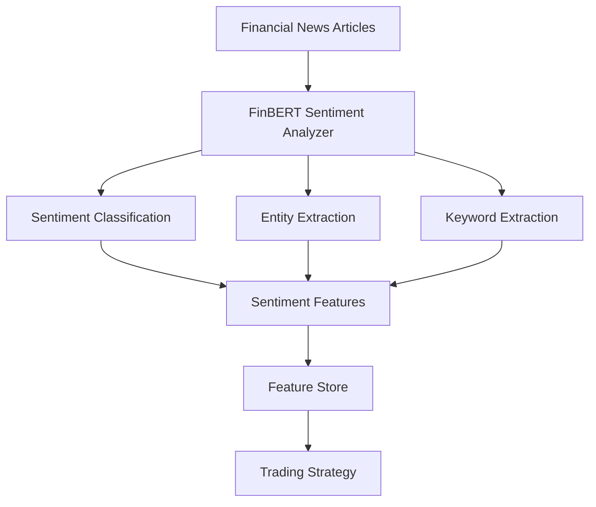

# FinBERT Sentiment Analysis

## Overview

The FinBERT Sentiment Analysis component is a specialized natural language processing (NLP) module designed to analyze sentiment in financial news and text. It leverages the FinBERT model, which is a pre-trained BERT model fine-tuned specifically for financial text. This component enables the Autonomous Trading System to incorporate market sentiment as a feature in trading strategies, providing an additional dimension of market analysis beyond traditional price and volume data.

## Architecture

The sentiment analysis pipeline consists of several key components:

1. **FinBERT Model**: A transformer-based language model fine-tuned on financial text to classify sentiment as positive, negative, or neutral.
2. **Entity Extraction**: Uses spaCy to identify and extract named entities from text, such as companies, people, and locations.
3. **Keyword Extraction**: Identifies important keywords and topics in financial news.
4. **Sentiment Feature Generation**: Calculates various sentiment metrics over different time windows.
5. **Database Integration**: Stores sentiment analysis results and features in TimescaleDB.



## Key Features

### Sentiment Analysis

- **Multi-class Sentiment Classification**: Classifies text as positive, negative, or neutral with confidence scores.
- **Sentiment Scoring**: Converts classification to a continuous score between -1 (negative) and 1 (positive).
- **Batch Processing**: Efficiently processes large volumes of news articles in batches.
- **GPU Acceleration**: Supports GPU acceleration for faster processing.

### Entity and Keyword Extraction

- **Named Entity Recognition**: Identifies companies, people, locations, and other entities.
- **Keyword Extraction**: Identifies important topics and themes in financial news.
- **Symbol Association**: Links news articles to relevant ticker symbols.

### Feature Engineering

- **Multi-timeframe Analysis**: Calculates sentiment features across different time windows (1, 3, 7, 14, 30 days).
- **Statistical Features**: Computes average sentiment, standard deviation, min/max, and sentiment change.
- **Confidence Weighting**: Incorporates model confidence in feature calculations.

### Integration

- **Database Storage**: Stores sentiment analysis results and features in TimescaleDB.
- **Feature Store Integration**: Makes sentiment features available to the feature store for model training.
- **Continuous Processing**: Supports both historical analysis and continuous processing of new articles.

## Implementation Details

### FinBERTSentimentAnalyzer Class

The `FinBERTSentimentAnalyzer` class is the main implementation of the sentiment analysis component. It provides methods for analyzing sentiment in financial text and generating sentiment features.

```python
analyzer = FinBERTSentimentAnalyzer(
    model_name="ProsusAI/finbert",
    device="cuda",  # or "cpu"
    batch_size=16,
    max_length=512,
    use_spacy=True
)

# Analyze a single text
result = analyzer.analyze_text("The company reported better than expected earnings, with revenue growth of 15%.")

# Analyze news articles from the database
results_df = analyzer.analyze_news_articles(
    start_date=datetime(2023, 1, 1),
    end_date=datetime(2023, 1, 31),
    symbols=["AAPL", "MSFT", "GOOGL"],
    store=True
)

# Get sentiment features for symbols
features_df = analyzer.get_sentiment_features(
    symbols=["AAPL", "MSFT", "GOOGL"],
    start_date=datetime(2023, 1, 1),
    end_date=datetime(2023, 1, 31),
    window_sizes=[1, 3, 7, 14, 30]
)
```

### Database Schema

The sentiment analysis component uses two main tables in the database:

1. **news_articles**: Stores news articles with metadata.
2. **news_sentiment**: Stores sentiment analysis results for each article and symbol.

The sentiment features are stored in the `features` table with the feature group `sentiment`.

## Usage

### Running Sentiment Analysis

The sentiment analysis component can be run using the `run_sentiment_analysis.py` script:

```bash
# Run historical sentiment analysis for all active tickers
python src/scripts/run_sentiment_analysis.py --days 30

# Run for specific symbols
python src/scripts/run_sentiment_analysis.py --symbols AAPL,MSFT,GOOGL --days 30

# Run continuously
python src/scripts/run_sentiment_analysis.py --continuous

# Use GPU acceleration
python src/scripts/run_sentiment_analysis.py --gpu

# Customize window sizes for feature calculation
python src/scripts/run_sentiment_analysis.py --window-sizes 1,5,10,20
```

### Integration with Feature Engineering

The sentiment analysis component is integrated with the feature engineering pipeline and can be run as part of the `run_feature_engineering.py` script:

```bash
# Run feature engineering with sentiment analysis
python src/scripts/run_feature_engineering.py

# Skip sentiment analysis
python src/scripts/run_feature_engineering.py --skip-sentiment

# Use GPU for sentiment analysis
python src/scripts/run_feature_engineering.py --gpu
```

## Performance Considerations

### Computational Requirements

- **CPU Mode**: Processing 1,000 news articles takes approximately 5-10 minutes on a modern CPU.
- **GPU Mode**: Processing 1,000 news articles takes approximately 30-60 seconds on a modern GPU.
- **Memory Usage**: The FinBERT model requires approximately 1-2 GB of memory.

### Optimization Techniques

- **Batch Processing**: Articles are processed in batches to optimize throughput.
- **Caching**: Frequently accessed sentiment data is cached to reduce database load.
- **Incremental Processing**: Only new articles are processed in continuous mode.
- **Parallel Processing**: Multiple symbols can be processed in parallel.

## Trading Strategy Integration

Sentiment features can be integrated into trading strategies in several ways:

1. **Sentiment Trend Following**: Enter positions when sentiment is trending positively.
2. **Sentiment Reversal**: Enter positions when sentiment is extremely negative but showing signs of improvement.
3. **Sentiment Confirmation**: Use sentiment as a confirmation signal for price-based strategies.
4. **Sentiment Divergence**: Identify divergences between price action and sentiment.
5. **Multi-factor Models**: Combine sentiment features with price, volume, and other features in machine learning models.

Example of a simple sentiment-based trading rule:

```python
# Pseudo-code for a sentiment-based trading rule
if (sentiment_avg_7d > 0.2 and sentiment_change_3d > 0.1):
    # Strong positive sentiment with recent improvement
    enter_long_position(symbol)
elif (sentiment_avg_7d < -0.2 and sentiment_change_3d < -0.1):
    # Strong negative sentiment with recent deterioration
    enter_short_position(symbol)
```

## Future Enhancements

1. **Multi-lingual Support**: Add support for financial news in multiple languages.
2. **Topic Modeling**: Implement topic modeling to categorize news articles.
3. **Aspect-based Sentiment Analysis**: Analyze sentiment towards specific aspects of a company (e.g., products, management, financials).
4. **Social Media Integration**: Extend sentiment analysis to social media sources like Twitter and Reddit.
5. **Custom Fine-tuning**: Fine-tune the FinBERT model on domain-specific financial text.
6. **Explainability**: Implement techniques to explain sentiment predictions.

## Conclusion

The FinBERT Sentiment Analysis component provides a powerful way to incorporate market sentiment into trading strategies. By analyzing financial news and extracting sentiment features, it enables the Autonomous Trading System to capture market sentiment as a predictive signal. This can help identify trading opportunities that might not be apparent from price and volume data alone, potentially improving the performance and robustness of trading strategies.