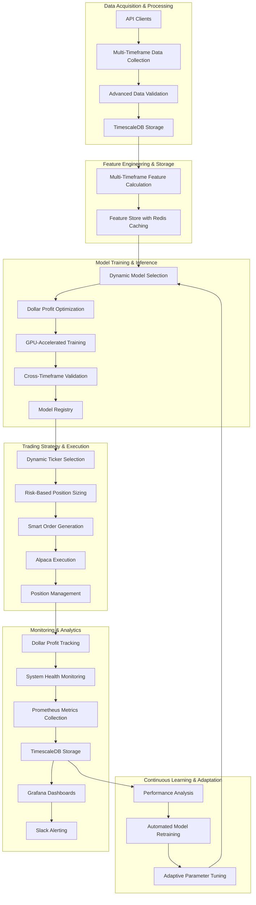
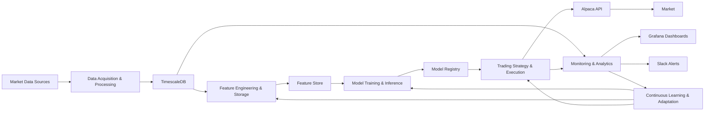

# Autonomous Trading System Architecture

## Executive Summary

This document provides a comprehensive architectural overview of our Autonomous Trading System (ATS), a sophisticated platform designed to maximize dollar profit through advanced market data analysis, dynamic timeframe selection, intelligent position sizing, and optimized trade execution. The system leverages state-of-the-art machine learning models and real-time market data to make trading decisions across multiple timeframes and asset classes.

The ATS is built with a modular architecture that enables continuous learning and adaptation to changing market conditions. Each component is designed for high performance, reliability, and scalability, with extensive monitoring and risk management capabilities.

## System Architecture Overview

The Autonomous Trading System follows a modular architecture with six primary subsystems:

1. **Data Acquisition & Processing**: Gathers and validates market data from various sources
2. **Feature Engineering & Storage**: Calculates and stores features from raw market data
3. **Model Training & Inference**: Trains and manages machine learning models
4. **Trading Strategy & Execution**: Executes trades based on model predictions
5. **Monitoring & Analytics**: Tracks system performance and health
6. **Continuous Learning & Adaptation**: Adapts the system to changing market conditions

## Key Subsystems

### 1. Data Acquisition & Processing

The Data Acquisition & Processing subsystem is responsible for gathering market data from various sources, validating it, and storing it in TimescaleDB for further processing.

**Key Components:**
- **API Clients**: Interfaces with Polygon.io, Unusual Whales, and Alpaca APIs
- **Multi-Timeframe Data Collection**: Collects data across multiple timeframes (1-min, 5-min, 15-min, hourly, daily)
- **Advanced Data Validation**: Ensures data quality and consistency
- **TimescaleDB Storage**: Efficiently stores time-series market data

**Data Types Collected:**
- Price data (OHLCV)
- Quotes data (bid/ask)
- Trades data
- Options flow data
- Market microstructure data

### 2. Feature Engineering & Storage

The Feature Engineering & Storage subsystem calculates various features from raw market data and stores them for use in machine learning models.

**Key Components:**
- **Multi-Timeframe Feature Calculation**: Computes features across multiple timeframes
- **Feature Store**: Stores and manages features with Redis caching
- **Feature Importance Analyzer**: Tracks feature importance over time

**Feature Categories:**
- Price-based features (moving averages, price ratios, etc.)
- Volume-based features (volume profiles, relative volume, etc.)
- Volatility features (ATR, Bollinger Bands, etc.)
- Momentum features (RSI, MACD, etc.)
- Trend features (ADX, directional movement, etc.)
- Pattern recognition features (candlestick patterns, etc.)
- Market microstructure features (order book imbalance, etc.)

### 3. Model Training & Inference

The Model Training & Inference subsystem implements various machine learning models for predicting price movements and optimizing dollar profit.

**Key Components:**
- **Dynamic Model Selection**: Selects optimal models based on market conditions
- **Dollar Profit Optimization**: Optimizes models for maximum dollar profit
- **GPU-Accelerated Training**: Leverages GPU acceleration for model training
- **Cross-Timeframe Validation**: Validates models across multiple timeframes
- **Model Registry**: Manages model versions and metadata

**Model Types:**
- XGBoost with custom dollar profit objective function
- LSTM with multi-timeframe inputs
- Multi-head attention models
- Ensemble models

### 4. Trading Strategy & Execution

The Trading Strategy & Execution subsystem handles the actual trading process, from ticker selection to order execution.

**Key Components:**
- **Dynamic Ticker Selection**: Selects promising tickers using tiered approach
- **Risk-Based Position Sizing**: Calculates position sizes based on risk parameters
- **Smart Order Generation**: Generates orders with optimal parameters
- **Alpaca Integration**: Executes trades through Alpaca API
- **Position Management**: Manages positions with adaptive stop-loss and profit targets

**Key Features:**
- Tiered ticker selection (Primary, Active, Focus universes)
- Risk-based position sizing with 2% risk rule
- Smart order type selection
- Adaptive stop-loss and profit targets
- Peak detection for optimal exit timing

### 5. Monitoring & Analytics

The Monitoring & Analytics subsystem tracks system performance and health.

**Key Components:**
- **Dollar Profit Tracking**: Tracks dollar profit across various dimensions
- **System Health Monitoring**: Monitors system components and resources
- **Prometheus Metrics Collection**: Collects system metrics
- **TimescaleDB Storage**: Stores metrics for historical analysis
- **Grafana Dashboards**: Visualizes performance and health metrics
- **Slack Alerting**: Sends alerts for critical events

**Key Metrics:**
- Dollar profit (total, per ticker, per timeframe)
- Risk-adjusted performance metrics
- System resource utilization
- API call statistics
- Error rates

### 6. Continuous Learning & Adaptation

The Continuous Learning & Adaptation subsystem ensures the system adapts to changing market conditions.

**Key Components:**
- **Performance Analysis**: Analyzes trading performance
- **Automated Model Retraining**: Retrains models based on performance
- **Adaptive Parameter Tuning**: Adjusts parameters based on market conditions
- **Market Regime Detection**: Identifies market regimes for strategy adaptation

**Key Features:**
- Automated model retraining
- Feature importance tracking
- Adaptive parameter tuning
- Market regime-based adjustments

## Data Flow

The data flows through the system as follows:

## Operational Workflow

The system operates according to the following workflow:

1. **Data Acquisition Phase**:
   - Scheduled data collection jobs run at regular intervals
   - Market data is collected, validated, and stored in TimescaleDB

2. **Feature Engineering Phase**:
   - Features are calculated from raw market data
   - Features are stored in the feature store with Redis caching

3. **Model Training Phase**:
   - Models are trained with dollar profit optimization
   - Models are validated across timeframes
   - Models are registered in the model registry

4. **Trading Strategy Phase**:
   - Dynamic ticker selection identifies promising tickers
   - Optimal timeframe is selected for each ticker
   - Position sizes are calculated based on risk parameters
   - Orders are generated and executed through Alpaca API
   - Positions are managed with adaptive stop-loss and profit targets

5. **Monitoring Phase**:
   - System performance and health are monitored
   - Metrics are collected and visualized
   - Alerts are sent for critical events

6. **Continuous Learning Phase**:
   - Trading performance is analyzed
   - Models are retrained based on performance
   - Parameters are adjusted based on market conditions

## Technical Requirements

### Hardware Requirements

- NVIDIA GPU with CUDA support (preferably NVIDIA GH200 Grace Hopper Superchip)
- 32+ GB RAM
- 1+ TB SSD storage
- High-speed internet connection

### Software Requirements

- Python 3.8+
- Docker and Docker Compose
- NVIDIA Container Toolkit
- TimescaleDB
- Redis
- Prometheus
- Grafana
- TensorFlow or PyTorch
- XGBoost
- Pandas, NumPy, Scikit-learn
- Alpaca SDK

### API Requirements

- Polygon.io API key
- Unusual Whales API key
- Alpaca API key and secret

## Key Features

- **Multi-timeframe Analysis**: Analyzes data across multiple timeframes (1-min, 5-min, 15-min, hourly, daily)
- **Dollar Profit Optimization**: Optimizes for absolute dollar profit rather than percentage returns
- **Dynamic Ticker Selection**: Selects the most promising tickers from a large universe
- **Risk-Based Position Sizing**: Sizes positions based on risk parameters
- **Adaptive Exit Timing**: Identifies optimal exit points based on market conditions
- **Comprehensive Monitoring**: Tracks system performance and health
- **Continuous Learning**: Adapts to changing market conditions

## Conclusion

The Autonomous Trading System is a sophisticated, adaptive trading platform that combines advanced machine learning techniques with robust trading strategies to maximize dollar profit while managing risk effectively. Its modular architecture allows for incremental improvements to each component while maintaining the overall integrity and functionality of the system.

By leveraging real-time market data, dynamic timeframe selection, intelligent position sizing, and optimized trade execution, the system can adapt to changing market conditions and consistently generate profits while managing risk.