# Autonomous Trading System Component Reference

## Overview

This document provides a comprehensive technical reference for all major components of the Autonomous Trading System (ATS). Each component is described in detail, including its purpose, architecture, interfaces, and implementation details. This reference serves as a guide for developers working on the system, providing the information needed to understand, extend, or modify each component.

## Table of Contents

1. [Data Acquisition & Processing Components](#data-acquisition--processing-components)
2. [Feature Engineering & Storage Components](#feature-engineering--storage-components)
3. [Model Training & Inference Components](#model-training--inference-components)
4. [Trading Strategy & Execution Components](#trading-strategy--execution-components)
5. [Monitoring & Analytics Components](#monitoring--analytics-components)
6. [Continuous Learning & Adaptation Components](#continuous-learning--adaptation-components)
7. [CI/CD Pipeline Components](#cicd-pipeline-components)
8. [Utility Components](#utility-components)

## Data Acquisition & Processing Components

### PolygonClient

**Purpose**: Provides a high-performance interface to the Polygon.io API for retrieving market data.

**Architecture**:
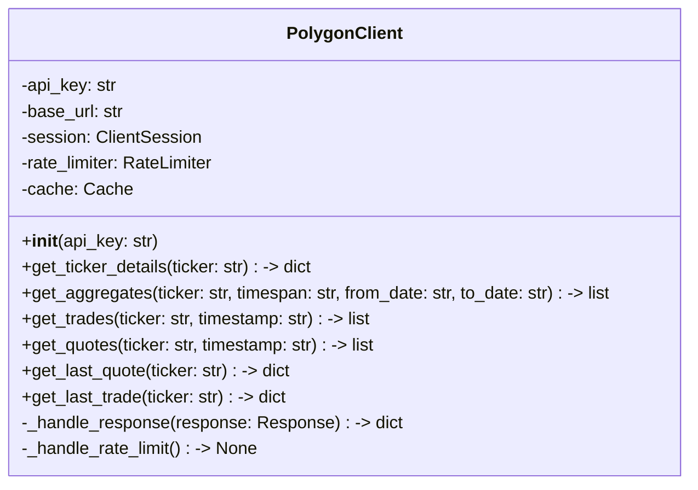
```mermaid
classDiagram
    class PolygonClient {
        -api_key: str
        -base_url: str
        -session: ClientSession
        -rate_limiter: RateLimiter
        -cache: Cache
        +__init__(api_key: str)
        +get_ticker_details(ticker: str) -> dict
        +get_aggregates(ticker: str, timespan: str, from_date: str, to_date: str) -> list
        +get_trades(ticker: str, timestamp: str) -> list
        +get_quotes(ticker: str, timestamp: str) -> list
        +get_last_quote(ticker: str) -> dict
        +get_last_trade(ticker: str) -> dict
        -_handle_response(response: Response) -> dict
        -_handle_rate_limit() -> None
    }
```

**Interfaces**:
- **Input**: API requests with parameters (ticker, timespan, dates, etc.)
- **Output**: Structured market data (ticker details, price bars, trades, quotes)

**Implementation Details**:
- Uses connection pooling for efficient HTTP connections
- Implements rate limiting to avoid API throttling
- Includes circuit breaker pattern for resilience
- Caches frequently accessed data
- Handles API errors with exponential backoff retry

**Example Usage**:
```python
client = PolygonClient(api_key="your_api_key")
ticker_details = client.get_ticker_details("AAPL")
price_bars = client.get_aggregates("AAPL", "minute", "2023-01-01", "2023-01-02")
```

### UnusualWhalesClient

**Purpose**: Provides an interface to the Unusual Whales API for retrieving options flow data.

**Architecture**:
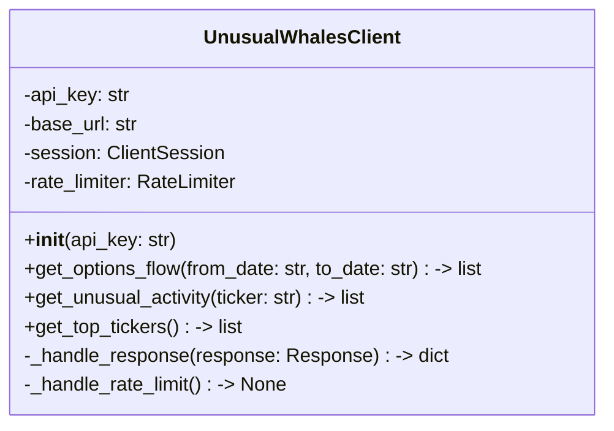
```mermaid
classDiagram
    class UnusualWhalesClient {
        -api_key: str
        -base_url: str
        -session: ClientSession
        -rate_limiter: RateLimiter
        +__init__(api_key: str)
        +get_options_flow(from_date: str, to_date: str) -> list
        +get_unusual_activity(ticker: str) -> list
        +get_top_tickers() -> list
        -_handle_response(response: Response) -> dict
        -_handle_rate_limit() -> None
    }
```

**Interfaces**:
- **Input**: API requests with parameters (dates, ticker, etc.)
- **Output**: Structured options flow data

**Implementation Details**:
- Uses connection pooling for efficient HTTP connections
- Implements rate limiting to avoid API throttling
- Includes circuit breaker pattern for resilience
- Handles API errors with exponential backoff retry

**Example Usage**:
```python
client = UnusualWhalesClient(api_key="your_api_key")
options_flow = client.get_options_flow("2023-01-01", "2023-01-02")
unusual_activity = client.get_unusual_activity("AAPL")
```

### DataPipelineScheduler

**Purpose**: Orchestrates the data collection process, scheduling various data collection jobs at appropriate intervals.

**Architecture**:
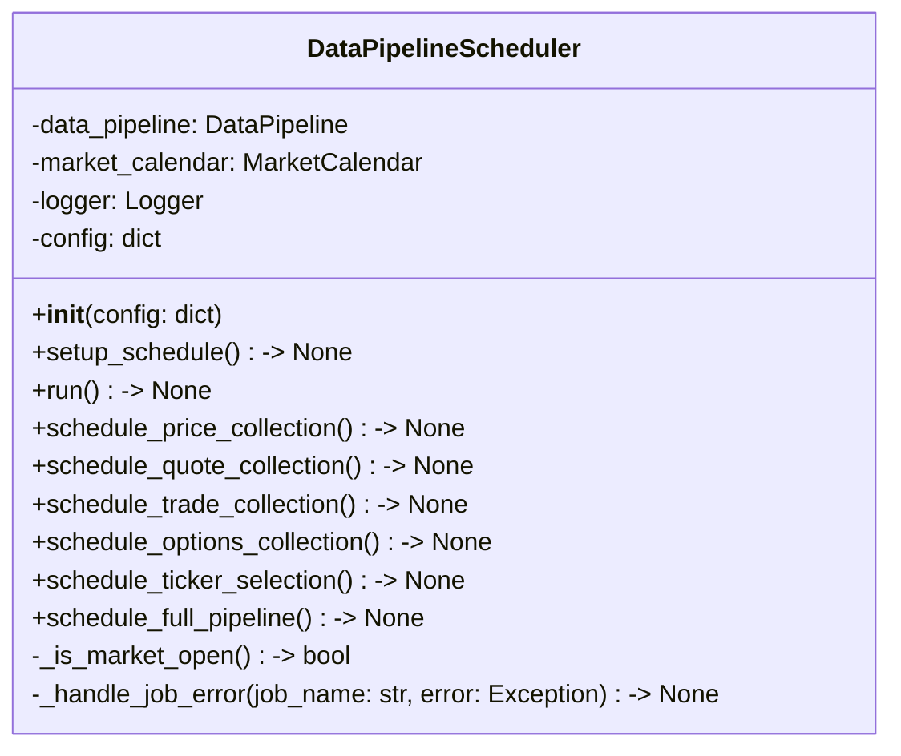
```mermaid
classDiagram
    class DataPipelineScheduler {
        -data_pipeline: DataPipeline
        -market_calendar: MarketCalendar
        -logger: Logger
        -config: dict
        +__init__(config: dict)
        +setup_schedule() -> None
        +run() -> None
        +schedule_price_collection() -> None
        +schedule_quote_collection() -> None
        +schedule_trade_collection() -> None
        +schedule_options_collection() -> None
        +schedule_ticker_selection() -> None
        +schedule_full_pipeline() -> None
        -_is_market_open() -> bool
        -_handle_job_error(job_name: str, error: Exception) -> None
    }
```

**Interfaces**:
- **Input**: Configuration parameters (schedule intervals, market hours, etc.)
- **Output**: Scheduled data collection jobs

**Implementation Details**:
- Uses the `schedule` library for cron-like scheduling
- Checks market calendar to only run during market hours
- Implements error handling for job failures
- Logs job execution status and errors
- Supports different schedules for different data types

**Example Usage**:
```python
scheduler = DataPipelineScheduler(config={
    "market_hours_only": True,
    "price_interval_minutes": 60,
    "quote_interval_minutes": 15,
    "trade_interval_minutes": 30,
    "options_interval_minutes": 120
})
scheduler.setup_schedule()
scheduler.run()
```

### MultiTimeframeDataCollector

**Purpose**: Collects market data for multiple timeframes in parallel.

**Architecture**:
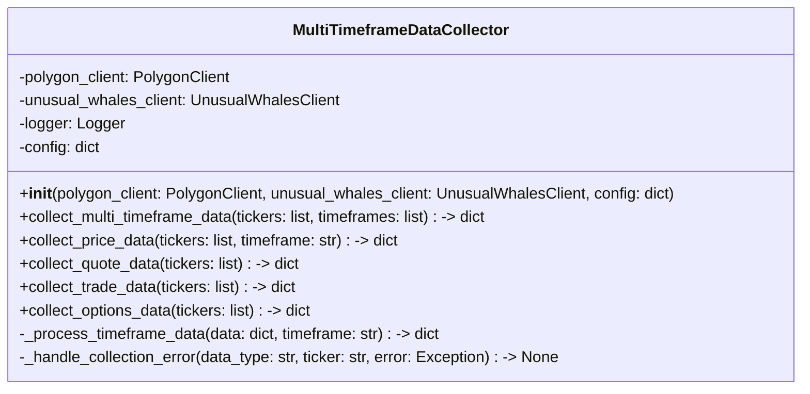
```mermaid
classDiagram
    class MultiTimeframeDataCollector {
        -polygon_client: PolygonClient
        -unusual_whales_client: UnusualWhalesClient
        -logger: Logger
        -config: dict
        +__init__(polygon_client: PolygonClient, unusual_whales_client: UnusualWhalesClient, config: dict)
        +collect_multi_timeframe_data(tickers: list, timeframes: list) -> dict
        +collect_price_data(tickers: list, timeframe: str) -> dict
        +collect_quote_data(tickers: list) -> dict
        +collect_trade_data(tickers: list) -> dict
        +collect_options_data(tickers: list) -> dict
        -_process_timeframe_data(data: dict, timeframe: str) -> dict
        -_handle_collection_error(data_type: str, ticker: str, error: Exception) -> None
    }
```

**Interfaces**:
- **Input**: List of tickers and timeframes
- **Output**: Multi-timeframe market data

**Implementation Details**:
- Uses thread pool for parallel data collection
- Handles API errors with fallback mechanisms
- Processes data for different timeframes
- Optimizes API calls to minimize rate limiting

**Example Usage**:
```python
collector = MultiTimeframeDataCollector(
    polygon_client=polygon_client,
    unusual_whales_client=unusual_whales_client,
    config={"max_threads": 10}
)
data = collector.collect_multi_timeframe_data(
    tickers=["AAPL", "MSFT", "GOOGL"],
    timeframes=["1m", "5m", "15m", "1h"]
)
```

### DataValidator

**Purpose**: Validates market data to ensure quality and consistency.

**Architecture**:
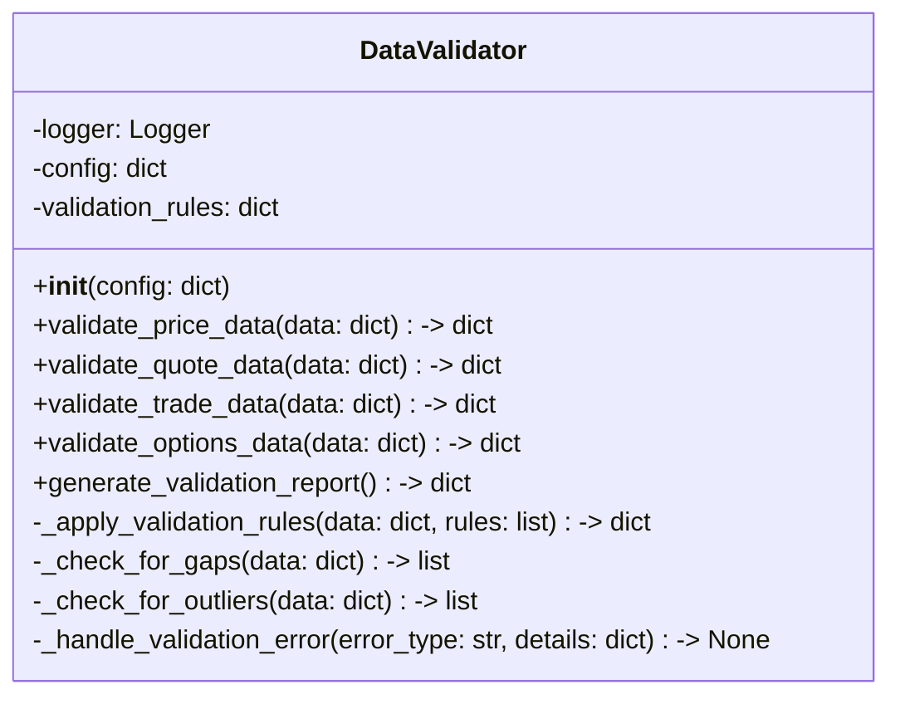
```mermaid
classDiagram
    class DataValidator {
        -logger: Logger
        -config: dict
        -validation_rules: dict
        +__init__(config: dict)
        +validate_price_data(data: dict) -> dict
        +validate_quote_data(data: dict) -> dict
        +validate_trade_data(data: dict) -> dict
        +validate_options_data(data: dict) -> dict
        +generate_validation_report() -> dict
        -_apply_validation_rules(data: dict, rules: list) -> dict
        -_check_for_gaps(data: dict) -> list
        -_check_for_outliers(data: dict) -> list
        -_handle_validation_error(error_type: str, details: dict) -> None
    }
```

**Interfaces**:
- **Input**: Raw market data
- **Output**: Validated market data with quality metrics

**Implementation Details**:
- Implements various validation rules (completeness, consistency, etc.)
- Checks for data gaps and outliers
- Generates validation reports
- Supports strict and lenient validation modes
- Handles validation errors with configurable actions

**Example Usage**:
```python
validator = DataValidator(config={"strict_mode": True})
validated_data = validator.validate_price_data(price_data)
validation_report = validator.generate_validation_report()
```

### TimescaleDBManager

**Purpose**: Manages the storage and retrieval of market data in TimescaleDB.

**Architecture**:
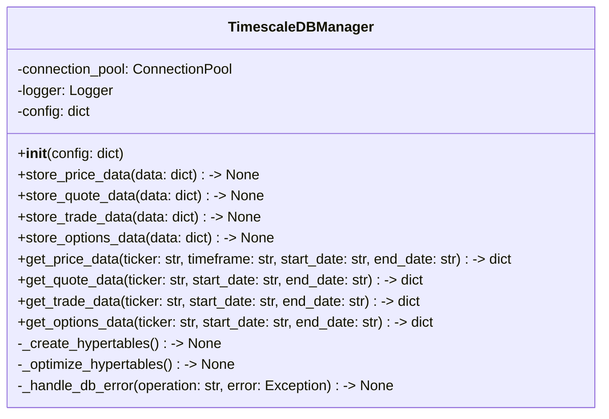
```mermaid
classDiagram
    class TimescaleDBManager {
        -connection_pool: ConnectionPool
        -logger: Logger
        -config: dict
        +__init__(config: dict)
        +store_price_data(data: dict) -> None
        +store_quote_data(data: dict) -> None
        +store_trade_data(data: dict) -> None
        +store_options_data(data: dict) -> None
        +get_price_data(ticker: str, timeframe: str, start_date: str, end_date: str) -> dict
        +get_quote_data(ticker: str, start_date: str, end_date: str) -> dict
        +get_trade_data(ticker: str, start_date: str, end_date: str) -> dict
        +get_options_data(ticker: str, start_date: str, end_date: str) -> dict
        -_create_hypertables() -> None
        -_optimize_hypertables() -> None
        -_handle_db_error(operation: str, error: Exception) -> None
    }
```

**Interfaces**:
- **Input**: Market data to store or query parameters
- **Output**: Stored data confirmation or retrieved market data

**Implementation Details**:
- Uses connection pooling for efficient database connections
- Creates and optimizes hypertables for time-series data
- Implements efficient query patterns for time-series data
- Handles database errors with retry mechanisms
- Supports batch operations for efficient storage

**Example Usage**:
```python
db_manager = TimescaleDBManager(config={
    "host": "localhost",
    "port": 5432,
    "database": "market_data",
    "user": "postgres",
    "password": "password"
})
db_manager.store_price_data(validated_price_data)
historical_data = db_manager.get_price_data(
    ticker="AAPL",
    timeframe="1m",
    start_date="2023-01-01",
    end_date="2023-01-02"
)
```

## Feature Engineering & Storage Components

### FeatureCalculator

**Purpose**: Calculates various features from raw market data.

**Architecture**:
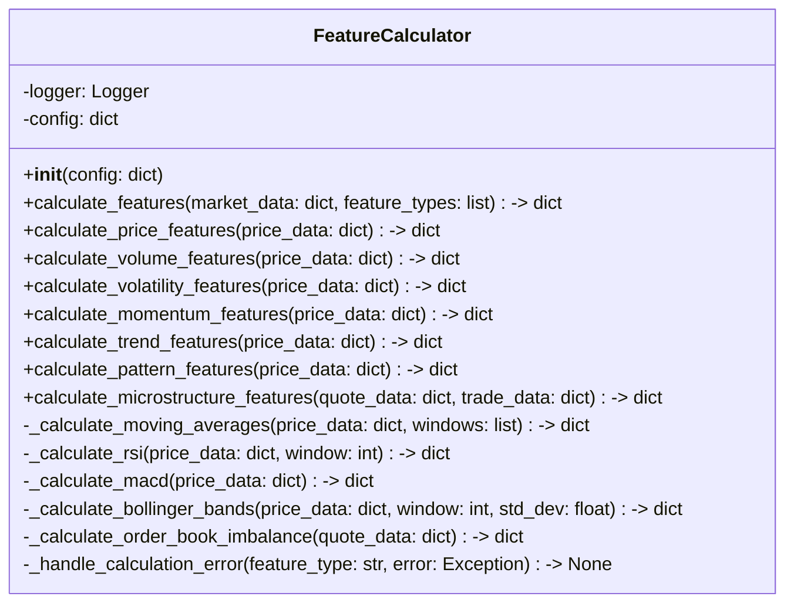
```mermaid
classDiagram
    class FeatureCalculator {
        -logger: Logger
        -config: dict
        +__init__(config: dict)
        +calculate_features(market_data: dict, feature_types: list) -> dict
        +calculate_price_features(price_data: dict) -> dict
        +calculate_volume_features(price_data: dict) -> dict
        +calculate_volatility_features(price_data: dict) -> dict
        +calculate_momentum_features(price_data: dict) -> dict
        +calculate_trend_features(price_data: dict) -> dict
        +calculate_pattern_features(price_data: dict) -> dict
        +calculate_microstructure_features(quote_data: dict, trade_data: dict) -> dict
        -_calculate_moving_averages(price_data: dict, windows: list) -> dict
        -_calculate_rsi(price_data: dict, window: int) -> dict
        -_calculate_macd(price_data: dict) -> dict
        -_calculate_bollinger_bands(price_data: dict, window: int, std_dev: float) -> dict
        -_calculate_order_book_imbalance(quote_data: dict) -> dict
        -_handle_calculation_error(feature_type: str, error: Exception) -> None
    }
```

**Interfaces**:
- **Input**: Raw market data
- **Output**: Calculated features

**Implementation Details**:
- Implements various feature calculation algorithms
- Supports different feature types (price, volume, volatility, etc.)
- Optimizes calculations for performance
- Handles calculation errors with fallback mechanisms
- Supports customizable feature parameters

**Example Usage**:
```python
calculator = FeatureCalculator(config={"window_sizes": [5, 10, 20]})
features = calculator.calculate_features(
    market_data=market_data,
    feature_types=["price", "volume", "momentum"]
)
```

### MultiTimeframeProcessor

**Purpose**: Processes features for multiple timeframes.

**Architecture**:
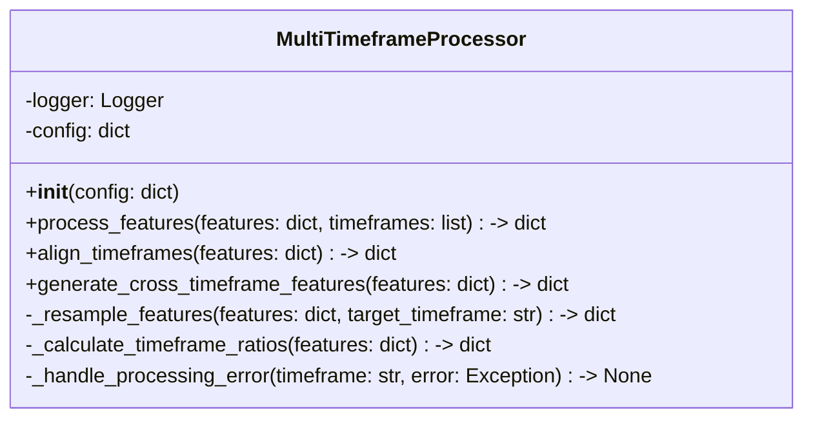
```mermaid
classDiagram
    class MultiTimeframeProcessor {
        -logger: Logger
        -config: dict
        +__init__(config: dict)
        +process_features(features: dict, timeframes: list) -> dict
        +align_timeframes(features: dict) -> dict
        +generate_cross_timeframe_features(features: dict) -> dict
        -_resample_features(features: dict, target_timeframe: str) -> dict
        -_calculate_timeframe_ratios(features: dict) -> dict
        -_handle_processing_error(timeframe: str, error: Exception) -> None
    }
```

**Interfaces**:
- **Input**: Features for different timeframes
- **Output**: Processed multi-timeframe features

**Implementation Details**:
- Aligns features across different timeframes
- Generates cross-timeframe features
- Resamples features to different timeframes
- Calculates timeframe ratios and relationships
- Handles processing errors with fallback mechanisms

**Example Usage**:
```python
processor = MultiTimeframeProcessor(config={"alignment_method": "forward_fill"})
processed_features = processor.process_features(
    features=features,
    timeframes=["1m", "5m", "15m", "1h"]
)
```

### FeatureStore

**Purpose**: Stores and manages features for use in machine learning models.

**Architecture**:
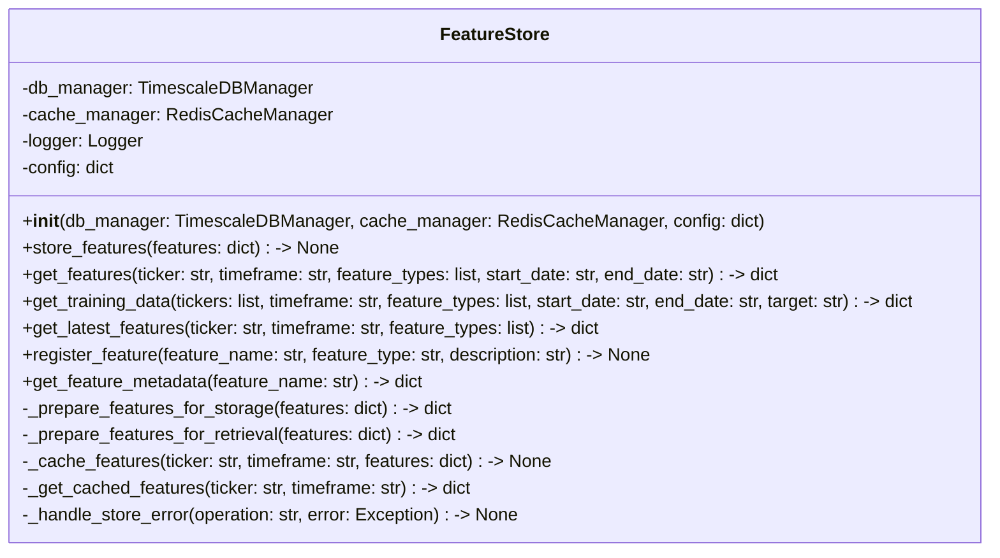
```mermaid
classDiagram
    class FeatureStore {
        -db_manager: TimescaleDBManager
        -cache_manager: RedisCacheManager
        -logger: Logger
        -config: dict
        +__init__(db_manager: TimescaleDBManager, cache_manager: RedisCacheManager, config: dict)
        +store_features(features: dict) -> None
        +get_features(ticker: str, timeframe: str, feature_types: list, start_date: str, end_date: str) -> dict
        +get_training_data(tickers: list, timeframe: str, feature_types: list, start_date: str, end_date: str, target: str) -> dict
        +get_latest_features(ticker: str, timeframe: str, feature_types: list) -> dict
        +register_feature(feature_name: str, feature_type: str, description: str) -> None
        +get_feature_metadata(feature_name: str) -> dict
        -_prepare_features_for_storage(features: dict) -> dict
        -_prepare_features_for_retrieval(features: dict) -> dict
        -_cache_features(ticker: str, timeframe: str, features: dict) -> None
        -_get_cached_features(ticker: str, timeframe: str) -> dict
        -_handle_store_error(operation: str, error: Exception) -> None
    }
```

**Interfaces**:
- **Input**: Features to store or query parameters
- **Output**: Stored features confirmation or retrieved features

**Implementation Details**:
- Uses TimescaleDB for persistent storage
- Uses Redis for caching frequently accessed features
- Implements efficient query patterns for feature retrieval
- Supports feature registration and metadata
- Handles storage and retrieval errors with retry mechanisms

**Example Usage**:
```python
feature_store = FeatureStore(
    db_manager=db_manager,
    cache_manager=cache_manager,
    config={"cache_ttl": 3600}
)
feature_store.store_features(processed_features)
training_data = feature_store.get_training_data(
    tickers=["AAPL", "MSFT", "GOOGL"],
    timeframe="5m",
    feature_types=["price", "volume", "momentum"],
    start_date="2023-01-01",
    end_date="2023-01-31",
    target="future_return_1h"
)
```

### FeatureImportanceAnalyzer

**Purpose**: Analyzes the importance of features for model training.

**Architecture**:
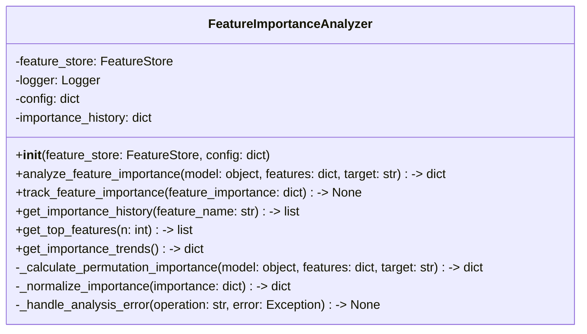
```mermaid
classDiagram
    class FeatureImportanceAnalyzer {
        -feature_store: FeatureStore
        -logger: Logger
        -config: dict
        -importance_history: dict
        +__init__(feature_store: FeatureStore, config: dict)
        +analyze_feature_importance(model: object, features: dict, target: str) -> dict
        +track_feature_importance(feature_importance: dict) -> None
        +get_importance_history(feature_name: str) -> list
        +get_top_features(n: int) -> list
        +get_importance_trends() -> dict
        -_calculate_permutation_importance(model: object, features: dict, target: str) -> dict
        -_normalize_importance(importance: dict) -> dict
        -_handle_analysis_error(operation: str, error: Exception) -> None
    }
```

**Interfaces**:
- **Input**: Model, features, and target
- **Output**: Feature importance metrics

**Implementation Details**:
- Supports different importance calculation methods
- Tracks feature importance over time
- Identifies top features for model training
- Analyzes importance trends
- Handles analysis errors with fallback mechanisms

**Example Usage**:
```python
analyzer = FeatureImportanceAnalyzer(
    feature_store=feature_store,
    config={"importance_method": "permutation"}
)
importance = analyzer.analyze_feature_importance(
    model=trained_model,
    features=training_data["features"],
    target=training_data["target"]
)
top_features = analyzer.get_top_features(10)
```

## Model Training & Inference Components

### ModelTrainer

**Purpose**: Trains machine learning models for price prediction.

**Architecture**:
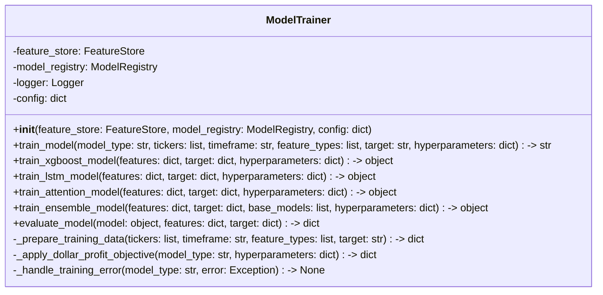
```mermaid
classDiagram
    class ModelTrainer {
        -feature_store: FeatureStore
        -model_registry: ModelRegistry
        -logger: Logger
        -config: dict
        +__init__(feature_store: FeatureStore, model_registry: ModelRegistry, config: dict)
        +train_model(model_type: str, tickers: list, timeframe: str, feature_types: list, target: str, hyperparameters: dict) -> str
        +train_xgboost_model(features: dict, target: dict, hyperparameters: dict) -> object
        +train_lstm_model(features: dict, target: dict, hyperparameters: dict) -> object
        +train_attention_model(features: dict, target: dict, hyperparameters: dict) -> object
        +train_ensemble_model(features: dict, target: dict, base_models: list, hyperparameters: dict) -> object
        +evaluate_model(model: object, features: dict, target: dict) -> dict
        -_prepare_training_data(tickers: list, timeframe: str, feature_types: list, target: str) -> dict
        -_apply_dollar_profit_objective(model_type: str, hyperparameters: dict) -> dict
        -_handle_training_error(model_type: str, error: Exception) -> None
    }
```

**Interfaces**:
- **Input**: Training parameters (model type, tickers, timeframe, etc.)
- **Output**: Trained model ID

**Implementation Details**:
- Supports different model types (XGBoost, LSTM, Attention, Ensemble)
- Implements dollar profit optimization
- Uses GPU acceleration for model training
- Evaluates models with various metrics
- Handles training errors with fallback mechanisms

**Example Usage**:
```python
trainer = ModelTrainer(
    feature_store=feature_store,
    model_registry=model_registry,
    config={"use_gpu": True}
)
model_id = trainer.train_model(
    model_type="xgboost",
    tickers=["AAPL", "MSFT", "GOOGL"],
    timeframe="5m",
    feature_types=["price", "volume", "momentum"],
    target="future_return_1h",
    hyperparameters={"max_depth": 6, "learning_rate": 0.1}
)
```

### DollarProfitOptimizer

**Purpose**: Optimizes models for maximum dollar profit.

**Architecture**:
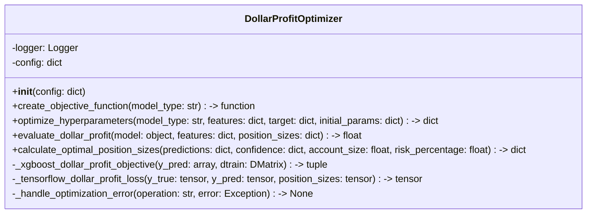
```mermaid
classDiagram
    class DollarProfitOptimizer {
        -logger: Logger
        -config: dict
        +__init__(config: dict)
        +create_objective_function(model_type: str) -> function
        +optimize_hyperparameters(model_type: str, features: dict, target: dict, initial_params: dict) -> dict
        +evaluate_dollar_profit(model: object, features: dict, position_sizes: dict) -> float
        +calculate_optimal_position_sizes(predictions: dict, confidence: dict, account_size: float, risk_percentage: float) -> dict
        -_xgboost_dollar_profit_objective(y_pred: array, dtrain: DMatrix) -> tuple
        -_tensorflow_dollar_profit_loss(y_true: tensor, y_pred: tensor, position_sizes: tensor) -> tensor
        -_handle_optimization_error(operation: str, error: Exception) -> None
    }
```

**Interfaces**:
- **Input**: Model type, features, target, and parameters
- **Output**: Optimized objective function or hyperparameters

**Implementation Details**:
- Implements custom objective functions for different model types
- Optimizes hyperparameters for dollar profit
- Calculates optimal position sizes based on predictions
- Evaluates dollar profit performance
- Handles optimization errors with fallback mechanisms

**Example Usage**:
```python
optimizer = DollarProfitOptimizer(config={"risk_percentage": 0.02})
objective_function = optimizer.create_objective_function("xgboost")
optimized_params = optimizer.optimize_hyperparameters(
    model_type="xgboost",
    features=training_data["features"],
    target=training_data["target"],
    initial_params={"max_depth": 6, "learning_rate": 0.1}
)
```

### CrossTimeframeValidator

**Purpose**: Validates models across multiple timeframes.

**Architecture**:
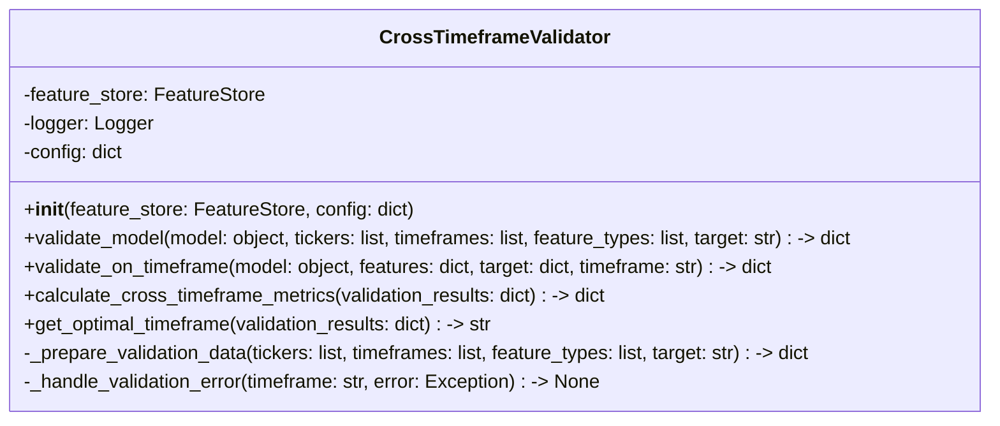
```mermaid
classDiagram
    class CrossTimeframeValidator {
        -feature_store: FeatureStore
        -logger: Logger
        -config: dict
        +__init__(feature_store: FeatureStore, config: dict)
        +validate_model(model: object, tickers: list, timeframes: list, feature_types: list, target: str) -> dict
        +validate_on_timeframe(model: object, features: dict, target: dict, timeframe: str) -> dict
        +calculate_cross_timeframe_metrics(validation_results: dict) -> dict
        +get_optimal_timeframe(validation_results: dict) -> str
        -_prepare_validation_data(tickers: list, timeframes: list, feature_types: list, target: str) -> dict
        -_handle_validation_error(timeframe: str, error: Exception) -> None
    }
```

**Interfaces**:
- **Input**: Model, tickers, timeframes, and target
- **Output**: Validation results across timeframes

**Implementation Details**:
- Validates models on different timeframes
- Calculates cross-timeframe performance metrics
- Identifies optimal timeframe for each model
- Analyzes timeframe sensitivity
- Handles validation errors with fallback mechanisms

**Example Usage**:
```python
validator = CrossTimeframeValidator(
    feature_store=feature_store,
    config={"validation_method": "walk_forward"}
)
validation_results = validator.validate_model(
    model=trained_model,
    tickers=["AAPL", "MSFT", "GOOGL"],
    timeframes=["1m", "5m", "15m", "1h"],
    feature_types=["price", "volume", "momentum"],
    target="future_return_1h"
)
optimal_timeframe = validator.get_optimal_timeframe(validation_results)
```

### ModelRegistry

**Purpose**: Manages model versions and metadata.

**Architecture**:
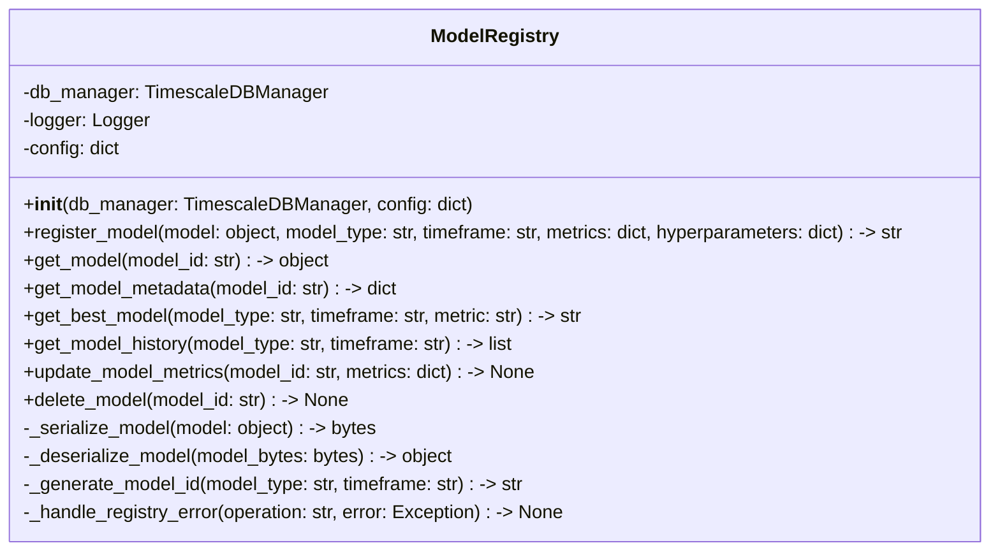
```mermaid
classDiagram
    class ModelRegistry {
        -db_manager: TimescaleDBManager
        -logger: Logger
        -config: dict
        +__init__(db_manager: TimescaleDBManager, config: dict)
        +register_model(model: object, model_type: str, timeframe: str, metrics: dict, hyperparameters: dict) -> str
        +get_model(model_id: str) -> object
        +get_model_metadata(model_id: str) -> dict
        +get_best_model(model_type: str, timeframe: str, metric: str) -> str
        +get_model_history(model_type: str, timeframe: str) -> list
        +update_model_metrics(model_id: str, metrics: dict) -> None
        +delete_model(model_id: str) -> None
        -_serialize_model(model: object) -> bytes
        -_deserialize_model(model_bytes: bytes) -> object
        -_generate_model_id(model_type: str, timeframe: str) -> str
        -_handle_registry_error(operation: str, error: Exception) -> None
    }
```

**Interfaces**:
- **Input**: Model, metadata, or query parameters
- **Output**: Model ID, model object, or metadata

**Implementation Details**:
- Stores models in TimescaleDB
- Manages model versions and metadata
- Tracks model performance metrics
- Supports model serialization and deserialization
- Handles registry errors with retry mechanisms

**Example Usage**:
```python
registry = ModelRegistry(
    db_manager=db_manager,
    config={"storage_path": "/models"}
)
model_id = registry.register_model(
    model=trained_model,
    model_type="xgboost",
    timeframe="5m",
    metrics=validation_results,
    hyperparameters={"max_depth": 6, "learning_rate": 0.1}
)
best_model_id = registry.get_best_model(
    model_type="xgboost",
    timeframe="5m",
    metric="dollar_profit"
)
```

### PredictionConfidenceCalculator

**Purpose**: Calculates confidence scores for model predictions.

**Architecture**:
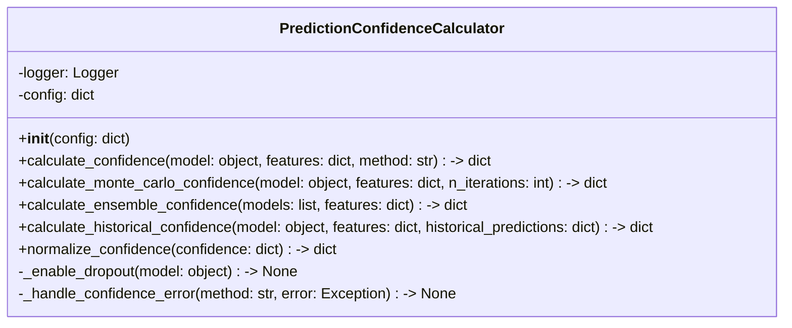
```mermaid
classDiagram
    class PredictionConfidenceCalculator {
        -logger: Logger
        -config: dict
        +__init__(config: dict)
        +calculate_confidence(model: object, features: dict, method: str) -> dict
        +calculate_monte_carlo_confidence(model: object, features: dict, n_iterations: int) -> dict
        +calculate_ensemble_confidence(models: list, features: dict) -> dict
        +calculate_historical_confidence(model: object, features: dict, historical_predictions: dict) -> dict
        +normalize_confidence(confidence: dict) -> dict
        -_enable_dropout(model: object) -> None
        -_handle_confidence_error(method: str, error: Exception) -> None
    }
```

**Interfaces**:
- **Input**: Model, features, and method
- **Output**: Confidence scores for predictions

**Implementation Details**:
- Supports different confidence calculation methods
- Implements Monte Carlo dropout for uncertainty estimation
- Calculates ensemble variance for confidence
- Uses historical prediction accuracy for confidence
- Handles confidence calculation errors with fallback mechanisms

**Example Usage**:
```python
calculator = PredictionConfidenceCalculator(config={"default_method": "monte_carlo"})
confidence = calculator.calculate_confidence(
    model=trained_model,
    features=inference_features,
    method="monte_carlo"
)
```

## Trading Strategy & Execution Components

### DynamicTickerSelector

**Purpose**: Selects the most promising tickers for trading.

**Architecture**:
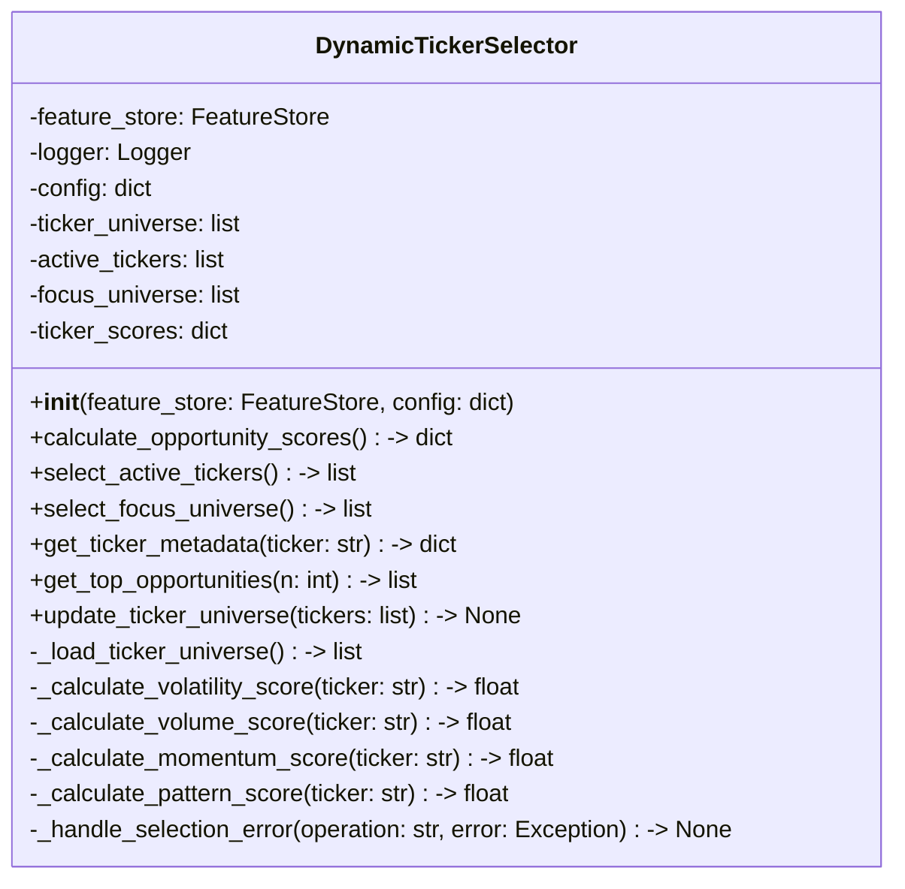
```mermaid
classDiagram
    class DynamicTickerSelector {
        -feature_store: FeatureStore
        -logger: Logger
        -config: dict
        -ticker_universe: list
        -active_tickers: list
        -focus_universe: list
        -ticker_scores: dict
        +__init__(feature_store: FeatureStore, config: dict)
        +calculate_opportunity_scores() -> dict
        +select_active_tickers() -> list
        +select_focus_universe() -> list
        +get_ticker_metadata(ticker: str) -> dict
        +get_top_opportunities(n: int) -> list
        +update_ticker_universe(tickers: list) -> None
        -_load_ticker_universe() -> list
        -_calculate_volatility_score(ticker: str) -> float
        -_calculate_volume_score(ticker: str) -> float
        -_calculate_momentum_score(ticker: str) -> float
        -_calculate_pattern_score(ticker: str) -> float
        -_handle_selection_error(operation: str, error: Exception) -> None
    }
```

**Interfaces**:
- **Input**: Configuration parameters
- **Output**: Selected tickers (active tickers, focus universe)

**Implementation Details**:
- Calculates opportunity scores based on various metrics
- Implements tiered selection approach (Primary, Active, Focus)
- Filters tickers based on minimum criteria (volume, volatility)
- Updates ticker universe dynamically
- Handles selection errors with fallback mechanisms

**Example Usage**:
```python
selector = DynamicTickerSelector(
    feature_store=feature_store,
    config={
        "max_active_tickers": 150,
        "focus_universe_size": 40,
        "min_volume": 500000,
        "min_volatility": 0.01,
        "opportunity_threshold": 0.5
    }
)
opportunity_scores = selector.calculate_opportunity_scores()
active_tickers = selector.select_active_tickers()
focus_universe = selector.select_focus_universe()
```

### TimeframeSelector

**Purpose**: Selects the optimal timeframe for trading.

**Architecture**:
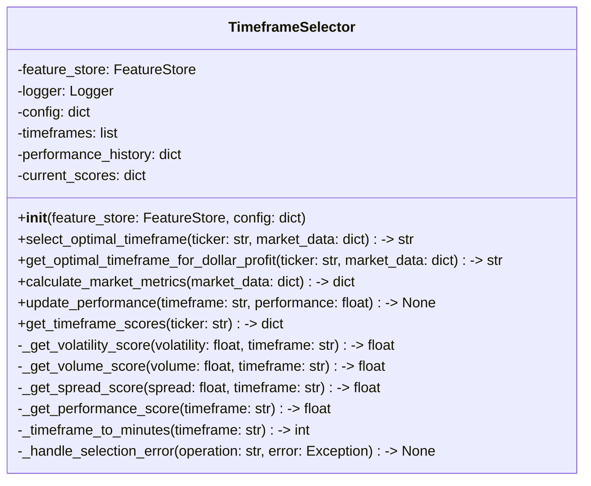
```mermaid
classDiagram
    class TimeframeSelector {
        -feature_store: FeatureStore
        -logger: Logger
        -config: dict
        -timeframes: list
        -performance_history: dict
        -current_scores: dict
        +__init__(feature_store: FeatureStore, config: dict)
        +select_optimal_timeframe(ticker: str, market_data: dict) -> str
        +get_optimal_timeframe_for_dollar_profit(ticker: str, market_data: dict) -> str
        +calculate_market_metrics(market_data: dict) -> dict
        +update_performance(timeframe: str, performance: float) -> None
        +get_timeframe_scores(ticker: str) -> dict
        -_get_volatility_score(volatility: float, timeframe: str) -> float
        -_get_volume_score(volume: float, timeframe: str) -> float
        -_get_spread_score(spread: float, timeframe: str) -> float
        -_get_performance_score(timeframe: str) -> float
        -_timeframe_to_minutes(timeframe: str) -> int
        -_handle_selection_error(operation: str, error: Exception) -> None
    }
```

**Interfaces**:
- **Input**: Ticker and market data
- **Output**: Optimal timeframe

**Implementation Details**:
- Calculates timeframe scores based on market conditions
- Tracks performance history for each timeframe
- Adapts to changing market conditions
- Optimizes for dollar profit
- Handles selection errors with fallback mechanisms

**Example Usage**:
```python
selector = TimeframeSelector(
    feature_store=feature_store,
    config={
        "timeframes": ["1m", "5m", "15m", "1h"],
        "volatility_weight": 0.3,
        "volume_weight": 0.2,
        "spread_weight": 0.2,
        "performance_weight": 0.3
    }
)
optimal_timeframe = selector.select_optimal_timeframe(
    ticker="AAPL",
    market_data=current_market_data
)
```

### PositionSizer

**Purpose**: Calculates position sizes based on risk parameters.

**Architecture**:
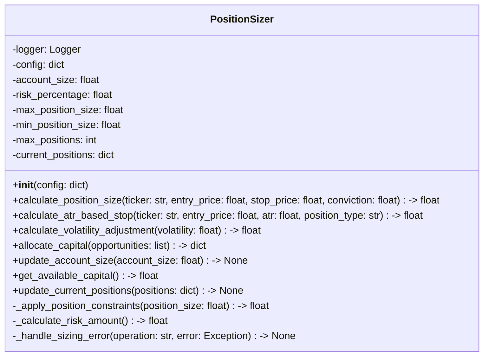
```mermaid
classDiagram
    class PositionSizer {
        -logger: Logger
        -config: dict
        -account_size: float
        -risk_percentage: float
        -max_position_size: float
        -min_position_size: float
        -max_positions: int
        -current_positions: dict
        +__init__(config: dict)
        +calculate_position_size(ticker: str, entry_price: float, stop_price: float, conviction: float) -> float
        +calculate_atr_based_stop(ticker: str, entry_price: float, atr: float, position_type: str) -> float
        +calculate_volatility_adjustment(volatility: float) -> float
        +allocate_capital(opportunities: list) -> dict
        +update_account_size(account_size: float) -> None
        +get_available_capital() -> float
        +update_current_positions(positions: dict) -> None
        -_apply_position_constraints(position_size: float) -> float
        -_calculate_risk_amount() -> float
        -_handle_sizing_error(operation: str, error: Exception) -> None
    }
```

**Interfaces**:
- **Input**: Ticker, prices, and risk parameters
- **Output**: Position size

**Implementation Details**:
- Implements risk-based position sizing (2% risk rule)
- Calculates ATR-based stop losses
- Adjusts position sizes based on volatility
- Allocates capital across multiple opportunities
- Handles sizing errors with fallback mechanisms

**Example Usage**:
```python
sizer = PositionSizer(
    config={
        "account_size": 100000.0,
        "risk_percentage": 0.02,
        "max_position_size": 10000.0,
        "min_position_size": 1000.0,
        "max_positions": 20
    }
)
position_size = sizer.calculate_position_size(
    ticker="AAPL",
    entry_price=150.0,
    stop_price=145.0,
    conviction=0.8
)
```

### PeakDetector

**Purpose**: Detects optimal exit points for trades.

**Architecture**:
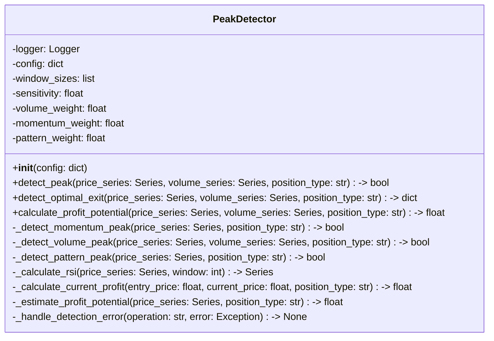
```mermaid
classDiagram
    class PeakDetector {
        -logger: Logger
        -config: dict
        -window_sizes: list
        -sensitivity: float
        -volume_weight: float
        -momentum_weight: float
        -pattern_weight: float
        +__init__(config: dict)
        +detect_peak(price_series: Series, volume_series: Series, position_type: str) -> bool
        +detect_optimal_exit(price_series: Series, volume_series: Series, position_type: str) -> dict
        +calculate_profit_potential(price_series: Series, volume_series: Series, position_type: str) -> float
        -_detect_momentum_peak(price_series: Series, position_type: str) -> bool
        -_detect_volume_peak(price_series: Series, volume_series: Series, position_type: str) -> bool
        -_detect_pattern_peak(price_series: Series, position_type: str) -> bool
        -_calculate_rsi(price_series: Series, window: int) -> Series
        -_calculate_current_profit(entry_price: float, current_price: float, position_type: str) -> float
        -_estimate_profit_potential(price_series: Series, position_type: str) -> float
        -_handle_detection_error(operation: str, error: Exception) -> None
    }
```

**Interfaces**:
- **Input**: Price and volume series, position type
- **Output**: Peak detection signal or optimal exit point

**Implementation Details**:
- Analyzes price and volume patterns for peak detection
- Uses multiple technical indicators (RSI, ROC, etc.)
- Implements weighted signal combination
- Estimates profit potential for exit decisions
- Handles detection errors with fallback mechanisms

**Example Usage**:
```python
detector = PeakDetector(
    config={
        "window_sizes": [5, 10, 20],
        "sensitivity": 0.7,
        "volume_weight": 0.3,
        "momentum_weight": 0.4,
        "pattern_weight": 0.3
    }
)
is_peak = detector.detect_peak(
    price_series=price_data["close"],
    volume_series=price_data["volume"],
    position_type="long"
)
```

### OrderTypeSelector

**Purpose**: Selects the optimal order type for trade execution.

**Architecture**:
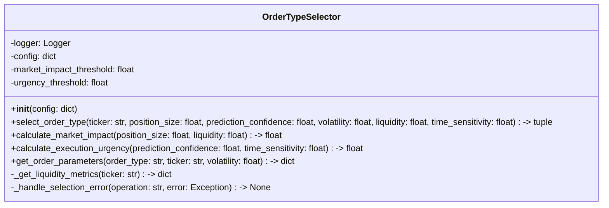
```mermaid
classDiagram
    class OrderTypeSelector {
        -logger: Logger
        -config: dict
        -market_impact_threshold: float
        -urgency_threshold: float
        +__init__(config: dict)
        +select_order_type(ticker: str, position_size: float, prediction_confidence: float, volatility: float, liquidity: float, time_sensitivity: float) -> tuple
        +calculate_market_impact(position_size: float, liquidity: float) -> float
        +calculate_execution_urgency(prediction_confidence: float, time_sensitivity: float) -> float
        +get_order_parameters(order_type: str, ticker: str, volatility: float) -> dict
        -_get_liquidity_metrics(ticker: str) -> dict
        -_handle_selection_error(operation: str, error: Exception) -> None
    }
```

**Interfaces**:
- **Input**: Trading parameters (ticker, position size, etc.)
- **Output**: Order type and parameters

**Implementation Details**:
- Selects order type based on market impact and urgency
- Calculates market impact based on position size and liquidity
- Determines execution urgency based on prediction confidence
- Generates order parameters for different order types
- Handles selection errors with fallback mechanisms

**Example Usage**:
```python
selector = OrderTypeSelector(
    config={
        "market_impact_threshold": 0.1,
        "urgency_threshold": 0.7
    }
)
order_type, order_params = selector.select_order_type(
    ticker="AAPL",
    position_size=1000.0,
    prediction_confidence=0.8,
    volatility=0.02,
    liquidity=1000000.0,
    time_sensitivity=0.5
)
```

### AlpacaIntegration

**Purpose**: Provides high-level integration with the Alpaca API for trade execution.

**Architecture**:
```mermaid
classDiagram
    class AlpacaIntegration {
        -client: AlpacaClient
        -trade_executor: AlpacaTradeExecutor
        -position_manager: AlpacaPositionManager
        -logger: Logger
        -config: dict
        +__init__(config: dict)
        +execute_model_prediction(ticker: str, prediction: float, confidence: float, timeframe: str, position_size: float) -> dict
        +process_peak_detection(ticker: str, is_peak: bool) -> dict
        +get_market_data(ticker: str, timeframe: str, limit: int) -> dict
        +get_portfolio_status() -> dict
        +close_position(ticker: str) -> dict
        +close_all_positions() -> dict
        +get_execution_metrics() -> dict
        +shutdown() -> None
        -_initialize_components() -> None
        -_handle_integration_error(operation: str, error: Exception) -> None
    }
```

**Interfaces**:
- **Input**: Trading parameters or commands
- **Output**: Execution results or market data

**Implementation Details**:
- Integrates with AlpacaClient for API access
- Uses AlpacaTradeExecutor for trade execution
- Manages positions with AlpacaPositionManager
- Processes model predictions and peak detection signals
- Handles integration errors with retry mechanisms

**Example Usage**:
```python
integration = AlpacaIntegration(
    config={
        "api_key": "your_api_key",
        "api_secret": "your_api_secret",
        "base_url": "https://paper-api.alpaca.markets",
        "data_url": "https://data.alpaca.markets"
    }
)
execution_result = integration.execute_model_prediction(
    ticker="AAPL",
    prediction=0.02,
    confidence=0.8,
    timeframe="5m",
    position_size=1000.0
)
```

## Monitoring & Analytics Components

### DollarProfitAnalyzer

**Purpose**: Analyzes dollar profit across multiple dimensions.

**Architecture**:
```mermaid
classDiagram
    class DollarProfitAnalyzer {
        -db_manager: TimescaleDBManager
        -logger: Logger
        -config: dict
        +__init__(db_manager: TimescaleDBManager, config: dict)
        +analyze_dollar_profit(trades: list, positions: dict, predictions: dict) -> dict
        +calculate_profit_by_ticker(trades: list) -> dict
        +calculate_profit_by_timeframe(trades: list) -> dict
        +calculate_profit_by_model(trades: list) -> dict
        +calculate_profit_by_day(trades: list) -> dict
        +calculate_profit_by_hour(trades: list) -> dict
        +calculate_cumulative_profit(trades: list) -> list
        +store_profit_metrics(metrics: dict) -> None
        +get_profit_metrics(start_date: str, end_date: str) -> dict
        -_calculate_realized_profit(trade: dict) -> float
        -_calculate_unrealized_profit(position: dict) -> float
        -_handle_analysis_error(operation: str, error: Exception) -> None
    }
```

**Interfaces**:
- **Input**: Trades, positions, and predictions
- **Output**: Dollar profit metrics

**Implementation Details**:
- Calculates dollar profit across multiple dimensions
- Analyzes profit by ticker, timeframe, model, etc.
- Calculates realized and unrealized profit
- Stores profit metrics in TimescaleDB
- Handles analysis errors with fallback mechanisms

**Example Usage**:
```python
analyzer = DollarProfitAnalyzer(
    db_manager=db_manager,
    config={"metrics_table": "profit_metrics"}
)
profit_metrics = analyzer.analyze_dollar_profit(
    trades=completed_trades,
    positions=current_positions,
    predictions=model_predictions
)
```

### PerformanceAnalyzer

**Purpose**: Analyzes trading performance with risk-adjusted metrics.

**Architecture**:
```mermaid
classDiagram
    class PerformanceAnalyzer {
        -db_manager: TimescaleDBManager
        -logger: Logger
        -config: dict
        +__init__(db_manager: TimescaleDBManager, config: dict)
        +calculate_risk_adjusted_metrics(daily_returns: list, risk_free_rate: float) -> dict
        +calculate_drawdown_metrics(equity_curve: list) -> dict
        +calculate_win_loss_metrics(trades: list) -> dict
        +calculate_exposure_metrics(positions: dict, account_size: float) -> dict
        +calculate_attribution_metrics(trades: list) -> dict
        +store_performance_metrics(metrics: dict) -> None
        +get_performance_metrics(start_date: str, end_date: str) -> dict
        -_calculate_sharpe_ratio(returns: list, risk_free_rate: float) -> float
        -_calculate_sortino_ratio(returns: list, risk_free_rate: float) -> float
        -_calculate_max_drawdown(equity_curve: list) -> float
        -_handle_analysis_error(operation: str, error: Exception) -> None
    }
```

**Interfaces**:
- **Input**: Returns, equity curve, trades, positions
- **Output**: Performance metrics

**Implementation Details**:
- Calculates risk-adjusted performance metrics
- Analyzes drawdown and recovery
- Calculates win/loss statistics
- Analyzes exposure and attribution
- Handles analysis errors with fallback mechanisms

**Example Usage**:
```python
analyzer = PerformanceAnalyzer(
    db_manager=db_manager,
    config={"metrics_table": "performance_metrics"}
)
performance_metrics = analyzer.calculate_risk_adjusted_metrics(
    daily_returns=daily_returns,
    risk_free_rate=0.0
)
```

### PrometheusExporter

**Purpose**: Exports metrics to Prometheus for monitoring.

**Architecture**:
```mermaid
classDiagram
    class PrometheusExporter {
        -logger: Logger
        -config: dict
        -registry: CollectorRegistry
        -gauges: dict
        -counters: dict
        -histograms: dict
        +__init__(config: dict)
        +initialize() -> None
        +export_metrics(metrics: dict) -> None
        +create_gauge(name: str, description: str, labels: list) -> None
        +create_counter(name: str, description: str, labels: list) -> None
        +create_histogram(name: str, description: str, labels: list, buckets: list) -> None
        +update_gauge(name: str, value: float, labels: dict) -> None
        +increment_counter(name: str, value: float, labels: dict) -> None
        +observe_histogram(name: str, value: float, labels: dict) -> None
        +start_http_server() -> None
        +shutdown() -> None
        -_handle_export_error(operation: str, error: Exception) -> None
    }
```

**Interfaces**:
- **Input**: Metrics to export
- **Output**: Exported metrics confirmation

**Implementation Details**:
- Creates and manages Prometheus metrics
- Exports metrics via HTTP server
- Supports different metric types (gauge, counter, histogram)
- Handles metric labels for multi-dimensional data
- Handles export errors with retry mechanisms

**Example Usage**:
```python
exporter = PrometheusExporter(
    config={
        "port": 9090,
        "metrics_path": "/metrics"
    }
)
exporter.initialize()
exporter.create_gauge("dollar_profit", "Dollar profit", ["ticker", "timeframe"])
exporter.update_gauge("dollar_profit", 100.0, {"ticker": "AAPL", "timeframe": "5m"})
exporter.start_http_server()
```

### SlackNotifier

**Purpose**: Sends alerts and notifications to Slack.

**Architecture**:
```mermaid
classDiagram
    class SlackNotifier {
        -logger: Logger
        -config: dict
        -webhook_url: str
        -channel: str
        -username: str
        +__init__(config: dict)
        +initialize() -> None
        +send_notification(message: str, level: str) -> None
        +send_critical_alert(message: str) -> None
        +send_warning_alert(message: str) -> None
        +send_info_notification(message: str) -> None
        +send_performance_update(metrics: dict) -> None
        +send_system_status(status: dict) -> None
        +shutdown() -> None
        -_format_message(message: str, level: str) -> dict
        -_format_performance_message(metrics: dict) -> dict
        -_handle_notification_error(operation: str, error: Exception) -> None
    }
```

**Interfaces**:
- **Input**: Message or metrics to send
- **Output**: Notification confirmation

**Implementation Details**:
- Sends notifications to Slack via webhook
- Supports different notification levels
- Formats messages for better readability
- Creates rich messages with metrics and charts
- Handles notification errors with retry mechanisms

**Example Usage**:
```python
notifier = SlackNotifier(
    config={
        "webhook_url": "https://hooks.slack.com/services/xxx/yyy/zzz",
        "channel": "#trading-alerts",
        "username": "Trading Bot"
    }
)
notifier.initialize()
notifier.send_critical_alert("Position size exceeds maximum limit for AAPL")
notifier.send_performance_update(performance_metrics)
```

## Continuous Learning & Adaptation Components

### ModelRetrainer

**Purpose**: Retrains models based on performance and market conditions.

**Architecture**:
```mermaid
classDiagram
    class ModelRetrainer {
        -model_trainer: ModelTrainer
        -model_registry: ModelRegistry
        -feature_store: FeatureStore
        -logger: Logger
        -config: dict
        -retraining_schedule: dict
        +__init__(model_trainer: ModelTrainer, model_registry: ModelRegistry, feature_store: FeatureStore, config: dict)
        +schedule_retraining(model_id: str, frequency: str, performance_threshold: float) -> None
        +check_retraining_needs() -> list
        +retrain_model(model_id: str) -> str
        +retrain_all_models() -> dict
        +get_retraining_status() -> dict
        -_get_training_data(model_metadata: dict) -> dict
        -_evaluate_model_performance(model_id: str) -> float
        -_handle_retraining_error(model_id: str, error: Exception) -> None
    }
```

**Interfaces**:
- **Input**: Model ID or retraining parameters
- **Output**: New model ID or retraining status

**Implementation Details**:
- Schedules model retraining based on frequency or performance
- Checks if models need retraining
- Retrains models with the latest data
- Evaluates model performance for retraining decisions
- Handles retraining errors with fallback mechanisms

**Example Usage**:
```python
retrainer = ModelRetrainer(
    model_trainer=model_trainer,
    model_registry=model_registry,
    feature_store=feature_store,
    config={"default_frequency": "daily"}
)
retrainer.schedule_retraining(
    model_id="model_123",
    frequency="daily",
    performance_threshold=0.05
)
models_to_retrain = retrainer.check_retraining_needs()
new_model_id = retrainer.retrain_model("model_123")
```

### MarketRegimeDetector

**Purpose**: Detects market regimes for strategy adaptation.

**Architecture**:
```mermaid
classDiagram
    class MarketRegimeDetector {
        -feature_store: FeatureStore
        -logger: Logger
        -config: dict
        -regime_history: dict
        -current_regime: str
        +__init__(feature_store: FeatureStore, config: dict)
        +detect_regime(market_data: dict) -> str
        +get_current_regime() -> str
        +get_regime_history() -> dict
        +get_regime_transition_probabilities() -> dict
        +get_optimal_parameters_for_regime(regime: str) -> dict
        -_calculate_volatility_regime(market_data: dict) -> str
        -_calculate_trend_regime(market_data: dict) -> str
        -_calculate_correlation_regime(market_data: dict) -> str
        -_combine_regime_signals(volatility_regime: str, trend_regime: str, correlation_regime: str) -> str
        -_handle_detection_error(operation: str, error: Exception) -> None
    }
```

**Interfaces**:
- **Input**: Market data
- **Output**: Market regime classification

**Implementation Details**:
- Analyzes market data for regime detection
- Classifies market into different regimes
- Tracks regime history and transitions
- Provides optimal parameters for each regime
- Handles detection errors with fallback mechanisms

**Example Usage**:
```python
detector = MarketRegimeDetector(
    feature_store=feature_store,
    config={
        "volatility_lookback": 20,
        "trend_lookback": 50,
        "correlation_lookback": 30
    }
)
current_regime = detector.detect_regime(market_data)
optimal_params = detector.get_optimal_parameters_for_regime(current_regime)
```

### AdaptiveParameterTuner

**Purpose**: Tunes system parameters based on market conditions and performance.

**Architecture**:
```mermaid
classDiagram
    class AdaptiveParameterTuner {
        -logger: Logger
        -config: dict
        -parameter_history: dict
        -current_parameters: dict
        -performance_metrics: dict
        +__init__(config: dict)
        +tune_parameters(market_regime: str, performance_metrics: dict) -> dict
        +get_optimal_parameters(component: str, market_regime: str) -> dict
        +update_performance_metrics(metrics: dict) -> None
        +get_parameter_history() -> dict
        +get_current_parameters() -> dict
        -_tune_timeframe_selector_parameters(market_regime: str) -> dict
        -_tune_position_sizer_parameters(market_regime: str) -> dict
        -_tune_peak_detector_parameters(market_regime: str) -> dict
        -_calculate_parameter_sensitivity() -> dict
        -_handle_tuning_error(component: str, error: Exception) -> None
    }
```

**Interfaces**:
- **Input**: Market regime and performance metrics
- **Output**: Tuned parameters

**Implementation Details**:
- Tunes parameters based on market regime
- Adapts to changing market conditions
- Tracks parameter history and performance
- Calculates parameter sensitivity
- Handles tuning errors with fallback mechanisms

**Example Usage**:
```python
tuner = AdaptiveParameterTuner(
    config={
        "learning_rate": 0.1,
        "adaptation_speed": 0.5
    }
)
tuned_parameters = tuner.tune_parameters(
    market_regime="high_volatility_trending",
    performance_metrics=performance_metrics
)
timeframe_params = tuner.get_optimal_parameters(
    component="timeframe_selector",
    market_regime="high_volatility_trending"
)
```

## CI/CD Pipeline Components

### GitHubActionsWorkflow

**Purpose**: Orchestrates the CI/CD pipeline using GitHub Actions.

**Architecture**:
```mermaid
classDiagram
    class GitHubActionsWorkflow {
        -logger: Logger
        -config: dict
        -workflows: dict
        +__init__(config: dict)
        +setup_ci_workflow() -> None
        +setup_test_workflow() -> None
        +setup_deploy_workflow() -> None
        +setup_coverage_workflow() -> None
        +setup_performance_workflow() -> None
        +setup_notify_workflow() -> None
        +generate_workflow_files() -> None
        -_create_workflow_directory() -> None
        -_handle_workflow_error(workflow_name: str, error: Exception) -> None
    }
```

**Interfaces**:
- **Input**: Configuration parameters
- **Output**: GitHub Actions workflow files

**Implementation Details**:
- Creates and configures GitHub Actions workflows
- Sets up CI, test, deploy, coverage, performance, and notify workflows
- Generates workflow YAML files
- Handles workflow errors with fallback mechanisms
- Supports customization of workflow triggers and steps

**Example Usage**:
```python
workflow = GitHubActionsWorkflow(
    config={
        "repository": "your-org/autonomous-trading-system",
        "branch": "main",
        "docker_registry": "ghcr.io"
    }
)
workflow.setup_ci_workflow()
workflow.setup_deploy_workflow()
workflow.generate_workflow_files()
```

### DockerBuildManager

**Purpose**: Manages Docker image builds for the CI/CD pipeline.

**Architecture**:
```mermaid
classDiagram
    class DockerBuildManager {
        -logger: Logger
        -config: dict
        -registry: str
        -repository: str
        -tag_prefix: str
        +__init__(config: dict)
        +build_image(component: str, dockerfile: str, context: str) -> str
        +tag_image(image_id: str, tags: list) -> list
        +push_image(image_id: str, tag: str) -> bool
        +pull_image(image_name: str, tag: str) -> str
        +list_images() -> list
        +cleanup_images(days_old: int) -> int
        -_generate_image_name(component: str) -> str
        -_generate_tag(tag_type: str) -> str
        -_handle_build_error(component: str, error: Exception) -> None
    }
```

**Interfaces**:
- **Input**: Build parameters (component, dockerfile, context)
- **Output**: Image ID or build status

**Implementation Details**:
- Builds Docker images for system components
- Tags images with version, commit hash, and environment
- Pushes images to container registry
- Manages image lifecycle and cleanup
- Handles build errors with retry mechanisms

**Example Usage**:
```python
build_manager = DockerBuildManager(
    config={
        "registry": "ghcr.io",
        "repository": "your-org/autonomous-trading-system",
        "tag_prefix": "v1"
    }
)
image_id = build_manager.build_image(
    component="data-acquisition",
    dockerfile="deployment/docker/data-acquisition.Dockerfile",
    context="."
)
tags = build_manager.tag_image(
    image_id=image_id,
    tags=["latest", "v1.0.0", "commit-abc123"]
)
build_manager.push_image(image_id, "latest")
```

### DeploymentManager

**Purpose**: Manages deployments to different environments.

**Architecture**:
```mermaid
classDiagram
    class DeploymentManager {
        -logger: Logger
        -config: dict
        -environments: dict
        -current_deployment: dict
        +__init__(config: dict)
        +deploy_to_environment(environment: str, version: str) -> bool
        +rollback_deployment(environment: str) -> bool
        +get_deployment_status(environment: str) -> dict
        +verify_deployment(environment: str) -> bool
        +run_smoke_tests(environment: str) -> dict
        +get_deployment_history(environment: str) -> list
        -_update_kubernetes_manifests(environment: str, version: str) -> None
        -_apply_kubernetes_manifests(environment: str) -> None
        -_handle_deployment_error(environment: str, error: Exception) -> None
    }
```

**Interfaces**:
- **Input**: Deployment parameters (environment, version)
- **Output**: Deployment status or verification result

**Implementation Details**:
- Manages deployments to different environments (development, staging, production)
- Updates Kubernetes manifests with image versions
- Applies Kubernetes manifests to deploy components
- Verifies deployments with health checks
- Handles deployment errors with rollback mechanisms

**Example Usage**:
```python
deployment_manager = DeploymentManager(
    config={
        "environments": {
            "development": {
                "namespace": "ats-development",
                "manifests_path": "deployment/kubernetes/development"
            },
            "production": {
                "namespace": "ats-production",
                "manifests_path": "deployment/kubernetes/production"
            }
        }
    }
)
deployment_success = deployment_manager.deploy_to_environment(
    environment="development",
    version="v1.0.0"
)
is_verified = deployment_manager.verify_deployment("development")
if not is_verified:
    deployment_manager.rollback_deployment("development")
```

## Utility Components

### MarketCalendar

**Purpose**: Provides information about market trading hours and holidays.

**Architecture**:
```mermaid
classDiagram
    class MarketCalendar {
        -logger: Logger
        -config: dict
        -calendar: TradingCalendar
        -timezone: str
        +__init__(config: dict)
        +is_market_open(timestamp: datetime) -> bool
        +get_next_market_open(timestamp: datetime) -> datetime
        +get_next_market_close(timestamp: datetime) -> datetime
        +get_trading_days(start_date: str, end_date: str) -> list
        +get_trading_hours(date: str) -> dict
        +is_holiday(date: str) -> bool
        +get_holidays(year: int) -> list
        -_load_calendar() -> None
        -_convert_timezone(timestamp: datetime, target_tz: str) -> datetime
        -_handle_calendar_error(operation: str, error: Exception) -> None
    }
```

**Interfaces**:
- **Input**: Date or timestamp
- **Output**: Market status or trading information

**Implementation Details**:
- Uses trading calendar for market hours
- Handles timezone conversions
- Provides information about trading days and holidays
- Determines if market is open at a given time
- Handles calendar errors with fallback mechanisms

**Example Usage**:
```python
calendar = MarketCalendar(
    config={
        "market": "NYSE",
        "timezone": "America/New_York"
    }
)
is_open = calendar.is_market_open(datetime.now())
next_open = calendar.get_next_market_open(datetime.now())
trading_days = calendar.get_trading_days("2023-01-01", "2023-01-31")
```

### RedisCacheManager

**Purpose**: Manages Redis cache for frequently accessed data.

**Architecture**:
```mermaid
classDiagram
    class RedisCacheManager {
        -logger: Logger
        -config: dict
        -redis_client: Redis
        -default_ttl: int
        +__init__(config: dict)
        +initialize() -> None
        +get(key: str) -> object
        +set(key: str, value: object, ttl: int) -> None
        +delete(key: str) -> None
        +exists(key: str) -> bool
        +get_many(keys: list) -> dict
        +set_many(key_values: dict, ttl: int) -> None
        +delete_many(keys: list) -> None
        +flush_all() -> None
        +get_stats() -> dict
        +shutdown() -> None
        -_serialize(value: object) -> str
        -_deserialize(value: str) -> object
        -_handle_cache_error(operation: str, error: Exception) -> None
    }
```

**Interfaces**:
- **Input**: Cache operations (get, set, delete)
- **Output**: Cached data or operation confirmation

**Implementation Details**:
- Manages Redis connection
- Handles serialization and deserialization
- Implements TTL for cache expiration
- Supports batch operations
- Handles cache errors with retry mechanisms

**Example Usage**:
```python
cache_manager = RedisCacheManager(
    config={
        "host": "localhost",
        "port": 6379,
        "db": 0,
        "default_ttl": 3600
    }
)
cache_manager.initialize()
cache_manager.set("features:AAPL:5m", features_data, ttl=1800)
features_data = cache_manager.get("features:AAPL:5m")
```

### DistributedLock

**Purpose**: Implements distributed locks using Redis for concurrent operations.

**Architecture**:
```mermaid
classDiagram
    class DistributedLock {
        -logger: Logger
        -config: dict
        -redis_client: Redis
        -lock_prefix: str
        -default_timeout: int
        -default_ttl: int
        +__init__(redis_client: Redis, config: dict)
        +acquire(resource_name: str, timeout: int, ttl: int) -> bool
        +release(resource_name: str) -> bool
        +extend(resource_name: str, ttl: int) -> bool
        +is_locked(resource_name: str) -> bool
        +get_lock_ttl(resource_name: str) -> int
        +get_lock_owner(resource_name: str) -> str
        -_generate_lock_key(resource_name: str) -> str
        -_generate_lock_value() -> str
        -_handle_lock_error(operation: str, error: Exception) -> None
    }
```

**Interfaces**:
- **Input**: Lock operations (acquire, release, extend)
- **Output**: Lock status or operation confirmation

**Implementation Details**:
- Uses Redis for distributed locking
- Implements lock acquisition with timeout
- Supports lock extension and release
- Provides lock status information
- Handles lock errors with retry mechanisms

**Example Usage**:
```python
lock = DistributedLock(
    redis_client=redis_client,
    config={
        "lock_prefix": "trading_system:",
        "default_timeout": 10,
        "default_ttl": 60
    }
)
if lock.acquire("model_training:AAPL", timeout=5, ttl=300):
    try:
        # Perform operation that requires exclusive access
        pass
    finally:
        lock.release("model_training:AAPL")
```

## Conclusion

This component reference provides a comprehensive technical overview of all major components in the Autonomous Trading System. Each component is described in detail, including its purpose, architecture, interfaces, and implementation details. This reference serves as a guide for developers working on the system, providing the information needed to understand, extend, or modify each component.

The modular architecture of the system allows for independent development and testing of each component while ensuring that the system as a whole functions cohesively. The clear separation of concerns and well-defined interfaces between components make the system maintainable and extensible. The CI/CD pipeline ensures that code changes are automatically built, tested, and deployed in a consistent and reliable manner.