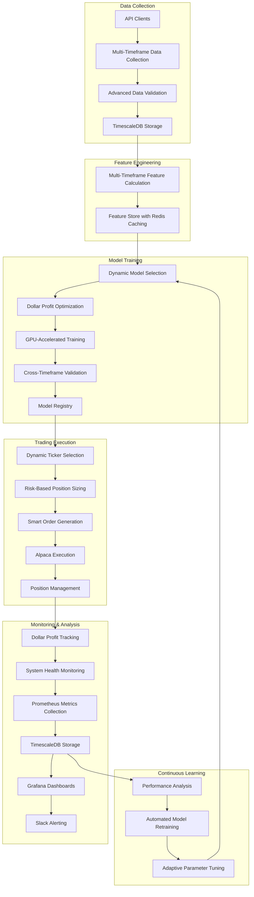
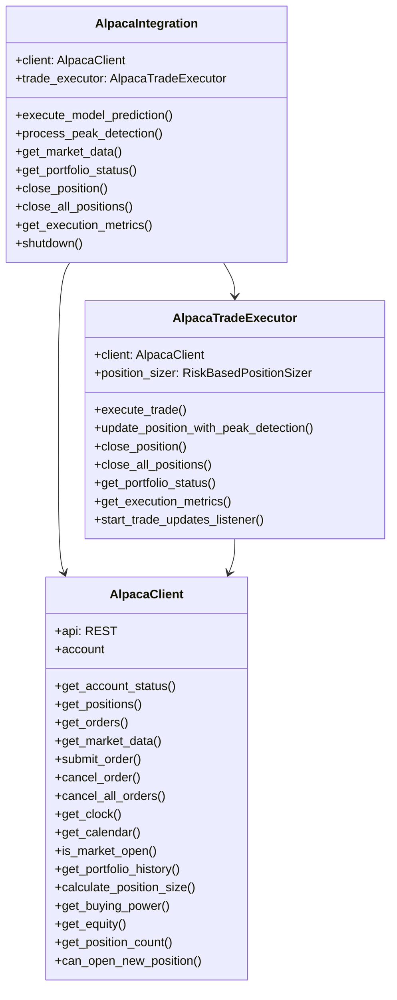
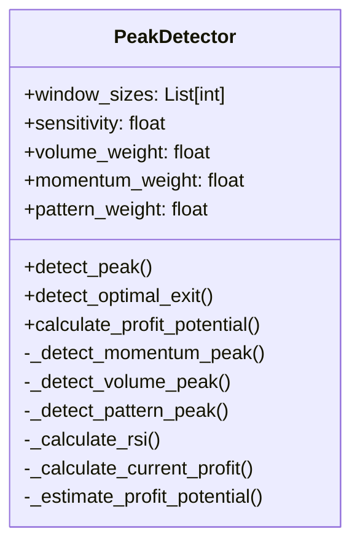
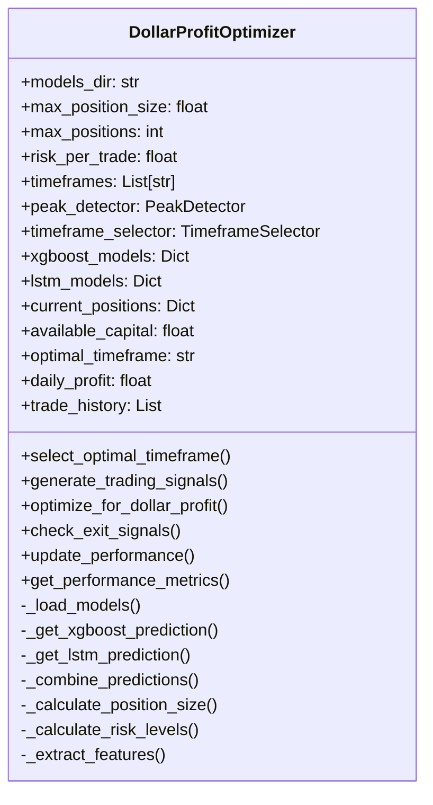
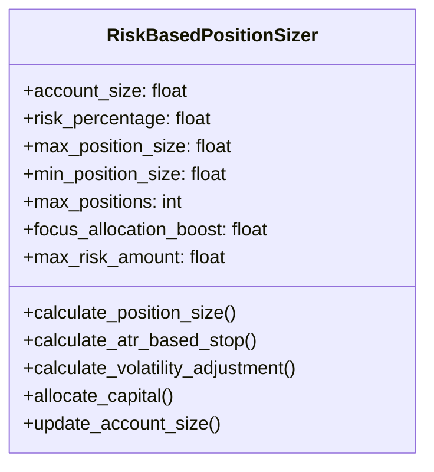
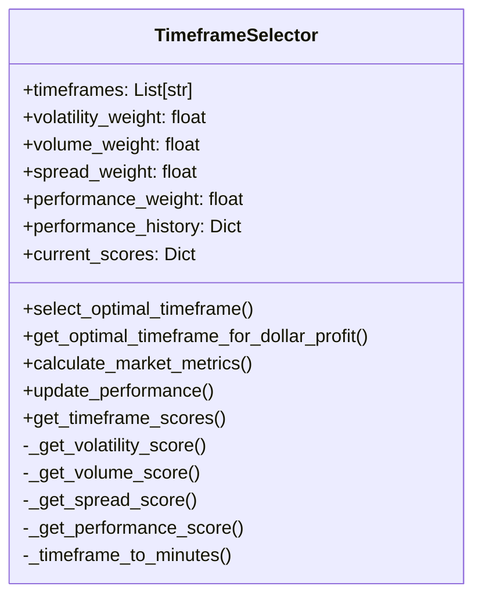
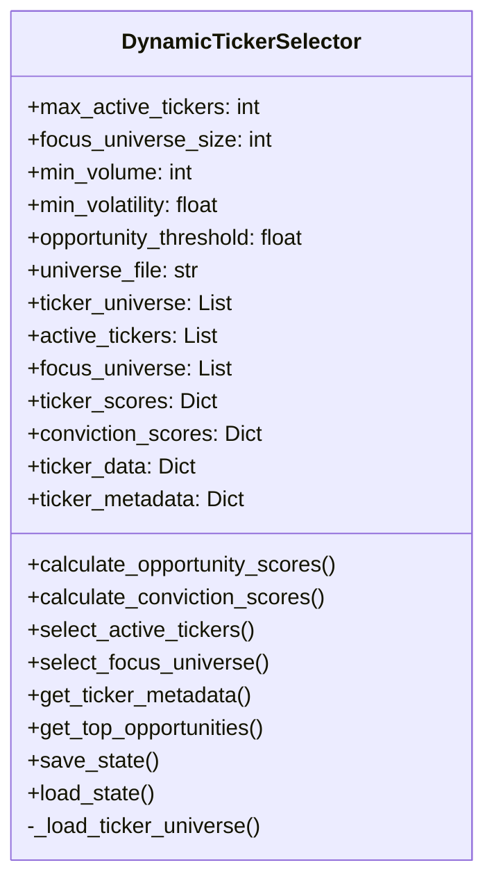
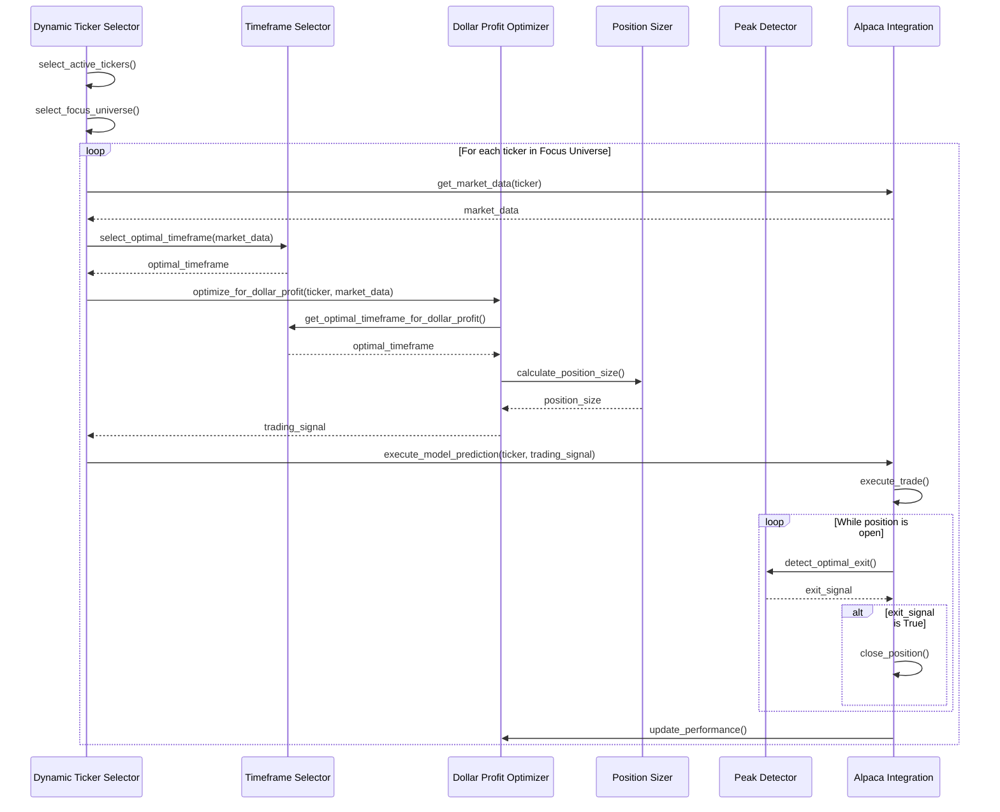

# AI Trading System Components Technical Overview

## Introduction

This document provides a comprehensive technical overview of the key components in our AI Trading System. It covers the architecture, implementation details, optimization techniques, and integration points of each component, along with specific recommendations for improvements to enhance performance, reliability, and profitability.

The AI Trading System is designed to maximize dollar profit through a sophisticated combination of market data analysis, dynamic timeframe selection, intelligent position sizing, and optimized trade execution. The system leverages advanced machine learning models and real-time market data to make trading decisions across multiple timeframes and asset classes.

## System Architecture Overview

The AI Trading System consists of several interconnected components that work together to implement a complete trading pipeline from data collection to trade execution and monitoring.



## 1. Alpaca API Integration

### Architecture and Design

The Alpaca API integration consists of three main components:

1. **AlpacaClient**: Low-level interface to the Alpaca API
2. **AlpacaTradeExecutor**: High-level trade execution interface
3. **AlpacaIntegration**: System-level integration component



### Implementation Details

#### AlpacaClient

The `AlpacaClient` class provides a low-level interface to the Alpaca API, handling:

- Account information retrieval
- Position and order management
- Market data retrieval
- Order submission and cancellation
- Market status checks
- Portfolio history retrieval
- Position sizing calculations

The client is configured with API credentials and base URLs for the Alpaca API:

```python
ALPACA_API_KEY = "PKM325793GT0FTUD24JF"
ALPACA_API_SECRET = "34aXMqUR8273mQxRbavcpfwkRrwJANVlcJcKl35d"
ALPACA_BASE_URL = "https://paper-api.alpaca.markets"
ALPACA_DATA_URL = "https://data.alpaca.markets"
ALPACA_STREAM_URL = "wss://stream.data.alpaca.markets"
```

#### AlpacaTradeExecutor

The `AlpacaTradeExecutor` class provides a higher-level interface for executing trades, handling:

- Trade execution based on model predictions
- Position management
- Risk management
- Execution strategies
- Performance tracking

Key methods include:

- `execute_trade()`: Executes a trade based on model prediction
- `update_position_with_peak_detection()`: Updates position based on peak detection
- `close_position()`: Closes a position for a specific ticker
- `close_all_positions()`: Closes all open positions
- `get_portfolio_status()`: Gets current portfolio status
- `get_execution_metrics()`: Gets execution metrics
- `start_trade_updates_listener()`: Starts listening for trade updates

#### AlpacaIntegration

The `AlpacaIntegration` class provides a high-level interface for the trading system to interact with Alpaca, handling:

- Initialization and configuration
- Trade execution based on model predictions
- Peak detection processing
- Market data retrieval
- Portfolio status retrieval
- Position management
- System shutdown

### Performance Optimization Techniques

1. **Order Type Selection**: The system selects the optimal order type based on prediction and market conditions:
   - Market orders for high urgency
   - Limit orders with tighter spread for medium urgency
   - Limit orders with wider spread for low urgency

2. **Trade Updates Listener**: The system uses a WebSocket connection to receive real-time trade updates, allowing for immediate reaction to fills, cancellations, and rejections.

3. **Connection Pooling**: The system reuses HTTP connections for faster subsequent requests.

4. **Caching**: Frequently accessed data is cached to reduce API calls.

### Integration with Other Components

The Alpaca integration interacts with several other components:

1. **Position Sizer**: Used to calculate position sizes based on risk parameters
2. **Peak Detector**: Used to detect optimal exit points
3. **Dollar Profit Optimizer**: Used to optimize trading decisions for maximum dollar profit
4. **Monitoring System**: Provides metrics for monitoring and analysis

### Recommendations for Improvements

1. **Enhanced Error Handling**: Implement more robust error handling with circuit breaker patterns to prevent repeated calls to failing endpoints.

2. **Rate Limiting**: Implement client-side rate limiting to avoid API throttling.

3. **Execution Quality Analysis**: Develop a module to analyze execution quality, including slippage, market impact, and implementation shortfall.

4. **Smart Order Routing**: Implement smart order routing to optimize execution across different venues.

5. **Secure API Key Management**: Move API keys to environment variables or a secure secrets management system for production deployment.

6. **Comprehensive Logging**: Enhance logging to capture all API interactions, errors, and performance metrics.

7. **Retry Mechanism**: Implement exponential backoff for transient failures.

## 2. Peak Detector

### Architecture and Design

The Peak Detector is designed to identify optimal exit points in price data to maximize dollar profit. It uses multiple technical indicators and combines them with volume analysis to detect potential price peaks and troughs.



### Implementation Details

The `PeakDetector` class provides methods for:

- Detecting local price peaks and troughs
- Analyzing momentum and volume patterns
- Identifying exhaustion signals
- Optimizing exit timing for maximum dollar profit

Key methods include:

- `detect_peak()`: Detects if price is at a peak for exit decision
- `detect_optimal_exit()`: Detects optimal exit point based on multiple factors
- `calculate_profit_potential()`: Calculates profit potential and optimal exit time

The peak detection algorithm combines three types of signals:

1. **Momentum Signals**: Based on RSI and price rate of change
2. **Volume Signals**: Based on volume patterns and price-volume relationships
3. **Pattern Signals**: Based on price patterns and technical indicators

### Performance Optimization Techniques

1. **Multiple Window Sizes**: The detector uses multiple window sizes (5, 10, 20) to capture different timeframes.

2. **Weighted Signal Combination**: Signals are combined with weights to emphasize more reliable indicators.

3. **Adaptive Thresholds**: Thresholds are adjusted based on market volatility.

4. **Profit Potential Estimation**: The detector estimates profit potential based on ATR to make risk-adjusted decisions.

### Integration with Other Components

The Peak Detector interacts with:

1. **Dollar Profit Optimizer**: Provides exit signals for profit optimization
2. **AlpacaTradeExecutor**: Used to update positions based on peak detection
3. **TimeframeSelector**: Works with different timeframes for peak detection

### Recommendations for Improvements

1. **Machine Learning Enhancement**: Implement machine learning models to improve peak detection accuracy.

2. **Multi-Timeframe Analysis**: Enhance the detector to analyze peaks across multiple timeframes simultaneously.

3. **Market Regime Awareness**: Add market regime detection to adjust sensitivity based on market conditions.

4. **Additional Technical Indicators**: Incorporate additional technical indicators like MACD, Bollinger Bands, and Ichimoku Cloud.

5. **Real-Time Optimization**: Implement real-time parameter optimization based on recent performance.

6. **Sentiment Integration**: Incorporate market sentiment data to improve peak detection.

7. **Correlation Analysis**: Add cross-asset correlation analysis to detect peaks in related assets.

## 3. Dollar Profit Optimizer

### Architecture and Design

The Dollar Profit Optimizer is designed to maximize absolute dollar profit in day trading by optimizing position sizing, entry/exit timing, and timeframe selection.



### Implementation Details

The `DollarProfitOptimizer` class provides methods for:

- Integrating multiple models for trading decisions
- Optimizing position sizing for dollar profit
- Dynamic timeframe selection
- Optimal entry and exit timing
- Risk management

Key methods include:

- `select_optimal_timeframe()`: Selects the optimal timeframe for trading
- `generate_trading_signals()`: Generates trading signals for all timeframes
- `optimize_for_dollar_profit()`: Optimizes trading decisions for maximum dollar profit
- `check_exit_signals()`: Checks if a position should be exited
- `update_performance()`: Updates performance metrics after a trade
- `get_performance_metrics()`: Gets current performance metrics

The optimizer uses both XGBoost and LSTM models for predictions, combining them with weights based on their historical performance.

### Performance Optimization Techniques

1. **Model Ensemble**: Combines predictions from multiple models to improve accuracy.

2. **Dynamic Timeframe Selection**: Selects the optimal timeframe based on market conditions.

3. **Position Size Scaling**: Scales position size based on signal strength and timeframe.

4. **Risk-Adjusted Returns**: Optimizes for risk-adjusted dollar returns rather than percentage returns.

5. **Batch Processing**: Processes data in batches for efficiency.

### Integration with Other Components

The Dollar Profit Optimizer interacts with:

1. **Peak Detector**: Used to detect optimal exit points
2. **Timeframe Selector**: Used to select the optimal timeframe
3. **Position Sizer**: Used to calculate position sizes
4. **AlpacaIntegration**: Used to execute trades and manage positions

### Recommendations for Improvements

1. **GPU Acceleration**: Implement GPU acceleration for model inference to reduce latency.

2. **Reinforcement Learning**: Add reinforcement learning models to optimize dollar profit directly.

3. **Adaptive Learning Rate**: Implement adaptive learning rates based on market volatility.

4. **Feature Importance Analysis**: Add feature importance analysis to focus on the most predictive features.

5. **Online Learning**: Implement online learning to adapt to changing market conditions in real-time.

6. **Multi-Asset Optimization**: Extend the optimizer to handle multiple assets simultaneously for portfolio-level optimization.

7. **Transaction Cost Modeling**: Add detailed transaction cost modeling to optimize net dollar profit.

## 4. Position Sizer

### Architecture and Design

The Position Sizer implements risk-based position sizing strategies, including the 2% risk rule, maximum position constraints, and tiered allocation for focus tickers.



### Implementation Details

The `RiskBasedPositionSizer` class provides methods for:

- Calculating position sizes based on risk parameters
- Calculating stop prices based on ATR
- Adjusting position sizes based on volatility
- Allocating capital across multiple trading opportunities
- Updating account size and risk parameters

Key methods include:

- `calculate_position_size()`: Calculates position size based on risk parameters
- `calculate_atr_based_stop()`: Calculates stop price based on ATR
- `calculate_volatility_adjustment()`: Calculates volatility adjustment factor
- `allocate_capital()`: Allocates capital across multiple trading opportunities
- `update_account_size()`: Updates account size and recalculates risk parameters

The position sizer uses a risk-based approach, calculating position sizes based on:

1. Account size
2. Risk percentage (default 2%)
3. Stop loss placement
4. Maximum position size constraints
5. Volatility adjustments
6. Conviction score multipliers
7. Focus ticker allocation boost

### Performance Optimization Techniques

1. **Risk-Based Sizing**: Sizes positions based on risk rather than fixed dollar amounts.

2. **Volatility Adjustment**: Adjusts position sizes based on market volatility.

3. **Focus Ticker Boost**: Allocates more capital to high-conviction focus tickers.

4. **Minimum Position Size**: Enforces minimum position sizes to avoid inefficient trades.

5. **Maximum Position Constraints**: Enforces maximum position sizes to limit risk.

### Integration with Other Components

The Position Sizer interacts with:

1. **AlpacaTradeExecutor**: Used to calculate position sizes for trades
2. **Dollar Profit Optimizer**: Used to optimize position sizes for dollar profit
3. **Dynamic Ticker Selector**: Used to allocate capital to selected tickers

### Recommendations for Improvements

1. **Portfolio-Level Risk Management**: Implement portfolio-level risk management to account for correlations between positions.

2. **Dynamic Risk Percentage**: Adjust risk percentage based on market conditions and account performance.

3. **Machine Learning Optimization**: Use machine learning to optimize position sizing parameters.

4. **Drawdown-Based Adjustment**: Adjust position sizes based on recent drawdowns.

5. **Sector Exposure Limits**: Add sector exposure limits to prevent overconcentration.

6. **Liquidity-Based Adjustment**: Adjust position sizes based on market liquidity.

7. **Profit Target Scaling**: Scale position sizes based on profit target distance.

## 5. Timeframe Selector

### Architecture and Design

The Timeframe Selector dynamically chooses the optimal timeframe for trading based on current market conditions.



### Implementation Details

The `TimeframeSelector` class provides methods for:

- Analyzing market conditions across timeframes
- Selecting the optimal timeframe for trading
- Tracking performance of different timeframes
- Adapting to changing market conditions

Key methods include:

- `select_optimal_timeframe()`: Selects the optimal timeframe based on current market conditions
- `get_optimal_timeframe_for_dollar_profit()`: Selects optimal timeframe specifically for dollar profit optimization
- `calculate_market_metrics()`: Calculates market metrics for all timeframes
- `update_performance()`: Updates performance history for a timeframe
- `get_timeframe_scores()`: Gets current scores for all timeframes

The timeframe selector calculates scores for each timeframe based on:

1. Volatility metrics
2. Volume metrics
3. Spread metrics
4. Historical performance

### Performance Optimization Techniques

1. **Weighted Scoring**: Uses weighted scoring to emphasize more important factors.

2. **Performance History**: Tracks performance history to favor timeframes that have performed well.

3. **Adaptive Weights**: Adjusts weights based on market conditions.

4. **Dollar Profit Optimization**: Specifically optimizes for dollar profit potential.

### Integration with Other Components

The Timeframe Selector interacts with:

1. **Dollar Profit Optimizer**: Used to select the optimal timeframe for dollar profit
2. **Peak Detector**: Provides timeframe-specific peak detection
3. **Dynamic Ticker Selector**: Used to select tickers for each timeframe

### Recommendations for Improvements

1. **Machine Learning Enhancement**: Implement machine learning models to improve timeframe selection.

2. **Market Regime Detection**: Add market regime detection to adjust timeframe selection based on market conditions.

3. **Adaptive Weights**: Implement adaptive weights that adjust based on recent performance.

4. **Multi-Timeframe Fusion**: Develop techniques to combine signals from multiple timeframes.

5. **Correlation Analysis**: Add cross-timeframe correlation analysis to detect relationships between timeframes.

6. **Volatility Regime Detection**: Implement volatility regime detection to adjust timeframe selection.

7. **Intraday Seasonality**: Account for intraday seasonality patterns in timeframe selection.

## 6. Dynamic Ticker Selector

### Architecture and Design

The Dynamic Ticker Selector adapts throughout the trading day, selecting the most promising tickers from a large universe based on opportunity scores and implementing a tiered selection approach.



### Implementation Details

The `DynamicTickerSelector` class provides methods for:

- Dynamically selecting tickers based on real-time market conditions
- Calculating opportunity scores and conviction scores
- Implementing a tiered selection approach (Primary Universe, Active Universe, Focus Universe)
- Managing ticker metadata and state

Key methods include:

- `calculate_opportunity_scores()`: Calculates opportunity scores for all tickers
- `calculate_conviction_scores()`: Calculates conviction scores for active tickers
- `select_active_tickers()`: Selects active tickers based on opportunity scores
- `select_focus_universe()`: Selects focus universe based on conviction scores
- `get_top_opportunities()`: Gets top N opportunities with details
- `save_state()`: Saves current state to file
- `load_state()`: Loads state from file

The ticker selector uses a three-tiered approach:

1. **Primary Universe**: All tickers in the universe file
2. **Active Universe**: Top tickers with opportunity scores above threshold
3. **Focus Universe**: Top tickers from Active Universe with highest conviction scores

### Performance Optimization Techniques

1. **Tiered Selection**: Uses a tiered approach to focus computational resources on the most promising tickers.

2. **Opportunity Scoring**: Calculates opportunity scores based on volatility, volume, momentum, and patterns.

3. **Conviction Scoring**: Calculates conviction scores based on trend strength and volatility efficiency.

4. **Filtering**: Filters tickers based on minimum volume and volatility requirements.

5. **State Management**: Saves and loads state to maintain continuity across sessions.

### Integration with Other Components

The Dynamic Ticker Selector interacts with:

1. **Dollar Profit Optimizer**: Provides selected tickers for optimization
2. **Position Sizer**: Used to allocate capital to selected tickers
3. **AlpacaIntegration**: Used to get market data for tickers

### Recommendations for Improvements

1. **Machine Learning Enhancement**: Implement machine learning models to improve ticker selection.

2. **Real-Time News Integration**: Add real-time news analysis to adjust opportunity scores.

3. **Sector Rotation Awareness**: Add sector rotation awareness to select tickers from trending sectors.

4. **Correlation Analysis**: Add correlation analysis to ensure diversification in the Focus Universe.

5. **Alternative Data Integration**: Incorporate alternative data sources for ticker selection.

6. **Adaptive Thresholds**: Implement adaptive thresholds based on market conditions.

7. **Performance-Based Feedback**: Add performance-based feedback to adjust selection criteria.

## System Integration and Workflow

The components described above work together in an integrated workflow to implement the complete trading system:



## Conclusion

The AI Trading System is a sophisticated platform that combines multiple components to implement a complete trading pipeline from data collection to trade execution and monitoring. Each component is designed with performance, reliability, and profitability in mind, with numerous optimization techniques and integration points.

By implementing the recommendations outlined in this document, the system can be further enhanced to improve performance, reliability, and profitability. Key areas for improvement include:

1. **Machine Learning Enhancements**: Implementing more advanced machine learning models and techniques
2. **Real-Time Optimization**: Adding real-time parameter optimization based on market conditions
3. **Integration of Alternative Data**: Incorporating additional data sources for improved decision-making
4. **Performance Optimization**: Enhancing performance through GPU acceleration and parallel processing
5. **Risk Management**: Implementing more sophisticated risk management techniques
6. **Monitoring and Alerting**: Enhancing monitoring and alerting capabilities

The modular architecture of the system allows for incremental improvements to each component while maintaining the overall integrity and functionality of the system.