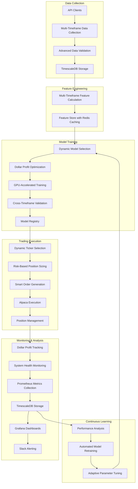
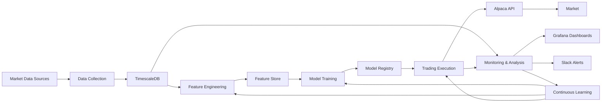

# AI Trading System Overview

## Introduction

The AI Trading System is a comprehensive, autonomous trading platform designed to maximize dollar profit through sophisticated market data analysis, dynamic timeframe selection, intelligent position sizing, and optimized trade execution. The system leverages advanced machine learning models and real-time market data to make trading decisions across multiple timeframes and asset classes.

This document provides a high-level overview of the entire system architecture, key components, data flow, and operational workflow. It is designed to be easily understood by both humans and AI systems, providing sufficient detail for system recreation while maintaining clarity.

## System Architecture

The AI Trading System follows a modular architecture with six main subsystems:

1. **Data Collection**: Gathers market data from various sources
2. **Feature Engineering**: Calculates features from raw market data
3. **Model Training**: Trains and manages machine learning models
4. **Trading Execution**: Executes trades based on model predictions
5. **Monitoring & Analysis**: Tracks system performance and health
6. **Continuous Learning**: Adapts the system to changing market conditions

## Key Components

### 1. Data Collection Subsystem

The Data Collection subsystem is responsible for gathering market data from various sources, validating it, and storing it in TimescaleDB.

**Key Components:**
- **API Clients**: Interfaces with Polygon.io, Unusual Whales, and Alpaca APIs
- **Data Pipeline Scheduler**: Orchestrates data collection at regular intervals
- **Data Validator**: Ensures data quality and consistency
- **TimescaleDB Storage**: Efficiently stores time-series market data

**Data Types Collected:**
- Price data (OHLCV)
- Quotes data (bid/ask)
- Trades data
- Options flow data
- Market microstructure data

### 2. Feature Engineering Subsystem

The Feature Engineering subsystem calculates various features from raw market data for use in machine learning models.

**Key Components:**
- **Feature Calculator**: Computes features across multiple timeframes
- **Feature Store**: Stores and manages features with Redis caching
- **Feature Importance Analyzer**: Tracks feature importance over time

**Feature Categories:**
- Price-based features
- Volume-based features
- Volatility features
- Momentum features
- Trend features
- Pattern recognition features
- Market microstructure features

### 3. Model Training Subsystem

The Model Training subsystem implements various machine learning models for predicting price movements and optimizing dollar profit.

**Key Components:**
- **Model Trainer**: Trains models with dollar profit optimization
- **Model Registry**: Manages model versions and metadata
- **Cross-Timeframe Validator**: Validates models across timeframes
- **GPU Accelerator**: Optimizes training with GPU acceleration

**Model Types:**
- XGBoost with custom dollar profit objective function
- LSTM with multi-timeframe inputs
- Multi-head attention models
- Ensemble models

### 4. Trading Execution Subsystem

The Trading Execution subsystem handles the actual trading process, from ticker selection to order execution.

**Key Components:**
- **Dynamic Ticker Selector**: Selects promising tickers using tiered approach
- **Timeframe Selector**: Chooses optimal timeframe for trading
- **Position Sizer**: Calculates position sizes based on risk parameters
- **Peak Detector**: Identifies optimal exit points
- **Alpaca Integration**: Executes trades through Alpaca API

**Key Features:**
- Tiered ticker selection (Primary, Active, Focus universes)
- Risk-based position sizing with 2% risk rule
- Smart order type selection
- Adaptive stop-loss and profit targets

### 5. Monitoring & Analysis Subsystem

The Monitoring & Analysis subsystem tracks system performance and health.

**Key Components:**
- **Performance Tracker**: Tracks dollar profit and other metrics
- **System Health Monitor**: Monitors system components
- **Prometheus Metrics Collector**: Collects system metrics
- **Grafana Dashboards**: Visualizes performance and health
- **Slack Alerting**: Sends alerts for critical events

**Key Metrics:**
- Dollar profit (total, per ticker, per timeframe)
- Risk-adjusted performance metrics
- System resource utilization
- API call statistics
- Error rates

### 6. Continuous Learning Subsystem

The Continuous Learning subsystem ensures the system adapts to changing market conditions.

**Key Components:**
- **Performance Analyzer**: Analyzes trading performance
- **Model Retrainer**: Retrains models based on performance
- **Parameter Tuner**: Adjusts parameters based on market conditions
- **Market Regime Detector**: Identifies market regimes

**Key Features:**
- Automated model retraining
- Feature importance tracking
- Adaptive parameter tuning
- Market regime-based adjustments

## Data Flow

The data flows through the system as follows:

## Operational Workflow

The system operates according to the following workflow:

1. **Data Collection Phase**:
   - Scheduled data collection jobs run at regular intervals
   - Market data is collected, validated, and stored in TimescaleDB

2. **Feature Engineering Phase**:
   - Features are calculated from raw market data
   - Features are stored in the feature store with Redis caching

3. **Model Training Phase**:
   - Models are trained with dollar profit optimization
   - Models are validated across timeframes
   - Models are registered in the model registry

4. **Trading Execution Phase**:
   - Dynamic ticker selection identifies promising tickers
   - Optimal timeframe is selected for each ticker
   - Position sizes are calculated based on risk parameters
   - Orders are generated and executed through Alpaca API
   - Positions are managed with adaptive stop-loss and profit targets

5. **Monitoring & Analysis Phase**:
   - System performance and health are monitored
   - Metrics are collected and visualized
   - Alerts are sent for critical events

6. **Continuous Learning Phase**:
   - Trading performance is analyzed
   - Models are retrained based on performance
   - Parameters are adjusted based on market conditions

## Technical Requirements

### Hardware Requirements

- NVIDIA GPU with CUDA support (preferably NVIDIA GH200 Grace Hopper Superchip)
- 32+ GB RAM
- 1+ TB SSD storage
- High-speed internet connection

### Software Requirements

- Python 3.8+
- Docker and Docker Compose
- NVIDIA Container Toolkit
- TimescaleDB
- Redis
- Prometheus
- Grafana
- TensorFlow or PyTorch
- XGBoost
- Pandas, NumPy, Scikit-learn
- Alpaca SDK

### API Requirements

- Polygon.io API key
- Unusual Whales API key
- Alpaca API key and secret

## Key Features

- **Multi-timeframe Analysis**: Analyzes data across multiple timeframes (1-min, 5-min, 15-min, hourly, daily)
- **Dollar Profit Optimization**: Optimizes for absolute dollar profit rather than percentage returns
- **Dynamic Ticker Selection**: Selects the most promising tickers from a large universe
- **Risk-Based Position Sizing**: Sizes positions based on risk parameters
- **Adaptive Exit Timing**: Identifies optimal exit points based on market conditions
- **Comprehensive Monitoring**: Tracks system performance and health
- **Continuous Learning**: Adapts to changing market conditions

## Conclusion

The AI Trading System is a sophisticated, autonomous trading platform that combines advanced machine learning techniques with robust trading strategies to maximize dollar profit while managing risk effectively. Its modular architecture allows for incremental improvements to each component while maintaining the overall integrity and functionality of the system.

By leveraging real-time market data, dynamic timeframe selection, intelligent position sizing, and optimized trade execution, the system can adapt to changing market conditions and consistently generate profits while managing risk.