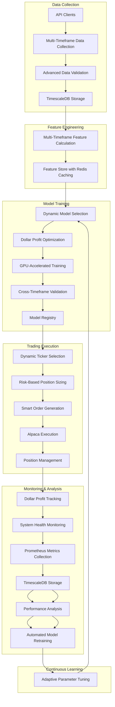

# AI Trading System Production Readiness Plan

## Executive Summary

This document outlines a comprehensive plan to make our AI Trading System production-ready by aligning our current implementation with the optimization plan. It identifies gaps in the current system, provides detailed implementation steps, and prioritizes tasks to ensure a robust, high-performance trading system capable of maximizing dollar profit while managing risk effectively.

## System Architecture Overview



## Gap Analysis & Implementation Plan

### 1. Data Collection Pipeline Enhancements

**Current Status:**
- Basic data collection from Polygon.io and Unusual Whales APIs
- Single timeframe data collection
- Basic data validation
- Storage in TimescaleDB

**Missing Components:**
- Multi-timeframe data collection (1-min, 5-min, 15-min, hourly)
- Advanced market microstructure features
- Real-time feature calculation pipeline
- Dynamic feature importance analysis

**Implementation Plan:**
1. Extend `ProductionDataPipeline` to support multiple timeframes:
   ```python
   def collect_multi_timeframe_data(self, tickers, timeframes=['1m', '5m', '15m', '1h']):
       """Collect data for multiple timeframes in parallel"""
       results = {}
       with concurrent.futures.ThreadPoolExecutor() as executor:
           futures = {executor.submit(self.collect_data, tickers, tf): tf for tf in timeframes}
           for future in concurrent.futures.as_completed(futures):
               timeframe = futures[future]
               results[timeframe] = future.result()
       return results
   ```

2. Add market microstructure features:
   - Order book imbalance metrics
   - Trade flow imbalance
   - Volume-weighted price pressure
   - Relative strength across timeframes

3. Optimize real-time feature calculation with parallel processing:
   ```python
   def calculate_features_parallel(self, market_data, timeframes=['1m', '5m', '15m', '1h']):
       """Calculate features for multiple timeframes in parallel"""
       features = {}
       with concurrent.futures.ProcessPoolExecutor() as executor:
           futures = {executor.submit(self.calculate_features, market_data[tf], tf): tf 
                     for tf in timeframes}
           for future in concurrent.futures.as_completed(futures):
               timeframe = futures[future]
               features[timeframe] = future.result()
       return features
   ```

4. Implement feature importance analysis module:
   ```python
   class FeatureImportanceAnalyzer:
       def __init__(self, feature_store):
           self.feature_store = feature_store
           self.importance_history = {}
           
       def analyze_feature_importance(self, model, features, target):
           """Analyze feature importance using model-specific methods"""
           if hasattr(model, 'feature_importances_'):
               # For tree-based models
               importances = model.feature_importances_
           elif hasattr(model, 'coef_'):
               # For linear models
               importances = np.abs(model.coef_)
           else:
               # Use permutation importance
               importances = self._calculate_permutation_importance(model, features, target)
               
           # Update importance history
           for feature, importance in zip(features.columns, importances):
               if feature not in self.importance_history:
                   self.importance_history[feature] = []
               self.importance_history[feature].append(importance)
               
           return dict(zip(features.columns, importances))
   ```

**API Integration:**
For detailed implementation of the Polygon.io and Unusual Whales API clients with enhanced performance features, refer to the [API Integration Reference](api_integration_reference.md) document. This reference includes:

- Client architecture for both APIs
- Performance optimizations (connection pooling, caching, circuit breakers)
- Error handling strategies
- Integration with the feature store
- Production considerations for API rate limiting and fault tolerance

### 2. Model Training & Optimization

**Current Status:**
- Basic XGBoost model implementation
- LSTM model with GPU support
- Basic walk-forward validation

**Missing Components:**
- Dollar profit-weighted objective functions
- Multi-timeframe input architecture for LSTM
- Multi-head attention mechanism
- Residual connections for better gradient flow
- Confidence scoring based on prediction variance
- Adaptive learning rate based on market volatility

**Implementation Plan:**
1. Implement dollar profit-weighted objective function:
   ```python
   def dollar_profit_objective(y_pred, dtrain):
       """Custom objective function to maximize dollar profit"""
       y_true = dtrain.get_label()
       # Convert to trade direction (1 for long, -1 for short, 0 for no trade)
       trade_direction = np.sign(y_pred)
       
       # Get price data and position sizes from metadata
       price_data = dtrain.get_float_info('price_data')
       position_sizes = dtrain.get_float_info('position_sizes')
       
       # Calculate dollar profit for each prediction
       future_returns = price_data[:, 1] / price_data[:, 0] - 1
       dollar_profit = trade_direction * future_returns * position_sizes
       
       # Calculate gradient and hessian
       grad = -dollar_profit
       hess = np.ones_like(dollar_profit)
       
       return grad, hess
   ```

2. Enhance LSTM model with multi-timeframe capabilities:
   ```python
   class MultiTimeframeLSTM:
       def __init__(self, timeframes=['1m', '5m', '15m', '1h']):
           self.timeframes = timeframes
           self.models = {}
           
       def build_model(self, input_shapes):
           """Build multi-timeframe LSTM model"""
           # Create input layers for each timeframe
           inputs = {}
           lstm_outputs = {}
           
           for tf in self.timeframes:
               inputs[tf] = Input(shape=input_shapes[tf], name=f'input_{tf}')
               
               # LSTM layers for each timeframe
               x = LSTM(128, return_sequences=True)(inputs[tf])
               x = BatchNormalization()(x)
               x = Dropout(0.2)(x)
               
               # Attention mechanism
               attention = Attention()([x, x])
               
               # Final LSTM layer
               lstm_outputs[tf] = LSTM(64)(attention)
           
           # Concatenate outputs from all timeframes
           if len(self.timeframes) > 1:
               concat = Concatenate()([lstm_outputs[tf] for tf in self.timeframes])
           else:
               concat = lstm_outputs[self.timeframes[0]]
           
           # Dense layers
           x = Dense(64, activation='relu')(concat)
           x = BatchNormalization()(x)
           x = Dropout(0.2)(x)
           
           # Output layer for dollar profit prediction
           output = Dense(1, activation='linear', name='dollar_profit')(x)
           
           # Create model
           model = Model(inputs=[inputs[tf] for tf in self.timeframes], outputs=output)
           
           return model
   ```

3. Implement confidence scoring based on prediction variance:
   ```python
   def calculate_prediction_confidence(self, model, features, n_iterations=10):
       """Calculate prediction confidence based on Monte Carlo Dropout"""
       predictions = []
       for _ in range(n_iterations):
           pred = model.predict(features, training=True)  # Enable dropout during inference
           predictions.append(pred)
           
       # Calculate mean and variance
       mean_pred = np.mean(predictions, axis=0)
       var_pred = np.var(predictions, axis=0)
       
       # Calculate confidence (inverse of variance, normalized)
       confidence = 1.0 / (1.0 + var_pred)
       
       return mean_pred, confidence
   ```

### 3. Dynamic Timeframe & Holding Period Optimization

**Current Status:**
- Basic timeframe selector
- Simple peak detection algorithm

**Missing Components:**
- Adaptive timeframe selection based on market conditions
- Advanced peak detection algorithm
- Dynamic holding period optimizer
- Profit maximization projections

**Implementation Plan:**
1. Enhance timeframe selector with adaptive selection:
   ```python
   class TimeframeSelector:
       def __init__(self, timeframes=['1m', '5m', '15m', '1h']):
           self.timeframes = timeframes
           self.performance_history = {tf: [] for tf in timeframes}
           
       def select_optimal_timeframe(self, market_data, volatility, volume, spread):
           """Select optimal timeframe based on current market conditions"""
           # Calculate timeframe scores
           scores = {}
           for tf in self.timeframes:
               # Base score on historical performance
               base_score = np.mean(self.performance_history[tf][-20:]) if self.performance_history[tf] else 0
               
               # Adjust for current market conditions
               vol_factor = self._get_volatility_factor(volatility, tf)
               vol_score = base_score * vol_factor
               
               # Adjust for volume
               volume_factor = self._get_volume_factor(volume, tf)
               vol_vol_score = vol_score * volume_factor
               
               # Adjust for spread
               spread_factor = self._get_spread_factor(spread, tf)
               final_score = vol_vol_score * spread_factor
               
               scores[tf] = final_score
               
           # Return timeframe with highest score
           return max(scores.items(), key=lambda x: x[1])[0]
   ```

2. Implement advanced peak detection algorithm:
   ```python
   class PeakDetector:
       def __init__(self, window_sizes=[5, 10, 20], sensitivity=0.5):
           self.window_sizes = window_sizes
           self.sensitivity = sensitivity
           
       def detect_peak(self, price_series, volume_series, position_type='long'):
           """Detect if price is at a peak for exit decision"""
           signals = []
           
           # Calculate momentum oscillators
           for window in self.window_sizes:
               # RSI
               rsi = self._calculate_rsi(price_series, window)
               
               # Rate of change
               roc = price_series.pct_change(window)
               
               # Volume rate of change
               vol_roc = volume_series.pct_change(window)
               
               # Generate signal based on position type
               if position_type == 'long':
                   # For long positions, look for overbought conditions
                   signal = (rsi > 70) & (roc < 0) & (vol_roc < 0)
               else:
                   # For short positions, look for oversold conditions
                   signal = (rsi < 30) & (roc > 0) & (vol_roc < 0)
                   
               signals.append(signal)
               
           # Combine signals with voting
           combined_signal = sum(signals) >= (self.sensitivity * len(self.window_sizes))
           
           return combined_signal
   ```

3. Develop dynamic holding period optimizer:
   ```python
   class HoldingPeriodOptimizer:
       def __init__(self, timeframes=['1m', '5m', '15m', '1h']):
           self.timeframes = timeframes
           self.optimal_periods = {tf: 0 for tf in timeframes}
           
       def optimize_holding_period(self, timeframe, volatility, historical_performance):
           """Optimize holding period based on timeframe and market conditions"""
           # Base holding period on timeframe
           base_period = self._get_base_period(timeframe)
           
           # Adjust for volatility
           vol_adjusted = base_period * self._get_volatility_adjustment(volatility)
           
           # Adjust for historical performance
           hist_adjusted = vol_adjusted * self._get_historical_adjustment(historical_performance)
           
           # Round to nearest integer
           optimal_period = max(1, round(hist_adjusted))
           
           # Update optimal periods
           self.optimal_periods[timeframe] = optimal_period
           
           return optimal_period
   ```

### 4. Trade Execution Optimization

**Current Status:**
- Basic Alpaca API integration
- Simple order type selection
- Basic position sizing

**Missing Components:**
- Smart order routing
- Advanced execution algorithms
- Execution quality analysis
- Slippage measurement and analysis
- Market impact analysis

**Implementation Plan:**
1. Implement order type selection framework:
   ```python
   class OrderTypeSelector:
       def __init__(self, market_impact_threshold=0.1, urgency_threshold=0.7):
           self.market_impact_threshold = market_impact_threshold
           self.urgency_threshold = urgency_threshold
           
       def select_order_type(self, ticker, position_size, prediction_confidence, 
                             volatility, liquidity, time_sensitivity):
           """Select optimal order type based on trading parameters"""
           # Calculate market impact
           market_impact = self._calculate_market_impact(position_size, liquidity)
           
           # Determine execution urgency
           urgency = time_sensitivity * prediction_confidence
           
           if market_impact > self.market_impact_threshold:
               if urgency > self.urgency_threshold:
                   return "TWAP", {"duration_minutes": 30}
               else:
                   return "Iceberg", {"display_size": position_size * 0.1}
           else:
               if urgency > self.urgency_threshold:
                   return "Market", {}
               else:
                   return "Limit", {"price_offset": volatility * 0.5}
   ```

2. Create execution quality analysis module:
   ```python
   class ExecutionQualityAnalyzer:
       def analyze_execution(self, order, executions, market_data):
           """Analyze execution quality for an order"""
           # Calculate slippage
           decision_price = order.decision_price
           executed_price = sum(e.price * e.quantity for e in executions) / sum(e.quantity for e in executions)
           slippage_bps = (executed_price - decision_price) / decision_price * 10000
           
           # Calculate market impact
           pre_order_price = market_data.get_price(order.ticker, order.timestamp - timedelta(minutes=5))
           post_order_price = market_data.get_price(order.ticker, order.timestamp + timedelta(minutes=5))
           market_impact_bps = (post_order_price - pre_order_price) / pre_order_price * 10000
           
           # Calculate implementation shortfall
           theoretical_value = order.quantity * decision_price
           actual_value = sum(e.price * e.quantity for e in executions)
           implementation_shortfall = (actual_value - theoretical_value) / theoretical_value
           
           return {
               "slippage_bps": slippage_bps,
               "market_impact_bps": market_impact_bps,
               "implementation_shortfall": implementation_shortfall
           }
   ```

### 5. Risk Management Enhancements

**Current Status:**
- Basic position sizing within limits
- Simple stop-loss implementation

**Missing Components:**
- Adaptive stop-loss based on volatility
- Dynamic profit targets with peak detection
- Risk-of-ruin protection
- Portfolio-level risk management
- Correlation-based position sizing

**Implementation Plan:**
1. Implement adaptive stop-loss mechanism:
   ```python
   class AdaptiveStopLoss:
       def __init__(self, base_atr_multiplier=2.0, min_stop_pct=0.005, max_stop_pct=0.03):
           self.base_atr_multiplier = base_atr_multiplier
           self.min_stop_pct = min_stop_pct
           self.max_stop_pct = max_stop_pct
           
       def calculate_stop_loss(self, entry_price, atr, volatility_regime, position_type='long'):
           """Calculate adaptive stop loss based on volatility"""
           # Adjust ATR multiplier based on volatility regime
           if volatility_regime == 'low':
               atr_multiplier = self.base_atr_multiplier * 0.8
           elif volatility_regime == 'high':
               atr_multiplier = self.base_atr_multiplier * 1.2
           else:
               atr_multiplier = self.base_atr_multiplier
               
           # Calculate stop distance
           stop_distance = atr * atr_multiplier
           
           # Calculate stop percentage
           stop_pct = stop_distance / entry_price
           
           # Ensure stop percentage is within bounds
           stop_pct = max(self.min_stop_pct, min(self.max_stop_pct, stop_pct))
           
           # Calculate stop price
           if position_type == 'long':
               stop_price = entry_price * (1 - stop_pct)
           else:
               stop_price = entry_price * (1 + stop_pct)
               
           return stop_price, stop_pct
   ```

2. Implement portfolio-level risk management:
   ```python
   class PortfolioRiskManager:
       def __init__(self, max_portfolio_risk=0.05, max_correlation=0.7):
           self.max_portfolio_risk = max_portfolio_risk
           self.max_correlation = max_correlation
           self.positions = {}
           
       def calculate_portfolio_risk(self):
           """Calculate total portfolio risk based on position correlations"""
           if not self.positions:
               return 0.0
               
           # Calculate correlation matrix
           returns = self._get_position_returns()
           correlation_matrix = returns.corr()
           
           # Calculate position weights
           total_value = sum(p['value'] for p in self.positions.values())
           weights = {ticker: p['value'] / total_value for ticker, p in self.positions.items()}
           
           # Calculate portfolio variance
           portfolio_variance = 0.0
           for ticker1, weight1 in weights.items():
               for ticker2, weight2 in weights.items():
                   correlation = correlation_matrix.loc[ticker1, ticker2]
                   vol1 = self.positions[ticker1]['volatility']
                   vol2 = self.positions[ticker2]['volatility']
                   portfolio_variance += weight1 * weight2 * correlation * vol1 * vol2
                   
           # Calculate portfolio risk
           portfolio_risk = np.sqrt(portfolio_variance)
           
           return portfolio_risk
           
       def can_add_position(self, ticker, value, volatility, returns):
           """Check if adding a position would exceed risk limits"""
           # Add position temporarily
           self.positions[ticker] = {'value': value, 'volatility': volatility, 'returns': returns}
           
           # Calculate new portfolio risk
           portfolio_risk = self.calculate_portfolio_risk()
           
           # Calculate correlations with existing positions
           correlations = self._calculate_correlations(ticker)
           max_correlation = max(correlations.values()) if correlations else 0.0
           
           # Remove temporary position
           del self.positions[ticker]
           
           # Check if risk limits would be exceeded
           if portfolio_risk > self.max_portfolio_risk:
               return False, "Portfolio risk limit exceeded"
           if max_correlation > self.max_correlation:
               return False, f"Correlation limit exceeded with {max(correlations, key=correlations.get)}"
               
           return True, ""
   ```

### 6. Performance Analysis & Monitoring

**Current Status:**
- Basic system monitoring with Prometheus
- Simple performance tracking
- Grafana dashboards
- Slack alerting for critical events

**Missing Components:**
- Comprehensive dollar profit metrics
- Risk-adjusted performance metrics
- Attribution analysis for profit sources
- Performance forecasting
- Drawdown monitoring
- Integrated monitoring infrastructure with Redis, Prometheus, Grafana, and Slack

**Implementation Plan:**
1. Implement dollar profit metrics:
   ```python
   class DollarProfitAnalyzer:
       def analyze_dollar_profit(self, trades, positions, predictions):
           """Analyze dollar profit across multiple dimensions"""
           # Calculate total dollar profit
           total_profit = sum(t.realized_profit for t in trades)
           
           # Calculate average dollar profit per trade
           avg_profit_per_trade = total_profit / len(trades) if trades else 0
           
           # Calculate dollar profit by ticker
           profit_by_ticker = {}
           for t in trades:
               profit_by_ticker[t.ticker] = profit_by_ticker.get(t.ticker, 0) + t.realized_profit
           
           # Calculate dollar profit by timeframe
           profit_by_timeframe = {}
           for t in trades:
               profit_by_timeframe[t.timeframe] = profit_by_timeframe.get(t.timeframe, 0) + t.realized_profit
           
           # Calculate dollar profit by model
           profit_by_model = {}
           for t in trades:
               profit_by_model[t.model] = profit_by_model.get(t.model, 0) + t.realized_profit
           
           return {
               "total_profit": total_profit,
               "avg_profit_per_trade": avg_profit_per_trade,
               "profit_by_ticker": profit_by_ticker,
               "profit_by_timeframe": profit_by_timeframe,
               "profit_by_model": profit_by_model
           }
   ```

2. Implement risk-adjusted performance metrics:
   ```python
   class PerformanceAnalyzer:
       def calculate_risk_adjusted_metrics(self, daily_returns, risk_free_rate=0.0):
           """Calculate risk-adjusted performance metrics"""
           # Calculate annualized return
           annual_return = np.mean(daily_returns) * 252
           
           # Calculate annualized volatility
           annual_volatility = np.std(daily_returns) * np.sqrt(252)
           
           # Calculate Sharpe ratio
           sharpe_ratio = (annual_return - risk_free_rate) / annual_volatility if annual_volatility > 0 else 0
           
           # Calculate Sortino ratio (downside deviation)
           downside_returns = daily_returns[daily_returns < 0]
           downside_deviation = np.std(downside_returns) * np.sqrt(252) if len(downside_returns) > 0 else 0
           sortino_ratio = (annual_return - risk_free_rate) / downside_deviation if downside_deviation > 0 else 0
           
           # Calculate maximum drawdown
           cumulative_returns = (1 + daily_returns).cumprod()
           max_drawdown = 0
           peak = cumulative_returns[0]
           for ret in cumulative_returns:
               if ret > peak:
                   peak = ret
               drawdown = (peak - ret) / peak
               max_drawdown = max(max_drawdown, drawdown)
           
           # Calculate Calmar ratio
           calmar_ratio = annual_return / max_drawdown if max_drawdown > 0 else 0
           
           # Calculate profit factor
           gross_profit = np.sum(daily_returns[daily_returns > 0])
           gross_loss = np.abs(np.sum(daily_returns[daily_returns < 0]))
           profit_factor = gross_profit / gross_loss if gross_loss > 0 else float('inf')
           
           return {
               "annual_return": annual_return,
               "annual_volatility": annual_volatility,
               "sharpe_ratio": sharpe_ratio,
               "sortino_ratio": sortino_ratio,
               "max_drawdown": max_drawdown,
               "calmar_ratio": calmar_ratio,
               "profit_factor": profit_factor
           }
   ```

3. Implement comprehensive monitoring infrastructure:
   ```python
   class MonitoringInfrastructure:
       def __init__(self, config):
           self.config = config
           self.prometheus_client = PrometheusClient(config['prometheus'])
           self.timescale_client = TimescaleDBClient(config['timescaledb'])
           self.slack_notifier = SlackNotifier(config['slack'])
           self.collectors = {}
           
       def initialize(self):
           """Initialize monitoring infrastructure"""
           # Initialize Prometheus client
           self.prometheus_client.initialize()
           
           # Initialize TimescaleDB client
           self.timescale_client.initialize()
           
           # Initialize Slack notifier
           self.slack_notifier.initialize()
           
           # Initialize collectors
           self.collectors['system'] = SystemMetricsCollector(self.prometheus_client)
           self.collectors['trading'] = TradingMetricsCollector(self.prometheus_client)
           self.collectors['model'] = ModelMetricsCollector(self.prometheus_client)
           self.collectors['data_pipeline'] = DataPipelineMetricsCollector(self.prometheus_client)
           
           # Start collectors
           for collector in self.collectors.values():
               collector.start()
               
           return True
           
       def shutdown(self):
           """Shutdown monitoring infrastructure"""
           # Stop collectors
           for collector in self.collectors.values():
               collector.stop()
               
           # Shutdown Prometheus client
           self.prometheus_client.shutdown()
           
           # Shutdown TimescaleDB client
           self.timescale_client.shutdown()
           
           # Shutdown Slack notifier
           self.slack_notifier.shutdown()
           
           return True
   ```

4. Configure Grafana dashboards with Prometheus and TimescaleDB data sources:
   ```python
   class GrafanaDashboardManager:
       def __init__(self, config):
           self.config = config
           self.grafana_url = config['grafana_url']
           self.api_key = config['api_key']
           
       def setup_data_sources(self):
           """Set up Prometheus and TimescaleDB data sources in Grafana"""
           # Set up Prometheus data source
           prometheus_ds = {
               "name": "Prometheus",
               "type": "prometheus",
               "url": self.config['prometheus_url'],
               "access": "proxy",
               "isDefault": True
           }
           
           # Set up TimescaleDB data source
           timescaledb_ds = {
               "name": "TimescaleDB",
               "type": "postgres",
               "url": self.config['timescaledb_host'],
               "database": self.config['timescaledb_database'],
               "user": self.config['timescaledb_user'],
               "secureJsonData": {
                   "password": self.config['timescaledb_password']
               }
           }
           
           # Create data sources in Grafana
           self._create_data_source(prometheus_ds)
           self._create_data_source(timescaledb_ds)
   ```

### 7. System Integration & Operations

**Current Status:**
- Basic startup/shutdown procedures
- Simple system controller
- Docker containerization

**Missing Components:**
- Comprehensive configuration system
- Proper component lifecycle management
- Graceful shutdown procedure
- Emergency shutdown with position liquidation
- System recovery procedures
- Production deployment plan

**Implementation Plan:**
1. Implement comprehensive configuration system:
   ```python
   class ConfigurationManager:
       def __init__(self, config_path):
           self.config_path = config_path
           self.config = self.load_config()
           self.validators = {
               'database': self.validate_database_config,
               'api_keys': self.validate_api_keys,
               'trading': self.validate_trading_config,
               'models': self.validate_model_config,
               'monitoring': self.validate_monitoring_config
           }
           
       def load_config(self):
           """Load configuration from file"""
           with open(self.config_path, 'r') as f:
               config = json.load(f)
           return config
           
       def validate_config(self):
           """Validate all configuration sections"""
           validation_results = {}
           for section, validator in self.validators.items():
               if section in self.config:
                   validation_results[section] = validator(self.config[section])
               else:
                   validation_results[section] = False
                   
           return all(validation_results.values()), validation_results
           
       def get_config(self, section, key=None):
           """Get configuration value"""
           if section not in self.config:
               raise ValueError(f"Configuration section '{section}' not found")
               
           if key is None:
               return self.config[section]
               
           if key not in self.config[section]:
               raise ValueError(f"Configuration key '{key}' not found in section '{section}'")
               
           return self.config[section][key]
   ```

2. Implement system controller with proper lifecycle management:
   ```python
   class SystemController:
       def __init__(self, config_path):
           """Initialize system controller"""
           self.config = ConfigurationManager(config_path)
           self.logger = logging.getLogger(__name__)
           self.components = {}
           self.status = "OFFLINE"
           
       def startup(self):
           """Execute system startup procedure"""
           self.logger.info("Initiating system startup sequence")
           self.status = "STARTING"
           
           try:
               # Step 1: Initialize database connections
               self.logger.info("Initializing database connections")
               self.components['database'] = self.initialize_database()
               
               # Step 2: Start data collection services
               self.logger.info("Starting data collection services")
               self.components['data_collection'] = self.start_data_collection()
               
               # Step 3: Load and initialize models
               self.logger.info("Loading prediction models")
               self.components['models'] = self.load_models()
               
               # Step 4: Initialize trading services
               self.logger.info("Initializing trading services")
               self.components['trading'] = self.initialize_trading_services()
               
               # Step 5: Start monitoring services
               self.logger.info("Starting monitoring services")
               self.components['monitoring'] = self.start_monitoring()
               
               # Step 6: Perform system checks
               self.logger.info("Performing system checks")
               check_results = self.perform_system_checks()
               
               if all(check_results.values()):
                   self.status = "ONLINE"
                   self.logger.info("System startup completed successfully")
                   return True
               else:
                   failed_checks = [k for k, v in check_results.items() if not v]
                   self.logger.error(f"System checks failed: {failed_checks}")
                   self.shutdown()
                   return False
                   
           except Exception as e:
               self.logger.error(f"Error during startup: {e}")
               self.emergency_shutdown()
               return False
       
       def shutdown(self):
           """Execute graceful system shutdown procedure"""
           self.logger.info("Initiating graceful system shutdown")
           self.status = "SHUTTING_DOWN"
           
           try:
               # Step 1: Close all trading positions if configured
               if self.config.get_config('trading', 'close_positions_on_shutdown'):
                   self.logger.info("Closing all trading positions")
                   self.close_all_positions()
               
               # Step 2: Shutdown trading services
               self.logger.info("Shutting down trading services")
               if 'trading' in self.components:
                   self.components['trading'].shutdown()
               
               # Step 3: Shutdown data collection services
               self.logger.info("Shutting down data collection services")
               if 'data_collection' in self.components:
                   self.components['data_collection'].shutdown()
               
               # Step 4: Unload models
               self.logger.info("Unloading models")
               if 'models' in self.components:
                   self.components['models'].unload()
               
               # Step 5: Shutdown monitoring services
               self.logger.info("Shutting down monitoring services")
               if 'monitoring' in self.components:
                   self.components['monitoring'].shutdown()
               
               # Step 6: Close database connections
               self.logger.info("Closing database connections")
               if 'database' in self.components:
                   self.components['database'].close()
               
               self.status = "OFFLINE"
               self.logger.info("System shutdown completed successfully")
               return True
               
           except Exception as e:
               self.logger.error(f"Error during shutdown: {e}")
               self.status = "ERROR"
               return False
               
       def emergency_shutdown(self):
           """Execute emergency shutdown procedure"""
           self.logger.critical("INITIATING EMERGENCY SHUTDOWN")
           self.status = "EMERGENCY_SHUTDOWN"
           
           try:
               # Step 1: Liquidate all positions immediately
               self.logger.critical("Liquidating all positions")
               self.liquidate_all_positions()
               
               # Step 2: Backup critical data
               self.logger.critical("Backing up critical data")
               self.backup_critical_data()
               
               # Step 3: Send emergency notifications
               self.logger.critical("Sending emergency notifications")
               self.send_emergency_notifications()
               
               # Step 4: Halt all services
               self.logger.critical("Halting all services")
               for component_name, component in self.components.items():
                   try:
                       if hasattr(component, 'emergency_shutdown'):
                           component.emergency_shutdown()
                       elif hasattr(component, 'shutdown'):
                           component.shutdown()
                   except Exception as e:
                       self.logger.error(f"Error shutting down {component_name}: {e}")
               
               # Step 5: Prepare for recovery
               self.logger.critical("Preparing for recovery")
               self.prepare_for_recovery()
               
               self.status = "OFFLINE_EMERGENCY"
               self.logger.critical("Emergency shutdown completed")
               return True
               
           except Exception as e:
               self.logger.critical(f"Critical error during emergency shutdown: {e}")
               self.status = "UNKNOWN"
               return False
   ```

### 8. Continuous Learning Pipeline

**Current Status:**
- Basic model retraining capability

**Missing Components:**
- Automated model retraining based on performance
- Feature importance tracking over time
- Adaptive parameter tuning
- Market regime detection
- Ensemble weighting based on performance

**Implementation Plan:**
1. Implement automated model retraining pipeline:
   ```python
   class ContinuousLearningPipeline:
       def __init__(self, model_registry, feature_store, performance_analyzer):
           self.model_registry = model_registry
           self.feature_store = feature_store
           self.performance_analyzer = performance_analyzer
           self.retraining_schedule = {}
           
       def schedule_retraining(self, model_id, frequency='daily', performance_threshold=0.05):
           """Schedule model retraining based on frequency or performance degradation"""
           self.retraining_schedule[model_id] = {
               'frequency': frequency,
               'performance_threshold': performance_threshold,
               'last_retrained': None,
               'baseline_performance': None
           }
           
       def check_retraining_needs(self):
           """Check if any models need retraining"""
           models_to_retrain = []
           
           for model_id, schedule in self.retraining_schedule.items():
               # Check if model exists
               if not self.model_registry.model_exists(model_id):
                   continue
                   
               # Get current model performance
               current_performance = self.performance_analyzer.get_model_performance(model_id)
               
               # Check if baseline performance is set
               if schedule['baseline_performance'] is None:
                   schedule['baseline_performance'] = current_performance
                   continue
                   
               # Check if performance has degraded
               performance_degradation = (schedule['baseline_performance'] - current_performance) / schedule['baseline_performance']
               
               # Check if time-based retraining is needed
               time_based_retraining = False
               if schedule['frequency'] == 'daily':
                   if schedule['last_retrained'] is None or (datetime.now() - schedule['last_retrained']).days >= 1:
                       time_based_retraining = True
               elif schedule['frequency'] == 'weekly':
                   if schedule['last_retrained'] is None or (datetime.now() - schedule['last_retrained']).days >= 7:
                       time_based_retraining = True
                       
               # Check if retraining is needed
               if performance_degradation > schedule['performance_threshold'] or time_based_retraining:
                   models_to_retrain.append(model_id)
                   
           return models_to_retrain
           
       def retrain_model(self, model_id):
           """Retrain a model with the latest data"""
           # Get model metadata
           model_metadata = self.model_registry.get_model_metadata(model_id)
           
           # Get training data
           training_data = self.feature_store.get_training_data(
               tickers=model_metadata['tickers'],
               timeframe=model_metadata['timeframe'],
               start_date=datetime.now() - timedelta(days=model_metadata['training_days']),
               end_date=datetime.now()
           )
           
           # Train model
           model_trainer = ModelTrainer(model_metadata['model_type'])
           new_model = model_trainer.train(
               training_data['features'],
               training_data['target'],
               model_metadata['hyperparameters']
           )
           
           # Evaluate model
           evaluation_results = model_trainer.evaluate(
               new_model,
               training_data['features_val'],
               training_data['target_val']
           )
           
           # Register new model version
           new_model_id = self.model_registry.register_model(
               new_model,
               model_metadata['model_type'],
               model_metadata['timeframe'],
               evaluation_results,
               model_metadata['hyperparameters']
           )
           
           # Update retraining schedule
           self.retraining_schedule[new_model_id] = self.retraining_schedule[model_id]
           self.retraining_schedule[new_model_id]['last_retrained'] = datetime.now()
           self.retraining_schedule[new_model_id]['baseline_performance'] = evaluation_results['performance']
           
           # Remove old schedule
           del self.retraining_schedule[model_id]
           
           return new_model_id, evaluation_results
   ```

## Implementation Prioritization

Based on the TODO list and optimization plan, here's the recommended implementation prioritization:

### Phase 1: Core Data Pipeline & Model Enhancements (Weeks 1-2)
1. Implement multi-timeframe data collection
2. Develop real-time feature calculation pipeline
3. Add market microstructure features
4. Implement dollar profit-weighted objective function
5. Enhance LSTM model with multi-timeframe capabilities

### Phase 2: Trading Strategy Optimization (Weeks 3-4)
1. Implement adaptive timeframe selection
2. Develop advanced peak detection algorithm
3. Create dynamic holding period optimizer
4. Implement adaptive stop-loss mechanism
5. Develop dynamic profit targets

### Phase 3: Execution & Risk Management (Weeks 5-6)
1. Implement order type selection framework
2. Create execution quality analysis module
3. Implement portfolio-level risk management
4. Develop correlation-based position sizing
5. Create comprehensive performance analysis

### Phase 4: System Integration & Production Readiness (Weeks 7-8)
1. Implement comprehensive configuration system
2. Enhance system controller with proper lifecycle management
3. Create graceful shutdown procedure
4. Implement emergency shutdown with position liquidation
5. Develop system recovery procedures
6. Create production deployment plan

## Updated TODO List

```markdown
# AI Trading System Implementation To-Do List

## Phase 1: Foundation (Weeks 1-2)

### 1. Environment Setup
- [x] Set up development environment with required dependencies
- [x] Configure GPU environment with NVIDIA drivers and CUDA
- [x] Set up Docker with NVIDIA Container Toolkit
- [x] Configure TimescaleDB for time-series data storage
- [x] Set up Alpaca API credentials and test connectivity
- [x] Implement Redis for caching and inter-process communication
- [x] Create configuration files for different environments (dev, test, prod)

### 2. Data Pipeline Implementation
- [ ] Implement multi-timeframe data collection (1-min, 5-min, 15-min, hourly)
- [ ] Develop data cleaning and preprocessing pipeline
- [ ] Implement feature engineering for each timeframe
- [ ] Create feature store with TimescaleDB optimization
- [ ] Implement real-time feature calculation pipeline
- [ ] Add market microstructure features (order book imbalance, trade flow, etc.)
- [ ] Develop feature importance analysis module

### 3. Model Development
- [x] Implement XGBoost model with dollar profit optimization
- [ ] Develop custom objective function for dollar profit maximization
- [ ] Implement LSTM model with multi-timeframe capabilities
- [ ] Add mixed precision support for GPU acceleration
- [ ] Implement model validation framework with cross-timeframe validation
- [ ] Create model persistence and versioning system
- [ ] Develop model serving infrastructure

### 4. Basic Trading Components
- [x] Implement dynamic ticker selector
- [x] Develop risk-based position sizer
- [x] Create basic peak detection algorithm
- [x] Implement timeframe selector
- [x] Develop Alpaca API integration for trade execution
- [x] Create portfolio management module
- [x] Implement basic system controller with startup/shutdown procedures

## Phase 2: Advanced Optimization (Weeks 3-4)

### 5. Enhanced Model Capabilities
- [ ] Implement multi-head attention mechanism for LSTM
- [ ] Add residual connections for better gradient flow
- [ ] Develop profit-weighted loss functions
- [ ] Implement confidence scoring based on prediction variance
- [ ] Add adaptive learning rate based on market volatility
- [ ] Implement quantile regression for risk assessment
- [ ] Develop Bayesian optimization for hyperparameters

### 6. Advanced Trading Strategies
- [ ] Enhance dynamic timeframe selection with market regime detection
- [ ] Improve peak detection with multiple indicators
- [ ] Implement adaptive exit timing based on volatility
- [ ] Develop profit target scaling based on timeframe
- [ ] Create stop loss optimization based on volatility
- [ ] Implement position sizing algorithm optimized for dollar returns
- [ ] Develop trade selection framework for highest expected dollar profit

### 7. Execution Optimization
- [x] Implement order type selection framework 
- [ ] Develop smart order routing system
- [ ] Create execution algorithms (Adaptive TWAP, Smart VWAP)
- [ ] Implement latency optimization techniques
- [ ] Develop execution quality analysis module
- [ ] Create slippage measurement and analysis tools
- [ ] Implement market impact analysis

### 8. System Monitoring Setup
- [x] Develop metrics collection system for all components
- [x] Create time-series database for metrics storage
- [x] Implement dashboard server with Flask
- [x] Create CPU/GPU utilization gauges with Apache ECharts
- [x] Develop financial performance charts
- [x] Create model performance visualization
- [x] Implement system health monitors
- [x] Develop alerting system for critical events
- [ ] Enhance Prometheus metrics collection
- [ ] Optimize Redis caching for monitoring data
- [ ] Create comprehensive Grafana dashboards
- [ ] Implement advanced Slack alerting with actionable notifications

## Phase 3: Integration & Testing (Weeks 5-6)

### 9. System Integration
- [ ] Integrate all components into unified pipeline
- [ ] Implement comprehensive configuration system
- [ ] Create system controller with proper component lifecycle management
- [ ] Develop startup sequence with dependency checks
- [ ] Implement graceful shutdown procedure
- [ ] Create emergency shutdown with position liquidation
- [ ] Develop system recovery procedures

### 10. Testing & Validation
- [ ] Implement comprehensive backtesting framework
- [ ] Create historical simulation environment
- [ ] Develop Monte Carlo analysis for strategy robustness
- [ ] Implement sensitivity analysis for parameters
- [ ] Create transaction cost modeling
- [ ] Develop market impact simulation
- [ ] Implement end-to-end system tests

### 11. Performance Optimization
- [ ] Optimize database queries for real-time performance
- [x] Implement caching strategies for frequently accessed data with Redis 
- [ ] Optimize GPU utilization for model inference
- [ ] Develop parallel processing for feature calculation
- [ ] Implement tiered resource allocation for focus tickers
- [ ] Create memory optimization strategies
- [ ] Develop network optimization for low latency

### 12. Documentation & Deployment
- [ ] Create comprehensive system documentation
- [ ] Develop user guides for system operation
- [ ] Create API documentation for all components
- [ ] Implement continuous integration pipeline
- [ ] Develop deployment scripts for production
- [ ] Create system monitoring documentation
- [ ] Develop troubleshooting guides

## Phase 4: Production Readiness (Weeks 7-8)

### 13. Risk Management Implementation
- [x] Implement dollar-based position sizing within limits 
- [ ] Develop adaptive stop-loss based on volatility
- [ ] Create dynamic profit targets with peak detection
- [ ] Implement risk-of-ruin protection
- [ ] Develop portfolio-level risk management
- [ ] Create correlation-based position sizing
- [ ] Implement market regime-based risk adjustment

### 14. Performance Analysis Tools
- [ ] Implement dollar profit metrics calculation
- [ ] Develop risk-adjusted performance metrics
- [ ] Create attribution analysis for profit sources
- [ ] Implement real-time performance monitoring
- [ ] Develop performance forecasting tools
- [ ] Create drawdown monitoring system
- [ ] Implement risk limit enforcement

### 15. Continuous Learning Pipeline
- [ ] Develop model retraining pipeline based on performance
- [ ] Implement feature importance tracking over time
- [ ] Create adaptive parameter tuning based on market conditions
- [ ] Develop market regime detection for model selection
- [ ] Implement ensemble weighting based on performance
- [ ] Create model performance evaluation framework
- [ ] Develop continuous improvement process

### 16. Final System Integration
- [ ] Perform end-to-end system testing
- [ ] Conduct stress testing under various market conditions
- [ ] Implement final performance optimizations
- [ ] Create production deployment plan
- [ ] Develop monitoring and alerting strategy
- [ ] Create incident response procedures
- [ ] Implement final security measures

## Daily Operations Tasks

### 17. Pre-Market Preparation
- [ ] Verify system health and connectivity
- [ ] Check for overnight data updates
- [ ] Verify model status and performance
- [ ] Review scheduled tasks for the day
- [ ] Check for any system alerts or warnings
- [ ] Verify available capital and position limits
- [ ] Prepare focus ticker list for the day

### 18. Trading Hours Operations
- [ ] Monitor system performance in real-time
- [ ] Track execution quality metrics
- [ ] Monitor position performance
- [ ] Check for any anomalies in model predictions
- [ ] Verify system resource utilization
- [ ] Monitor market conditions for regime changes
- [ ] Track dollar profit metrics throughout the day

### 19. Post-Market Analysis
- [ ] Generate daily performance reports
- [ ] Analyze execution quality metrics
- [ ] Review model prediction accuracy
- [ ] Identify opportunities for improvement
- [ ] Backup critical data
- [ ] Prepare for next trading day
- [ ] Update system parameters if needed
```

## Conclusion

This production readiness plan provides a comprehensive roadmap for making our AI Trading System production-ready. By implementing the components outlined in this plan, we will create a robust, high-performance trading system capable of maximizing dollar profit while managing risk effectively.

The plan addresses all aspects of the system, from data collection and feature engineering to model training, trade execution, risk management, and system operations. It prioritizes tasks based on their importance for production readiness and provides detailed implementation steps for each component.

The monitoring infrastructure leverages industry-standard tools including Prometheus for metrics collection, Redis for caching and pub/sub messaging, TimescaleDB for time-series data storage, Grafana for visualization, and Slack for alerting. This comprehensive monitoring stack ensures that all aspects of the system are properly monitored and that operators are promptly notified of any issues.

For detailed implementation of the API clients used in the data collection pipeline, refer to the [API Integration Reference](api_integration_reference.md) document, which provides comprehensive information on the Polygon.io and Unusual Whales API implementations with enhanced performance features.

By following this plan, we will align our current implementation with the optimization plan and create a system that is ready for production deployment.