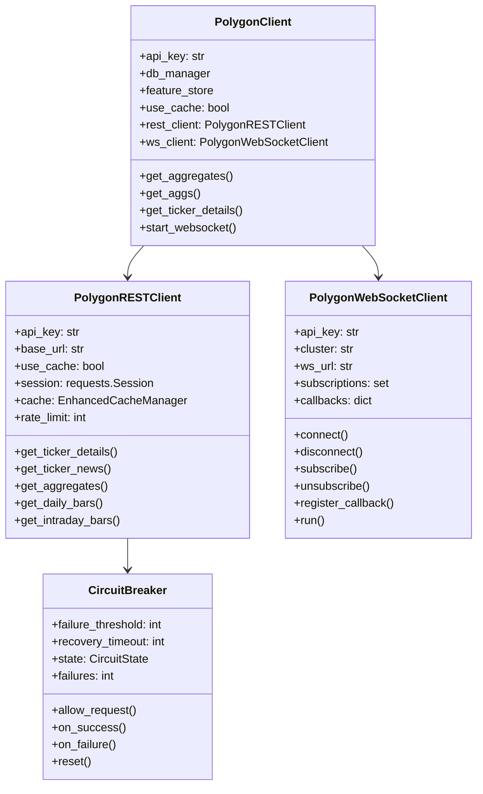
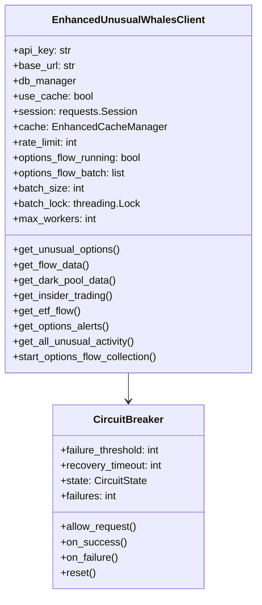

# API Integration Reference for AI Trading System

## Overview

This document provides detailed reference information for the API integrations used in our AI Trading System. It includes implementation details, best practices, and code examples for the Polygon.io and Unusual Whales APIs that are critical components of our data collection pipeline.

## Table of Contents

1. [Polygon.io API Integration](#polygionio-api-integration)
   - [Client Architecture](#client-architecture)
   - [REST API Implementation](#rest-api-implementation)
   - [WebSocket Implementation](#websocket-implementation)
   - [Performance Optimizations](#performance-optimizations)
   - [Error Handling](#error-handling)

2. [Unusual Whales API Integration](#unusual-whales-api-integration)
   - [Client Architecture](#unusual-whales-client-architecture)
   - [Data Collection Methods](#data-collection-methods)
   - [Performance Optimizations](#unusual-whales-performance-optimizations)
   - [Error Handling](#unusual-whales-error-handling)

3. [Integration with Feature Store](#integration-with-feature-store)
   - [Caching Strategy](#caching-strategy)
   - [Data Transformation](#data-transformation)

4. [Production Considerations](#production-considerations)
   - [API Rate Limiting](#api-rate-limiting)
   - [Fault Tolerance](#fault-tolerance)
   - [Monitoring](#monitoring)

## Polygon.io API Integration

The Polygon.io API provides market data including real-time and historical price data, trades, quotes, and reference data. Our implementation includes both REST API and WebSocket clients with enhanced performance features.

### Client Architecture

The Polygon client is structured with three main components:

1. **Main Client (`PolygonClient`)**: Coordinates between REST and WebSocket clients
2. **REST Client (`PolygonRESTClient`)**: Handles historical data requests
3. **WebSocket Client (`PolygonWebSocketClient`)**: Manages real-time data streaming



### REST API Implementation

The REST client includes several performance optimizations:

1. **Connection Pooling**: Reuses HTTP connections for faster subsequent requests
2. **Retry Mechanism**: Implements exponential backoff for transient failures
3. **Caching Layer**: Stores frequently accessed data to reduce API calls
4. **Circuit Breaker**: Prevents repeated calls to failing endpoints

Key methods include:

```python
def get_aggregates(self, symbol: str, multiplier: int, timespan: str,
                  from_date: str, to_date: str, adjusted: bool = True,
                  sort: str = 'asc', limit: int = 5000) -> pd.DataFrame:
    """
    Get aggregated bars for a ticker with caching and large date range handling.
    
    Args:
        symbol: Ticker symbol
        multiplier: Size of the timespan multiplier
        timespan: Size of the time window (minute, hour, day, week, month, quarter, year)
        from_date: Start date (YYYY-MM-DD)
        to_date: End date (YYYY-MM-DD)
        adjusted: Whether to adjust for splits
        sort: Sort direction (asc, desc)
        limit: Maximum number of results
        
    Returns:
        df: DataFrame with aggregated bars
    """
    # Implementation details...
```

For large date ranges, the client automatically chunks requests to avoid API limitations:

```python
def _fetch_chunked_data(self, symbol: str, multiplier: int, timespan: str,
                      from_dt: datetime, to_dt: datetime, 
                      adjusted: bool, sort: str, limit: int) -> pd.DataFrame:
    """
    Fetch data in chunks for large date ranges.
    
    Args:
        symbol: Ticker symbol
        multiplier: Size of the timespan multiplier
        timespan: Size of the time window
        from_dt: Start date
        to_dt: End date
        adjusted: Whether to adjust for splits
        sort: Sort direction
        limit: Maximum number of results per chunk
        
    Returns:
        df: Combined DataFrame
    """
    # Implementation details...
```

### WebSocket Implementation

The WebSocket client provides real-time market data with robust error handling and recovery:

1. **Automatic Reconnection**: Reconnects with exponential backoff after disconnections
2. **Heartbeat Mechanism**: Ensures connection stays alive
3. **Callback System**: Routes messages to appropriate handlers
4. **Subscription Management**: Tracks and restores subscriptions after reconnection

Key methods include:

```python
async def connect(self) -> None:
    """Connect to the WebSocket"""
    # Implementation details...

async def subscribe(self, channels: List[str]) -> None:
    """
    Subscribe to WebSocket channels
    
    Args:
        channels: List of channels to subscribe to
    """
    # Implementation details...

def register_callback(self, channel_prefix: str, callback: Callable[[Dict], None]) -> None:
    """
    Register a callback for a channel prefix
    
    Args:
        channel_prefix: Channel prefix (e.g., 'T.', 'Q.', 'A.')
        callback: Callback function to handle messages
    """
    # Implementation details...
```

### Performance Optimizations

1. **Connection Pooling**: Uses `requests.Session` with connection pooling
2. **Retry Mechanism**: Implements exponential backoff with `urllib3.util.Retry`
3. **Caching**: Uses Redis-based caching for frequently accessed data
4. **Circuit Breaker**: Prevents calls to failing endpoints
5. **Chunked Requests**: Splits large date ranges into manageable chunks
6. **Parallel Processing**: Uses `concurrent.futures` for parallel data collection

### Error Handling

The Polygon client implements robust error handling:

1. **Circuit Breaker Pattern**: Prevents repeated calls to failing endpoints
2. **Exponential Backoff**: Gradually increases retry delay
3. **Logging**: Comprehensive logging of errors and warnings
4. **Exception Handling**: Graceful handling of API errors

```python
class CircuitBreaker:
    """Circuit breaker pattern implementation for API resilience."""
    def __init__(self, failure_threshold: int = 5, recovery_timeout: int = 30, name: str = "default"):
        self.failure_threshold = failure_threshold
        self.recovery_timeout = recovery_timeout
        self.state = CircuitState.CLOSED
        self.failures = 0
        self.last_failure_time = None
        self.name = name
        self.logger = logging.getLogger(f'circuit_breaker.{name}')
        
    def __call__(self, func):
        """Decorator to apply circuit breaker to a function."""
        @functools.wraps(func)
        def wrapper(*args, **kwargs):
            if not self.allow_request():
                raise Exception(f"Circuit breaker {self.name} is OPEN - request not allowed")
            
            try:
                result = func(*args, **kwargs)
                self.on_success()
                return result
            except Exception as e:
                self.on_failure()
                raise
        
        return wrapper
```

## Unusual Whales API Integration

The Unusual Whales API provides options flow data, dark pool trades, insider trading, and other alternative data sources. Our implementation includes enhanced performance features and data processing capabilities.

### Unusual Whales Client Architecture

The Unusual Whales client is implemented as a single class with comprehensive functionality:



### Data Collection Methods

The client provides methods for collecting various types of data:

1. **Unusual Options Activity**: `get_unusual_options()`
2. **Options Flow Data**: `get_flow_data()`
3. **Dark Pool Trading**: `get_dark_pool_data()`
4. **Insider Trading**: `get_insider_trading()`
5. **ETF Flow Data**: `get_etf_flow()`
6. **Options Alerts**: `get_options_alerts()`
7. **Combined Activity**: `get_all_unusual_activity()`

Example method:

```python
def get_unusual_options(self, from_date: Optional[str] = None, 
                       to_date: Optional[str] = None,
                       min_volume: Optional[int] = None,
                       min_open_interest: Optional[int] = None,
                       min_premium: Optional[int] = None) -> pd.DataFrame:
    """
    Get unusual options activity
    
    Args:
        from_date: Start date (YYYY-MM-DD) (optional)
        to_date: End date (YYYY-MM-DD) (optional)
        min_volume: Minimum volume (optional, default: 0)
        min_open_interest: Minimum open interest (optional, default: 0)
        min_premium: Minimum premium in dollars (optional, default: 0)
        
    Returns:
        df: DataFrame with unusual options activity
    """
    # Implementation details...
```

### Unusual Whales Performance Optimizations

1. **Connection Pooling**: Uses `requests.Session` with connection pooling
2. **Retry Mechanism**: Implements exponential backoff with `urllib3.util.Retry`
3. **Caching Layer**: Uses Redis-based caching for frequently accessed data
4. **Circuit Breaker**: Prevents calls to failing endpoints
5. **Rate Limiting**: Implements client-side rate limiting
6. **Parallel Processing**: Uses `concurrent.futures` for parallel data collection
7. **Batched Processing**: Collects and processes data in batches for efficiency

### Unusual Whales Error Handling

The client implements robust error handling:

1. **Circuit Breaker Pattern**: Prevents repeated calls to failing endpoints
2. **Exponential Backoff**: Gradually increases retry delay
3. **Logging**: Comprehensive logging of errors and warnings
4. **Exception Handling**: Graceful handling of API errors
5. **Data Validation**: Validates and cleans API responses

```python
@CircuitBreaker(failure_threshold=3, recovery_timeout=60, name="unusual_whales_api")
def _make_request(self, endpoint: str, method: str = 'GET', 
                 params: Optional[Dict] = None, data: Optional[Dict] = None,
                 bypass_cache: bool = False) -> Dict:
    """
    Make a request to the Unusual Whales API with caching and circuit breaker
    
    Args:
        endpoint: API endpoint
        method: HTTP method (GET, POST)
        params: Query parameters
        data: Request body data
        bypass_cache: Whether to bypass cache
        
    Returns:
        response: API response
    """
    # Implementation details...
```

## Integration with Feature Store

Both API clients integrate with our feature store for efficient data storage and retrieval:

### Caching Strategy

1. **Redis-Based Caching**: Uses Redis for high-performance caching
2. **TTL-Based Expiration**: Different TTLs based on data type and freshness requirements
3. **Namespace Isolation**: Separate namespaces for different data sources
4. **Serialization**: JSON serialization for structured data

```python
# Check cache first if enabled
cache_key = None
if self.use_cache and not bypass_cache and method.upper() == 'GET' and hasattr(self, 'cache'):
    param_str = urlencode(sorted(params.items())) if params else ""
    cache_key = f"{endpoint}:{param_str}"
    cached = self.cache.get(cache_key)
    if cached:
        logger.debug(f"Cache hit for {endpoint}")
        return json.loads(cached) if isinstance(cached, str) else cached
```

### Data Transformation

1. **Standardized Format**: Converts API responses to standardized DataFrame format
2. **Column Mapping**: Maps API field names to expected field names
3. **Type Conversion**: Ensures proper data types for all fields
4. **Timestamp Handling**: Converts timestamps to datetime objects
5. **Missing Data Handling**: Fills in missing data with default values

```python
# Store in feature store if available
try:
    feature_name = f"{symbol.lower()}_{timeframe}_ohlcv"
    params = {
        "symbol": symbol, 
        "timeframe": timeframe, 
        "source": "polygon"
    }
    feature_store_cache.set_dataframe(feature_name, params, df)
    logger.info(f"Stored {len(df)} rows in Redis feature store as {feature_name}")
except Exception as e:
        logger.error(f"Error storing in feature store: {e}")
```

## Production Considerations

### API Rate Limiting

Both clients implement client-side rate limiting to avoid API throttling:

```python
def _handle_rate_limit(self) -> None:
    """Handle rate limiting"""
    current_time = time.time()
    elapsed = current_time - self.last_request_time
    
    # If less than 1/rate_limit seconds have passed since the last request
    if elapsed < (1 / self.rate_limit):
        sleep_time = (1 / self.rate_limit) - elapsed
        time.sleep(sleep_time)
    
    self.last_request_time = time.time()
```

### Fault Tolerance

1. **Circuit Breaker Pattern**: Prevents calls to failing endpoints
2. **Retry Mechanism**: Implements exponential backoff for transient failures
3. **Error Handling**: Graceful handling of API errors
4. **Fallback Mechanisms**: Alternative data sources when primary sources fail

### Monitoring

1. **Logging**: Comprehensive logging of API calls, errors, and warnings
2. **Metrics Collection**: Tracks API call counts, response times, and error rates
3. **Alerting**: Alerts on API failures and rate limit warnings
4. **Health Checks**: Regular health checks for API endpoints

## Conclusion

This API integration reference provides a comprehensive guide to the Polygon.io and Unusual Whales API implementations in our AI Trading System. These implementations include numerous performance optimizations, error handling mechanisms, and integration with our feature store to ensure reliable and efficient data collection for our trading strategies.

By following the patterns and practices outlined in this document, we can maintain a robust and scalable data collection pipeline that forms the foundation of our AI Trading System.