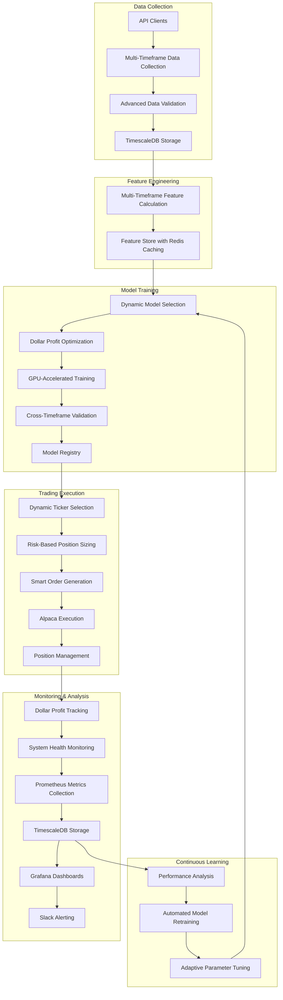
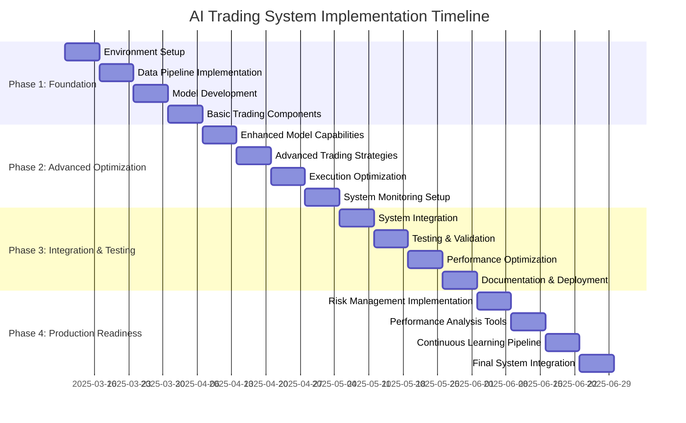

# Comprehensive AI Trading System Implementation Guide

## Executive Summary

This document provides a comprehensive guide for building an AI Trading System from scratch, following the production readiness plan. It includes detailed implementation steps, code examples, and best practices for creating a robust, high-performance trading system capable of maximizing dollar profit while managing risk effectively.

## System Architecture Overview

## Implementation Plan

The implementation is divided into four phases, each with specific components and tasks:

### Phase 1: Foundation (Weeks 1-2)

#### 1. Environment Setup

- Set up development environment with required dependencies
- Configure GPU environment with NVIDIA drivers and CUDA
- Set up Docker with NVIDIA Container Toolkit
- Configure TimescaleDB for time-series data storage
- Set up Alpaca API credentials and test connectivity
- Implement Redis for caching and inter-process communication
- Create configuration files for different environments (dev, test, prod)

#### 2. Data Pipeline Implementation

- Implement multi-timeframe data collection (1-min, 5-min, 15-min, hourly)
- Develop data cleaning and preprocessing pipeline
- Implement feature engineering for each timeframe
- Create feature store with TimescaleDB optimization
- Implement real-time feature calculation pipeline
- Add market microstructure features (order book imbalance, trade flow, etc.)
- Develop feature importance analysis module

#### 3. Model Development

- Implement XGBoost model with dollar profit optimization
- Develop custom objective function for dollar profit maximization
- Implement LSTM model with multi-timeframe capabilities
- Add mixed precision support for GPU acceleration
- Implement model validation framework with cross-timeframe validation
- Create model persistence and versioning system
- Develop model serving infrastructure

#### 4. Basic Trading Components

- Implement dynamic ticker selector
- Develop risk-based position sizer
- Create basic peak detection algorithm
- Implement timeframe selector
- Develop Alpaca API integration for trade execution
- Create portfolio management module
- Implement basic system controller with startup/shutdown procedures

### Phase 2: Advanced Optimization (Weeks 3-4)

#### 5. Enhanced Model Capabilities

- Implement multi-head attention mechanism for LSTM
- Add residual connections for better gradient flow
- Develop profit-weighted loss functions
- Implement confidence scoring based on prediction variance
- Add adaptive learning rate based on market volatility
- Implement quantile regression for risk assessment
- Develop Bayesian optimization for hyperparameters

#### 6. Advanced Trading Strategies

- Enhance dynamic timeframe selection with market regime detection
- Improve peak detection with multiple indicators
- Implement adaptive exit timing based on volatility
- Develop profit target scaling based on timeframe
- Create stop loss optimization based on volatility
- Implement position sizing algorithm optimized for dollar returns
- Develop trade selection framework for highest expected dollar profit

#### 7. Execution Optimization

- Implement order type selection framework
- Develop smart order routing system
- Create execution algorithms (Adaptive TWAP, Smart VWAP)
- Implement latency optimization techniques
- Develop execution quality analysis module
- Create slippage measurement and analysis tools
- Implement market impact analysis

#### 8. System Monitoring Setup

- Develop metrics collection system for all components
- Create time-series database for metrics storage
- Implement dashboard server with Flask
- Create CPU/GPU utilization gauges with Apache ECharts
- Develop financial performance charts
- Create model performance visualization
- Implement system health monitors
- Develop alerting system for critical events
- Enhance Prometheus metrics collection
- Optimize Redis caching for monitoring data
- Create comprehensive Grafana dashboards
- Implement advanced Slack alerting with actionable notifications

### Phase 3: Integration & Testing (Weeks 5-6)

#### 9. System Integration

- Integrate all components into unified pipeline
- Implement comprehensive configuration system
- Create system controller with proper component lifecycle management
- Develop startup sequence with dependency checks
- Implement graceful shutdown procedure
- Create emergency shutdown with position liquidation
- Develop system recovery procedures

#### 10. Testing & Validation

- Implement comprehensive backtesting framework
- Create historical simulation environment
- Develop Monte Carlo analysis for strategy robustness
- Implement sensitivity analysis for parameters
- Create transaction cost modeling
- Develop market impact simulation
- Implement end-to-end system tests

#### 11. Performance Optimization

- Optimize database queries for real-time performance
- Implement caching strategies for frequently accessed data with Redis
- Optimize GPU utilization for model inference
- Develop parallel processing for feature calculation
- Implement tiered resource allocation for focus tickers
- Create memory optimization strategies
- Develop network optimization for low latency

#### 12. Documentation & Deployment

- Create comprehensive system documentation
- Develop user guides for system operation
- Create API documentation for all components
- Implement continuous integration pipeline
- Develop deployment scripts for production
- Create system monitoring documentation
- Develop troubleshooting guides

### Phase 4: Production Readiness (Weeks 7-8)

#### 13. Risk Management Implementation

- Implement dollar-based position sizing within limits
- Develop adaptive stop-loss based on volatility
- Create dynamic profit targets with peak detection
- Implement risk-of-ruin protection
- Develop portfolio-level risk management
- Create correlation-based position sizing
- Implement market regime-based risk adjustment

#### 14. Performance Analysis Tools

- Implement dollar profit metrics calculation
- Develop risk-adjusted performance metrics
- Create attribution analysis for profit sources
- Implement real-time performance monitoring
- Develop performance forecasting tools
- Create drawdown monitoring system
- Implement risk limit enforcement

#### 15. Continuous Learning Pipeline

- Develop model retraining pipeline based on performance
- Implement feature importance tracking over time
- Create adaptive parameter tuning based on market conditions
- Develop market regime detection for model selection
- Implement ensemble weighting based on performance
- Create model performance evaluation framework
- Develop continuous improvement process

#### 16. Final System Integration

- Perform end-to-end system testing
- Conduct stress testing under various market conditions
- Implement final performance optimizations
- Create production deployment plan
- Develop monitoring and alerting strategy
- Create incident response procedures
- Implement final security measures

## Key Components Implementation

### 1. Data Collection Pipeline

The data collection pipeline is responsible for gathering market data from various sources, validating it, and storing it in TimescaleDB. Key components include:

- API clients for Polygon.io, Unusual Whales, and Alpaca
- Multi-timeframe data collection (1-min, 5-min, 15-min, hourly, daily)
- Advanced data validation with comprehensive rules
- Efficient storage in TimescaleDB with hypertables

### 2. Feature Engineering

The feature engineering module calculates various features from raw market data, including:

- Price-based features (moving averages, price ratios, etc.)
- Volume-based features (volume profiles, relative volume, etc.)
- Volatility features (ATR, Bollinger Bands, etc.)
- Momentum features (RSI, MACD, etc.)
- Trend features (ADX, directional movement, etc.)
- Pattern recognition features (candlestick patterns, etc.)
- Market microstructure features (order book imbalance, etc.)

### 3. Model Training

The model training module implements various machine learning models for predicting price movements and optimizing dollar profit:

- XGBoost model with custom dollar profit objective function
- LSTM model with multi-timeframe inputs
- Multi-head attention mechanism for capturing temporal dependencies
- Mixed precision training for GPU acceleration
- Cross-timeframe validation for robust model evaluation
- Model registry for versioning and tracking

### 4. Trading Execution

The trading execution module handles the actual trading process, including:

- Dynamic ticker selection with tiered approach (Primary, Active, Focus universes)
- Risk-based position sizing with 2% risk rule
- Smart order generation with optimal order types
- Alpaca API integration for trade execution
- Position management with adaptive stop-loss and profit targets
- Peak detection for optimal exit timing

### 5. Monitoring & Analysis

The monitoring and analysis module tracks system performance and health:

- Dollar profit tracking with attribution analysis
- System health monitoring with Prometheus
- Metrics storage in TimescaleDB
- Visualization with Grafana dashboards
- Alerting with Slack integration
- Performance analysis with risk-adjusted metrics

### 6. Continuous Learning

The continuous learning module ensures the system adapts to changing market conditions:

- Automated model retraining based on performance
- Feature importance tracking over time
- Adaptive parameter tuning
- Market regime detection
- Ensemble weighting based on performance

## Technical Requirements

### Hardware Requirements

- NVIDIA GPU with CUDA support (preferably NVIDIA GH200 Grace Hopper Superchip)
- 32+ GB RAM
- 1+ TB SSD storage
- High-speed internet connection

### Software Requirements

- Python 3.8+
- Docker and Docker Compose
- NVIDIA Container Toolkit
- TimescaleDB
- Redis
- Prometheus
- Grafana
- TensorFlow or PyTorch
- XGBoost
- Pandas, NumPy, Scikit-learn
- Alpaca SDK

### API Requirements

- Polygon.io API key
- Unusual Whales API key
- Alpaca API key and secret

## Implementation Timeline

## Conclusion

This comprehensive guide provides a detailed roadmap for building an AI Trading System from scratch. By following the implementation plan and best practices outlined in this document, you can create a robust, high-performance trading system capable of maximizing dollar profit while managing risk effectively.

The system architecture is designed to be modular, scalable, and adaptable to changing market conditions. The four-phase implementation approach ensures a systematic and thorough development process, with each phase building on the previous one.

Key features of the system include:
- Multi-timeframe data collection and feature engineering
- Dollar profit optimization with custom objective functions
- Dynamic ticker selection with tiered approach
- Risk-based position sizing with 2% risk rule
- Comprehensive monitoring and analysis
- Continuous learning and adaptation

By implementing this system, you will have a state-of-the-art AI trading platform that can adapt to changing market conditions and consistently generate profits while managing risk.
