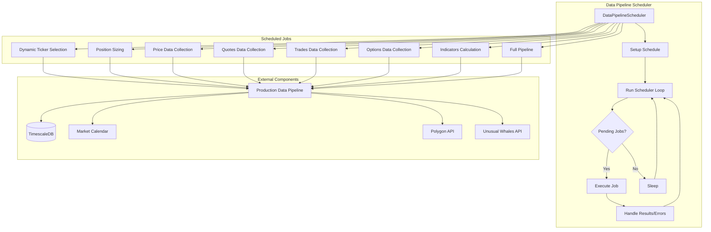
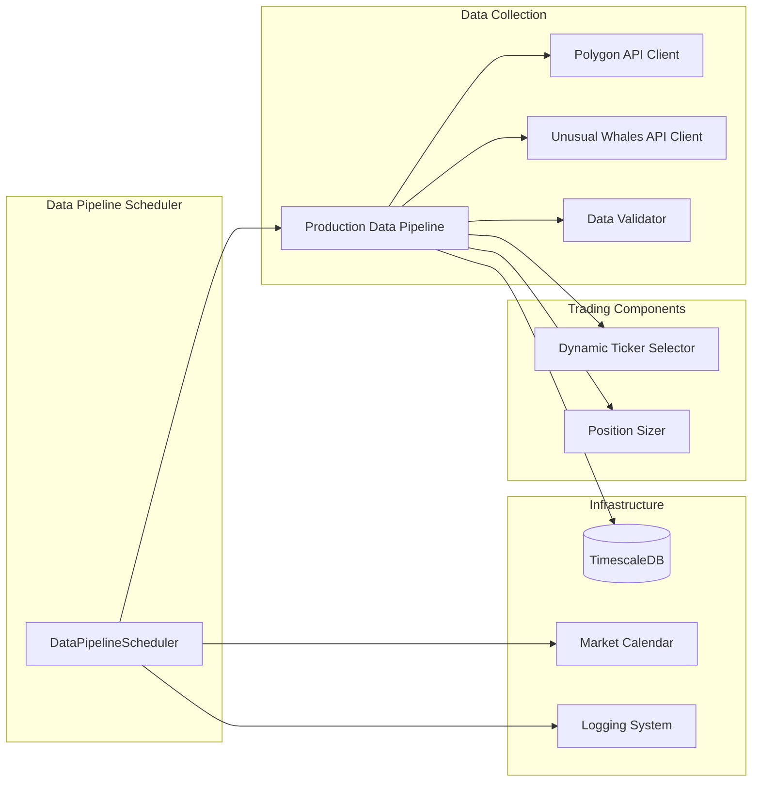
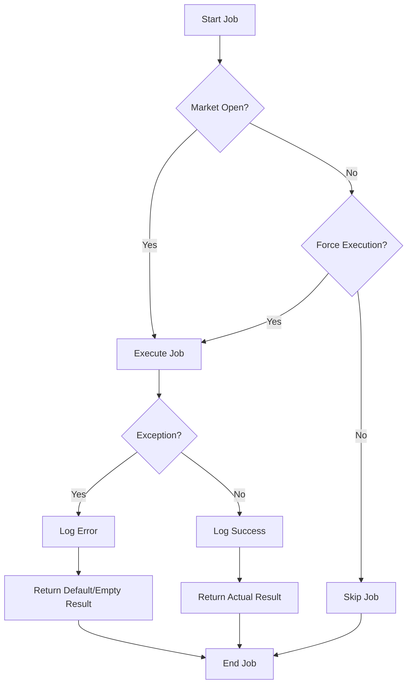

# Data Pipeline Scheduler Architecture

## 1. Introduction

The Data Pipeline Scheduler is a critical component of the AI Trading System that orchestrates the collection, validation, and processing of market data at regular intervals. It ensures that the system has access to up-to-date, validated data for making trading decisions.

This document provides a high-level architectural overview of the Data Pipeline Scheduler, focusing on its design patterns, scheduling strategy, integration with other system components, error handling mechanisms, and recommendations for improvements.

## 2. System Architecture Overview

The Data Pipeline Scheduler follows a job scheduling architecture pattern, where different data collection and processing tasks are scheduled to run at specific times or intervals. It uses the `schedule` library to create a cron-like scheduling system.

## 3. Key Components

### 3.1 DataPipelineScheduler Class

The core component of the scheduler is the `DataPipelineScheduler` class, which:
- Initializes the data pipeline and related components
- Sets up the schedule for various data collection jobs
- Runs the scheduler loop
- Handles job execution and error handling

### 3.2 Scheduled Jobs

The scheduler manages several types of jobs:

1. **Dynamic Ticker Selection Job**: Selects the most promising tickers from a large universe based on opportunity scores
2. **Position Sizing Job**: Calculates position sizes for selected tickers
3. **Price Data Collection Job**: Collects OHLCV data for selected tickers
4. **Quotes Data Collection Job**: Collects bid/ask quotes data
5. **Trades Data Collection Job**: Collects individual trades data
6. **Options Data Collection Job**: Collects options flow data
7. **Indicators Calculation Job**: Calculates technical indicators
8. **Full Pipeline Job**: Runs the complete data pipeline

### 3.3 Integration Components

The scheduler integrates with several external components:

1. **Production Data Pipeline**: The main data processing pipeline that fetches, validates, and stores data
2. **Market Calendar**: Provides information about market trading hours and holidays
3. **Database Manager**: Manages connections to the TimescaleDB database
4. **API Clients**: Interfaces with external data providers (Polygon.io, Unusual Whales)

## 4. Scheduling Strategy

The scheduler employs a time-based scheduling strategy with different frequencies for different job types:

```mermaid
gantt
    title Data Pipeline Scheduling Strategy
    dateFormat  HH:mm
    axisFormat %H:%M
    
    section Market Open
    Dynamic Ticker Selection    :milestone, m1, 09:35, 0m
    Position Sizing             :milestone, m2, 09:45, 0m
    
    section Hourly
    Price Data Collection       :crit, p1, 09:05, 1m
    Price Data Collection       :crit, p2, 10:05, 1m
    Price Data Collection       :crit, p3, 11:05, 1m
    Price Data Collection       :crit, p4, 12:05, 1m
    Price Data Collection       :crit, p5, 13:05, 1m
    Price Data Collection       :crit, p6, 14:05, 1m
    Price Data Collection       :crit, p7, 15:05, 1m
    
    section Every 15 Minutes
    Quotes Data Collection      :active, q1, 09:00, 1m
    Quotes Data Collection      :active, q2, 09:15, 1m
    Quotes Data Collection      :active, q3, 09:30, 1m
    Quotes Data Collection      :active, q4, 09:45, 1m
    
    section Every 30 Minutes
    Trades Data Collection      :t1, 09:00, 1m
    Trades Data Collection      :t2, 09:30, 1m
    Trades Data Collection      :t3, 10:00, 1m
    Trades Data Collection      :t4, 10:30, 1m
    
    section Every 2 Hours
    Options Data Collection     :o1, 09:15, 1m
    Options Data Collection     :o2, 11:15, 1m
    Options Data Collection     :o3, 13:15, 1m
    Options Data Collection     :o4, 15:15, 1m
    
    section Every 4 Hours
    Indicators Calculation      :i1, 09:30, 1m
    Indicators Calculation      :i2, 13:30, 1m
    
    section Market Close
    Full Pipeline               :milestone, m3, 16:30, 0m
```

Key scheduling decisions:

1. **Dynamic Ticker Selection**: Runs once at market open (9:35 AM) to select the most promising tickers for the day
2. **Position Sizing**: Runs shortly after market open (9:45 AM) to calculate position sizes for selected tickers
3. **Price Data Collection**: Runs hourly to collect OHLCV data
4. **Quotes Data Collection**: Runs every 15 minutes to collect bid/ask quotes
5. **Trades Data Collection**: Runs every 30 minutes to collect trades data
6. **Options Data Collection**: Runs every 2 hours to collect options flow data
7. **Indicators Calculation**: Runs every 4 hours to calculate technical indicators
8. **Full Pipeline**: Runs once after market close (4:30 PM) to ensure all data is collected and processed

## 5. Integration Points

The Data Pipeline Scheduler integrates with several other components of the AI Trading System:

Key integration points:

1. **Production Data Pipeline**: The scheduler calls methods on the `ProductionDataPipeline` class to execute data collection and processing tasks
2. **Market Calendar**: Used to check if the market is open and to determine trading days
3. **Database Manager**: Used to store and retrieve data from TimescaleDB
4. **Dynamic Ticker Selector**: Used to select active tickers and focus universe
5. **Position Sizer**: Used to calculate position sizes for selected tickers
6. **Logging System**: Used to log job execution status and errors

## 6. Error Handling and Resilience

The Data Pipeline Scheduler implements several error handling and resilience mechanisms:

1. **Job-Level Exception Handling**: Each job method has try-except blocks to catch and log exceptions
2. **Scheduler Loop Exception Handling**: The main scheduler loop has exception handling to prevent the scheduler from crashing
3. **Market Hours Check**: Jobs can be configured to only run during market hours
4. **Fallback Mechanisms**: If dynamic ticker selection fails, the system falls back to default tickers
5. **Logging**: Comprehensive logging of job execution status and errors

## 7. Configuration Options

The Data Pipeline Scheduler supports several configuration options through command-line arguments:

1. **Market Hours Only**: Only run jobs during market hours
2. **Symbols**: Comma-separated list of symbols to use (defaults to dynamic selection)
3. **Lookback Days**: Number of days to look back for historical data
4. **Strict Validation**: Enable strict validation mode
5. **Generate Report**: Generate validation report
6. **Max Active Tickers**: Maximum number of active tickers
7. **Focus Universe Size**: Number of tickers in the focus universe
8. **Min Volume**: Minimum trading volume for ticker selection
9. **Min Volatility**: Minimum volatility (ATR/price) for ticker selection
10. **Opportunity Threshold**: Minimum opportunity score for ticker selection

## 8. Recommendations for Improvements

### 8.1 Architecture Improvements

1. **Microservices Architecture**: Split the monolithic scheduler into smaller, specialized schedulers for different data types
2. **Message Queue Integration**: Use a message queue (e.g., RabbitMQ, Kafka) for job distribution and processing
3. **Containerization**: Containerize the scheduler for easier deployment and scaling
4. **Service Discovery**: Implement service discovery for dynamic configuration of API endpoints

### 8.2 Scheduling Improvements

1. **Adaptive Scheduling**: Adjust job frequency based on market volatility and trading volume
2. **Priority-Based Scheduling**: Implement priority levels for different jobs
3. **Dependency-Based Scheduling**: Define dependencies between jobs to ensure proper execution order
4. **Distributed Scheduling**: Distribute jobs across multiple nodes for better scalability

### 8.3 Resilience Improvements

1. **Circuit Breaker Pattern**: Implement circuit breakers for API calls to prevent cascading failures
2. **Retry Mechanisms**: Add exponential backoff retry logic for failed jobs
3. **Health Checks**: Implement health checks for the scheduler and its dependencies
4. **State Persistence**: Persist scheduler state to allow for graceful restarts

### 8.4 Monitoring Improvements

1. **Metrics Collection**: Collect and expose metrics on job execution time, success rate, etc.
2. **Alerting**: Implement alerting for critical job failures
3. **Dashboard**: Create a dashboard for monitoring scheduler status and job execution
4. **Performance Profiling**: Add performance profiling to identify bottlenecks

## 9. Conclusion

The Data Pipeline Scheduler is a critical component of the AI Trading System that ensures the system has access to up-to-date, validated data for making trading decisions. Its architecture follows a job scheduling pattern with different frequencies for different data types.

By implementing the recommended improvements, the scheduler can become more scalable, resilient, and adaptable to changing market conditions, ultimately leading to better trading decisions and higher profitability.