# Enhanced Data Validation Guide

## Overview

The AI Trading System implements a robust data validation framework that ensures data quality, consistency, and integrity across all components. This enhanced guide provides a comprehensive overview of the data validation capabilities, including detailed explanations of validation rules, cross-timeframe consistency checks, market microstructure validation, and integration with the monitoring system.

## System Architecture

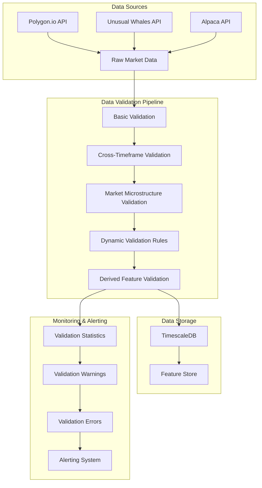

## Data Flow Process

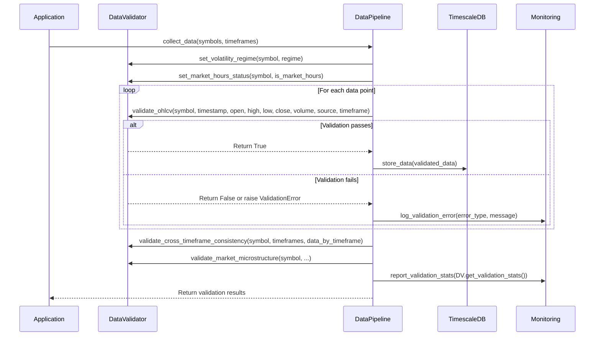

## Key Components

### DataValidator Class

The `DataValidator` class is the core component responsible for validating market data. It provides methods for validating different types of data, including OHLCV, quotes, trades, options flow, and derived features.

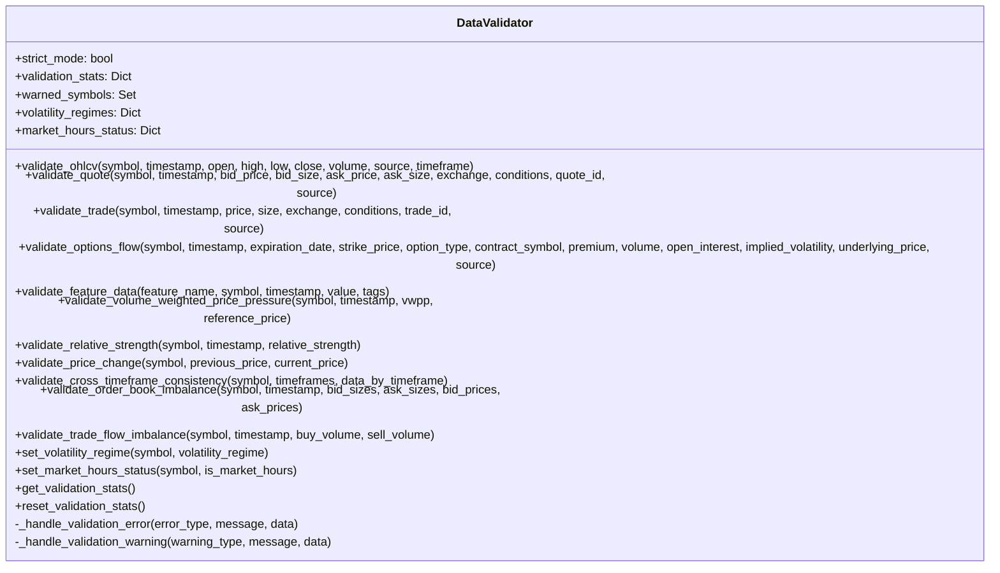

### ProductionDataPipeline Integration

The `ProductionDataPipeline` class integrates with the `DataValidator` to ensure data quality throughout the data collection and processing pipeline.

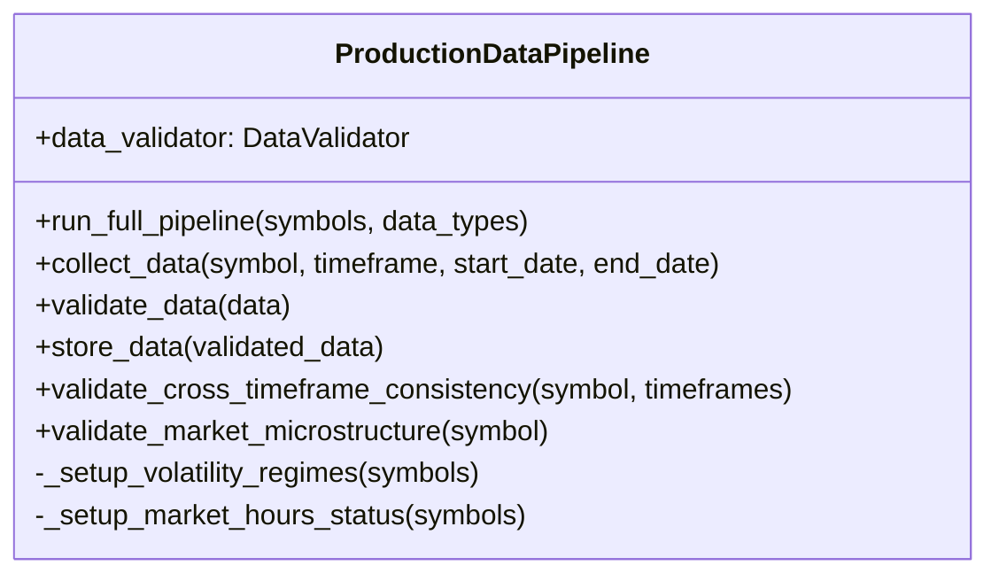

## Validation Types

### Basic OHLCV Validation

The basic OHLCV validation ensures that price and volume data meet fundamental quality requirements.

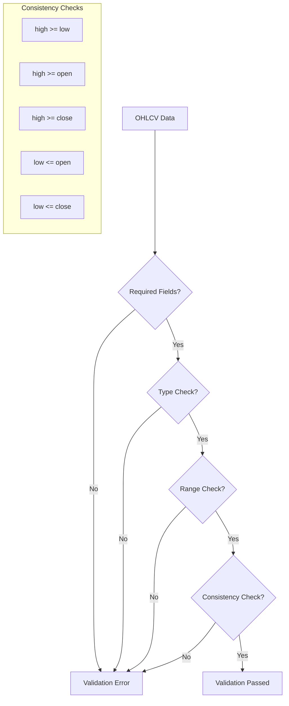

**Implementation:**
```python
def validate_ohlcv(self, symbol: str, timestamp: datetime, 
                  open_price: float, high: float, low: float, close: float, 
                  volume: float, source: str, timeframe: str) -> bool:
    # Required fields validation
    if not symbol or not timestamp:
        return self._handle_validation_error("missing_field", "Required field missing")
    
    # Type validation
    if not all(isinstance(x, (int, float)) for x in [open_price, high, low, close, volume]):
        return self._handle_validation_error("type_error", "Price/volume must be numbers")
    
    # Range validation
    if any(x <= 0 for x in [open_price, high, low, close]) or volume < 0:
        return self._handle_validation_error("range_error", "Invalid price/volume range")
    
    # Consistency validation
    if high < low:
        return self._handle_validation_error("consistency_error", "High price < low price")
    if open_price > high or open_price < low:
        return self._handle_validation_error("consistency_error", "Open price outside range")
    if close > high or close < low:
        return self._handle_validation_error("consistency_error", "Close price outside range")
    
    # All validations passed
    return True
```

### Quote Validation

Quote validation ensures that bid/ask prices and sizes are consistent and reasonable.

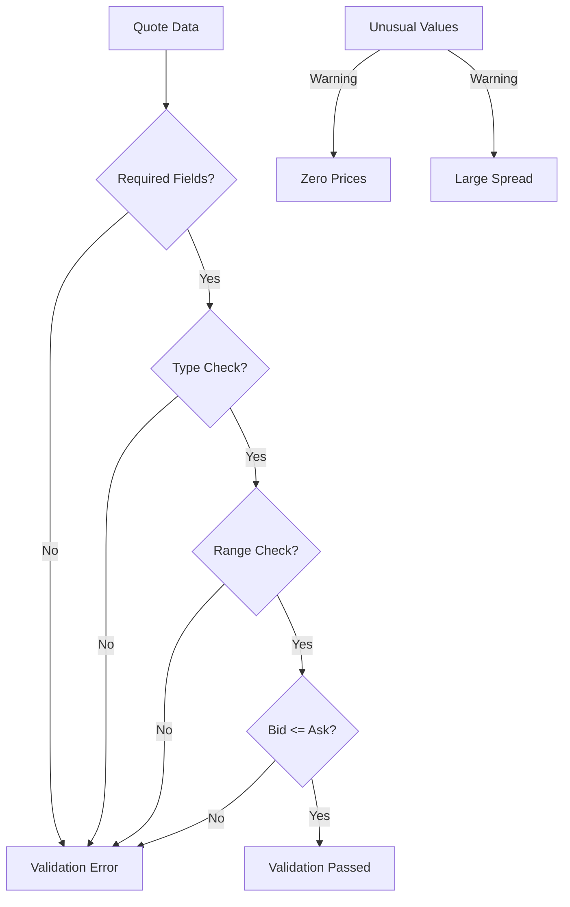

**Implementation:**
```python
def validate_quote(self, symbol: str, timestamp: datetime, 
                  bid_price: float, bid_size: float, 
                  ask_price: float, ask_size: float, 
                  exchange: int, conditions: List, 
                  quote_id: int, source: str) -> bool:
    # Required fields validation
    if not symbol or not timestamp:
        return self._handle_validation_error("missing_field", "Required field missing")
    
    # Type validation
    if not all(isinstance(x, (int, float)) for x in [bid_price, bid_size, ask_price, ask_size]):
        return self._handle_validation_error("type_error", "Price/size must be numbers")
    
    # Range validation
    if any(x < 0 for x in [bid_price, bid_size, ask_price, ask_size]):
        return self._handle_validation_error("range_error", "Negative price/size")
    
    # Consistency validation
    if bid_price > ask_price and bid_price > 0 and ask_price > 0:
        return self._handle_validation_error("consistency_error", "Bid price > ask price")
    
    # Warning for unusual values
    if bid_price == 0 and ask_price == 0:
        self._handle_validation_warning("unusual_value", "Zero prices")
    
    if bid_price > 0 and ask_price > 0 and (ask_price / bid_price) > 1.1:
        self._handle_validation_warning("unusual_value", "Large spread")
    
    # All validations passed
    return True
```

### Trade Validation

Trade validation ensures that trade prices and sizes are reasonable.

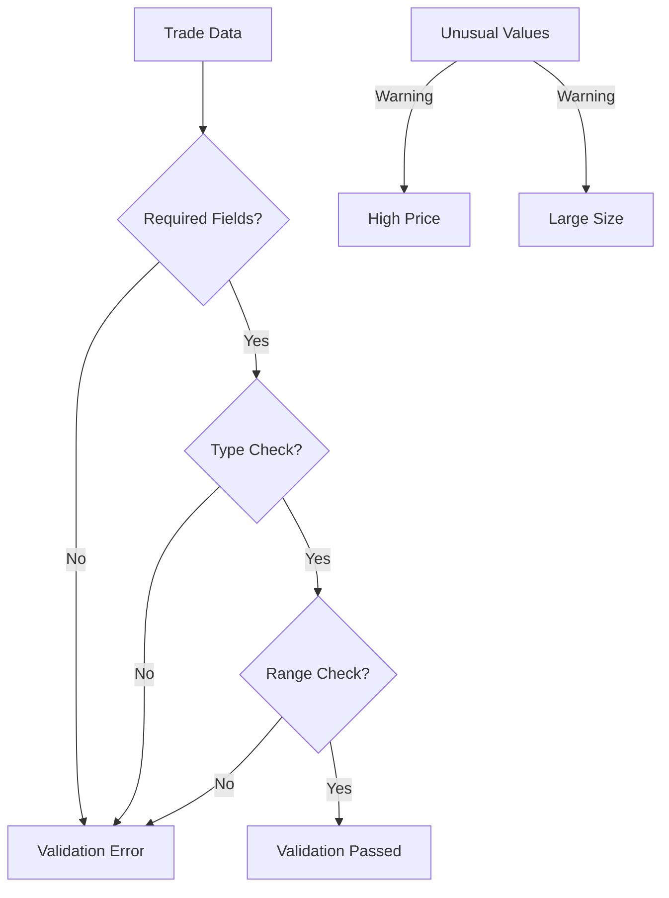

**Implementation:**
```python
def validate_trade(self, symbol: str, timestamp: datetime, 
                  price: float, size: float, 
                  exchange: int, conditions: List, 
                  trade_id: int, source: str) -> bool:
    # Required fields validation
    if not symbol or not timestamp:
        return self._handle_validation_error("missing_field", "Required field missing")
    
    # Type validation
    if not isinstance(price, (int, float)) or not isinstance(size, (int, float)):
        return self._handle_validation_error("type_error", "Price/size must be numbers")
    
    # Range validation
    if price <= 0 or size <= 0:
        return self._handle_validation_error("range_error", "Non-positive price/size")
    
    # Warning for unusual values
    if price > 10000:
        self._handle_validation_warning("unusual_value", "Unusually high price")
    
    if size > 1000000:
        self._handle_validation_warning("unusual_value", "Unusually large size")
    
    # All validations passed
    return True
```

### Options Flow Validation

Options flow validation ensures that options data is consistent and reasonable.

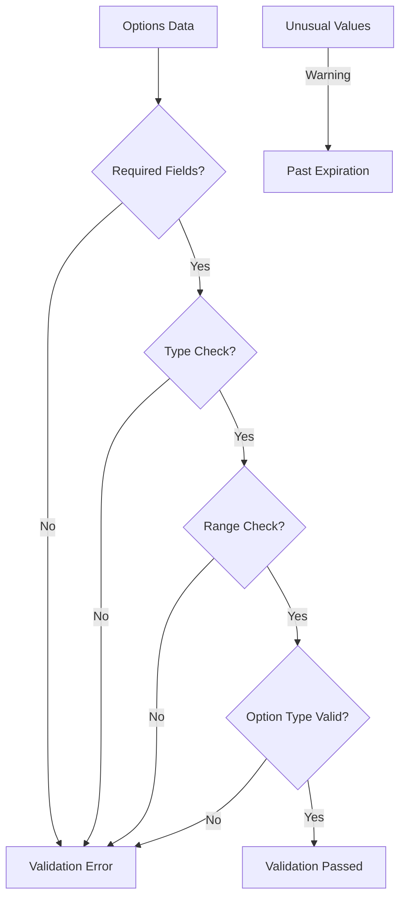

**Implementation:**
```python
def validate_options_flow(self, symbol: str, timestamp: datetime, 
                         expiration_date: date, strike_price: float, 
                         option_type: str, contract_symbol: str, 
                         premium: float, volume: float, 
                         open_interest: float, implied_volatility: float, 
                         underlying_price: float, source: str) -> bool:
    # Required fields validation
    if not all([symbol, timestamp, expiration_date, option_type]):
        return self._handle_validation_error("missing_field", "Required field missing")
    
    # Type validation
    if not isinstance(strike_price, (int, float)):
        return self._handle_validation_error("type_error", "Strike price must be a number")
    
    # Value validation
    if option_type not in ['call', 'put']:
        return self._handle_validation_error("value_error", "Invalid option type")
    
    # Range validation
    if strike_price <= 0:
        return self._handle_validation_error("range_error", "Non-positive strike price")
    
    # Date validation
    if expiration_date < datetime.now().date():
        self._handle_validation_warning("unusual_value", "Past expiration date")
    
    # All validations passed
    return True
```

## Advanced Validation Features

### Dynamic Validation Rules

The system adjusts validation thresholds based on volatility regimes and market hours.

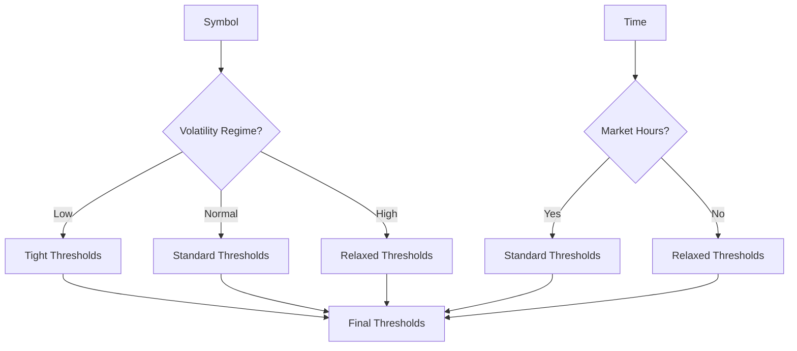

**Implementation:**
```python
def get_price_change_threshold(self, symbol: str) -> float:
    """Get price change threshold based on volatility regime."""
    regime = self.volatility_regimes.get(symbol, 'normal')
    
    if regime == 'low':
        return 0.05
    elif regime == 'high':
        return 0.2
    else:  # normal
        return 0.1

def get_spread_threshold(self, symbol: str) -> float:
    """Get spread threshold based on volatility regime and market hours."""
    regime = self.volatility_regimes.get(symbol, 'normal')
    is_market_hours = self.market_hours_status.get(symbol, True)
    
    # Base threshold
    if regime == 'low':
        threshold = 0.005
    elif regime == 'high':
        threshold = 0.02
    else:  # normal
        threshold = 0.01
    
    # Adjust for market hours
    if not is_market_hours:
        threshold *= 2  # Allow wider spreads outside market hours
    
    return threshold
```

### Cross-Timeframe Consistency Validation

Cross-timeframe validation ensures that data is consistent across different timeframes.

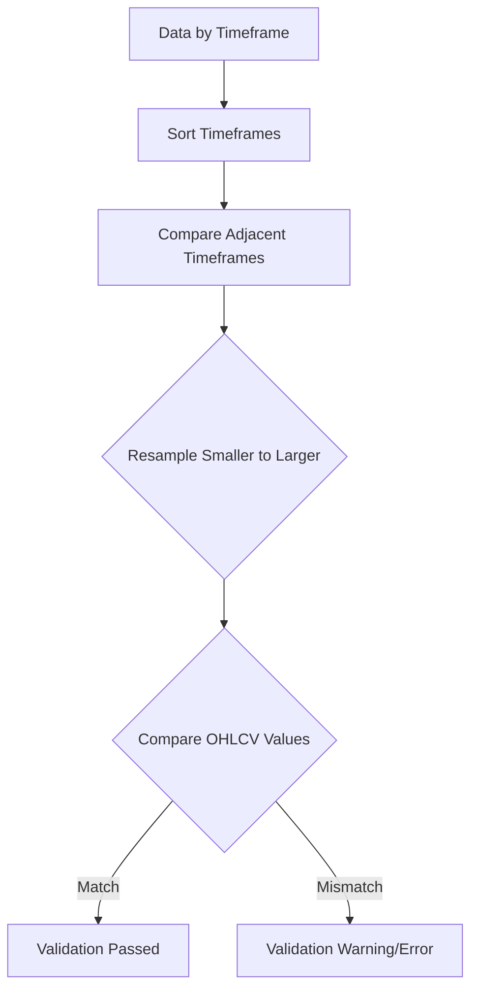

**Implementation:**
```python
def validate_cross_timeframe_consistency(self, symbol: str, timeframes: List[str], 
                                       data_by_timeframe: Dict[str, pd.DataFrame]) -> bool:
    # Sort timeframes from smallest to largest
    sorted_timeframes = sorted(timeframes, key=lambda tf: self._timeframe_to_minutes(tf))
    
    # Check if we have at least two timeframes to compare
    if len(sorted_timeframes) < 2:
        return True
    
    # Validate OHLCV consistency across timeframes
    for i in range(len(sorted_timeframes) - 1):
        smaller_tf = sorted_timeframes[i]
        larger_tf = sorted_timeframes[i + 1]
        
        smaller_df = data_by_timeframe[smaller_tf]
        larger_df = data_by_timeframe[larger_tf]
        
        # Resample smaller timeframe to match larger timeframe
        resampled = self._resample_ohlcv(smaller_df, smaller_tf, larger_tf)
        
        # Compare resampled data with larger timeframe data
        if not self._compare_resampled_data(symbol, resampled, larger_df):
            return self._handle_validation_error(
                "cross_timeframe_error", 
                f"Cross-timeframe inconsistency between {smaller_tf} and {larger_tf}",
                {"symbol": symbol}
            )
    
    # All validations passed
    return True
```

### Market Microstructure Validation

Market microstructure validation ensures that order book and trade flow data is consistent and reasonable.

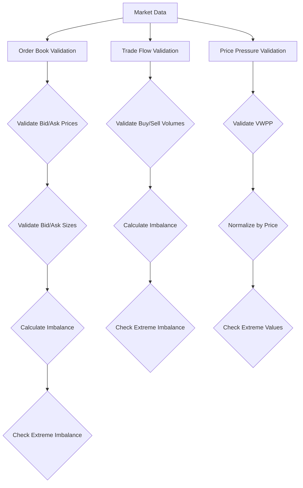

**Implementation:**
```python
def validate_order_book_imbalance(self, symbol: str, timestamp: datetime, 
                                 bid_sizes: List[float], ask_sizes: List[float],
                                 bid_prices: List[float], ask_prices: List[float]) -> bool:
    # Required fields validation
    if not symbol or not timestamp:
        return self._handle_validation_error("missing_field", "Required field missing")
    
    # Type validation
    if not all(isinstance(size, (int, float)) for size in bid_sizes + ask_sizes):
        return self._handle_validation_error("type_error", "Sizes must be numbers")
    
    if not all(isinstance(price, (int, float)) for price in bid_prices + ask_prices):
        return self._handle_validation_error("type_error", "Prices must be numbers")
    
    # Range validation
    if any(size < 0 for size in bid_sizes + ask_sizes):
        return self._handle_validation_error("range_error", "Negative sizes")
    
    if any(price <= 0 for price in bid_prices + ask_prices):
        return self._handle_validation_error("range_error", "Non-positive prices")
    
    # Consistency validation
    if len(bid_prices) > 0 and len(ask_prices) > 0:
        max_bid = max(bid_prices)
        min_ask = min(ask_prices)
        
        if max_bid >= min_ask:
            return self._handle_validation_error(
                "consistency_error", 
                "Maximum bid price >= minimum ask price",
                {"max_bid": max_bid, "min_ask": min_ask}
            )
    
    # Calculate and validate order book imbalance
    if len(bid_sizes) > 0 and len(ask_sizes) > 0:
        total_bid_size = sum(bid_sizes)
        total_ask_size = sum(ask_sizes)
        
        if total_bid_size + total_ask_size > 0:
            imbalance = (total_bid_size - total_ask_size) / (total_bid_size + total_ask_size)
            
            # Check for extreme imbalance
            if abs(imbalance) > 0.9:
                self._handle_validation_warning(
                    "unusual_value",
                    f"Extreme order book imbalance for {symbol}",
                    {"imbalance": imbalance}
                )
    
    # All validations passed
    return True
```

## Validation Statistics and Monitoring

The validation system tracks statistics and integrates with the monitoring system to provide alerts for validation failures.

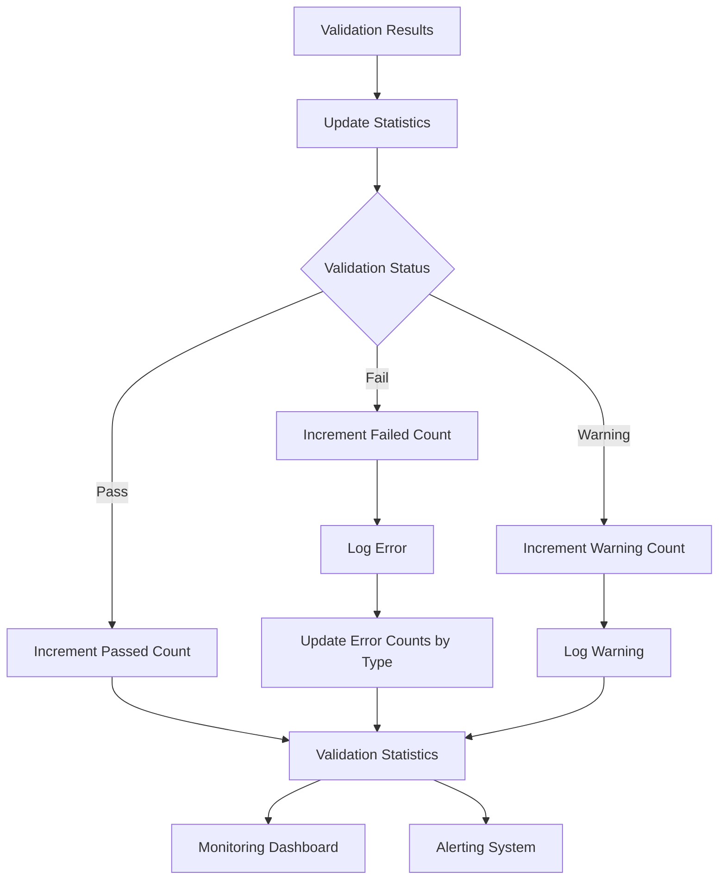

**Implementation:**
```python
def _handle_validation_error(self, error_type: str, message: str, data: Any = None) -> bool:
    """Handle validation error based on strict mode setting."""
    # Update statistics
    self.validation_stats["failed"] += 1
    if error_type not in self.validation_stats["errors_by_type"]:
        self.validation_stats["errors_by_type"][error_type] = 0
    self.validation_stats["errors_by_type"][error_type] += 1
    
    # Log the error
    if data:
        logger.error(f"Validation error ({error_type}): {message}. Data: {data}")
    else:
        logger.error(f"Validation error ({error_type}): {message}")
    
    # Raise exception if in strict mode
    if self.strict_mode:
        raise ValidationError(f"{error_type}: {message}")
    
    return False

def _handle_validation_warning(self, warning_type: str, message: str, data: Any = None) -> None:
    """Handle validation warning."""
    # Update statistics
    self.validation_stats["warnings"] += 1
    
    # Log the warning
    if data:
        logger.warning(f"Validation warning ({warning_type}): {message}. Data: {data}")
    else:
        logger.warning(f"Validation warning ({warning_type}): {message}")
```

## Integration with Production Data Pipeline

The data validation system is integrated with the production data pipeline to ensure data quality throughout the data collection and processing pipeline.

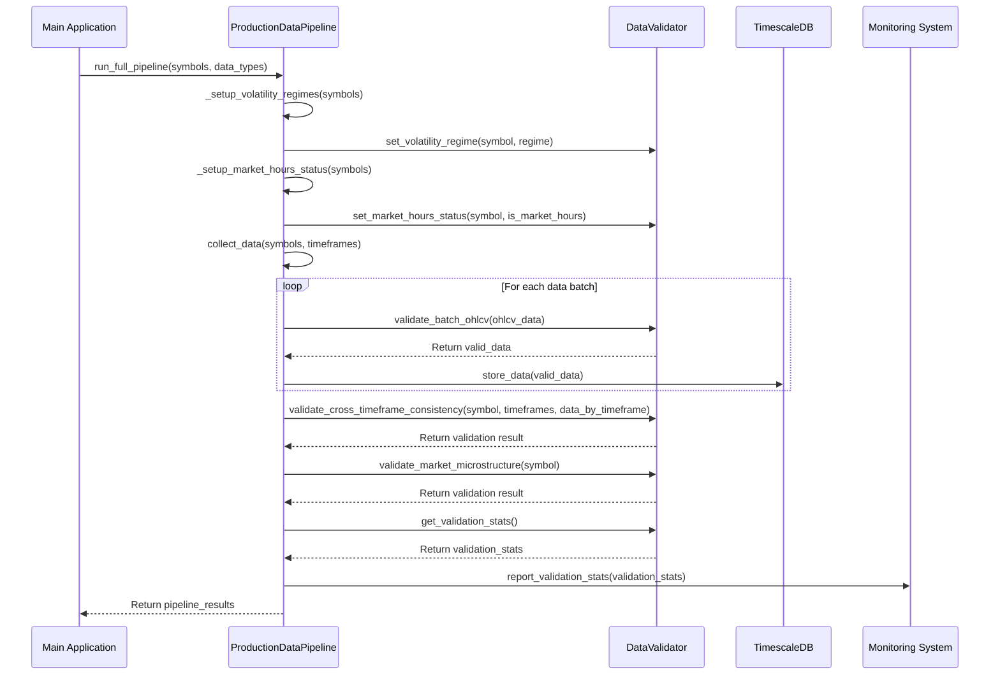

## Batch Validation

The system supports batch validation for efficient processing of large datasets.

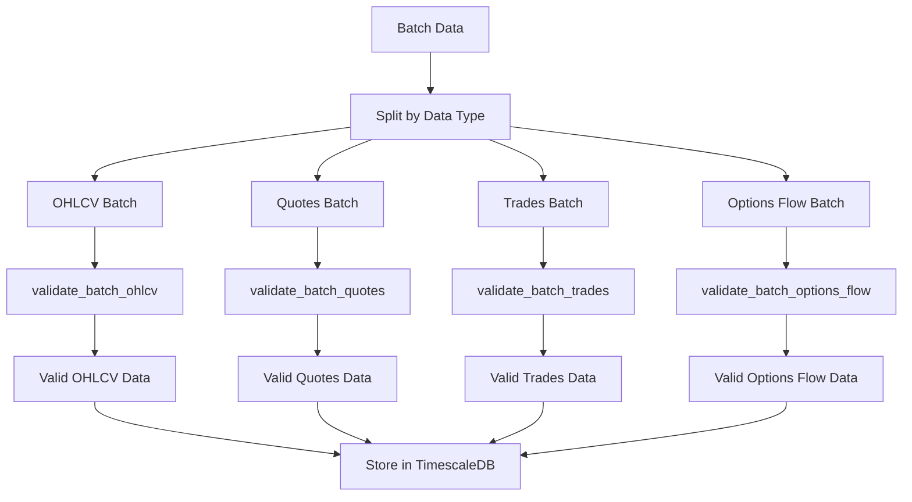

**Implementation:**
```python
def validate_batch_ohlcv(self, ohlcv_data: List[Tuple]) -> List[Tuple]:
    """Validate a batch of OHLCV data."""
    valid_data = []
    
    for data in ohlcv_data:
        if len(data) != 9:
            self._handle_validation_error("format_error", "OHLCV data tuple must have 9 elements", data)
            continue
            
        symbol, timestamp, open_price, high, low, close, volume, source, timeframe = data
        
        if self.validate_ohlcv(symbol, timestamp, open_price, high, low, close, volume, source, timeframe):
            valid_data.append(data)
    
    return valid_data
```

## Error Handling and Reporting

The system provides detailed error handling and reporting to help diagnose and fix data quality issues.

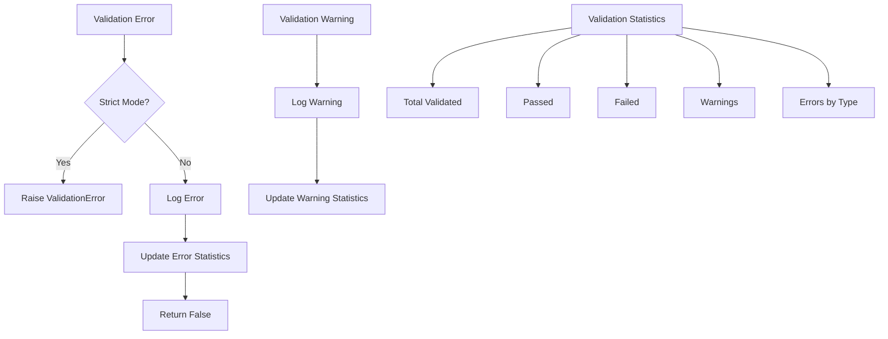

## Best Practices

1. **Use strict mode in production** - Enable strict validation mode in production to ensure data quality
2. **Monitor validation statistics** - Regularly review validation statistics to identify potential issues
3. **Adjust thresholds as needed** - Fine-tune validation thresholds based on your specific requirements
4. **Validate across timeframes** - Always validate data across multiple timeframes for consistency
5. **Validate market microstructure** - Pay special attention to market microstructure validation for trading strategies
6. **Set appropriate volatility regimes** - Adjust validation thresholds based on market volatility
7. **Handle validation warnings** - Review validation warnings to identify potential issues before they become errors
8. **Use batch validation for efficiency** - Use batch validation for large datasets to improve performance
9. **Integrate with monitoring** - Integrate validation statistics with your monitoring system for real-time alerting
10. **Regularly review validation rules** - Periodically review and update validation rules based on changing market conditions

## Performance Considerations

### Batch Processing

For large datasets, use batch validation to improve performance:

```python
# Instead of validating individual data points
for data_point in data_points:
    validator.validate_ohlcv(...)

# Use batch validation
valid_data = validator.validate_batch_ohlcv(data_points)
```

### Parallel Validation

For very large datasets, consider parallel validation:

```python
def validate_in_parallel(data_chunks):
    with concurrent.futures.ProcessPoolExecutor() as executor:
        results = list(executor.map(validator.validate_batch_ohlcv, data_chunks))
    return [item for sublist in results for item in sublist]
```

### Caching Volatility Regimes

Cache volatility regimes to avoid recalculating them for each validation:

```python
# Calculate volatility regimes once
for symbol in symbols:
    volatility = calculate_volatility(symbol)
    validator.set_volatility_regime(symbol, get_regime(volatility))

# Use cached regimes in validation
validator.validate_price_change(symbol, prev_price, curr_price)
```

## Integration with Model Training

The validated data can be used to train machine learning models with confidence in data quality:

```python
# Collect and validate data
pipeline = ProductionDataPipeline(strict_validation=True)
validated_data = pipeline.run_full_pipeline(symbols, data_types)

# Use validated data for feature engineering
feature_engineer = FeatureEngineer()
features = feature_engineer.generate_features(validated_data)

# Train model with high-quality data
model = ModelTrainer()
model.train(features)
```

## Conclusion

The enhanced data validation system provides a robust framework for ensuring data quality throughout the AI Trading System. By implementing comprehensive validation rules, cross-timeframe consistency checks, and market microstructure validation, the system can detect and handle data quality issues before they impact trading decisions.