# Enhanced Dollar Profit Optimizer with GPU Acceleration Guide

## Overview

The Dollar Profit Optimizer is a sophisticated component of the AI Trading System designed to maximize absolute dollar profit in day trading. This enhanced guide provides a comprehensive overview of the optimizer's architecture, GPU acceleration techniques, and integration with the NVIDIA TensorFlow container for optimal performance.

## System Architecture

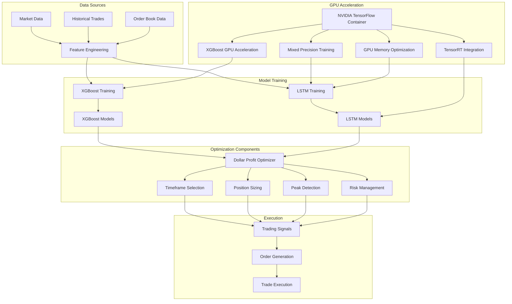
```mermaid
flowchart TD
    subgraph "Data Sources"
        A1[Market Data] --> B1[Feature Engineering]
        A2[Historical Trades] --> B1
        A3[Order Book Data] --> B1
    end
    
    subgraph "Model Training"
        B1 --> C1[XGBoost Training]
        B1 --> C2[LSTM Training]
        C1 --> D1[XGBoost Models]
        C2 --> D2[LSTM Models]
    end
    
    subgraph "GPU Acceleration"
        E1[NVIDIA TensorFlow Container] --> F1[Mixed Precision Training]
        E1 --> F2[TensorRT Integration]
        E1 --> F3[GPU Memory Optimization]
        E1 --> F4[XGBoost GPU Acceleration]
    end
    
    subgraph "Optimization Components"
        D1 --> G1[Dollar Profit Optimizer]
        D2 --> G1
        G1 --> H1[Timeframe Selection]
        G1 --> H2[Position Sizing]
        G1 --> H3[Peak Detection]
        G1 --> H4[Risk Management]
    end
    
    subgraph "Execution"
        H1 --> I1[Trading Signals]
        H2 --> I1
        H3 --> I1
        H4 --> I1
        I1 --> J1[Order Generation]
        J1 --> K1[Trade Execution]
    end
    
    F1 --> C2
    F2 --> D2
    F3 --> C2
    F4 --> C1
```

## Components and Data Flow

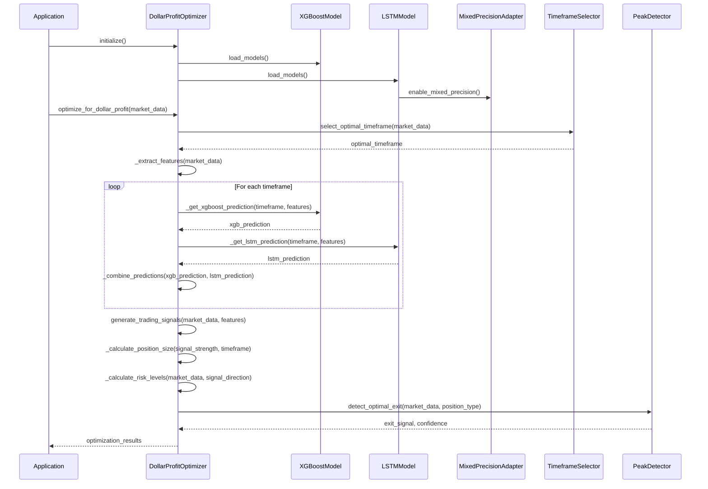
```mermaid
sequenceDiagram
    participant App as Application
    participant DPO as DollarProfitOptimizer
    participant XGB as XGBoostModel
    participant LSTM as LSTMModel
    participant MPA as MixedPrecisionAdapter
    participant TFS as TimeframeSelector
    participant PD as PeakDetector
    
    App->>DPO: initialize()
    DPO->>XGB: load_models()
    DPO->>LSTM: load_models()
    LSTM->>MPA: enable_mixed_precision()
    
    App->>DPO: optimize_for_dollar_profit(market_data)
    DPO->>TFS: select_optimal_timeframe(market_data)
    TFS-->>DPO: optimal_timeframe
    
    DPO->>DPO: _extract_features(market_data)
    
    loop For each timeframe
        DPO->>XGB: _get_xgboost_prediction(timeframe, features)
        XGB-->>DPO: xgb_prediction
        DPO->>LSTM: _get_lstm_prediction(timeframe, features)
        LSTM-->>DPO: lstm_prediction
        DPO->>DPO: _combine_predictions(xgb_prediction, lstm_prediction)
    end
    
    DPO->>DPO: generate_trading_signals(market_data, features)
    DPO->>DPO: _calculate_position_size(signal_strength, timeframe)
    DPO->>DPO: _calculate_risk_levels(market_data, signal_direction)
    
    DPO->>PD: detect_optimal_exit(market_data, position_type)
    PD-->>DPO: exit_signal, confidence
    
    DPO-->>App: optimization_results
```

## Key Components

### DollarProfitOptimizer Class

The `DollarProfitOptimizer` class is the core component responsible for integrating multiple models and optimizing trading decisions for maximum dollar profit.

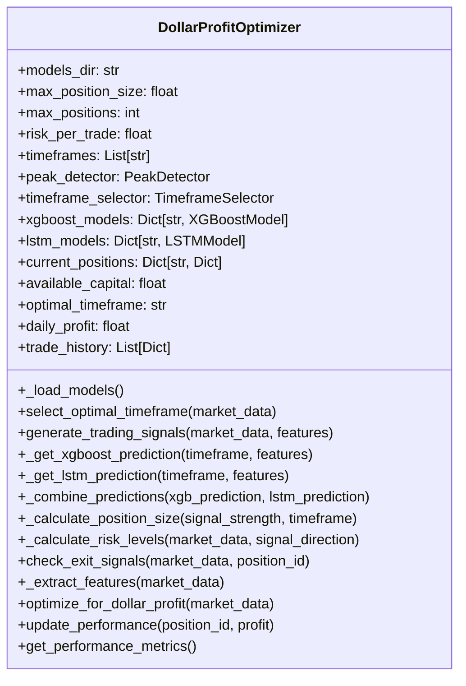
```mermaid
classDiagram
    class DollarProfitOptimizer {
        +models_dir: str
        +max_position_size: float
        +max_positions: int
        +risk_per_trade: float
        +timeframes: List[str]
        +peak_detector: PeakDetector
        +timeframe_selector: TimeframeSelector
        +xgboost_models: Dict[str, XGBoostModel]
        +lstm_models: Dict[str, LSTMModel]
        +current_positions: Dict[str, Dict]
        +available_capital: float
        +optimal_timeframe: str
        +daily_profit: float
        +trade_history: List[Dict]
        +_load_models()
        +select_optimal_timeframe(market_data)
        +generate_trading_signals(market_data, features)
        +_get_xgboost_prediction(timeframe, features)
        +_get_lstm_prediction(timeframe, features)
        +_combine_predictions(xgb_prediction, lstm_prediction)
        +_calculate_position_size(signal_strength, timeframe)
        +_calculate_risk_levels(market_data, signal_direction)
        +check_exit_signals(market_data, position_id)
        +_extract_features(market_data)
        +optimize_for_dollar_profit(market_data)
        +update_performance(position_id, profit)
        +get_performance_metrics()
    }
```

### MixedPrecisionAdapter Class

The `MixedPrecisionAdapter` class provides functionality for enabling and configuring mixed precision training for TensorFlow-based models.

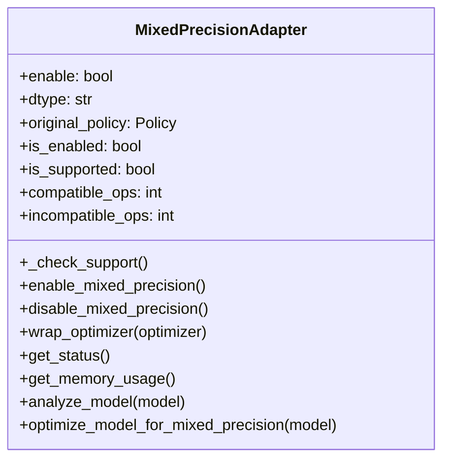
```mermaid
classDiagram
    class MixedPrecisionAdapter {
        +enable: bool
        +dtype: str
        +original_policy: Policy
        +is_enabled: bool
        +is_supported: bool
        +compatible_ops: int
        +incompatible_ops: int
        +_check_support()
        +enable_mixed_precision()
        +disable_mixed_precision()
        +wrap_optimizer(optimizer)
        +get_status()
        +get_memory_usage()
        +analyze_model(model)
        +optimize_model_for_mixed_precision(model)
    }
```

### XGBoostModel Class

The `XGBoostModel` class implements an XGBoost model with GPU acceleration for classification or regression tasks.

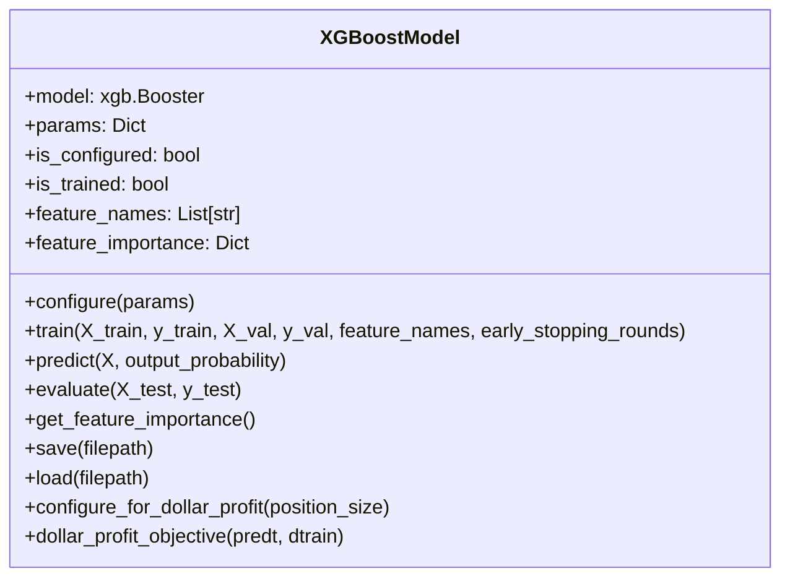
```mermaid
classDiagram
    class XGBoostModel {
        +model: xgb.Booster
        +params: Dict
        +is_configured: bool
        +is_trained: bool
        +feature_names: List[str]
        +feature_importance: Dict
        +configure(params)
        +train(X_train, y_train, X_val, y_val, feature_names, early_stopping_rounds)
        +predict(X, output_probability)
        +evaluate(X_test, y_test)
        +get_feature_importance()
        +save(filepath)
        +load(filepath)
        +configure_for_dollar_profit(position_size)
        +dollar_profit_objective(predt, dtrain)
    }
```

## GPU Acceleration Techniques

### Mixed Precision Training

Mixed precision training uses both 16-bit and 32-bit floating-point types to make training faster and more memory-efficient while maintaining model accuracy.

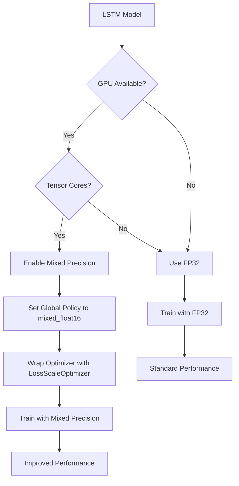
```mermaid
flowchart TD
    A[LSTM Model] --> B{GPU Available?}
    B -->|Yes| C{Tensor Cores?}
    B -->|No| D[Use FP32]
    C -->|Yes| E[Enable Mixed Precision]
    C -->|No| D
    E --> F[Set Global Policy to mixed_float16]
    F --> G[Wrap Optimizer with LossScaleOptimizer]
    G --> H[Train with Mixed Precision]
    D --> I[Train with FP32]
    H --> J[Improved Performance]
    I --> K[Standard Performance]
```

**Implementation:**
```python
def enable_mixed_precision(self) -> None:
    """Enable mixed precision for the current TensorFlow session."""
    if not self.is_supported:
        self.logger.warning("Mixed precision not supported, using float32 instead")
        return
    
    try:
        # Save original policy
        self.original_policy = global_policy()
        
        # Set mixed precision policy
        policy = Policy(self.dtype)
        set_global_policy(policy)
        
        # Enable dynamic loss scaling for mixed_float16
        if self.dtype == 'mixed_float16':
            self.logger.info("Enabled dynamic loss scaling for mixed_float16")
        
        self.is_enabled = True
        self.logger.info(f"Mixed precision enabled with dtype: {self.dtype}")
        
        # Log GPU information
        gpus = tf.config.list_physical_devices('GPU')
        for i, gpu in enumerate(gpus):
            try:
                details = tf.config.experimental.get_device_details(gpu)
                self.logger.info(f"GPU {i}: {details}")
            except:
                self.logger.info(f"GPU {i}: {gpu}")
    
    except Exception as e:
        self.logger.error(f"Error enabling mixed precision: {e}")
        self.is_enabled = False
```

### XGBoost GPU Acceleration

XGBoost can use GPU acceleration for tree building using the `gpu_hist` algorithm.

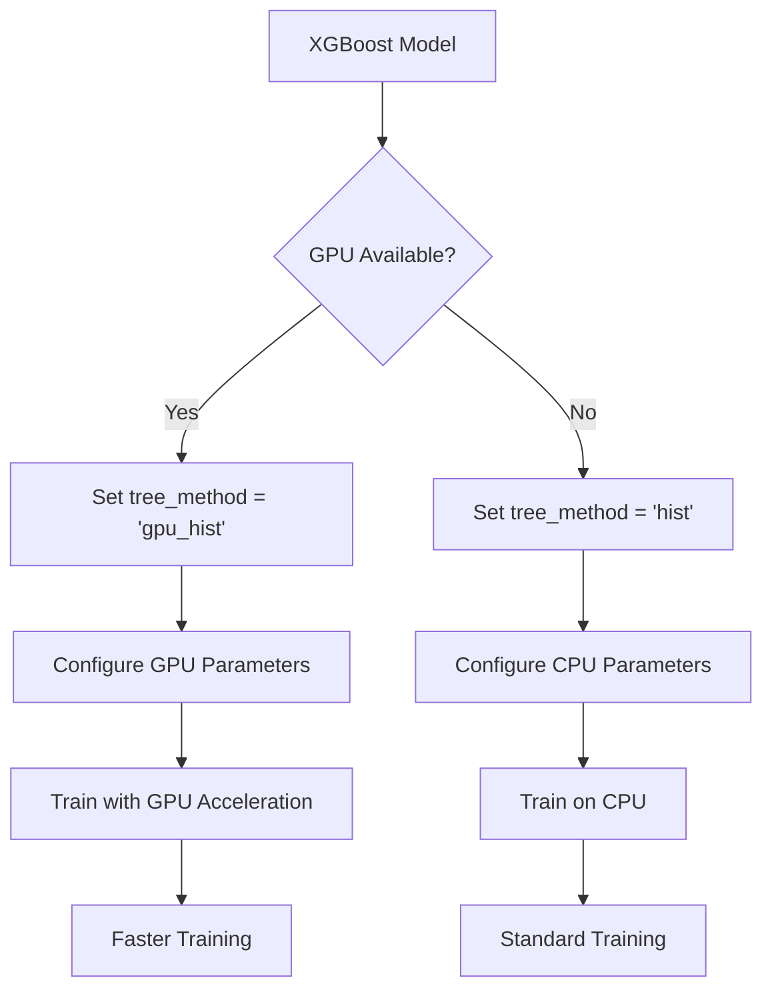
```mermaid
flowchart TD
    A[XGBoost Model] --> B{GPU Available?}
    B -->|Yes| C[Set tree_method = 'gpu_hist']
    B -->|No| D[Set tree_method = 'hist']
    C --> E[Configure GPU Parameters]
    D --> F[Configure CPU Parameters]
    E --> G[Train with GPU Acceleration]
    F --> H[Train on CPU]
    G --> I[Faster Training]
    H --> J[Standard Training]
```

**Implementation:**
```python
def configure(self, params: Optional[Dict] = None) -> None:
    """
    Configure the XGBoost model parameters.
    """
    try:
        # Default parameters
        default_params = {
            'max_depth': 6,
            'learning_rate': 0.01,
            'n_estimators': 1000,
            'subsample': 0.8,
            'colsample_bytree': 0.8,
            'objective': 'binary:logistic',
            'tree_method': 'gpu_hist',  # GPU-accelerated histogram algorithm
            'grow_policy': 'lossguide',  # More flexible tree growth
            'max_leaves': 256,  # Maximum number of leaves in trees
            'eval_metric': 'logloss',
            'seed': 42
        }
        
        # Update with provided parameters
        if params:
            # If GPU is not available, fall back to CPU
            if params.get('tree_method') != 'gpu_hist':
                try:
                    import xgboost as xgb
                    if not xgb.config.USE_CUDA:
                        self.logger.warning("CUDA not available for XGBoost, falling back to CPU 'hist' method")
                        default_params['tree_method'] = 'hist'
                except:
                    default_params['tree_method'] = 'hist'
            default_params.update(params)
        
        self.params = default_params
        
        self.logger.info(f"XGBoost model configured with parameters: {self.params}")
        
        self.is_configured = True
        
    except Exception as e:
        self.logger.error(f"Error configuring XGBoost model: {e}")
        raise
```

### TensorRT Integration

TensorRT is used to optimize LSTM model inference on NVIDIA GPUs.

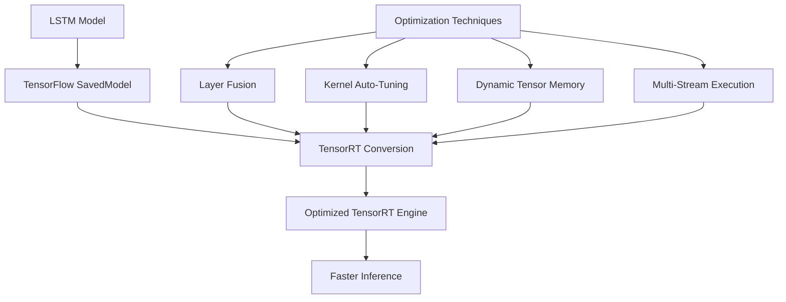
```mermaid
flowchart TD
    A[LSTM Model] --> B[TensorFlow SavedModel]
    B --> C[TensorRT Conversion]
    C --> D[Optimized TensorRT Engine]
    D --> E[Faster Inference]
    
    F[Optimization Techniques] --> G[Layer Fusion]
    F --> H[Kernel Auto-Tuning]
    F --> I[Dynamic Tensor Memory]
    F --> J[Multi-Stream Execution]
    
    G --> C
    H --> C
    I --> C
    J --> C
```

### GPU Memory Optimization

Techniques for optimizing GPU memory usage to prevent out-of-memory errors.

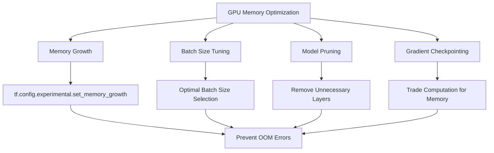
```mermaid
flowchart TD
    A[GPU Memory Optimization] --> B[Memory Growth]
    A --> C[Batch Size Tuning]
    A --> D[Model Pruning]
    A --> E[Gradient Checkpointing]
    
    B --> F[tf.config.experimental.set_memory_growth]
    C --> G[Optimal Batch Size Selection]
    D --> H[Remove Unnecessary Layers]
    E --> I[Trade Computation for Memory]
    
    F --> J[Prevent OOM Errors]
    G --> J
    H --> J
    I --> J
```

**Implementation:**
```python
# Configure GPU memory growth to prevent OOM errors
gpus = tf.config.list_physical_devices('GPU')
if gpus:
    try:
        for gpu in gpus:
            tf.config.experimental.set_memory_growth(gpu, True)
        logical_gpus = tf.config.list_logical_devices('GPU')
        print(f"{len(gpus)} Physical GPUs, {len(logical_gpus)} Logical GPUs")
    except RuntimeError as e:
        print(f"Memory growth configuration error: {e}")
```

## NVIDIA TensorFlow Container

The NVIDIA TensorFlow container provides a pre-configured environment for running TensorFlow with GPU acceleration.

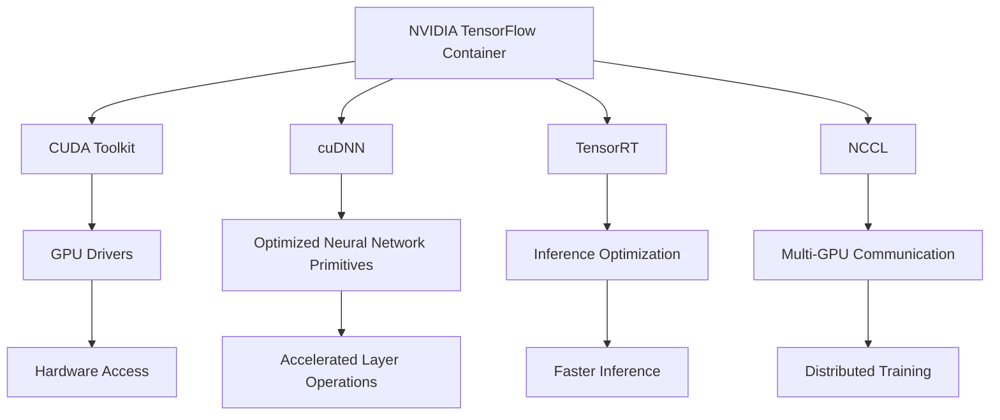
```mermaid
flowchart TD
    A[NVIDIA TensorFlow Container] --> B[CUDA Toolkit]
    A --> C[cuDNN]
    A --> D[TensorRT]
    A --> E[NCCL]
    
    B --> F[GPU Drivers]
    C --> G[Optimized Neural Network Primitives]
    D --> H[Inference Optimization]
    E --> I[Multi-GPU Communication]
    
    F --> J[Hardware Access]
    G --> K[Accelerated Layer Operations]
    H --> L[Faster Inference]
    I --> M[Distributed Training]
```

### Container Configuration

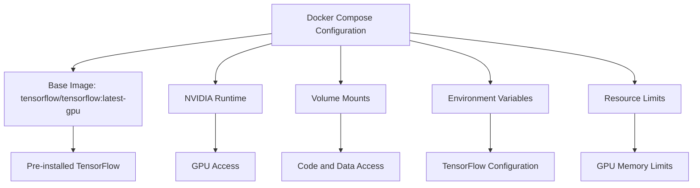
```mermaid
flowchart TD
    A[Docker Compose Configuration] --> B[Base Image: tensorflow/tensorflow:latest-gpu]
    A --> C[NVIDIA Runtime]
    A --> D[Volume Mounts]
    A --> E[Environment Variables]
    A --> F[Resource Limits]
    
    B --> G[Pre-installed TensorFlow]
    C --> H[GPU Access]
    D --> I[Code and Data Access]
    E --> J[TensorFlow Configuration]
    F --> K[GPU Memory Limits]
```

**Implementation:**
```yaml
version: '3'
services:
  tensorflow:
    image: tensorflow/tensorflow:latest-gpu
    container_name: inavvi-tensorflow-gpu
    volumes:
      - ./:/app
    environment:
      - TF_FORCE_GPU_ALLOW_GROWTH=true
      - TF_XLA_FLAGS=--tf_xla_auto_jit=2
      - TF_CUDNN_RESET_RNN_DESCRIPTOR=1
    deploy:
      resources:
        reservations:
          devices:
            - driver: nvidia
              count: 1
              capabilities: [gpu]
```

## Model Training with GPU Acceleration

### XGBoost Training

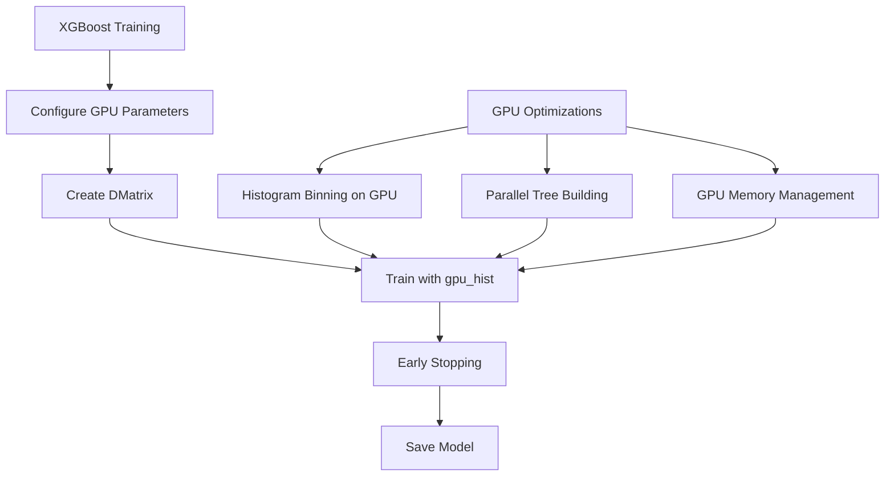
```mermaid
flowchart TD
    A[XGBoost Training] --> B[Configure GPU Parameters]
    B --> C[Create DMatrix]
    C --> D[Train with gpu_hist]
    D --> E[Early Stopping]
    E --> F[Save Model]
    
    G[GPU Optimizations] --> H[Histogram Binning on GPU]
    G --> I[Parallel Tree Building]
    G --> J[GPU Memory Management]
    
    H --> D
    I --> D
    J --> D
```

**Implementation:**
```python
def train(self, X_train: np.ndarray, y_train: np.ndarray,
          X_val: np.ndarray, y_val: np.ndarray, 
          feature_names: Optional[List[str]] = None,
          early_stopping_rounds: int = 10) -> Optional[Dict]:
    """Train the XGBoost model with GPU acceleration."""
    try:
        # Import XGBoost here to avoid dependency issues if not installed
        import xgboost as xgb
        
        # Check if GPU is available for XGBoost
        if self.params.get('tree_method') == 'gpu_hist':
            try:
                if not xgb.config.USE_CUDA:
                    self.logger.warning("CUDA not available for XGBoost, falling back to CPU 'hist' method")
                    self.params['tree_method'] = 'hist'
            except:
                self.params['tree_method'] = 'hist'
        
        # Create DMatrix objects with feature names if available
        if feature_names:
            dtrain = xgb.DMatrix(X_train, label=y_train, feature_names=feature_names)
            dval = xgb.DMatrix(X_val, label=y_val, feature_names=feature_names)
        else:
            dtrain = xgb.DMatrix(X_train, label=y_train)
            dval = xgb.DMatrix(X_val, label=y_val)
        
        # Set up evaluation list
        eval_list = [(dtrain, 'train'), (dval, 'validation')]
        
        # Train the model
        self.logger.info(f"Training XGBoost with tree_method: {self.params.get('tree_method', 'hist')}")
        self.model = xgb.train(
            self.params,
            dtrain,
            num_boost_round=self.params.get('n_estimators', 1000),
            evals=eval_list,
            early_stopping_rounds=early_stopping_rounds,
            verbose_eval=100  # Print evaluation every 100 rounds
        )
        
        # Get training history
        results = {
            'train': self.model.eval(dtrain).split(':')[1],
            'validation': self.model.eval(dval).split(':')[1],
            'best_iteration': self.model.best_iteration,
            'best_score': self.model.best_score
        }
        
        self.is_trained = True
        return results
        
    except Exception as e:
        self.logger.error(f"Error training XGBoost model: {e}")
        return None
```

### LSTM Training

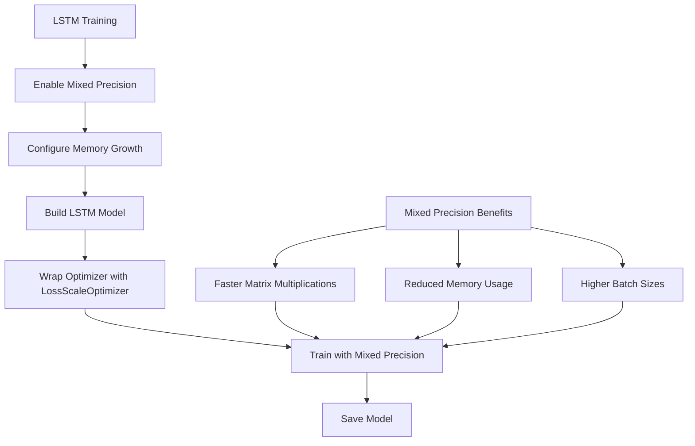
```mermaid
flowchart TD
    A[LSTM Training] --> B[Enable Mixed Precision]
    B --> C[Configure Memory Growth]
    C --> D[Build LSTM Model]
    D --> E[Wrap Optimizer with LossScaleOptimizer]
    E --> F[Train with Mixed Precision]
    F --> G[Save Model]
    
    H[Mixed Precision Benefits] --> I[Faster Matrix Multiplications]
    H --> J[Reduced Memory Usage]
    H --> K[Higher Batch Sizes]
    
    I --> F
    J --> F
    K --> F
```

## Dollar Profit Optimization Process

### Timeframe Selection

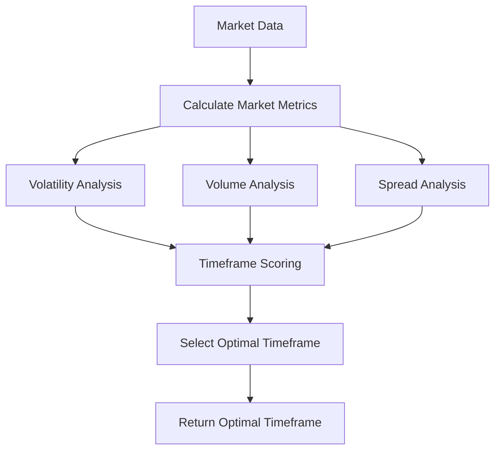
```mermaid
flowchart TD
    A[Market Data] --> B[Calculate Market Metrics]
    B --> C[Volatility Analysis]
    B --> D[Volume Analysis]
    B --> E[Spread Analysis]
    
    C --> F[Timeframe Scoring]
    D --> F
    E --> F
    
    F --> G[Select Optimal Timeframe]
    G --> H[Return Optimal Timeframe]
```

### Trading Signal Generation

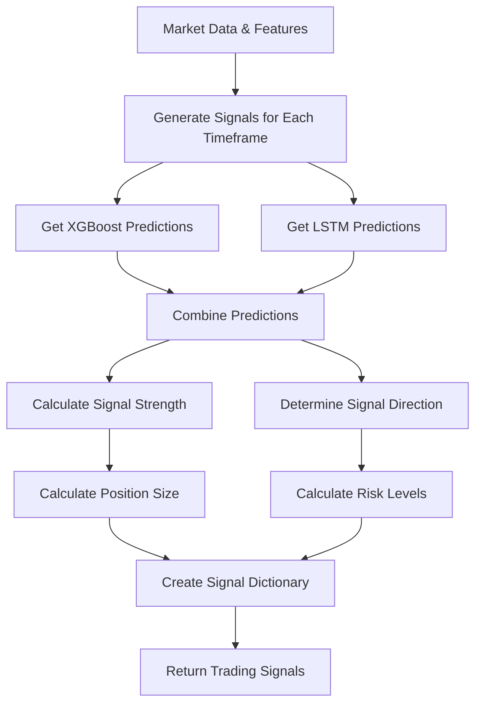
```mermaid
flowchart TD
    A[Market Data & Features] --> B[Generate Signals for Each Timeframe]
    B --> C[Get XGBoost Predictions]
    B --> D[Get LSTM Predictions]
    
    C --> E[Combine Predictions]
    D --> E
    
    E --> F[Calculate Signal Strength]
    E --> G[Determine Signal Direction]
    
    F --> H[Calculate Position Size]
    G --> I[Calculate Risk Levels]
    
    H --> J[Create Signal Dictionary]
    I --> J
    
    J --> K[Return Trading Signals]
```

### Position Sizing

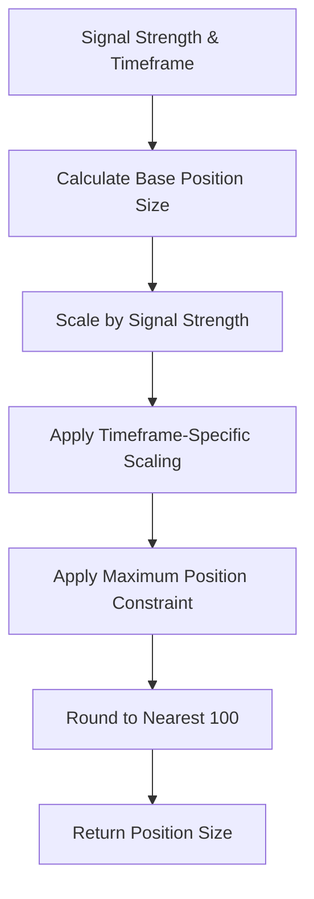
```mermaid
flowchart TD
    A[Signal Strength & Timeframe] --> B[Calculate Base Position Size]
    B --> C[Scale by Signal Strength]
    C --> D[Apply Timeframe-Specific Scaling]
    D --> E[Apply Maximum Position Constraint]
    E --> F[Round to Nearest 100]
    F --> G[Return Position Size]
```

### Risk Management

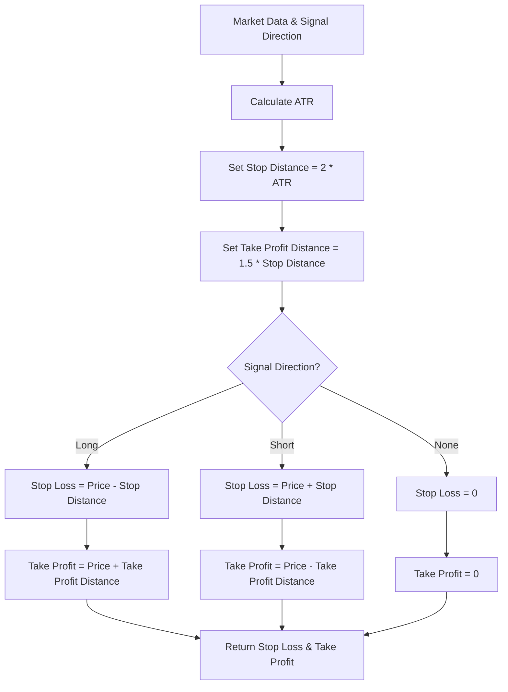
```mermaid
flowchart TD
    A[Market Data & Signal Direction] --> B[Calculate ATR]
    B --> C[Set Stop Distance = 2 * ATR]
    C --> D[Set Take Profit Distance = 1.5 * Stop Distance]
    
    D --> E{Signal Direction?}
    E -->|Long| F[Stop Loss = Price - Stop Distance]
    E -->|Short| G[Stop Loss = Price + Stop Distance]
    E -->|None| H[Stop Loss = 0]
    
    F --> I[Take Profit = Price + Take Profit Distance]
    G --> J[Take Profit = Price - Take Profit Distance]
    H --> K[Take Profit = 0]
    
    I --> L[Return Stop Loss & Take Profit]
    J --> L
    K --> L
```

## Performance Comparison

The following tables show the performance improvements achieved with GPU acceleration:

### LSTM Model Training

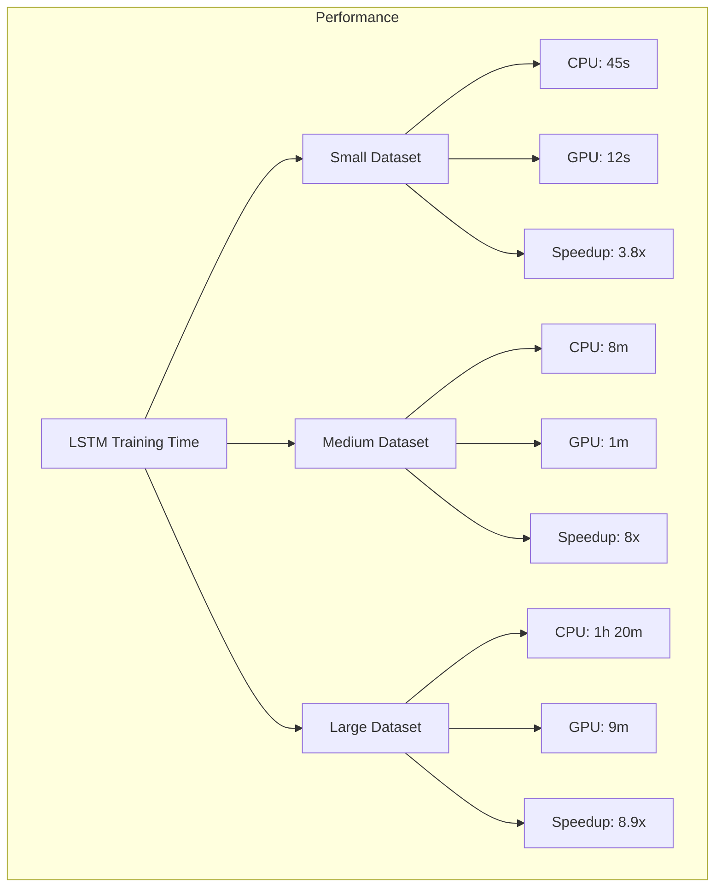
```mermaid
graph TD
    subgraph Performance
        A[LSTM Training Time] --> B[Small Dataset]
        A --> C[Medium Dataset]
        A --> D[Large Dataset]
        
        B --> E[CPU: 45s]
        B --> F[GPU: 12s]
        B --> G[Speedup: 3.8x]
        
        C --> H[CPU: 8m]
        C --> I[GPU: 1m]
        C --> J[Speedup: 8x]
        
        D --> K[CPU: 1h 20m]
        D --> L[GPU: 9m]
        D --> M[Speedup: 8.9x]
    end
```

### XGBoost Model Training

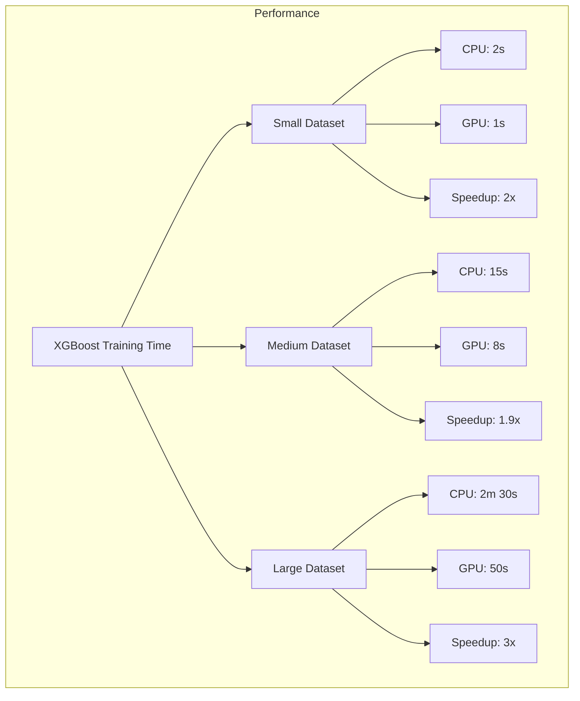
```mermaid
graph TD
    subgraph Performance
        A[XGBoost Training Time] --> B[Small Dataset]
        A --> C[Medium Dataset]
        A --> D[Large Dataset]
        
        B --> E[CPU: 2s]
        B --> F[GPU: 1s]
        B --> G[Speedup: 2x]
        
        C --> H[CPU: 15s]
        C --> I[GPU: 8s]
        C --> J[Speedup: 1.9x]
        
        D --> K[CPU: 2m 30s]
        D --> L[GPU: 50s]
        D --> M[Speedup: 3x]
    end
```

## GH200 Grace Hopper Superchip Compatibility

The system includes special optimizations for NVIDIA GH200 Grace Hopper Superchips:

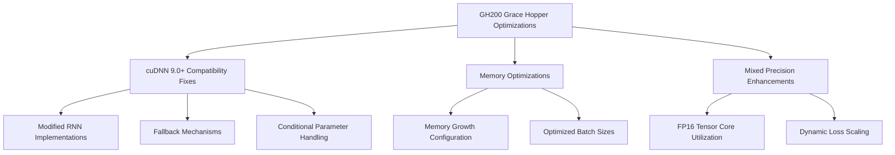
```mermaid
flowchart TD
    A[GH200 Grace Hopper Optimizations] --> B[cuDNN 9.0+ Compatibility Fixes]
    A --> C[Memory Optimizations]
    A --> D[Mixed Precision Enhancements]
    
    B --> E[Modified RNN Implementations]
    B --> F[Fallback Mechanisms]
    B --> G[Conditional Parameter Handling]
    
    C --> H[Memory Growth Configuration]
    C --> I[Optimized Batch Sizes]
    
    D --> J[FP16 Tensor Core Utilization]
    D --> K[Dynamic Loss Scaling]
```

### cuDNN Compatibility Fixes

```mermaid
flowchart TD
    A[cuDNN Compatibility Issues] --> B[Reset RNN Descriptor]
    A --> C[SimpleRNN Fallback]
    A --> D[Custom LSTM Implementation]
    
    B --> E[TF_CUDNN_RESET_RNN_DESCRIPTOR=1]
    C --> F[Use SimpleRNN when LSTM fails]
    D --> G[Avoid cuDNN-specific LSTM features]
    
    E --> H[Fix Sequence Length Issues]
    F --> I[Maintain Compatibility]
    G --> J[Ensure Stable Training]
```

## Troubleshooting

### Common Issues and Solutions

```mermaid
flowchart TD
    A[Common Issues] --> B[CUDA Out of Memory]
    A --> C[cuDNN Compatibility]
    A --> D[Driver Issues]
    A --> E[Container Access]
    
    B --> F[Reduce Batch Size]
    B --> G[Enable Memory Growth]
    B --> H[Simplify Model]
    
    C --> I[Apply cuDNN Fixes]
    C --> J[Use Fallback Implementations]
    
    D --> K[Update NVIDIA Drivers]
    D --> L[Check nvidia-smi]
    
    E --> M[Check Docker Permissions]
    E --> N[Verify NVIDIA Container Toolkit]
```

### Diagnostic Commands

```mermaid
flowchart TD
    A[Diagnostic Commands] --> B[Check NVIDIA Drivers]
    A --> C[Verify Docker GPU Access]
    A --> D[Check Container Logs]
    A --> E[Run Model Tests]
    
    B --> F[nvidia-smi]
    C --> G[docker run --rm --gpus all nvidia/cuda:11.0-base nvidia-smi]
    D --> H[docker-compose -f nvidia_tf_container/docker-compose.yml logs]
    E --> I[docker exec -it inavvi-tensorflow-gpu python /app/app/test_models_gpu.py]
```

## Best Practices

1. **Use Mixed Precision Training** - Enable mixed precision training for LSTM models to take advantage of Tensor Cores on NVIDIA GPUs
2. **Configure GPU Memory Growth** - Set memory growth to prevent out-of-memory errors
3. **Use XGBoost's GPU Acceleration** - Set `tree_method='gpu_hist'` for XGBoost models to use GPU acceleration
4. **Optimize Batch Sizes** - Find the optimal batch size for your GPU memory capacity
5. **Use TensorRT for Inference** - Convert trained models to TensorRT for faster inference
6. **Apply cuDNN Fixes for GH200** - Use the provided fixes for cuDNN compatibility with GH200 Grace Hopper Superchips
7. **Monitor GPU Utilization** - Use `nvidia-smi` to monitor GPU utilization and memory usage
8. **Implement Fallbacks** - Always implement CPU fallbacks for when GPU is not available
9. **Optimize Container Resources** - Configure container resource limits appropriately for your hardware
10. **Regular Performance Testing** - Regularly test performance to ensure optimal GPU utilization

## Advanced Configuration

### Mixed Precision Settings

```mermaid
flowchart TD
    A[Mixed Precision Configuration] --> B[Policy Selection]
    A --> C[Optimizer Wrapping]
    A --> D[Layer-Specific Settings]
    
    B --> E[mixed_float16]
    B --> F[mixed_bfloat16]
    B --> G[float32]
    
    C --> H[LossScaleOptimizer]
    C --> I[Dynamic Loss Scaling]
    
    D --> J[Cast Softmax to float32]
    D --> K[Keep BatchNorm in float32]
```

### XGBoost GPU Settings

```mermaid
flowchart TD
    A[XGBoost GPU Configuration] --> B[Tree Method]
    A --> C[Grow Policy]
    A --> D[Max Leaves]
    A --> E[GPU ID]
    
    B --> F[gpu_hist]
    C --> G[lossguide]
    D --> H[256]
    E --> I[0]
```

### Container Resource Limits

```mermaid
flowchart TD
    A[Container Resource Configuration] --> B[GPU Count]
    A --> C[Memory Limits]
    A --> D[CPU Limits]
    A --> E[Shared Memory]
    
    B --> F[count: 1]
    C --> G[memory: 16g]
    D --> H[cpus: 8]
    E --> I[shm_size: 2g]
```

## Conclusion

The Dollar Profit Optimizer with GPU acceleration provides a powerful framework for maximizing absolute dollar profit in day trading. By leveraging NVIDIA GPUs and advanced optimization techniques, the system achieves significant performance improvements in both training and inference, enabling faster and more efficient trading decisions.