# Enhanced Multi-Timeframe Feature Engineering Guide

## Overview

The AI Trading System implements a sophisticated feature engineering pipeline that leverages multiple timeframes and Redis caching to generate high-quality features for machine learning models. This enhanced guide provides a comprehensive overview of the feature engineering process, including detailed explanations of technical indicators, feature transformations, and performance considerations.

## System Architecture

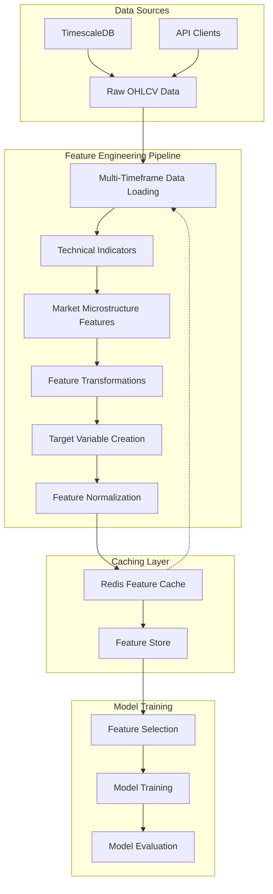

## Data Flow Process

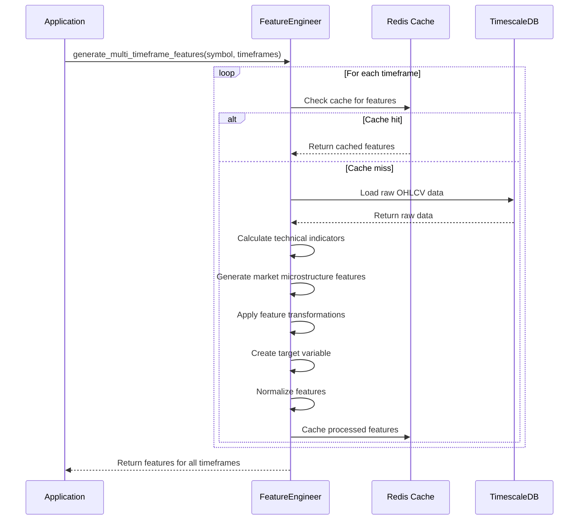

## Key Components

### FeatureEngineer Class

The `FeatureEngineer` class is the core component responsible for generating features from raw market data. It provides methods for:

- Loading raw market data from TimescaleDB
- Calculating technical indicators
- Generating market microstructure features
- Creating target variables
- Normalizing and transforming features

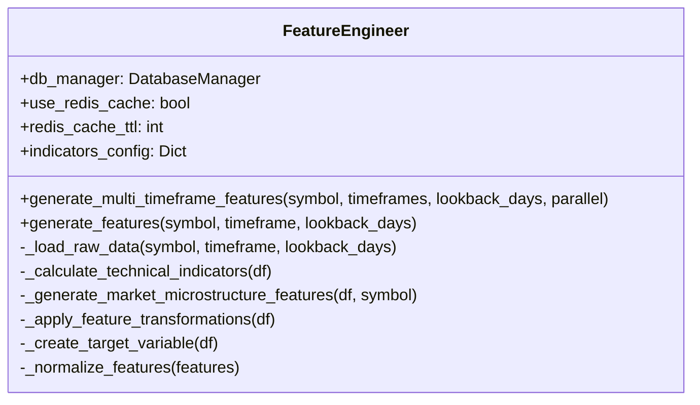

### Redis Feature Store Cache

The `FeatureStoreCache` class provides Redis-based caching for features, enabling fast retrieval of previously calculated features.

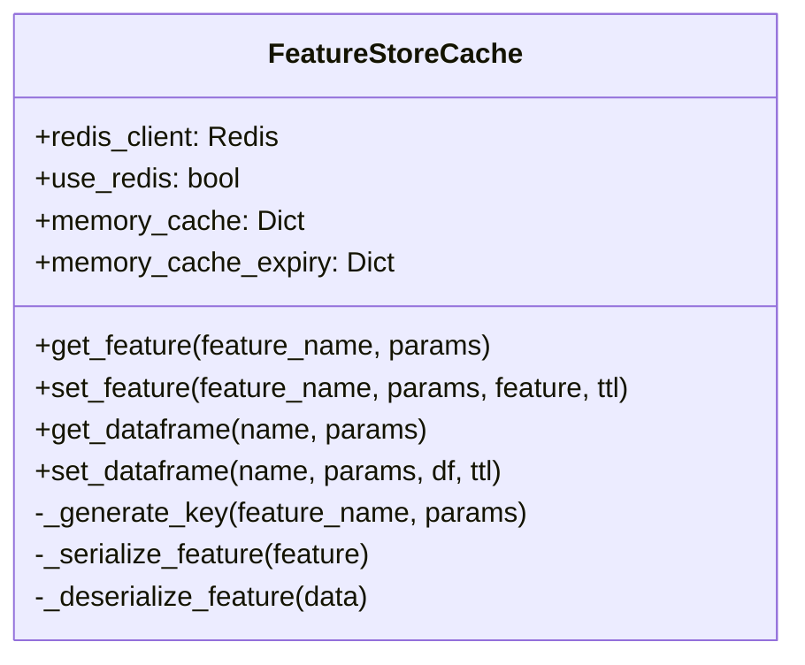

## Technical Indicators

The feature engineering pipeline calculates a variety of technical indicators to capture different aspects of market behavior:

### Relative Strength Index (RSI)

RSI measures the speed and change of price movements, oscillating between 0 and 100.

```mermaid
flowchart LR
    A[Price Data] --> B[Calculate Price Changes]
    B --> C[Separate Gains and Losses]
    C --> D[Calculate Average Gain]
    C --> E[Calculate Average Loss]
    D --> F[Calculate RS = Avg Gain / Avg Loss]
    E --> F
    F --> G[Calculate RSI = 100 - 100/(1+RS)]
```

**Implementation:**
```python
def _calculate_rsi(self, df: pd.DataFrame, config: Dict) -> pd.DataFrame:
    window = config.get('parameters', {}).get('window', 14)
    
    # Calculate price changes
    delta = df['close'].diff()
    
    # Create gain and loss series
    gain = delta.copy()
    loss = delta.copy()
    gain[gain < 0] = 0
    loss[loss > 0] = 0
    loss = abs(loss)
    
    # Calculate average gain and loss
    avg_gain = gain.rolling(window=window).mean()
    avg_loss = loss.rolling(window=window).mean()
    
    # Calculate RS and RSI
    rs = avg_gain / avg_loss
    rsi = 100 - (100 / (1 + rs))
    
    # Add to DataFrame
    df['rsi'] = rsi
    
    return df
```

### Moving Average Convergence Divergence (MACD)

MACD is a trend-following momentum indicator that shows the relationship between two moving averages of a security's price.

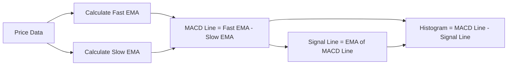

**Implementation:**
```python
def _calculate_macd(self, df: pd.DataFrame, config: Dict) -> pd.DataFrame:
    fast_period = config.get('parameters', {}).get('fast_period', 12)
    slow_period = config.get('parameters', {}).get('slow_period', 26)
    signal_period = config.get('parameters', {}).get('signal_period', 9)
    
    # Calculate EMAs
    ema_fast = df['close'].ewm(span=fast_period, adjust=False).mean()
    ema_slow = df['close'].ewm(span=slow_period, adjust=False).mean()
    
    # Calculate MACD and signal line
    macd = ema_fast - ema_slow
    signal = macd.ewm(span=signal_period, adjust=False).mean()
    histogram = macd - signal
    
    # Add to DataFrame
    df['macd'] = macd
    df['macd_signal'] = signal
    df['macd_histogram'] = histogram
    
    return df
```

### Bollinger Bands

Bollinger Bands consist of a middle band (SMA) with upper and lower bands at standard deviation levels above and below the middle band.

```mermaid
flowchart LR
    A[Price Data] --> B[Calculate Middle Band (SMA)]
    A --> C[Calculate Standard Deviation]
    B --> D[Upper Band = Middle Band + (StdDev * Multiplier)]
    C --> D
    B --> E[Lower Band = Middle Band - (StdDev * Multiplier)]
    C --> E
    D --> F[Bandwidth = (Upper - Lower) / Middle]
    E --> F
    D --> G[%B = (Price - Lower) / (Upper - Lower)]
    E --> G
```

**Implementation:**
```python
def _calculate_bollinger_bands(self, df: pd.DataFrame, config: Dict) -> pd.DataFrame:
    window = config.get('parameters', {}).get('window', 20)
    num_std_dev = config.get('parameters', {}).get('num_std_dev', 2)
    
    # Calculate middle band (SMA)
    middle_band = df['close'].rolling(window=window).mean()
    
    # Calculate standard deviation
    std_dev = df['close'].rolling(window=window).std()
    
    # Calculate upper and lower bands
    upper_band = middle_band + (std_dev * num_std_dev)
    lower_band = middle_band - (std_dev * num_std_dev)
    
    # Calculate bandwidth and %B
    bandwidth = (upper_band - lower_band) / middle_band
    percent_b = (df['close'] - lower_band) / (upper_band - lower_band)
    
    # Add to DataFrame
    df['bb_upper'] = upper_band
    df['bb_middle'] = middle_band
    df['bb_lower'] = lower_band
    df['bb_bandwidth'] = bandwidth
    df['bb_percent_b'] = percent_b
    
    return df
```

### Average True Range (ATR)

ATR measures market volatility by decomposing the entire range of an asset price for a period.

```mermaid
flowchart LR
    A[Price Data] --> B[Calculate High-Low Range]
    A --> C[Calculate High-Close Range]
    A --> D[Calculate Low-Close Range]
    B --> E[True Range = Max(High-Low, High-Close, Low-Close)]
    C --> E
    D --> E
    E --> F[ATR = Moving Average of True Range]
```

**Implementation:**
```python
def _calculate_atr(self, df: pd.DataFrame, config: Dict) -> pd.DataFrame:
    window = config.get('parameters', {}).get('window', 14)
    
    # Calculate true range
    high_low = df['high'] - df['low']
    high_close = abs(df['high'] - df['close'].shift())
    low_close = abs(df['low'] - df['close'].shift())
    
    true_range = pd.concat([high_low, high_close, low_close], axis=1).max(axis=1)
    
    # Calculate ATR
    atr = true_range.rolling(window=window).mean()
    
    # Add to DataFrame
    df['atr'] = atr
    
    return df
```

### On-Balance Volume (OBV)

OBV is a momentum indicator that uses volume flow to predict changes in stock price.

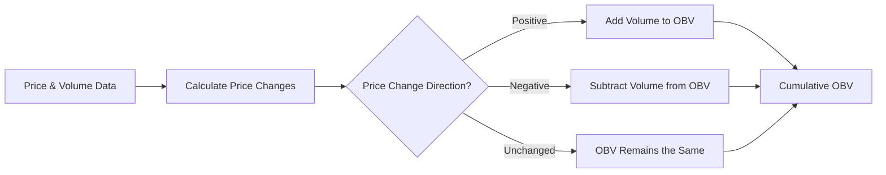

**Implementation:**
```python
def _calculate_obv(self, df: pd.DataFrame, config: Dict) -> pd.DataFrame:
    # Initialize OBV with zeros
    obv = np.zeros(len(df))
    
    # Calculate price changes
    price_changes = df['close'].diff().values
    
    # Calculate OBV
    for i in range(1, len(df)):
        if price_changes[i] > 0:  # Price went up
            obv[i] = obv[i-1] + df['volume'].iloc[i]
        elif price_changes[i] < 0:  # Price went down
            obv[i] = obv[i-1] - df['volume'].iloc[i]
        else:  # Price unchanged
            obv[i] = obv[i-1]
    
    # Add to DataFrame
    df['obv'] = obv
    
    return df
```

## Advanced Market Microstructure Features

The feature engineering pipeline includes advanced market microstructure features that provide deeper insights into market behavior:

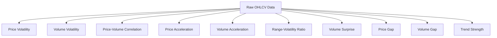

**Implementation:**
```python
def _generate_market_microstructure_features(self, df: pd.DataFrame, symbol: str) -> pd.DataFrame:
    # Calculate price volatility
    df['price_volatility'] = df['close'].pct_change().rolling(window=20).std()
    
    # Calculate volume volatility
    df['volume_volatility'] = df['volume'].pct_change().rolling(window=20).std()
    
    # Calculate price-volume correlation
    df['price_volume_corr'] = df['close'].pct_change().rolling(window=20).corr(df['volume'].pct_change())
    
    # Calculate price acceleration (second derivative of price)
    df['price_acceleration'] = df['close'].pct_change().diff()
    
    # Calculate volume acceleration
    df['volume_acceleration'] = df['volume'].pct_change().diff()
    
    # Calculate price range relative to volatility
    df['range_volatility_ratio'] = (df['high'] - df['low']) / (df['close'].rolling(window=20).std() * df['close'])
    
    # Calculate volume surprise (volume relative to recent average)
    df['volume_surprise'] = df['volume'] / df['volume'].rolling(window=20).mean() - 1
    
    # Calculate price gap (overnight gap)
    df['price_gap'] = df['open'] / df['close'].shift(1) - 1
    
    # Calculate volume gap
    df['volume_gap'] = df['volume'] / df['volume'].shift(1) - 1
    
    # Calculate price trend strength
    df['trend_strength'] = df['close'].rolling(window=20).mean() / df['close'].rolling(window=50).mean() - 1
    
    return df
```

## Feature Transformations

The feature engineering pipeline applies various transformations to the raw features to capture different aspects of market behavior:

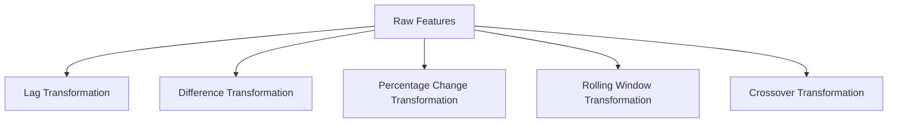

### Lag Transformation

Lag transformation creates lagged versions of features, allowing the model to capture temporal dependencies.

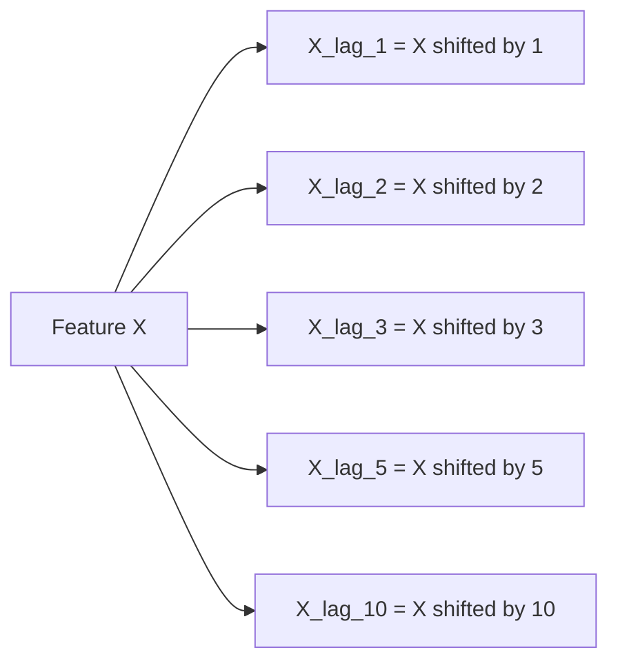

**Implementation:**
```python
def _apply_lag_transformation(self, df: pd.DataFrame, config: Dict) -> pd.DataFrame:
    periods = config.get('parameters', {}).get('periods', [1, 2, 3, 5, 10])
    
    # Get numeric columns (excluding target if it exists)
    numeric_cols = df.select_dtypes(include=[np.number]).columns.tolist()
    if 'target' in numeric_cols:
        numeric_cols.remove('target')
    
    # Create lagged features
    for col in numeric_cols:
        for period in periods:
            df[f"{col}_lag_{period}"] = df[col].shift(period)
    
    return df
```

### Difference Transformation

Difference transformation calculates the difference between the current value and a previous value, capturing changes over time.

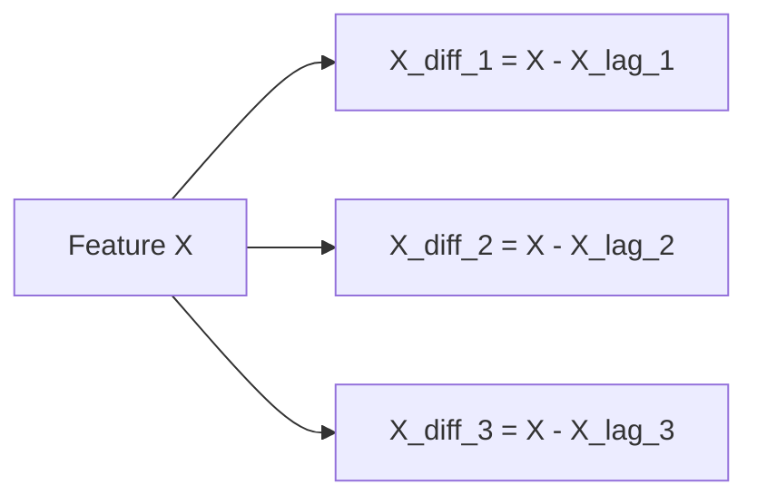

**Implementation:**
```python
def _apply_diff_transformation(self, df: pd.DataFrame, config: Dict) -> pd.DataFrame:
    periods = config.get('parameters', {}).get('periods', [1, 2, 3])
    
    # Get numeric columns (excluding target if it exists)
    numeric_cols = df.select_dtypes(include=[np.number]).columns.tolist()
    if 'target' in numeric_cols:
        numeric_cols.remove('target')
    
    # Create differenced features
    for col in numeric_cols:
        for period in periods:
            df[f"{col}_diff_{period}"] = df[col].diff(period)
    
    return df
```

### Percentage Change Transformation

Percentage change transformation calculates the percentage change between the current value and a previous value, capturing relative changes over time.

```mermaid
flowchart LR
    A[Feature X] --> B[X_pct_1 = (X / X_lag_1) - 1]
    A --> C[X_pct_2 = (X / X_lag_2) - 1]
    A --> D[X_pct_3 = (X / X_lag_3) - 1]
    A --> E[X_pct_5 = (X / X_lag_5) - 1]
    A --> F[X_pct_10 = (X / X_lag_10) - 1]
```

**Implementation:**
```python
def _apply_pct_change_transformation(self, df: pd.DataFrame, config: Dict) -> pd.DataFrame:
    periods = config.get('parameters', {}).get('periods', [1, 2, 3, 5, 10])
    
    # Get numeric columns (excluding target if it exists)
    numeric_cols = df.select_dtypes(include=[np.number]).columns.tolist()
    if 'target' in numeric_cols:
        numeric_cols.remove('target')
    
    # Create percentage change features
    for col in numeric_cols:
        for period in periods:
            df[f"{col}_pct_{period}"] = df[col].pct_change(period)
    
    return df
```

### Rolling Window Transformation

Rolling window transformation applies a function (mean, std, min, max) to a rolling window of values, capturing statistical properties over time.

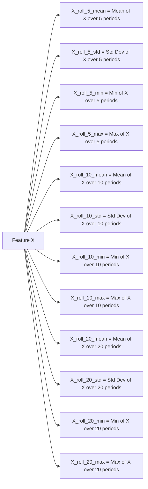

**Implementation:**
```python
def _apply_rolling_transformation(self, df: pd.DataFrame, config: Dict) -> pd.DataFrame:
    windows = config.get('parameters', {}).get('windows', [5, 10, 20])
    functions = config.get('parameters', {}).get('functions', ['mean', 'std', 'min', 'max'])
    
    # Get numeric columns (excluding target if it exists)
    numeric_cols = df.select_dtypes(include=[np.number]).columns.tolist()
    if 'target' in numeric_cols:
        numeric_cols.remove('target')
    
    # Create rolling window features
    for col in numeric_cols:
        for window in windows:
            for func in functions:
                if func == 'mean':
                    df[f"{col}_roll_{window}_mean"] = df[col].rolling(window=window).mean()
                elif func == 'std':
                    df[f"{col}_roll_{window}_std"] = df[col].rolling(window=window).std()
                elif func == 'min':
                    df[f"{col}_roll_{window}_min"] = df[col].rolling(window=window).min()
                elif func == 'max':
                    df[f"{col}_roll_{window}_max"] = df[col].rolling(window=window).max()
    
    return df
```

### Crossover Transformation

Crossover transformation identifies when one feature crosses above or below another feature, capturing potential trading signals.

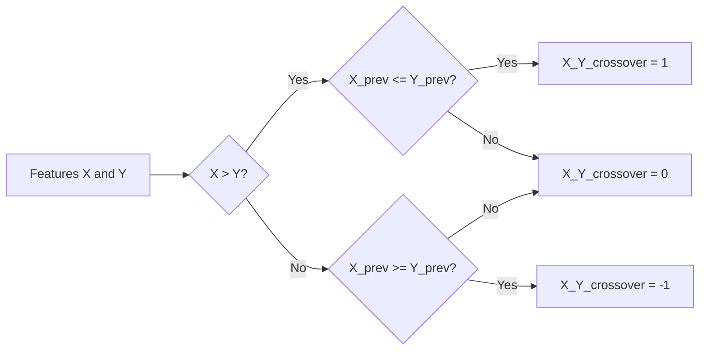

**Implementation:**
```python
def _apply_crossover_transformation(self, df: pd.DataFrame, config: Dict) -> pd.DataFrame:
    pairs = config.get('parameters', {}).get('pairs', [])
    
    # Create crossover features
    for pair in pairs:
        if len(pair) == 2 and all(col in df.columns for col in pair):
            col1, col2 = pair
            # Crossover: 1 if col1 crosses above col2, -1 if col1 crosses below col2, 0 otherwise
            df[f"{col1}_{col2}_crossover"] = np.where(
                (df[col1] > df[col2]) & (df[col1].shift(1) <= df[col2].shift(1)),
                1,
                np.where(
                    (df[col1] < df[col2]) & (df[col1].shift(1) >= df[col2].shift(1)),
                    -1,
                    0
                )
            )
    
    return df
```

## Target Variable Creation

The feature engineering pipeline creates a target variable for model training based on future price movements:

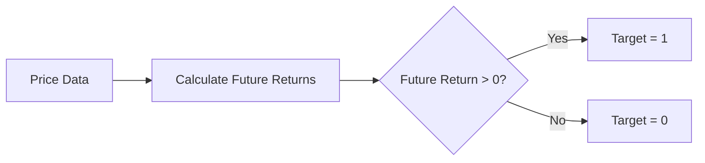

**Implementation:**
```python
def _create_target_variable(self, df: pd.DataFrame) -> pd.DataFrame:
    # Calculate future returns (next day's return)
    df['future_return'] = df['close'].pct_change(1).shift(-1)
    
    # Create classification target (1 for positive return, 0 for negative return)
    df['target'] = np.where(df['future_return'] > 0, 1, 0)
    
    # Drop future_return column
    df = df.drop(['future_return'], axis=1)
    
    return df
```

## Feature Normalization

The feature engineering pipeline normalizes features to ensure they have similar scales, which is important for many machine learning algorithms:

```mermaid
flowchart LR
    A[Raw Features] --> B[Calculate Min and Max Values]
    B --> C[Normalize Features = (Features - Min) / (Max - Min)]
    C --> D[Replace NaN Values with 0]
```

**Implementation:**
```python
def _normalize_features(self, features: np.ndarray) -> np.ndarray:
    # Simple min-max normalization
    min_vals = np.nanmin(features, axis=0)
    max_vals = np.nanmax(features, axis=0)
    
    # Avoid division by zero
    range_vals = max_vals - min_vals
    range_vals[range_vals == 0] = 1
    
    normalized_features = (features - min_vals) / range_vals
    
    # Replace NaN values with 0
    normalized_features = np.nan_to_num(normalized_features)
    
    return normalized_features
```

## Multi-Timeframe Feature Generation

The feature engineering pipeline generates features for multiple timeframes in parallel, leveraging Redis caching for improved performance:

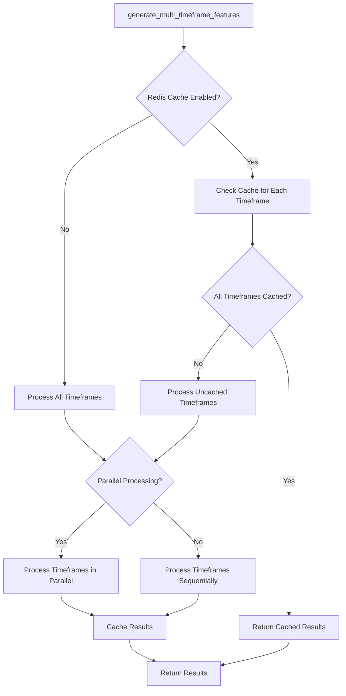

**Implementation:**
```python
def generate_multi_timeframe_features(self, symbol: str, 
                                     timeframes: List[str] = ['1m', '5m', '15m', '1h', '1d'], 
                                     lookback_days: int = 365,
                                     parallel: bool = True) -> Dict[str, Tuple[Optional[np.ndarray], Optional[np.ndarray]]]:
    self.logger.info(f"Generating multi-timeframe features for {symbol} across {timeframes}")
    
    results = {}
    
    # Check Redis cache first if enabled
    if self.use_redis_cache:
        cached_results = {}
        for timeframe in timeframes:
            cache_key = f"multi_timeframe_features:{symbol}:{timeframe}"
            cache_params = {
                "symbol": symbol,
                "timeframe": timeframe,
                "lookback_days": lookback_days
            }
            
            # Try to get from cache
            cached_data = feature_store_cache.get_feature(cache_key, cache_params)
            if cached_data is not None:
                self.logger.info(f"Cache hit for {symbol} {timeframe} features")
                cached_results[timeframe] = cached_data
        
        # If all timeframes were cached, return them
        if len(cached_results) == len(timeframes):
            self.logger.info(f"All timeframes for {symbol} were cached")
            return cached_results
        
        # Remove cached timeframes from the list to process
        timeframes_to_process = [tf for tf in timeframes if tf not in cached_results]
        self.logger.info(f"Need to process {len(timeframes_to_process)} timeframes for {symbol}")
    else:
        timeframes_to_process = timeframes
        cached_results = {}
    
    # Generate features for each timeframe
    if parallel and len(timeframes_to_process) > 1:
        # Use parallel processing
        with concurrent.futures.ThreadPoolExecutor() as executor:
            # Submit tasks
            future_to_timeframe = {
                executor.submit(self.generate_features, symbol, tf, lookback_days): tf 
                for tf in timeframes_to_process
            }
            
            # Process results as they complete
            for future in concurrent.futures.as_completed(future_to_timeframe):
                timeframe = future_to_timeframe[future]
                try:
                    features, targets = future.result()
                    results[timeframe] = (features, targets)
                except Exception as e:
                    self.logger.error(f"Error generating features for {symbol} {timeframe}: {e}")
    else:
        # Sequential processing
        for timeframe in timeframes_to_process:
            results[timeframe] = self.generate_features(symbol, timeframe, lookback_days)
    
    # Combine with cached results
    results.update(cached_results)
    
    # Cache results if Redis cache is enabled
    if self.use_redis_cache:
        for timeframe, (features, targets) in results.items():
            if timeframe not in cached_results and features is not None and targets is not None:
                cache_key = f"multi_timeframe_features:{symbol}:{timeframe}"
                cache_params = {
                    "symbol": symbol,
                    "timeframe": timeframe,
                    "lookback_days": lookback_days
                }
                
                # Store in cache
                feature_store_cache.set_feature(
                    cache_key, 
                    cache_params, 
                    (features, targets), 
                    ttl=self.redis_cache_ttl
                )
                self.logger.info(f"Cached features for {symbol} {timeframe}")
    
    return results
```

## Performance Considerations

### Redis Cache Configuration

The Redis cache is configured with a default TTL (Time-To-Live) of 3600 seconds (1 hour). You can adjust this value by setting the `redis_cache_ttl` attribute of the `FeatureEngineer` class:

```python
feature_engineer = FeatureEngineer(db_manager, use_redis_cache=True)
feature_engineer.redis_cache_ttl = 7200  # 2 hours
```

### Parallel Processing

Multi-timeframe feature generation uses parallel processing by default. You can disable this by setting the `parallel` parameter to `False`:

```python
features = feature_engineer.generate_multi_timeframe_features(
    symbol="AAPL",
    timeframes=['1m', '5m', '15m', '1h', '1d'],
    lookback_days=30,
    parallel=False  # Disable parallel processing
)
```

### Memory Usage

When generating features for multiple timeframes, memory usage can be significant. To reduce memory usage, consider:

1. Processing fewer timeframes at once
2. Reducing the lookback period
3. Implementing feature selection to reduce the number of features

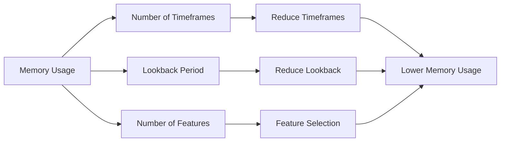

## Integration with Model Training

The multi-timeframe features can be used to train machine learning models that leverage information from multiple timeframes:

```python
# Generate features for multiple timeframes
features = feature_engineer.generate_multi_timeframe_features(
    symbol="AAPL",
    timeframes=['1m', '5m', '15m', '1h', '1d'],
    lookback_days=30,
    parallel=True
)

# Extract features and targets for each timeframe
features_1m, targets_1m = features['1m']
features_5m, targets_5m = features['5m']
features_15m, targets_15m = features['15m']
features_1h, targets_1h = features['1h']
features_1d, targets_1d = features['1d']

# Combine features from multiple timeframes
# (Ensure they have the same number of samples)
combined_features = np.hstack([features_1m, features_5m, features_15m, features_1h, features_1d])

# Use targets from one timeframe (e.g., 1-day timeframe)
targets = targets_1d

# Train a model using the combined features
model = XGBClassifier()
model.fit(combined_features, targets)
```

## Impact on Model Performance

Using multi-timeframe features can significantly improve model performance by capturing patterns at different time scales. Here's how different timeframes contribute to model performance:

```mermaid
flowchart TD
    A[Multi-Timeframe Features] --> B[Short-Term Patterns]
    A --> C[Medium-Term Patterns]
    A --> D[Long-Term Patterns]
    B --> E[1-Minute Timeframe]
    B --> F[5-Minute Timeframe]
    C --> G[15-Minute Timeframe]
    C --> H[1-Hour Timeframe]
    D --> I[1-Day Timeframe]
    E --> J[Captures Microstructure]
    F --> K[Captures Intraday Patterns]
    G --> L[Captures Session Patterns]
    H --> M[Captures Daily Patterns]
    I --> N[Captures Multi-Day Trends]
    J --> O[Improved Model Performance]
    K --> O
    L --> O
    M --> O
    N --> O
```

## Best Practices

1. **Use multi-timeframe features for better model performance** - Features from multiple timeframes can provide better insights into market behavior
2. **Enable Redis caching for frequently accessed features** - This can significantly improve performance
3. **Use parallel processing for multi-timeframe feature generation** - This can reduce processing time
4. **Consider the TTL for cached features** - Set an appropriate TTL based on how frequently the data changes
5. **Monitor Redis cache usage** - Ensure that the cache doesn't grow too large and cause memory issues
6. **Implement feature selection** - Not all features are equally important, so select the most relevant ones
7. **Normalize features** - Ensure features have similar scales for better model performance
8. **Handle missing values** - Ensure that missing values are handled appropriately
9. **Use appropriate lookback periods** - Different timeframes may require different lookback periods
10. **Validate features** - Ensure that features are correctly calculated and provide meaningful information

## Conclusion

The multi-timeframe feature engineering system with Redis caching provides a powerful framework for generating high-quality features for machine learning models. By leveraging multiple timeframes and advanced feature engineering techniques, the system can capture complex patterns in market data and improve model performance.