# Enhanced TimescaleDB Guide for AI Trading System

## Table of Contents

1. [Introduction](#introduction)
2. [System Architecture](#system-architecture)
3. [Docker Setup](#docker-setup)
4. [Database Configuration](#database-configuration)
5. [Complete Database Schema](#complete-database-schema)
6. [Database Operations](#database-operations)
7. [Query Patterns & Examples](#query-patterns--examples)
8. [Performance Optimization](#performance-optimization)
9. [Maintenance & Monitoring](#maintenance--monitoring)
10. [Database Tools](#database-tools)
11. [Troubleshooting](#troubleshooting)
12. [Advanced Topics](#advanced-topics)

## Introduction

### TimescaleDB Overview

TimescaleDB is a PostgreSQL extension optimized for time-series data. It provides specialized storage and querying capabilities for the high-volume time-series data inherent in financial markets, making it an ideal choice for the AI Trading System.

TimescaleDB organizes data into "chunks" based on time intervals, which allows for efficient insertion, deletion, and querying of time-series data. This chunking mechanism is transparent to users, who can interact with the database using standard SQL.

### Key Features & Benefits

```mermaid
flowchart TD
    A[TimescaleDB Features] --> B[Hypertables]
    A --> C[Continuous Aggregates]
    A --> D[Data Retention Policies]
    A --> E[Compression]
    A --> F[PostgreSQL Compatibility]
    
    B --> B1[Transparent Chunking]
    B --> B2[Efficient Time-Based Queries]
    B --> B3[Parallel Query Execution]
    
    C --> C1[Materialized Views]
    C --> C2[Automatic Refreshing]
    C --> C3[Query Acceleration]
    
    D --> D1[Automatic Data Aging]
    D --> D2[Chunk-Based Retention]
    D --> D3[Policy-Based Management]
    
    E --> E1[Columnar Compression]
    E --> E2[Reduced Storage Costs]
    E --> E3[Improved Query Performance]
    
    F --> F1[Standard SQL Interface]
    F --> F2[PostgreSQL Extensions]
    F --> F3[Familiar Administration]
```

Key advantages of TimescaleDB for the AI Trading System:

1. **Time-Series Optimization**: Specialized storage for time-series data (hypertables) with automatic partitioning
2. **SQL Interface**: Full SQL compatibility with PostgreSQL, allowing for complex queries and joins
3. **Scalability**: Efficiently handles large volumes of time-series data with optimized storage and querying
4. **Continuous Aggregations**: Efficient pre-aggregation of time-series data for faster analytics
5. **Data Retention Policies**: Automated management of historical data with compression and deletion policies
6. **PostgreSQL Ecosystem**: Access to the rich ecosystem of PostgreSQL tools and extensions

### System Requirements

Before setting up TimescaleDB, ensure you have:

- Docker (version 19.03+)
- Docker Compose (version 1.25+)
- At least 8GB RAM available
- At least 50GB disk space (SSD recommended)
- Linux/Unix environment (recommended)

## System Architecture

The TimescaleDB database is a core component of the AI Trading System, serving as the central repository for market data, trading signals, and system performance metrics.

### Architecture Diagram

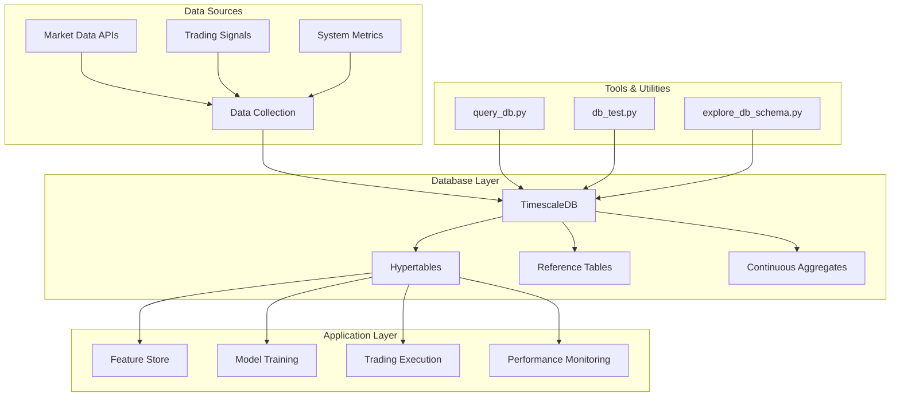

### Data Flow

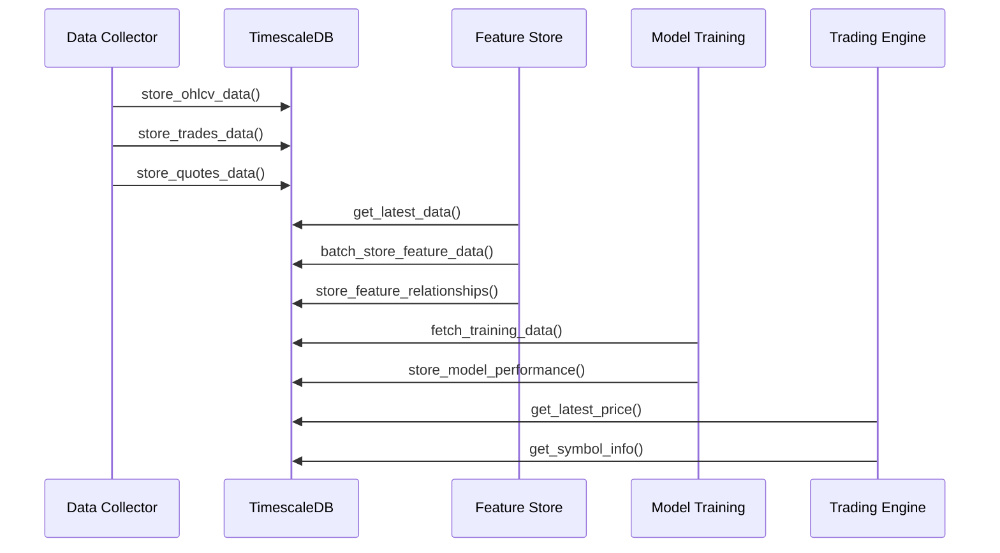

### Component Relationships

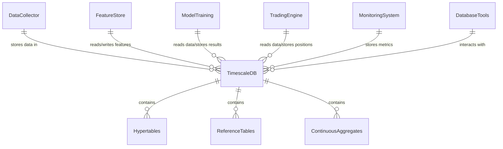

## Docker Setup

The AI Trading System uses Docker to run TimescaleDB, which simplifies deployment and ensures consistency across environments.

### Docker Compose Configuration

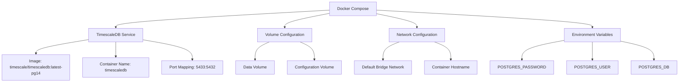

Here's a complete `docker-compose.yml` file for setting up TimescaleDB:

```yaml
version: '3.8'

services:
  timescaledb:
    image: timescale/timescaledb:latest-pg14
    container_name: timescaledb
    ports:
      - "5433:5432"
    environment:
      - POSTGRES_PASSWORD=postgres
      - POSTGRES_USER=inavvi_user
      - POSTGRES_DB=inavvi
    volumes:
      - timescaledb_data:/var/lib/postgresql/data
      - ./src/config/timescaledb/postgresql.conf:/etc/postgresql/postgresql.conf
      - ./src/config/timescaledb/init-scripts:/docker-entrypoint-initdb.d
    command: postgres -c config_file=/etc/postgresql/postgresql.conf
    restart: unless-stopped
    healthcheck:
      test: ["CMD-SHELL", "pg_isready -U inavvi_user -d inavvi"]
      interval: 10s
      timeout: 5s
      retries: 5

volumes:
  timescaledb_data:
    driver: local
```

### Starting the Container

To start the TimescaleDB container:

```bash
# Navigate to the project directory
cd /path/to/project

# Start the container
docker-compose up -d

# Check if the container is running
docker ps

# Check the logs
docker logs timescaledb
```

### Volume Management

The Docker Compose configuration sets up two types of volumes:

1. **Data Volume**: A named volume (`timescaledb_data`) for persistent storage of database files
2. **Configuration Volume**: A bind mount for the PostgreSQL configuration file
3. **Initialization Scripts**: A bind mount for database initialization scripts

This ensures that:
- Database data persists across container restarts
- Custom configuration is applied to the database
- Database is initialized with the correct schema on first startup

### Network Configuration

The Docker Compose configuration maps port 5432 inside the container to port 5433 on the host. This allows applications to connect to the database using `localhost:5433`.

> **Important Note on Hostname Resolution**: When connecting to the database from within Docker containers, use `host.docker.internal` instead of `localhost` to access the host network. If you're using Docker Compose with a custom network, you can use the service name (`timescaledb`) as the hostname.

### Authentication Configuration

The Docker Compose configuration sets up the following authentication parameters:

- **Username**: inavvi_user
- **Password**: postgres
- **Database**: inavvi

> ⚠️ **Security Warning**: The default password should be changed in production environments!

## Database Configuration

### PostgreSQL Configuration

The TimescaleDB container uses a custom PostgreSQL configuration file located at `src/config/timescaledb/postgresql.conf`. This file contains optimized settings for the AI Trading System.

Key configuration parameters:

```
# Memory Settings
shared_buffers = 2GB                  # 25% of available RAM, up to 8GB
work_mem = 64MB                       # Depends on max_connections and complexity of queries
maintenance_work_mem = 256MB          # For maintenance operations
effective_cache_size = 6GB            # 75% of available RAM
effective_io_concurrency = 200        # For SSDs

# Background Writer
bgwriter_delay = 200ms
bgwriter_lru_maxpages = 100
bgwriter_lru_multiplier = 2.0

# WAL Settings
wal_level = replica
max_wal_size = 2GB
min_wal_size = 1GB
checkpoint_completion_target = 0.9
wal_buffers = 16MB

# Optimization for ARM64
max_worker_processes = 8              # Number of CPU cores
max_parallel_workers_per_gather = 4   # Half of CPU cores
max_parallel_workers = 8              # Number of CPU cores
max_parallel_maintenance_workers = 4  # Half of CPU cores

# Query Tuning
random_page_cost = 1.1                # For SSDs
effective_io_concurrency = 200        # For SSDs
default_statistics_target = 100

# TimescaleDB Settings
timescaledb.max_background_workers = 8
timescaledb.telemetry_level = 'off'
```

### TimescaleDB Extensions

The TimescaleDB extension is automatically installed when the container starts. The initialization script creates the extension in the database:

```sql
CREATE EXTENSION IF NOT EXISTS timescaledb CASCADE;
```

### Memory & Performance Settings

The PostgreSQL configuration is optimized for performance on a system with at least 8GB of RAM. The key memory parameters are:

- **shared_buffers**: 2GB (25% of available RAM)
- **work_mem**: 64MB (per connection, per query)
- **maintenance_work_mem**: 256MB (for maintenance operations)
- **effective_cache_size**: 6GB (75% of available RAM)

These settings can be adjusted based on the available system resources. For systems with more RAM, increase these values proportionally.

### Authentication & Security

TimescaleDB uses PostgreSQL's authentication methods. The default configuration uses:

- **Username/Password Authentication**: Basic authentication with username (`inavvi_user`) and password
- **Host-Based Authentication**: Configured in `pg_hba.conf` to control connection methods

To change the database password:

```bash
# Connect to the database
docker exec -it timescaledb psql -U inavvi_user -d inavvi

# Change the password
ALTER USER inavvi_user WITH PASSWORD 'new_secure_password';
```

After changing the password, update the connection strings in your application code and configuration files.

## Complete Database Schema

The AI Trading System database schema is designed to efficiently store and query financial market data, trading signals, and system performance metrics.

### Tables & Hypertables Overview

```mermaid
flowchart TD
    A[Database Schema] --> B[Time-Series Data]
    A --> C[Reference Data]
    A --> D[Feature Store]
    A --> E[Trading Data]
    A --> F[System Metrics]
    
    B --> B1[ohlcv]
    B --> B2[trades]
    B --> B3[quotes]
    B --> B4[options_flow]
    
    C --> C1[symbols]
    C --> C2[symbol_groups]
    C --> C3[data_collection_status]
    
    D --> D1[feature_metadata]
    D --> D2[feature_timeseries]
    D --> D3[feature_relationships]
    D --> D4[feature_access_log]
    
    E --> E1[positions]
    E --> E2[options_flow_daily_summary]
    E --> E3[bullish_options_sentiment]
    
    F --> F1[model_performance]
    F --> F2[feature_importance]
    F --> F3[system_metrics]
    F --> F4[cache_metrics]
```

### Schema Relationships

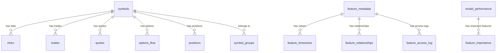

### Hypertables

The following tables are configured as TimescaleDB hypertables, which are optimized for time-series data:

| Hypertable Name | Description | Time Dimension |
|-----------------|-------------|----------------|
| ohlcv | Price and volume data at regular intervals | timestamp |
| trades | Individual trade execution data | timestamp |
| quotes | Bid and ask price/size data | timestamp |
| options_flow | Options market flow data | timestamp |
| model_performance | Model prediction performance metrics | timestamp |
| feature_importance | Feature importance scores for models | timestamp |
| system_metrics | System performance metrics | timestamp |
| feature_timeseries | Time-series feature data | timestamp |
| feature_access_log | Feature access logging | timestamp |
| cache_metrics | Cache performance metrics | timestamp |
| feature_data | Feature data storage | timestamp |

### Detailed Table Definitions

#### OHLCV Table

Stores open, high, low, close, and volume data for financial instruments at regular intervals.

```sql
CREATE TABLE IF NOT EXISTS ohlcv (
    symbol TEXT NOT NULL,
    timestamp TIMESTAMPTZ NOT NULL,
    open NUMERIC NOT NULL,
    high NUMERIC NOT NULL,
    low NUMERIC NOT NULL,
    close NUMERIC NOT NULL,
    volume NUMERIC NOT NULL,
    source TEXT NOT NULL,
    timeframe TEXT NOT NULL,
    PRIMARY KEY (symbol, timestamp, timeframe)
);

-- Convert to hypertable
SELECT create_hypertable('ohlcv', 'timestamp');

-- Create indexes
CREATE INDEX ON ohlcv (timestamp DESC);
CREATE INDEX ON ohlcv (symbol, timeframe);
```

#### Trades Table

Records individual trade executions.

```sql
CREATE TABLE IF NOT EXISTS trades (
    symbol TEXT NOT NULL,
    timestamp TIMESTAMPTZ NOT NULL,
    price NUMERIC NOT NULL,
    size NUMERIC NOT NULL,
    exchange INTEGER,
    conditions TEXT[],
    id BIGINT NOT NULL,
    source TEXT NOT NULL,
    PRIMARY KEY (symbol, timestamp, id)
);

-- Convert to hypertable
SELECT create_hypertable('trades', 'timestamp');

-- Create indexes
CREATE INDEX ON trades (timestamp DESC);
CREATE INDEX ON trades (symbol, id);
```

#### Quotes Table

Stores market quotes (bid/ask prices and sizes).

```sql
CREATE TABLE IF NOT EXISTS quotes (
    symbol TEXT NOT NULL,
    timestamp TIMESTAMPTZ NOT NULL,
    bid_price NUMERIC NOT NULL,
    bid_size NUMERIC NOT NULL,
    ask_price NUMERIC NOT NULL,
    ask_size NUMERIC NOT NULL,
    exchange INTEGER,
    conditions TEXT[],
    id BIGINT NOT NULL,
    source TEXT NOT NULL,
    PRIMARY KEY (symbol, timestamp, id)
);

-- Convert to hypertable
SELECT create_hypertable('quotes', 'timestamp');

-- Create indexes
CREATE INDEX ON quotes (timestamp DESC);
CREATE INDEX ON quotes (symbol, id);
```

#### Options Flow Table

Records options market data and analytics.

```sql
CREATE TABLE IF NOT EXISTS options_flow (
    symbol TEXT NOT NULL,
    timestamp TIMESTAMPTZ NOT NULL,
    expiration_date DATE NOT NULL,
    strike_price NUMERIC NOT NULL,
    option_type TEXT NOT NULL,
    contract_symbol TEXT NOT NULL,
    premium NUMERIC,
    volume NUMERIC,
    open_interest NUMERIC,
    implied_volatility NUMERIC,
    delta NUMERIC,
    gamma NUMERIC,
    theta NUMERIC,
    vega NUMERIC,
    underlying_price NUMERIC,
    sentiment_score NUMERIC,
    sentiment_source TEXT,
    source TEXT NOT NULL,
    batch_id TEXT,
    processed_by_feature_store BOOLEAN DEFAULT FALSE,
    PRIMARY KEY (contract_symbol, timestamp)
);

-- Convert to hypertable
SELECT create_hypertable('options_flow', 'timestamp');

-- Create indexes
CREATE INDEX ON options_flow (timestamp DESC);
CREATE INDEX ON options_flow (symbol);
CREATE INDEX ON options_flow (expiration_date);
CREATE INDEX ON options_flow (sentiment_score);
```

#### Symbols Table

Metadata for financial instruments tracked by the system.

```sql
CREATE TABLE IF NOT EXISTS symbols (
    symbol TEXT PRIMARY KEY,
    name TEXT,
    type TEXT,
    market TEXT,
    currency TEXT,
    active BOOLEAN DEFAULT TRUE,
    last_updated TIMESTAMPTZ DEFAULT NOW(),
    metadata JSONB
);

-- Create indexes
CREATE INDEX ON symbols (active);
CREATE INDEX ON symbols (type);
```

#### Symbol Groups Table

Defines groupings of symbols for analysis and trading strategies.

```sql
CREATE TABLE IF NOT EXISTS symbol_groups (
    group_name TEXT NOT NULL,
    symbol TEXT NOT NULL,
    added_at TIMESTAMPTZ DEFAULT NOW(),
    PRIMARY KEY (group_name, symbol)
);

-- Create indexes
CREATE INDEX ON symbol_groups (symbol);
```

#### Data Collection Status Table

Tracks the status of data collection processes.

```sql
CREATE TABLE IF NOT EXISTS data_collection_status (
    symbol TEXT NOT NULL,
    data_type TEXT NOT NULL,
    date_range TEXT,
    collection_time TIMESTAMPTZ DEFAULT NOW(),
    status TEXT,
    num_records INTEGER DEFAULT 0,
    details JSONB,
    PRIMARY KEY (symbol, data_type)
);

-- Create indexes
CREATE INDEX ON data_collection_status (status);
CREATE INDEX ON data_collection_status (collection_time DESC);
```

#### Model Performance Table

Records performance metrics for prediction models.

```sql
CREATE TABLE IF NOT EXISTS model_performance (
    model_id TEXT NOT NULL,
    model_type TEXT NOT NULL,
    timestamp TIMESTAMPTZ NOT NULL,
    metrics JSONB NOT NULL,
    parameters JSONB,
    PRIMARY KEY (model_id, timestamp)
);

-- Convert to hypertable
SELECT create_hypertable('model_performance', 'timestamp');

-- Create indexes
CREATE INDEX ON model_performance (timestamp DESC);
CREATE INDEX ON model_performance (model_type);
```

#### Feature Importance Table

Tracks importance scores for features used in models.

```sql
CREATE TABLE IF NOT EXISTS feature_importance (
    model_id TEXT NOT NULL,
    timestamp TIMESTAMPTZ NOT NULL,
    feature_name TEXT NOT NULL,
    importance NUMERIC NOT NULL,
    PRIMARY KEY (model_id, timestamp, feature_name)
);

-- Convert to hypertable
SELECT create_hypertable('feature_importance', 'timestamp');

-- Create indexes
CREATE INDEX ON feature_importance (timestamp DESC);
CREATE INDEX ON feature_importance (feature_name);
```

#### System Metrics Table

Stores system performance and operational metrics.

```sql
CREATE TABLE IF NOT EXISTS system_metrics (
    timestamp TIMESTAMPTZ NOT NULL,
    metric_name TEXT NOT NULL,
    metric_value NUMERIC NOT NULL,
    labels JSONB,
    PRIMARY KEY (timestamp, metric_name)
);

-- Convert to hypertable
SELECT create_hypertable('system_metrics', 'timestamp');

-- Create indexes
CREATE INDEX ON system_metrics (timestamp DESC);
CREATE INDEX ON system_metrics (metric_name);
```

#### Feature Metadata Table

Stores metadata about features used in the system.

```sql
CREATE TABLE IF NOT EXISTS feature_metadata (
    feature_name TEXT PRIMARY KEY,
    description TEXT,
    created_at TIMESTAMPTZ NOT NULL DEFAULT NOW(),
    updated_at TIMESTAMPTZ NOT NULL DEFAULT NOW(),
    tags TEXT[],
    parameters JSONB,
    source TEXT
);

-- Create indexes
CREATE INDEX ON feature_metadata (source);
CREATE INDEX ON feature_metadata USING GIN (tags);
```

#### Feature Timeseries Table

Stores time-series feature data.

```sql
CREATE TABLE IF NOT EXISTS feature_timeseries (
    feature_name TEXT NOT NULL,
    symbol TEXT NOT NULL,
    timestamp TIMESTAMPTZ NOT NULL,
    value NUMERIC NOT NULL,
    tags JSONB,
    PRIMARY KEY (feature_name, symbol, timestamp)
);

-- Convert to hypertable
SELECT create_hypertable('feature_timeseries', 'timestamp');

-- Create indexes
CREATE INDEX ON feature_timeseries (timestamp DESC);
CREATE INDEX ON feature_timeseries (feature_name, symbol);
```

#### Feature Relationships Table

Defines relationships between features.

```sql
CREATE TABLE IF NOT EXISTS feature_relationships (
    source_feature TEXT NOT NULL,
    target_feature TEXT NOT NULL,
    relationship_type TEXT NOT NULL,
    metadata JSONB,
    PRIMARY KEY (source_feature, target_feature, relationship_type)
);

-- Create indexes
CREATE INDEX ON feature_relationships (source_feature);
CREATE INDEX ON feature_relationships (target_feature);
```

#### Feature Access Log Table

Logs access to features for auditing and usage tracking.

```sql
CREATE TABLE IF NOT EXISTS feature_access_log (
    feature_name TEXT NOT NULL,
    accessed_at TIMESTAMPTZ NOT NULL,
    accessed_by TEXT NOT NULL,
    operation TEXT NOT NULL
);

-- Convert to hypertable
SELECT create_hypertable('feature_access_log', 'accessed_at');

-- Create indexes
CREATE INDEX ON feature_access_log (accessed_at DESC);
CREATE INDEX ON feature_access_log (feature_name);
```

#### Cache Metrics Table

Stores performance metrics for caching systems.

```sql
CREATE TABLE IF NOT EXISTS cache_metrics (
    timestamp TIMESTAMPTZ NOT NULL,
    cache_name TEXT NOT NULL,
    hit_count INTEGER NOT NULL,
    miss_count INTEGER NOT NULL,
    size_bytes BIGINT,
    eviction_count INTEGER,
    PRIMARY KEY (timestamp, cache_name)
);

-- Convert to hypertable
SELECT create_hypertable('cache_metrics', 'timestamp');

-- Create indexes
CREATE INDEX ON cache_metrics (timestamp DESC);
CREATE INDEX ON cache_metrics (cache_name);
```

#### Positions Table

Stores active trading positions.

```sql
CREATE TABLE IF NOT EXISTS positions (
    id SERIAL PRIMARY KEY,
    ticker TEXT NOT NULL,
    timestamp TIMESTAMPTZ NOT NULL,
    entry_price NUMERIC NOT NULL,
    stop_price NUMERIC,
    shares INTEGER NOT NULL,
    position_value NUMERIC NOT NULL,
    risk_amount NUMERIC,
    stop_percentage NUMERIC,
    metadata JSONB,
    is_focus_ticker BOOLEAN DEFAULT FALSE
);

-- Create indexes
CREATE INDEX ON positions (ticker);
CREATE INDEX ON positions (timestamp DESC);
CREATE INDEX ON positions (is_focus_ticker);
```

### Continuous Aggregates

TimescaleDB supports continuous aggregates, which are materialized views that automatically refresh as new data is added. The AI Trading System uses several continuous aggregates for frequently accessed aggregated data:

#### Daily OHLCV Aggregation

```sql
CREATE MATERIALIZED VIEW daily_ohlcv_agg
WITH (timescaledb.continuous) AS
SELECT
    symbol,
    time_bucket('1 day', timestamp) AS day,
    timeframe,
    first(open, timestamp) AS open,
    max(high) AS high,
    min(low) AS low,
    last(close, timestamp) AS close,
    sum(volume) AS volume,
    count(*) AS sample_count
FROM
    ohlcv
GROUP BY
    symbol, day, timeframe;

-- Set refresh policy
SELECT add_continuous_aggregate_policy('daily_ohlcv_agg',
    start_offset => INTERVAL '3 months',
    end_offset => INTERVAL '1 hour',
    schedule_interval => INTERVAL '1 day');
```

#### Hourly Feature Aggregation

```sql
CREATE MATERIALIZED VIEW hourly_feature_agg
WITH (timescaledb.continuous) AS
SELECT
    feature_name,
    symbol,
    time_bucket('1 hour', timestamp) AS hour,
    avg(value) AS avg_value,
    min(value) AS min_value,
    max(value) AS max_value,
    count(*) AS sample_count
FROM
    feature_timeseries
GROUP BY
    feature_name, symbol, hour;

-- Set refresh policy
SELECT add_continuous_aggregate_policy('hourly_feature_agg',
    start_offset => INTERVAL '1 month',
    end_offset => INTERVAL '1 hour',
    schedule_interval => INTERVAL '1 hour');
```

## Database Operations

### Connection Methods

#### Using Python with psycopg2

```python
import psycopg2

# Connect to the database
conn = psycopg2.connect(
    host='localhost',
    port=5433,
    dbname='inavvi',
    user='inavvi_user',
    password='postgres'
)

# Create a cursor
cur = conn.cursor()

# Execute a query
cur.execute("SELECT * FROM symbols LIMIT 5;")

# Fetch results
results = cur.fetchall()
for row in results:
    print(row)

# Close cursor and connection
cur.close()
conn.close()
```

#### Using the DatabaseManager Class

The AI Trading System includes a `DatabaseManager` class in `src/utils/database.py` that handles connection management, reconnection, and query execution:

```python
from src.utils.database import DatabaseManager

# Create database manager
db_manager = DatabaseManager()

# Execute a query and get results as a DataFrame
df = db_manager.get_dataframe("SELECT * FROM symbols WHERE active = true;")

# Print results
print(df)

# Close the connection
db_manager.close()
```

#### Using psql CLI

```bash
# Connect to the database
psql -h localhost -p 5433 -d inavvi -U inavvi_user

# Within psql
inavvi=> SELECT * FROM symbols LIMIT 5;
```

#### Using Docker exec

```bash
# Run psql inside the Docker container
docker exec -it timescaledb psql -U inavvi_user -d inavvi

# Within psql
inavvi=> SELECT * FROM symbols LIMIT 5;
```

### Data Storage Operations

#### Storing OHLCV Data

```python
def store_ohlcv_data(conn, symbol, timestamp, open_price, high, low, close, volume, source='polygon_api', timeframe='day'):
    """
    Store OHLCV data in the ohlcv table.
    """
    try:
        with conn.cursor() as cur:
            cur.execute("""
                INSERT INTO ohlcv (symbol, timestamp, open, high, low, close, volume, source, timeframe)
                VALUES (%s, %s, %s, %s, %s, %s, %s, %s, %s)
                ON CONFLICT (symbol, timestamp, timeframe) 
                DO UPDATE SET open = EXCLUDED.open, high = EXCLUDED.high, low = EXCLUDED.low, 
                            close = EXCLUDED.close, volume = EXCLUDED.volume, source = EXCLUDED.source
            """, (symbol, timestamp, open_price, high, low, close, volume, source, timeframe))
        conn.commit()
    except Exception as e:
        conn.rollback()
        logger.error(f"Error storing OHLCV data for {symbol}: {e}")
        raise
```

#### Batch Storing OHLCV Data

```python
def batch_store_ohlcv_data(conn, ohlcv_data):
    """
    Store multiple OHLCV data points in the ohlcv table.
    """
    if not ohlcv_data:
        return

    try:
        with conn.cursor() as cur:
            psycopg2.extras.execute_batch(cur, """
                INSERT INTO ohlcv (symbol, timestamp, open, high, low, close, volume, source, timeframe)
                VALUES (%s, %s, %s, %s, %s, %s, %s, %s, %s)
                ON CONFLICT (symbol, timestamp, timeframe) 
                DO UPDATE SET open = EXCLUDED.open, high = EXCLUDED.high, low = EXCLUDED.low, 
                            close = EXCLUDED.close, volume = EXCLUDED.volume, source = EXCLUDED.source
            """, ohlcv_data)
        conn.commit()
    except Exception as e:
        conn.rollback()
        logger.error(f"Error batch storing OHLCV data: {e}")
        raise
```

## Query Patterns & Examples

### Time-Series Data Analysis

#### Aggregating OHLCV Data to Higher Timeframes

```sql
-- Aggregate 1-minute data to 5-minute intervals
SELECT
    symbol,
    time_bucket('5 minutes', timestamp) AS interval_5min,
    first(open, timestamp) AS open,
    max(high) AS high,
    min(low) AS low,
    last(close, timestamp) AS close,
    sum(volume) AS volume
FROM 
    ohlcv
WHERE 
    symbol = 'AAPL' 
    AND timestamp >= NOW() - INTERVAL '1 day'
    AND timeframe = '1m'
GROUP BY 
    symbol, interval_5min
ORDER BY 
    interval_5min;
```

#### Calculating Moving Averages

```sql
-- 20-period moving average
SELECT
    symbol,
    timestamp,
    close,
    AVG(close) OVER (
        PARTITION BY symbol 
        ORDER BY timestamp 
        ROWS BETWEEN 19 PRECEDING AND CURRENT ROW
    ) AS ma_20
FROM 
    ohlcv
WHERE 
    symbol = 'AAPL' 
    AND timestamp >= NOW() - INTERVAL '5 days'
    AND timeframe = '1h'
ORDER BY 
    timestamp;
```

## Performance Optimization

### Hardware Considerations

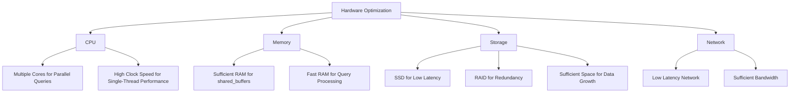

### PostgreSQL Configuration

Key PostgreSQL configuration parameters for performance:

```
# Memory Settings
shared_buffers = 2GB                  # 25% of available RAM
work_mem = 64MB                       # Per-operation memory
maintenance_work_mem = 256MB          # For maintenance operations
effective_cache_size = 6GB            # Estimate of OS cache

# Parallel Query Settings
max_worker_processes = 8              # Number of CPU cores
max_parallel_workers_per_gather = 4   # Half of CPU cores
max_parallel_workers = 8              # Number of CPU cores
max_parallel_maintenance_workers = 4  # Half of CPU cores
```

### TimescaleDB Tuning

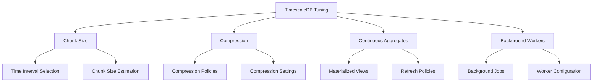

## Database Tools

### query_db.py Tool

The `query_db.py` tool is a powerful utility for interacting with the TimescaleDB database. It allows you to execute predefined or custom SQL queries and view the results in a formatted table or JSON format.

```python
#!/usr/bin/env python3
"""
TimescaleDB Query Tool for INAVVI Trading System

This script provides an interactive interface to query the TimescaleDB database
for the INAVVI trading system. It allows executing custom SQL queries and displays
results in a formatted table.

Connection parameters are preconfigured for the local TimescaleDB instance.
"""

import psycopg2
import argparse
import sys
import os
import json
from datetime import datetime, timedelta

# Try to import tabulate, use fallback if not available
try:
    from tabulate import tabulate
    have_tabulate = True
except ImportError:
    have_tabulate = False

    # Define a fallback formatter in case tabulate isn't available
    def tabulate(data, headers=None, tablefmt=None):
        """Format data as a plain text table without dependencies."""
        if not data:
            return "No data available"
        
        result = []
        if headers:
            result.append(" | ".join(str(h) for h in headers))
            result.append("-" * len(result[0]))
        
        for row in data:
            result.append(" | ".join(str(cell) for cell in row))
        
        return "\n".join(result)


# Database connection parameters
DB_CONFIG = {  
    'host': 'localhost',  # Using localhost to match the update_database_schema.sh
    'port': 5433,           # Port used in the update_database_schema.sh script
    'dbname': 'inavvi',   
    'user': 'inavvi_user', 
    'password': 'postgres'
}

# Example queries that can be referenced by name
EXAMPLE_QUERIES = {
    'tables': "SELECT table_name FROM information_schema.tables WHERE table_schema = 'public';",
    
    'recent_ohlcv': """
        SELECT symbol, timestamp, open, high, low, close, volume
        FROM ohlcv
        ORDER BY timestamp DESC
        LIMIT 10;
    """,
    
    'recent_trades': """
        SELECT symbol, timestamp, price, size
        FROM trades
        ORDER BY timestamp DESC
        LIMIT 10;
    """,
    
    'recent_quotes': """
        SELECT symbol, timestamp, bid_price, bid_size, ask_price, ask_size
        FROM quotes
        ORDER BY timestamp DESC
        LIMIT 10;
    """,
    
    'active_symbols': """
        SELECT symbol, name, type, market, currency
        FROM symbols
        WHERE active = true;
    """,
    
    'symbol_groups': """
        SELECT group_name, COUNT(symbol) as symbol_count
        FROM symbol_groups
        GROUP BY group_name
        ORDER BY symbol_count DESC;
    """,
    
    'model_performance': """
        SELECT model_id, model_type, timestamp,
               metrics->'accuracy' as accuracy,
               metrics->'f1_score' as f1_score
        FROM model_performance
        ORDER BY timestamp DESC
        LIMIT 10;
    """,
    
    'top_features': """
        SELECT model_id, feature_name, importance
        FROM feature_importance
        ORDER BY importance DESC
        LIMIT 20;
    """,

    'system_metrics_latest': """
        SELECT metric_name, metric_value, timestamp
        FROM system_metrics
        ORDER BY timestamp DESC
        LIMIT 20;
    """,
    
    'hypertables': """
        SELECT hypertable_schema, hypertable_name, owner, num_dimensions, num_chunks, compression_enabled
        FROM timescaledb_information.hypertables;
    """,
    
    # New queries for feature store tables
    'feature_metadata': """
        SELECT feature_name, description, created_at, updated_at, tags, source
        FROM feature_metadata
        ORDER BY updated_at DESC
        LIMIT 20;
    """,
    
    'feature_timeseries': """
        SELECT feature_name, symbol, timestamp, value
        FROM feature_timeseries
        ORDER BY timestamp DESC
        LIMIT 20;
    """,
    
    'feature_relationships': """
        SELECT source_feature, target_feature, relationship_type, metadata
        FROM feature_relationships
        LIMIT 20;
    """,
    
    'feature_access_log': """
        SELECT feature_name, accessed_at, accessed_by, operation
        FROM feature_access_log
        ORDER BY accessed_at DESC
        LIMIT 20;
    """,
    
    'cache_metrics': """
        SELECT timestamp, cache_name, hit_count, miss_count, 
               CASE WHEN hit_count + miss_count > 0 
                    THEN (hit_count::float / (hit_count + miss_count)) * 100 
                    ELSE 0 
               END AS hit_rate_percent,
               size_bytes, eviction_count
        FROM cache_metrics
        ORDER BY timestamp DESC
        LIMIT 20;
    """,
    
    'enhanced_options_flow': """
        SELECT symbol, timestamp, expiration_date, option_type, strike_price,
               premium, volume, open_interest, implied_volatility,
               delta, gamma, theta, vega, sentiment_score, sentiment_source
        FROM options_flow
        WHERE sentiment_score IS NOT NULL
        ORDER BY timestamp DESC
        LIMIT 20;
    """,
    
    'daily_ohlcv_agg': """
        SELECT symbol, day, timeframe, open, high, low, close, volume, sample_count
        FROM daily_ohlcv_agg
        ORDER BY day DESC, symbol
        LIMIT 20;
    """,
    
    'hourly_feature_agg': """
        SELECT feature_name, symbol, hour, avg_value, min_value, max_value, sample_count
        FROM hourly_feature_agg
        ORDER BY hour DESC, feature_name, symbol
        LIMIT 20;
    """,
    
    'compression_stats': """
        SELECT hypertable_name, 
               hypertable_size, 
               compressed_total_size,
               compression_ratio
        FROM timescaledb_information.compressed_hypertable_stats;
    """,
    
    'database_size': """
        SELECT pg_size_pretty(pg_database_size('inavvi')) as inavvi_db_size;
    """
}


def connect_to_db():
    """Establish connection to the database."""
    try:
        conn = psycopg2.connect(**DB_CONFIG)
        return conn
    except Exception as e:
        print(f"Error connecting to database: {e}", file=sys.stderr)
        sys.exit(1)


def execute_query(conn, query, params=None):
    """Execute a SQL query and return results."""
    try:
        cursor = conn.cursor()
        cursor.execute(query, params)
        
        # Try to fetch results (will fail for non-SELECT queries)
        try:
            columns = [desc[0] for desc in cursor.description]
            results = cursor.fetchall()
            return columns, results
        except:
            # For INSERT/UPDATE/DELETE queries
            rows_affected = cursor.rowcount if cursor.rowcount >= 0 else 0
            print(f"Query executed successfully. {rows_affected} rows affected.")
            return None, None
        finally:
            cursor.close()
    except Exception as e:
        print(f"Error executing query: {e}", file=sys.stderr)
        return None, None


def print_results(headers, data):
    """Print query results in a formatted table."""
    if headers and data:
        if have_tabulate:
            print(tabulate(data, headers=headers, tablefmt="grid"))
        else:
            print(tabulate(data, headers=headers))
        print(f"\n{len(data)} rows returned.")
    elif headers:
        print("Query executed successfully. 0 rows returned.")
    else:
        print("Query executed successfully. No result set returned.")


def show_example_queries():
    """Display available example queries."""
    print("\nAvailable example queries:")
    
    # Group queries by category for better organization
    categories = {
        "Basic Information": ["tables", "hypertables", "database_size", "compression_stats"],
        "Market Data": ["recent_ohlcv", "recent_trades", "recent_quotes", "daily_ohlcv_agg"],
        "Symbol Information": ["active_symbols", "symbol_groups"],
        "Options Data": ["enhanced_options_flow"],
        "Feature Store": ["feature_metadata", "feature_timeseries", "feature_relationships", 
                          "feature_access_log", "hourly_feature_agg"],
        "ML & Performance": ["model_performance", "top_features", "cache_metrics"],
        "System": ["system_metrics_latest"],
    }
    
    for category, query_names in categories.items():
        print(f"\n  {category}:")
        for name in query_names:
            if name in EXAMPLE_QUERIES:
                print(f"    - {name}")


def format_json_result(result_text):
    """Format JSON output for better readability."""
    try:
        data = json.loads(result_text)
        return json.dumps(data, indent=2)
    except:
        return result_text


def main():
    parser = argparse.ArgumentParser(
        description='Execute SQL queries against the INAVVI trading system database.'
    )
    parser.add_argument(
        'query', nargs='?',
        help='SQL query to execute or name of example query'
    )
    parser.add_argument(
        '-f', '--file', 
        help='Execute SQL from file'
    )
    parser.add_argument(
        '-l', '--list', action='store_true',
        help='List available example queries'
    )
    parser.add_argument(
        '-o', '--output',
        help='Save results to file'
    )
    parser.add_argument(
        '-j', '--json', action='store_true',
        help='Output results as JSON'
    )
    parser.add_argument(
        '-c', '--connection',
        help='Connection string: "host:port/database?user=xxx&password=yyy"'
    )
    
    args = parser.parse_args()
    
    if args.list:
        show_example_queries()
        return
    
    # Override connection parameters if provided
    if args.connection:
        try:
            # Parse connection string
            parts = args.connection.split('/')
            host_port = parts[0].split(':')
            conn_host = host_port[0]
            conn_port = int(host_port[1]) if len(host_port) > 1 else DB_CONFIG['port']
            
            db_and_params = parts[1].split('?')
            conn_db = db_and_params[0]
            
            conn_params = {}
            if len(db_and_params) > 1:
                param_list = db_and_params[1].split('&')
                for param in param_list:
                    key, value = param.split('=')
                    conn_params[key] = value
            
            DB_CONFIG['host'] = conn_host
            DB_CONFIG['port'] = conn_port
            DB_CONFIG['dbname'] = conn_db
            if 'user' in conn_params:
                DB_CONFIG['user'] = conn_params['user']
            if 'password' in conn_params:
                DB_CONFIG['password'] = conn_params['password']
                
        except Exception as e:
            print(f"Error parsing connection string: {e}", file=sys.stderr)
            return
    
    # Get query from args, file or example queries
    query = None
    
    if args.query in EXAMPLE_QUERIES:
        query = EXAMPLE_QUERIES[args.query]
        print(f"Executing example query '{args.query}':")
        print(f"{query}\n")
    elif args.query:
        query = args.query
    elif args.file:
        try:
            with open(args.file, 'r') as f:
                query = f.read()
            print(f"Executing query from file '{args.file}'...")
        except Exception as e:
            print(f"Error reading query file: {e}", file=sys.stderr)
            return
    else:
        parser.print_help()
        show_example_queries()
        return
    
    conn = connect_to_db()
    headers, data = execute_query(conn, query)
    
    if headers is not None:
        if args.json:
            # Output as JSON
            result_list = []
            for row in data:
                row_dict = {}
                for i, header in enumerate(headers):
                    row_dict[header] = row[i]
                result_list.append(row_dict)
            
            json_result = json.dumps(result_list, default=str, indent=2)
            print(json_result)
            
            if args.output:
                try:
                    with open(args.output, 'w') as f:
                        f.write(json_result)
                    print(f"Results saved to {args.output}")
                except Exception as e:
                    print(f"Error saving results: {e}", file=sys.stderr)
        else:
            # Output as table
            print_results(headers, data)
            
            if args.output:
                try:
                    with open(args.output, 'w') as f:
                        if have_tabulate:
                            f.write(tabulate(data, headers=headers, tablefmt="grid"))
                        else:
                            f.write(tabulate(data, headers=headers))
                    print(f"Results saved to {args.output}")
                except Exception as e:
                    print(f"Error saving results: {e}", file=sys.stderr)
    
    conn.close()


if __name__ == "__main__":
    main()
```

### Usage Examples

#### List Available Example Queries

```bash
python query_db.py -l
```

#### Execute a Predefined Query

```bash
python query_db.py recent_ohlcv
```

#### Execute a Custom SQL Query

```bash
python query_db.py "SELECT * FROM symbols WHERE active = true LIMIT 10;"
```

#### Execute a Query from a File

```bash
python query_db.py -f my_query.sql
```

#### Save Query Results to a File

```bash
python query_db.py recent_trades -o trades_output.txt
```

#### Output Results as JSON

```bash
python query_db.py -j "SELECT * FROM positions ORDER BY timestamp DESC LIMIT 10;"
```

#### Use a Custom Connection String

```bash
python query_db.py -c "localhost:5433/inavvi?user=inavvi_user&password=postgres" tables
```

## Troubleshooting

### Common Issues

#### Connection Errors

```mermaid
flowchart TD
    A[Connection Errors] --> B[Check Container Status]
    A --> C[Check Port Mapping]
    A --> D[Check Credentials]
    A --> E[Check Hostname Resolution]
    
    B --> B1[docker ps]
    B --> B2[docker logs timescaledb]
    
    C --> C1[docker port timescaledb]
    C --> C2[netstat -tuln | grep 5433]
    
    D --> D1[Check Username/Password]
    D --> D2[Check Database Name]
    
    E --> E1[Use localhost Instead of Container Name]
    E --> E2[Use host.docker.internal from Other Containers]
```

**Issue**: Cannot connect to the database
**Solution**:
1. Check if the container is running: `docker ps`
2. Check container logs: `docker logs timescaledb`
3. Verify port mapping: `docker port timescaledb`
4. Check credentials in connection string
5. **Important**: Use `localhost` instead of container name when connecting from the host
6. Use `host.docker.internal` when connecting from other containers

#### Authentication Issues

**Issue**: Authentication failed
**Solution**:
1. Verify username and password
2. Check pg_hba.conf configuration
3. Try connecting with psql: `docker exec -it timescaledb psql -U inavvi_user -d inavvi`
4. Reset password if necessary:
   ```sql
   ALTER USER inavvi_user WITH PASSWORD 'new_password';
   ```

#### Performance Issues

**Issue**: Slow queries
**Solution**:
1. Check for missing indexes
2. Use EXPLAIN ANALYZE to identify bottlenecks
3. Adjust PostgreSQL configuration parameters
4. Consider using continuous aggregates for frequently accessed aggregated data
5. Use appropriate chunk sizes for hypertables

## Advanced Topics

### Replication & High Availability

TimescaleDB supports PostgreSQL's replication features for high availability:

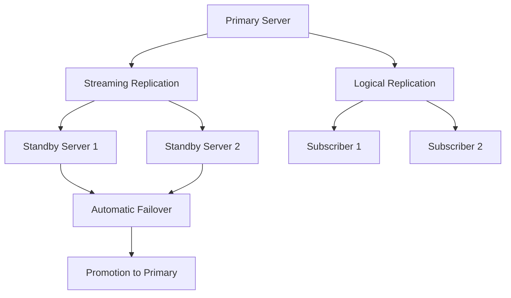

### Scaling Strategies

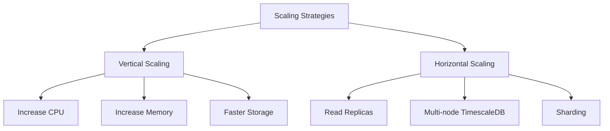

### Cloud Deployment

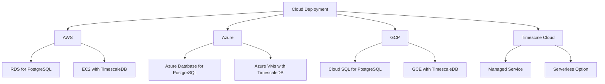

## Conclusion

This enhanced TimescaleDB guide provides a comprehensive overview of the database system used in the AI Trading System. It covers everything from setup and configuration to advanced topics like performance optimization and high availability.

The guide includes:
- Complete Docker setup instructions
- Comprehensive schema documentation
- Detailed database operations examples
- Query patterns and examples
- Performance optimization techniques
- Maintenance and monitoring procedures
- Database tools documentation
- Troubleshooting guidance
- Advanced topics for scaling and high availability

By following this guide, you can effectively set up, configure, and use the TimescaleDB database for the AI Trading System.
