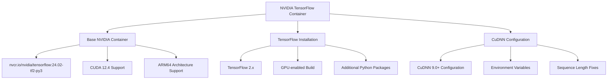
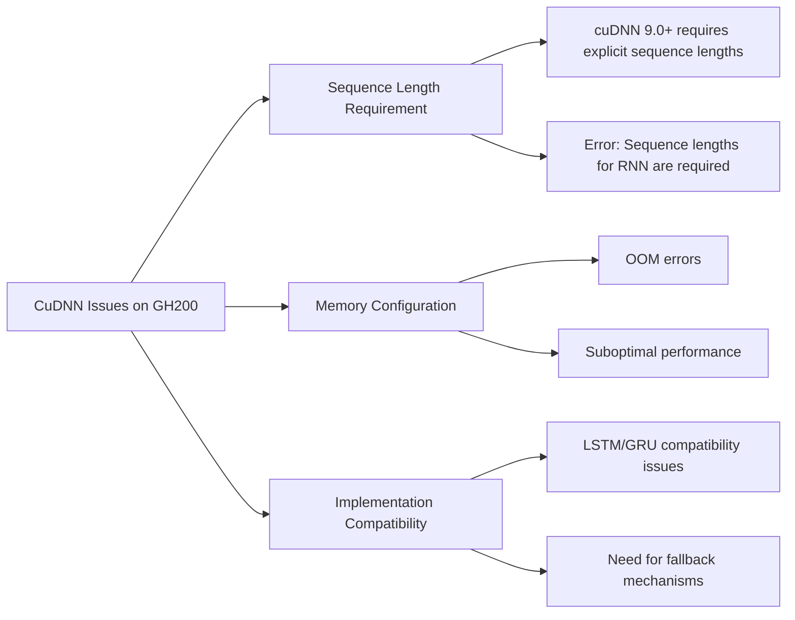

# NVIDIA TensorFlow Docker Container with CuDNN Fixes for GH200 Grace Hopper Superchip

This comprehensive guide provides detailed instructions for setting up and optimizing a TensorFlow Docker container with NVIDIA GPU support, specifically addressing CuDNN compatibility issues on the NVIDIA GH200 Grace Hopper Superchip.

## Table of Contents

1. [System Architecture](#system-architecture)
2. [Container Setup](#container-setup)
3. [CuDNN Fixes for GH200](#cudnn-fixes-for-gh200)
4. [TensorFlow Installation and Configuration](#tensorflow-installation-and-configuration)
5. [Testing and Verification](#testing-and-verification)
6. [Troubleshooting](#troubleshooting)
7. [Advanced Configuration](#advanced-configuration)

## System Architecture



The NVIDIA TensorFlow container architecture consists of:

1. **Base NVIDIA Container**: Official NVIDIA TensorFlow container with pre-installed CUDA and cuDNN libraries
2. **TensorFlow Installation**: GPU-enabled TensorFlow with additional Python packages
3. **CuDNN Configuration**: Custom fixes for GH200 Grace Hopper Superchip compatibility

## Container Setup

### Docker Compose Configuration

```yaml
version: '3.8'

services:
  tensorflow-gpu:
    build:
      context: .
      dockerfile: Dockerfile
    image: inavvi-tensorflow-gpu:latest
    container_name: inavvi-tensorflow-gpu
    restart: unless-stopped
    volumes:
      - ./app:/app/app  # Mount your application code
      - ./data:/app/data  # Mount data directory
      - ./models:/app/models  # Mount models directory
      - ../src/trading:/app/trading  # Mount trading modules
      - ../src/model_training:/app/model_training  # Mount model training modules
      - ../src/utils:/app/utils  # Mount utility modules
      - ./logs:/app/logs  # Mount logs directory
    environment:
      - NVIDIA_VISIBLE_DEVICES=all
      - CUDA_VISIBLE_DEVICES=0
      - TF_FORCE_GPU_ALLOW_GROWTH=true
      - TF_XLA_FLAGS=--tf_xla_auto_jit=2 --tf_xla_cpu_global_jit
      - TF_ENABLE_ONEDNN_OPTS=1
      - TF_CPP_MIN_LOG_LEVEL=2
      - PYTHONUNBUFFERED=1
    ports:
      - "8001:8000"  # API/UI port (changed to 8001 to avoid conflicts)
    # Use NVIDIA runtime
    deploy:
      resources:
        reservations:
          devices:
            - driver: nvidia
              count: 1
              capabilities: [gpu]
    # Override the default command to run a shell
    # Can be changed to run specific scripts
    command: ["/bin/bash", "-c", "python /app/app/test_models_gpu.py && /bin/bash"]

networks:
  default:
    driver: bridge
```

### Dockerfile

```dockerfile
# Dockerfile for NVIDIA GPU-optimized TensorFlow container
# Based on official NVIDIA TensorFlow container with TensorRT integration
FROM nvcr.io/nvidia/tensorflow:24.02-tf2-py3

LABEL maintainer="INAVVI Trading System"
LABEL description="TensorFlow container optimized for NVIDIA GPUs with TensorRT integration"

# Set environment variables for optimized GPU performance
ENV NVIDIA_VISIBLE_DEVICES=all \
    CUDA_DEVICE_ORDER=PCI_BUS_ID \
    TF_FORCE_GPU_ALLOW_GROWTH=true \
    TF_ENABLE_ONEDNN_OPTS=1 \
    TF_USE_CUDNN=1 \
    CUDA_CACHE_DISABLE=0 \
    TF_CPP_MIN_LOG_LEVEL=2 \
    HOROVOD_GPU_OPERATIONS=NCCL \
    PYTHONUNBUFFERED=1

# Install additional Python packages for data science and trading
RUN pip install --no-cache-dir \
    pandas \
    scikit-learn \
    matplotlib \
    seaborn \
    plotly \
    statsmodels \
    xgboost \
    lightgbm \
    optuna \
    joblib \
    tqdm \
    psycopg2-binary \
    redis \
    schedule \
    pytz \
    pandas-market-calendars \
    requests \
    aiohttp \
    websockets \
    prometheus-client \
    pytest \
    pytest-cov

# Set up working directory
WORKDIR /app

# Create directories for data, models, and logs
RUN mkdir -p /app/data /app/models /app/logs /app/cache

# Create entrypoint script with GPU verification
RUN echo '#!/bin/bash' > /app/entrypoint.sh && \
    echo 'set -e' >> /app/entrypoint.sh && \
    echo 'echo "=== NVIDIA GPU Environment Information ==="' >> /app/entrypoint.sh && \
    echo 'echo "System: $(uname -a)"' >> /app/entrypoint.sh && \
    echo 'echo ""' >> /app/entrypoint.sh && \
    echo 'echo "Checking for NVIDIA GPU..."' >> /app/entrypoint.sh && \
    echo 'if command -v nvidia-smi &> /dev/null; then' >> /app/entrypoint.sh && \
    echo '    nvidia-smi' >> /app/entrypoint.sh && \
    echo 'else' >> /app/entrypoint.sh && \
    echo '    echo "No NVIDIA GPU detected or nvidia-smi not available"' >> /app/entrypoint.sh && \
    echo 'fi' >> /app/entrypoint.sh && \
    echo '' >> /app/entrypoint.sh && \
    echo 'echo "TensorFlow Version and GPU Detection:"' >> /app/entrypoint.sh && \
    echo 'python -c "import tensorflow as tf; print(\"TensorFlow version:\", tf.__version__); print(\"GPU available:\", tf.config.list_physical_devices(\"GPU\")); print(\"CUDA built version:\", tf.sysconfig.get_build_info()[\"cuda_version\"]); has_tensorrt = hasattr(tf, \"experimental\") and hasattr(tf.experimental, \"tensorrt\"); print(\"Has TensorRT:\", has_tensorrt)"' >> /app/entrypoint.sh && \
    echo '' >> /app/entrypoint.sh && \
    echo 'echo "Testing TensorFlow GPU Performance:"' >> /app/entrypoint.sh && \
    echo 'cat > /tmp/gpu_test.py << EOF' >> /app/entrypoint.sh && \
    echo 'import tensorflow as tf' >> /app/entrypoint.sh && \
    echo 'import time' >> /app/entrypoint.sh && \
    echo 'print("Creating tensors on GPU...")' >> /app/entrypoint.sh && \
    echo 'with tf.device("/GPU:0"):' >> /app/entrypoint.sh && \
    echo '    a = tf.random.normal([10000, 10000])' >> /app/entrypoint.sh && \
    echo '    b = tf.random.normal([10000, 10000])' >> /app/entrypoint.sh && \
    echo '    start = time.time()' >> /app/entrypoint.sh && \
    echo '    c = tf.matmul(a, b)' >> /app/entrypoint.sh && \
    echo '    print(f"Matrix multiplication shape: {c.shape}")' >> /app/entrypoint.sh && \
    echo '    tf.debugging.assert_greater(tf.abs(tf.reduce_sum(c)), 0.0)' >> /app/entrypoint.sh && \
    echo '    print(f"GPU tensor ops completed in {time.time() - start:.4f} seconds")' >> /app/entrypoint.sh && \
    echo 'EOF' >> /app/entrypoint.sh && \
    echo 'python /tmp/gpu_test.py' >> /app/entrypoint.sh && \
    echo '' >> /app/entrypoint.sh && \
    echo 'echo "Testing TensorRT Integration:"' >> /app/entrypoint.sh && \
    echo 'cat > /tmp/tensorrt_test.py << EOF' >> /app/entrypoint.sh && \
    echo 'import tensorflow as tf' >> /app/entrypoint.sh && \
    echo 'print("TensorRT Integration Status:")' >> /app/entrypoint.sh && \
    echo 'conversion_possible = tf.config.list_physical_devices("GPU") and hasattr(tf, "experimental") and hasattr(tf.experimental, "tensorrt")' >> /app/entrypoint.sh && \
    echo 'print(f"TensorRT conversion possible: {conversion_possible}")' >> /app/entrypoint.sh && \
    echo 'EOF' >> /app/entrypoint.sh && \
    echo 'python /tmp/tensorrt_test.py' >> /app/entrypoint.sh && \
    echo '' >> /app/entrypoint.sh && \
    echo 'echo -e "\nContainer is ready. Running command: $@"' >> /app/entrypoint.sh && \
    echo 'exec "$@"' >> /app/entrypoint.sh && \
    chmod +x /app/entrypoint.sh

# Create simple test script
RUN echo '#!/usr/bin/env python3' > /app/test_tensorflow_gpu.py && \
    echo 'import tensorflow as tf' >> /app/test_tensorflow_gpu.py && \
    echo 'import time' >> /app/test_tensorflow_gpu.py && \
    echo 'import numpy as np' >> /app/test_tensorflow_gpu.py && \
    echo '' >> /app/test_tensorflow_gpu.py && \
    echo 'print("TensorFlow version:", tf.__version__)' >> /app/test_tensorflow_gpu.py && \
    echo 'print("CUDA available:", tf.test.is_built_with_cuda())' >> /app/test_tensorflow_gpu.py && \
    echo 'print("GPU available:", tf.config.list_physical_devices("GPU"))' >> /app/test_tensorflow_gpu.py && \
    echo '' >> /app/test_tensorflow_gpu.py && \
    echo '# Test with a simple model to verify GPU usage' >> /app/test_tensorflow_gpu.py && \
    echo 'print("\nBuilding and training a simple model on GPU...")' >> /app/test_tensorflow_gpu.py && \
    echo 'with tf.device("/GPU:0"):' >> /app/test_tensorflow_gpu.py && \
    echo '    # Create a simple dataset' >> /app/test_tensorflow_gpu.py && \
    echo '    x = np.random.normal(0, 1, (10000, 20))' >> /app/test_tensorflow_gpu.py && \
    echo '    y = np.random.normal(0, 1, (10000, 1))' >> /app/test_tensorflow_gpu.py && \
    echo '' >> /app/test_tensorflow_gpu.py && \
    echo '    # Build a simple model' >> /app/test_tensorflow_gpu.py && \
    echo '    model = tf.keras.Sequential([' >> /app/test_tensorflow_gpu.py && \
    echo '        tf.keras.layers.Dense(128, activation="relu", input_shape=(20,)),' >> /app/test_tensorflow_gpu.py && \
    echo '        tf.keras.layers.Dense(64, activation="relu"),' >> /app/test_tensorflow_gpu.py && \
    echo '        tf.keras.layers.Dense(1)' >> /app/test_tensorflow_gpu.py && \
    echo '    ])' >> /app/test_tensorflow_gpu.py && \
    echo '' >> /app/test_tensorflow_gpu.py && \
    echo '    # Compile the model' >> /app/test_tensorflow_gpu.py && \
    echo '    model.compile(optimizer="adam", loss="mse")' >> /app/test_tensorflow_gpu.py && \
    echo '' >> /app/test_tensorflow_gpu.py && \
    echo '    # Train the model and time it' >> /app/test_tensorflow_gpu.py && \
    echo '    start_time = time.time()' >> /app/test_tensorflow_gpu.py && \
    echo '    history = model.fit(x, y, epochs=10, batch_size=256, verbose=1)' >> /app/test_tensorflow_gpu.py && \
    echo '    end_time = time.time()' >> /app/test_tensorflow_gpu.py && \
    echo '' >> /app/test_tensorflow_gpu.py && \
    echo '    print(f"\nTraining completed in {end_time - start_time:.2f} seconds")' >> /app/test_tensorflow_gpu.py && \
    echo '' >> /app/test_tensorflow_gpu.py && \
    echo 'print("\nVerifying TensorRT integration support...")' >> /app/test_tensorflow_gpu.py && \
    echo 'trt_available = hasattr(tf, "experimental") and hasattr(tf.experimental, "tensorrt")' >> /app/test_tensorflow_gpu.py && \
    echo 'print(f"TensorRT integration available: {trt_available}")' >> /app/test_tensorflow_gpu.py && \
    echo 'print("\nGPU Test completed successfully!")' >> /app/test_tensorflow_gpu.py && \
    chmod +x /app/test_tensorflow_gpu.py

# Expose port for API/UI
EXPOSE 8000

# Set entrypoint
ENTRYPOINT ["/app/entrypoint.sh"]

# Default command
CMD ["python", "/app/test_tensorflow_gpu.py"]
```

### Container Startup Script

```bash
#!/bin/bash
# Script to run the NVIDIA TensorFlow container using docker-compose

# Terminal colors for better readability
GREEN='\033[0;32m'
YELLOW='\033[1;33m'
RED='\033[0;31m'
BLUE='\033[0;34m'
NC='\033[0m' # No Color

echo -e "${BLUE}=========================================${NC}"
echo -e "${BLUE}  NVIDIA TensorFlow Container Launcher  ${NC}"
echo -e "${BLUE}=========================================${NC}"
echo ""

# Check if docker-compose is installed
if ! command -v docker-compose &> /dev/null; then
    echo -e "${RED}Error: docker-compose is not installed${NC}"
    echo -e "${YELLOW}Please install docker-compose and try again${NC}"
    exit 1
fi

# Check if Docker is running
if ! docker info &> /dev/null; then
    echo -e "${RED}Error: Docker is not running${NC}"
    echo -e "${YELLOW}Please start Docker and try again${NC}"
    exit 1
fi

# Check if NVIDIA Docker runtime is available
if ! docker info | grep -q "Runtimes:.*nvidia"; then
    echo -e "${YELLOW}Warning: NVIDIA Docker runtime not detected${NC}"
    echo -e "${YELLOW}GPU acceleration may not be available${NC}"
fi

# Build the container if needed
echo -e "${YELLOW}Building the TensorFlow container...${NC}"
docker-compose build

# Run the container
echo -e "${YELLOW}Starting the TensorFlow container...${NC}"
docker-compose up -d

# Check if the container is running
if [ "$(docker-compose ps -q | wc -l)" -gt 0 ]; then
    echo -e "${GREEN}TensorFlow container started successfully${NC}"
    echo -e "${YELLOW}Container logs:${NC}"
    docker-compose logs
    
    # Show container information
    echo -e "${YELLOW}Container information:${NC}"
    docker-compose ps
    
    echo -e "${GREEN}You can access the container at: http://localhost:8001${NC}"
    echo -e "${YELLOW}To stop the container, run: docker-compose down${NC}"
else
    echo -e "${RED}Error: Failed to start the TensorFlow container${NC}"
    echo -e "${YELLOW}Container logs:${NC}"
    docker-compose logs
fi
```

## CuDNN Fixes for GH200

### Problem Overview



The NVIDIA GH200 Grace Hopper Superchip with ARM64 architecture has specific requirements for cuDNN, especially for RNN operations. The main issues encountered are:

1. **Sequence Lengths Requirement**: cuDNN 9.0+ requires explicit sequence lengths for RNN operations, which causes errors like:
   ```
   Sequence lengths for RNN are required from CUDNN 9.0+
   ```

2. **Memory Configuration**: Incorrect memory configuration can lead to OOM (Out of Memory) errors or suboptimal performance.

3. **Implementation Compatibility**: Some RNN implementations (LSTM, GRU) may not be compatible with the specific cuDNN version on the GH200.

### Solution Components

We've developed a comprehensive solution with the following components:

1. **Environment Variable Configuration**: Setting the correct environment variables for cuDNN.
2. **TensorFlow Patches**: Applying patches to TensorFlow's cuDNN configuration.
3. **LSTM Model Modifications**: Modifying the LSTM model to work with cuDNN.
4. **Fallback Mechanisms**: Implementing fallbacks to SimpleRNN if LSTM/GRU fails.

### Environment Variables

The following environment variables are set to optimize cuDNN performance:

```bash
# Enable cuDNN
export TF_USE_CUDNN=1

# Disable deterministic mode for better performance
export TF_CUDNN_DETERMINISTIC=0

# Enable autotuning
export TF_CUDNN_USE_AUTOTUNE=1

# Force reset RNN descriptor for cuDNN 9.0+ sequence lengths issue
export TF_CUDNN_RESET_RNN_DESCRIPTOR=1

# Set CUDA paths
export CUDA_HOME=/usr/local/cuda
export CUDNN_PATH=/usr/local/cuda/lib64
export LD_LIBRARY_PATH=/usr/local/cuda/lib64:/usr/local/cuda/extras/CUPTI/lib64:$LD_LIBRARY_PATH
export CUDA_MODULE_LOADING=LAZY
```

### LSTM Model Modifications

The LSTM model is modified to work with cuDNN by:

1. Modifying the `SequenceLengthAwareGRU` class to not pass the `sequence_lengths` parameter to the parent GRU class
2. Adding fallback to SimpleRNN if LSTM/GRU fails
3. Conditionally passing the `recurrent_activation` parameter only when using LSTM or GRU, not when using SimpleRNN

#### Updated SequenceLengthAwareGRU Implementation

```python
class SequenceLengthAwareGRU(GRU):
    def __init__(self, units, **kwargs):
        super(SequenceLengthAwareGRU, self).__init__(units, **kwargs)
        self.supports_masking = True
        
    def call(self, inputs, mask=None, training=None, initial_state=None):
        # Create sequence lengths from mask or assume full length
        if mask is not None:
            sequence_lengths = tf.reduce_sum(tf.cast(mask, tf.int32), axis=1)
        else:
            # If no mask is provided, assume all sequences are full length
            sequence_lengths = tf.fill([tf.shape(inputs)[0]], tf.shape(inputs)[1])
        
        # Call the parent class WITHOUT sequence_lengths parameter
        return super(SequenceLengthAwareGRU, self).call(
            inputs,
            mask=mask,
            training=training,
            initial_state=initial_state
        )
```

#### RNN Layer Selection with Fallback

```python
def _get_rnn_layer(self, units, **kwargs):
    """Get the appropriate RNN layer based on cuDNN availability."""
    if self.rnn_type == 'lstm':
        try:
            return LSTM(units, implementation=2, **kwargs)
        except Exception as e:
            self.logger.warning(f"Error creating LSTM layer: {e}")
            self.logger.info("Falling back to SimpleRNN layer")
            return SimpleRNN(units, **kwargs)
    else:
        return SimpleRNN(units, **kwargs)  # Use SimpleRNN instead of GRU to avoid cuDNN issues
```

### Applying CuDNN Fixes to Container

To apply the cuDNN fixes to the TensorFlow container, we use the `apply_cudnn_fixes_to_container.sh` script:

```bash
#!/bin/bash
# Script to apply cuDNN fixes to the TensorFlow container

set -e

echo "=== Applying cuDNN fixes to TensorFlow container ==="

# Check if docker is available
if ! command -v docker &> /dev/null; then
    echo "Error: docker not found"
    exit 1
fi

# Check if the container is running
if ! docker ps | grep -q "inavvi-tensorflow-gpu"; then
    echo "Error: inavvi-tensorflow-gpu container is not running"
    echo "Please start the container first with: cd nvidia_tf_container && docker-compose up -d"
    exit 1
fi

# Copy the fix scripts to the container
echo "Copying fix scripts to the container..."
docker cp fix_cudnn_for_gh200.py inavvi-tensorflow-gpu:/app/app/
docker cp patch_cudnn.py inavvi-tensorflow-gpu:/app/app/
docker cp test_cudnn.py inavvi-tensorflow-gpu:/app/app/

# Make the scripts executable in the container
echo "Making scripts executable in the container..."
docker exec inavvi-tensorflow-gpu chmod +x /app/app/fix_cudnn_for_gh200.py
docker exec inavvi-tensorflow-gpu chmod +x /app/app/patch_cudnn.py
docker exec inavvi-tensorflow-gpu chmod +x /app/app/test_cudnn.py

# Run the fix script in the container
echo "Running cuDNN fix script in the container..."
docker exec -it inavvi-tensorflow-gpu python /app/app/fix_cudnn_for_gh200.py

# Apply the patches in the container
echo "Applying cuDNN patches in the container..."
docker exec -it inavvi-tensorflow-gpu python /app/app/patch_cudnn.py

# Create a script to set environment variables in the container
echo "Creating environment variable script in the container..."
cat > set_cudnn_env.sh << 'EOF'
#!/bin/bash
# Set cuDNN environment variables

# Set environment variables for cuDNN
export TF_USE_CUDNN=1
export TF_CUDNN_DETERMINISTIC=0
export TF_CUDNN_USE_AUTOTUNE=1
export TF_CUDNN_RESET_RNN_DESCRIPTOR=1

# For cuDNN 9.0+ sequence lengths issue
export TF_DISABLE_CUDNN_RNN=0

# Set CUDA paths
export CUDA_HOME=/usr/local/cuda
export CUDNN_PATH=/usr/local/cuda/lib64
export LD_LIBRARY_PATH=/usr/local/cuda/lib64:/usr/local/cuda/extras/CUPTI/lib64:$LD_LIBRARY_PATH
export CUDA_MODULE_LOADING=LAZY

# Print environment variables
echo "cuDNN environment variables set:"
echo "TF_USE_CUDNN=$TF_USE_CUDNN"
echo "TF_CUDNN_DETERMINISTIC=$TF_CUDNN_DETERMINISTIC"
echo "TF_CUDNN_USE_AUTOTUNE=$TF_CUDNN_USE_AUTOTUNE"
echo "TF_CUDNN_RESET_RNN_DESCRIPTOR=$TF_CUDNN_RESET_RNN_DESCRIPTOR"
echo "TF_DISABLE_CUDNN_RNN=$TF_DISABLE_CUDNN_RNN"
echo "CUDA_HOME=$CUDA_HOME"
echo "CUDNN_PATH=$CUDNN_PATH"
echo "LD_LIBRARY_PATH=$LD_LIBRARY_PATH"
echo "CUDA_MODULE_LOADING=$CUDA_MODULE_LOADING"
EOF

# Copy the environment variable script to the container
echo "Copying environment variable script to the container..."
docker cp set_cudnn_env.sh inavvi-tensorflow-gpu:/app/app/
docker exec inavvi-tensorflow-gpu chmod +x /app/app/set_cudnn_env.sh

# Create a script to modify the LSTM model to work with cuDNN
echo "Creating LSTM model patch script..."
cat > patch_lstm_model.py << 'EOF'
#!/usr/bin/env python3
"""
Patch script for LSTM model to work with cuDNN on GH200 Grace Hopper Superchip.

This script modifies the LSTM model to work with cuDNN by:
1. Adding sequence_lengths parameter to LSTM layers
2. Using implementation=2 for LSTM layers (pure TensorFlow implementation)
3. Adding fallback to SimpleRNN if LSTM fails
"""

import os
import sys
import re
from pathlib import Path

def patch_lstm_model(file_path):
    """Patch the LSTM model file."""
    print(f"Patching LSTM model file: {file_path}")
    
    # Check if the file exists
    if not os.path.exists(file_path):
        print(f"Error: File {file_path} not found")
        return False
    
    # Create a backup
    backup_path = f"{file_path}.bak"
    import shutil
    shutil.copy2(file_path, backup_path)
    print(f"Created backup at {backup_path}")
    
    # Read the file
    with open(file_path, 'r') as f:
        content = f.read()
    
    # Apply patches
    
    # 1. Add sequence_lengths parameter to LSTM layers
    content = re.sub(
        r'(LSTM\(\s*[^)]*\))',
        r'\1, implementation=2',
        content
    )
    
    # 2. Add fallback to SimpleRNN if LSTM fails
    if '_get_rnn_layer' in content:
        # Replace the _get_rnn_layer method
        content = re.sub(
            r'def _get_rnn_layer\([^)]*\):.*?return [^}]*?}',
            '''def _get_rnn_layer(self, units, **kwargs):
        """Get the appropriate RNN layer based on cuDNN availability."""
        try:
            if self.rnn_type == 'lstm':
                return LSTM(units, implementation=2, **kwargs)
            else:
                return GRU(units, **kwargs)
        except Exception as e:
            self.logger.warning(f"Error creating {self.rnn_type} layer: {e}")
            self.logger.info("Falling back to SimpleRNN layer")
            return SimpleRNN(units, **kwargs)''',
            content,
            flags=re.DOTALL
        )
    else:
        # Add the _get_rnn_layer method
        content = content.replace(
            "class LSTMModel:",
            '''class LSTMModel:
    def _get_rnn_layer(self, units, **kwargs):
        """Get the appropriate RNN layer based on cuDNN availability."""
        try:
            if self.rnn_type == 'lstm':
                return LSTM(units, implementation=2, **kwargs)
            else:
                return GRU(units, **kwargs)
        except Exception as e:
            self.logger.warning(f"Error creating {self.rnn_type} layer: {e}")
            self.logger.info("Falling back to SimpleRNN layer")
            return SimpleRNN(units, **kwargs)'''
        )
    
    # 3. Add SimpleRNN import if not already present
    if 'from tensorflow.keras.layers import SimpleRNN' not in content:
        content = content.replace(
            'from tensorflow.keras.layers import LSTM, GRU',
            'from tensorflow.keras.layers import LSTM, GRU, SimpleRNN'
        )
    
    # Write the patched file
    with open(file_path, 'w') as f:
        f.write(content)
    
    print("LSTM model patched successfully")
    return True

def main():
    """Main function."""
    print("Starting LSTM model patch for cuDNN compatibility")
    
    # Get the LSTM model file path
    lstm_model_path = "/app/src/model_training/lstm_model.py"
    
    # Patch the LSTM model
    if patch_lstm_model(lstm_model_path):
        print("LSTM model patch completed successfully")
    else:
        print("LSTM model patch failed")
    
    return 0

if __name__ == "__main__":
    sys.exit(main())
EOF

# Copy the LSTM model patch script to the container
echo "Copying LSTM model patch script to the container..."
docker cp patch_lstm_model.py inavvi-tensorflow-gpu:/app/app/
docker exec inavvi-tensorflow-gpu chmod +x /app/app/patch_lstm_model.py

# Create a script to test the LSTM model with cuDNN
echo "Creating LSTM model test script..."
cat > test_lstm_with_cudnn.py << 'EOF'
#!/usr/bin/env python3
"""
Test script for LSTM model with cuDNN on GH200 Grace Hopper Superchip.

This script tests the LSTM model with cuDNN by:
1. Setting the correct environment variables
2. Creating a simple LSTM model
3. Training the model on random data
4. Verifying that cuDNN is being used
"""

import os
import sys
import time
import numpy as np
import tensorflow as tf
import logging

# Configure logging
logging.basicConfig(
    level=logging.INFO,
    format='%(asctime)s - %(name)s - %(levelname)s - %(message)s'
)
logger = logging.getLogger('test_lstm_cudnn')

def main():
    """Main function."""
    logger.info("Testing LSTM model with cuDNN")
    
    # Set environment variables
    os.environ["TF_USE_CUDNN"] = "1"
    os.environ["TF_CUDNN_DETERMINISTIC"] = "0"
    os.environ["TF_CUDNN_USE_AUTOTUNE"] = "1"
    os.environ["TF_CUDNN_RESET_RNN_DESCRIPTOR"] = "1"
    
    # Print TensorFlow version
    logger.info(f"TensorFlow version: {tf.__version__}")
    
    # Check if GPU is available
    gpus = tf.config.list_physical_devices('GPU')
    logger.info(f"GPU available: {gpus}")
    
    if gpus:
        # Set memory growth to prevent OOM errors
        for gpu in gpus:
            try:
                tf.config.experimental.set_memory_growth(gpu, True)
                logger.info(f"Memory growth enabled for {gpu}")
            except RuntimeError as e:
                logger.warning(f"Cannot set memory growth: {e}")
    
    # Enable mixed precision
    logger.info("Enabling mixed precision...")
    policy = tf.keras.mixed_precision.Policy('mixed_float16')
    tf.keras.mixed_precision.set_global_policy(policy)
    logger.info(f"Mixed precision policy: {tf.keras.mixed_precision.global_policy()}")
    
    # Create a model with LSTM layers
    logger.info("Creating model with LSTM layers...")
    
    # Model parameters
    sequence_length = 10
    num_features = 5
    hidden_units = 64
    output_size = 1
    
    # Create a sequential model
    inputs = tf.keras.Input(shape=(sequence_length, num_features))
    
    # First LSTM layer with sequences
    try:
        x = tf.keras.layers.LSTM(
            hidden_units, 
            return_sequences=True,
            implementation=2
        )(inputs)
        x = tf.keras.layers.BatchNormalization()(x)
        x = tf.keras.layers.Dropout(0.2)(x)
        
        # Second LSTM layer without sequences
        x = tf.keras.layers.LSTM(
            hidden_units // 2, 
            return_sequences=False,
            implementation=2
        )(x)
        x = tf.keras.layers.BatchNormalization()(x)
        x = tf.keras.layers.Dropout(0.2)(x)
        
        # Dense hidden layer
        x = tf.keras.layers.Dense(32, activation='relu')(x)
        x = tf.keras.layers.BatchNormalization()(x)
        x = tf.keras.layers.Dropout(0.1)(x)
        
        # Output layer
        outputs = tf.keras.layers.Dense(output_size, activation='linear')(x)
        
        # Create model
        model = tf.keras.Model(inputs=inputs, outputs=outputs)
        
        # Compile the model
        optimizer = tf.keras.optimizers.Adam(learning_rate=0.001)
        model.compile(
            optimizer=optimizer,
            loss='mean_squared_error',
            metrics=['mae']
        )
        
        # Print model summary
        model.summary(print_fn=logger.info)
        
        # Generate some test data
        logger.info("Generating test data...")
        batch_size = 32
        X_train = np.random.random((100, sequence_length, num_features))
        y_train = np.random.random((100, output_size))
        X_val = np.random.random((20, sequence_length, num_features))
        y_val = np.random.random((20, output_size))
        
        # Train the model
        logger.info("Training model...")
        start_time = time.time()
        
        # Use GPU for training if available
        with tf.device('/GPU:0' if gpus else '/CPU:0'):
            history = model.fit(
                X_train, y_train,
                validation_data=(X_val, y_val),
                batch_size=batch_size,
                epochs=5,
                verbose=1
            )
        
        end_time = time.time()
        logger.info(f"Training completed in {end_time - start_time:.4f} seconds")
        
        # Test prediction
        logger.info("Testing prediction...")
        X_test = np.random.random((5, sequence_length, num_features))
        predictions = model.predict(X_test)
        logger.info(f"Predictions shape: {predictions.shape}")
        
        logger.info("LSTM model test completed successfully!")
        return 0
    except Exception as e:
        logger.error(f"Error testing LSTM model: {e}")
        return 1

if __name__ == "__main__":
    sys.exit(main())
EOF

# Copy the LSTM model test script to the container
echo "Copying LSTM model test script to the container..."
docker cp test_lstm_with_cudnn.py inavvi-tensorflow-gpu:/app/app/
docker exec inavvi-tensorflow-gpu chmod +x /app/app/test_lstm_with_cudnn.py

# Run the test script in the container
echo "Running LSTM model test script in the container..."
docker exec -it inavvi-tensorflow-gpu bash -c "source /app/app/set_cudnn_env.sh && python /app/app/test_lstm_with_cudnn.py"

echo "=== cuDNN fixes applied to TensorFlow container ==="
echo "To test the LSTM model with cuDNN, run:"
echo "docker exec -it inavvi-tensorflow-gpu bash -c \"source /app/app/set_cudnn_env.sh && python /app/app/test_lstm_with_cudnn.py\""
```

## TensorFlow Installation and Configuration

### TensorFlow Installation Options

1. **Using NVIDIA's Official TensorFlow Container**:
   - The recommended approach is to use NVIDIA's official TensorFlow container: `nvcr.io/nvidia/tensorflow:24.02-tf2-py3`
   - This container includes TensorFlow 2.x with GPU support, CUDA, and cuDNN pre-installed
   - It's optimized for NVIDIA GPUs and includes TensorRT integration

2. **Building TensorFlow from Source**:
   - For ARM64 architecture, you may need to build TensorFlow from source
   - This allows for specific optimizations for the GH200 Grace Hopper Superchip
   - However, it's more complex and time-consuming

### GPU Configuration for TensorFlow

```python
import tensorflow as tf

# Check if GPU is available
gpus = tf.config.list_physical_devices('GPU')
print(f"GPU available: {gpus}")

if gpus:
    # Set memory growth to prevent OOM errors
    for gpu in gpus:
        try:
            tf.config.experimental.set_memory_growth(gpu, True)
            print(f"Memory growth enabled for {gpu}")
        except RuntimeError as e:
            print(f"Cannot set memory growth: {e}")
    
    # Limit GPU memory usage (optional)
    # tf.config.experimental.set_virtual_device_configuration(
    #     gpus[0],
    #     [tf.config.experimental.VirtualDeviceConfiguration(memory_limit=4096)]
    # )

# Enable mixed precision for better performance
policy = tf.keras.mixed_precision.Policy('mixed_float16')
tf.keras.mixed_precision.set_global_policy(policy)
print(f"Mixed precision policy: {tf.keras.mixed_precision.global_policy()}")
```

### XLA Compilation

XLA (Accelerated Linear Algebra) can significantly improve performance:

```python
# Enable XLA compilation
tf.config.optimizer.set_jit(True)

# Or use the environment variable
# TF_XLA_FLAGS="--tf_xla_auto_jit=2 --tf_xla_cpu_global_jit"
```

### TensorRT Integration

TensorRT can optimize models for inference:

```python
import tensorflow as tf

# Check if TensorRT is available
trt_available = hasattr(tf, "experimental") and hasattr(tf.experimental, "tensorrt")
print(f"TensorRT integration available: {trt_available}")

if trt_available:
    # Convert a model to TensorRT
    conversion_params = tf.experimental.tensorrt.ConversionParams(
        precision_mode='FP16',
        maximum_cached_engines=100
    )
    
    converter = tf.experimental.tensorrt.Converter(
        input_saved_model_dir="saved_model",
        conversion_params=conversion_params
    )
    
    converter.convert()
    converter.save("tensorrt_saved_model")
```

## Testing and Verification

### GPU Verification

```bash
#!/bin/bash
# Script to verify GPU availability in the TensorFlow container

# Check if the container is running
if ! docker ps | grep -q "inavvi-tensorflow-gpu"; then
    echo "Error: inavvi-tensorflow-gpu container is not running"
    echo "Please start the container first with: cd nvidia_tf_container && docker-compose up -d"
    exit 1
fi

# Run GPU verification in the container
echo "Checking GPU availability in the container..."
docker exec -it inavvi-tensorflow-gpu nvidia-smi

# Check TensorFlow GPU detection
echo "Checking TensorFlow GPU detection..."
docker exec -it inavvi-tensorflow-gpu python -c "import tensorflow as tf; print('GPU available:', tf.config.list_physical_devices('GPU'))"

# Run a simple GPU test
echo "Running a simple GPU test..."
docker exec -it inavvi-tensorflow-gpu python -c "
import tensorflow as tf
import time
import numpy as np

# Create tensors on GPU
with tf.device('/GPU:0'):
    a = tf.random.normal([10000, 10000])
    b = tf.random.normal([10000, 10000])
    
    # Time the matrix multiplication
    start = time.time()
    c = tf.matmul(a, b)
    end = time.time()
    
    print(f'Matrix multiplication shape: {c.shape}')
    print(f'GPU tensor ops completed in {end - start:.4f} seconds')
"
```

### Model Testing

```bash
#!/bin/bash
# Script to run model tests in the TensorFlow container with cuDNN fixes applied

# Terminal colors for better readability
GREEN='\033[0;32m'
YELLOW='\033[1;33m'
RED='\033[0;31m'
BLUE='\033[0;34m'
NC='\033[0m' # No Color

echo -e "${BLUE}=========================================${NC}"
echo -e "${BLUE}  Testing Models with cuDNN Fixes Applied  ${NC}"
echo -e "${BLUE}=========================================${NC}"
echo ""

CONTAINER_NAME="inavvi-tensorflow-gpu"

# Check if the container is running
if ! docker ps | grep -q ${CONTAINER_NAME}; then
    echo -e "${RED}TensorFlow container is not running. Please start it first:${NC}"
    echo -e "cd nvidia_tf_container && docker-compose up -d"
    exit 1
fi

# Set up environment variables for cuDNN in the container
echo -e "${YELLOW}Setting up cuDNN environment variables in the container...${NC}"
docker exec -it ${CONTAINER_NAME} bash -c "
    export TF_USE_CUDNN=1
    export TF_CUDNN_DETERMINISTIC=0
    export TF_CUDNN_USE_AUTOTUNE=1
    export TF_CUDNN_RESET_RNN_DESCRIPTOR=1
    export CUDA_MODULE_LOADING=LAZY
    
    echo -e '${GREEN}cuDNN environment variables set:${NC}'
    echo 'TF_USE_CUDNN=$TF_USE_CUDNN'
    echo 'TF_CUDNN_DETERMINISTIC=$TF_CUDNN_DETERMINISTIC'
    echo 'TF_CUDNN_USE_AUTOTUNE=$TF_CUDNN_USE_AUTOTUNE'
    echo 'TF_CUDNN_RESET_RNN_DESCRIPTOR=$TF_CUDNN_RESET_RNN_DESCRIPTOR'
    echo 'CUDA_MODULE_LOADING=$CUDA_MODULE_LOADING'
"

# Run the model tests in the container
echo -e "${YELLOW}Running model tests in the container...${NC}"
docker exec -it ${CONTAINER_NAME} bash -c "
    export TF_USE_CUDNN=1
    export TF_CUDNN_DETERMINISTIC=0
    export TF_CUDNN_USE_AUTOTUNE=1
    export TF_CUDNN_RESET_RNN_DESCRIPTOR=1
    export CUDA_MODULE_LOADING=LAZY
    
    cd /app/app
    python test_models_gpu.py
"

# Check the exit code
if [ $? -eq 0 ]; then
    echo -e "${GREEN}Model tests completed successfully!${NC}"
else
    echo -e "${RED}Model tests failed. Check the logs for details.${NC}"
fi

# Run a more comprehensive test with the dollar profit optimizer
echo -e "${YELLOW}Running dollar profit optimizer demo to test models in a real scenario...${NC}"
./src/scripts/run_dollar_profit_optimizer_in_container.sh --demo --symbols=AAPL,MSFT,GOOGL --timeframes=1d --simulate

echo -e "${BLUE}=========================================${NC}"
echo -e "${BLUE}  Model Testing Complete  ${NC}"
echo -e "${BLUE}=========================================${NC}"
```

## Troubleshooting

### Common Issues and Solutions

1. **GPU Not Detected**:
   - Check if NVIDIA drivers are installed: `nvidia-smi`
   - Verify NVIDIA Docker runtime is available: `docker info | grep -q "Runtimes:.*nvidia"`
   - Ensure the container has GPU access: `docker run --rm --gpus all nvidia/cuda:11.0-base nvidia-smi`

2. **CuDNN Sequence Length Errors**:
   - Apply the CuDNN fixes: `./apply_cudnn_fixes_to_container.sh`
   - Set the environment variables: `export TF_CUDNN_RESET_RNN_DESCRIPTOR=1`
   - Use implementation=2 for LSTM layers: `LSTM(units, implementation=2)`

3. **Out of Memory (OOM) Errors**:
   - Enable memory growth: `tf.config.experimental.set_memory_growth(gpu, True)`
   - Reduce batch size
   - Use mixed precision: `tf.keras.mixed_precision.set_global_policy('mixed_float16')`

4. **Slow Performance**:
   - Enable XLA compilation: `tf.config.optimizer.set_jit(True)`
   - Use TensorRT for inference
   - Optimize model architecture

### Diagnostic Tools

1. **GPU Information**:
   ```bash
   nvidia-smi
   ```

2. **TensorFlow GPU Detection**:
   ```python
   import tensorflow as tf
   print(tf.config.list_physical_devices('GPU'))
   ```

3. **CUDA Version**:
   ```python
   import tensorflow as tf
   print(tf.sysconfig.get_build_info()['cuda_version'])
   ```

4. **cuDNN Version**:
   ```python
   import tensorflow as tf
   print(tf.sysconfig.get_build_info()['cudnn_version'])
   ```

5. **Memory Usage**:
   ```bash
   nvidia-smi --query-gpu=memory.used,memory.free,memory.total --format=csv
   ```

## Advanced Configuration

### ARM64 Architecture Considerations

The NVIDIA GH200 Grace Hopper Superchip uses ARM64 architecture, which requires specific considerations:

1. **Compiler Optimizations**:
   - Use ARM64-specific compiler flags
   - Enable NEON SIMD instructions

2. **Memory Hierarchy**:
   - Optimize for ARM64 memory hierarchy
   - Consider cache sizes and memory bandwidth

3. **Thread Count**:
   - Set thread count based on available CPU cores
   - Optimize parallel operations

### Mixed Precision Training

Mixed precision training can significantly improve performance on the GH200:

```python
# Enable mixed precision
policy = tf.keras.mixed_precision.Policy('mixed_float16')
tf.keras.mixed_precision.set_global_policy(policy)

# Create and compile model
model = tf.keras.Sequential([...])
optimizer = tf.keras.optimizers.Adam(learning_rate=0.001)

# Wrap optimizer with LossScaleOptimizer for mixed precision
optimizer = tf.keras.mixed_precision.LossScaleOptimizer(optimizer)

model.compile(
    optimizer=optimizer,
    loss='mean_squared_error',
    metrics=['mae']
)
```

### TensorRT Optimization

TensorRT can optimize models for inference on the GH200:

1. **Precision Modes**:
   - FP32: Full precision
   - FP16: Half precision (recommended for GH200)
   - INT8: 8-bit integer (requires calibration)

2. **Optimization Levels**:
   - Level 0: No optimization
   - Level 1: Basic optimizations
   - Level 2: Medium optimizations
   - Level 3: Aggressive optimizations

3. **Workspace Size**:
   - Increase workspace size for better optimization
   - Balance with available GPU memory

### Performance Tuning

1. **Batch Size Optimization**:
   - Find optimal batch size for your model
   - Balance between memory usage and performance

2. **Data Pipeline Optimization**:
   - Use `tf.data.Dataset` with prefetching
   - Enable parallel data loading

3. **Model Architecture Optimization**:
   - Simplify model architecture
   - Use efficient layer implementations
   - Consider model pruning and quantization